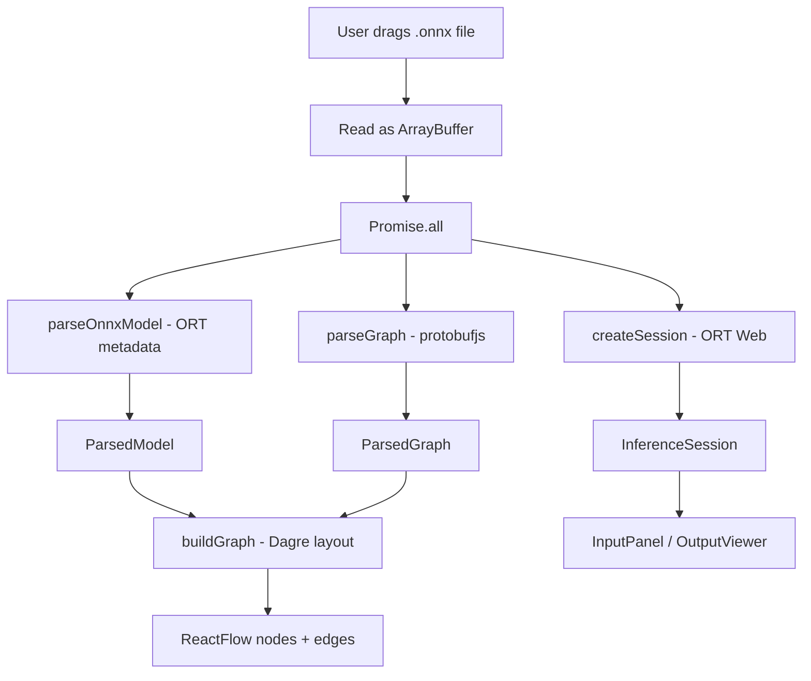

# Building ONNXLab: Understanding ONNX by Building a Browser-Based Visualization and Inference Platform

I've always found ONNX models fascinating — they're this universal intermediate format that lets you train in PyTorch and deploy anywhere. But most tools for exploring ONNX models are either desktop apps like Netron or Python notebooks. I wanted something I could open in a browser tab, drag a model into, and immediately see the full computational graph — then run inference on the same page without any backend.

So I built ONNXLab.

## Overview

ONNXLab is a browser-native tool for visualizing and running inference on ONNX models. Drop an `.onnx` file, see the interactive graph, inspect every node, upload an image, and run inference — all client-side, no server required.

This article walks through the architecture, the unexpected challenges I hit, and the lessons learned. If you've ever wondered how ONNX models are structured under the hood, or how to build a graph visualization tool that also runs ML inference, this might be useful.

## Background

The original spark was pretty simple. I was working on a computer vision pipeline that involved converting PyTorch models to ONNX and deploying them with ONNX Runtime. Every time I needed to debug a model — check if the graph connected correctly, verify tensor shapes, inspect node attributes — I'd either:

- Use Netron, which is great but is a desktop app
- Write a quick Python script to parse the protobuf and dump the graph

None of these felt good. And none of them let me actually *run* the model in the same place I was inspecting it.

So I set out to build a single-page web app that could do both: visualize the full graph topology *and* run inference with ONNX Runtime Web, all from a browser.

## Goals

I wanted:

- **Drop-in model loading** — drag an `.onnx` file, see everything instantly
- **Full graph visualization** — every node, every connection, every tensor shape
- **Node inspection** — click a node, see its inputs, outputs, attributes
- **Browser-native inference** — upload an image, run the model, see predictions
- **Zero backend** — everything must work on static hosting
- **WebGPU acceleration** — use the GPU when available, fall back to WASM otherwise

## Tech Stack

| Technology | What it does | Why I chose it |
|---|---|---|
| Next.js (App Router) | Application framework | File-based routing, great DX, pure static export |
| React Flow | Interactive graph rendering | Battle-tested node graph library with pan/zoom/selection |
| Dagre | Automatic graph layout | Hierarchical layout for computational graphs |
| ONNX Runtime Web | Client-side model execution | WebGPU + WASM, no server needed |
| protobufjs | ONNX protobuf schema decoding | Needed to extract full graph structure (ORT doesn't expose it) |
| TailwindCSS | Styling | Fast iteration, dark theme out of the box |

### Why protobufjs?

This is the most interesting choice and worth calling out. ONNX models are serialized as protobuf binaries. ONNX Runtime Web can load and run them, but it only exposes input/output metadata — not the full graph topology. To get every node, edge, and attribute, I had to decode the raw protobuf using the ONNX schema directly. More on this later.

## Architecture

The entire application is a single Next.js page with three views that the user switches between after loading a model. Here's the data flow:



The key insight is that three independent operations run in parallel via `Promise.all`:

```typescript
const [runtimeSession, parsed, realGraph] = await Promise.all([
  createSession(arrayBuffer),
  parseOnnxModel(arrayBuffer),
  parseGraph(arrayBuffer),
]);
```

This means the graph visualization and the inference session are ready at roughly the same time — the user doesn't wait twice.

## Implementation Journey

### Step 1: Getting the Graph Out of ONNX

My first naive approach was to use ONNX Runtime Web for everything. I assumed there'd be a `session.getGraph()` or something similar. Nope.

ORT Web exposes `session.inputMetadata` and `session.outputMetadata` — which gives you tensor names, types, and shapes for the *boundary* of the model — but nothing about the internal nodes. You can't even see what operators are inside.

So I had to go deeper.

#### Parsing with protobufjs

ONNX models are Google protobuf binaries, and the ONNX project publishes the `.proto` schema. I loaded it at runtime and decoded the model:

```typescript
const root = await protobuf.load("/onnx.proto3");
const ModelProto = root.lookupType("onnx.ModelProto");
const decoded = ModelProto.decode(new Uint8Array(arrayBuffer));

const graph = decoded.graph;
```

This gave me access to `graph.node` — the full list of operators, their inputs, outputs, and attributes. But parsing it correctly was trickier than expected.

#### The Great Protobuf Long Problem

This one cost me a couple hours of debugging. Protobuf supports 64-bit integers, but JavaScript doesn't — not natively. When protobufjs encounters a 64-bit value, it returns an object like `{ low: 42, high: 0 }` instead of a plain number.

I scattered `toNumber()` helpers throughout the codebase to handle this:

```typescript
function toNumber(v: unknown): number {
  if (typeof v === "number") return v;
  if (v && typeof v === "object" && "low" in v) {
    return (v as { low: number }).low;
  }
  return Number(v);
}
```

This appears in both `graphParser.ts` and `NodeInspector.tsx` — every time you read an attribute value or tensor dimension, you need to handle the Long case. It's one of those things that's trivial once you know about it, but confusing the first time you see `NaN` in a tensor shape.

#### Building the Tensor Map

The trickiest part of graph parsing is connecting the dots between nodes. Each node has input tensors and output tensors — just names like `"conv1_output"`. To build edges between nodes, I had to:

1. Extract all tensor metadata from `graph.input`, `graph.output`, `graph.valueInfo`, and `graph.initializer`
2. Build a map of tensor name -> TensorInfo
3. Fill in missing tensors with placeholders (some intermediate tensors aren't declared in the schema)

```typescript
const tensorMap = buildTensorMap(allTensors, graph.initializer || []);

// Fill in missing tensors found in node inputs/outputs
for (const node of graph.node || []) {
  for (const name of node.input || []) {
    if (name && !tensorMap.has(name)) missingNames.add(name);
  }
  for (const name of node.output || []) {
    if (name && !tensorMap.has(name)) missingNames.add(name);
  }
}
```

Tensor shapes themselves were another challenge. The protobuf schema defines dimensions as one of:
- `dimValue` — a concrete number like `224`
- `dimParam` — a symbolic name like `"batch_size"`
- Neither — meaning it's dynamic, represented as `"?"`

I return all three types from the parser, and the UI handles them gracefully (showing `[1, 3, ?, ?]` for example).

### Step 2: Laying Out the Graph

With the parsed graph structure, I needed to turn it into a visual layout. React Flow handles the rendering and interaction, but it doesn't do layout — you provide node positions yourself.

I used Dagre, a JavaScript port of the classic graph layout library, configured for top-to-bottom hierarchical layout:

```typescript
dagreGraph.setGraph({ rankdir: "TB", nodesep: 120, ranksep: 180 });

// Create a dagre node for each operator
for (const node of graph.nodes) {
  dagreGraph.setNode(nodeId, { width: NODE_WIDTH, height: NODE_HEIGHT });
}

// Create edges by matching tensor names
for (const node of graph.nodes) {
  for (const input of node.inputs) {
    const sourceId = tensorMap.get(input.name);
    if (sourceId && sourceId !== targetId) {
      dagreGraph.setEdge(sourceId, targetId);
    }
  }
}

dagre.layout(dagreGraph);
```

The edge-building step was the core logic: for each node's input tensors, look up which *other* node produced that tensor as output, then create an edge. The edge labels show tensor shapes — `[1, 64, 112, 112]` — which makes it immediately clear how data transforms as it flows through the graph.

### Step 3: Custom React Flow Nodes

I wanted nodes that looked good and communicated useful information at a glance. Each operator node has:

- **Color-coded header dot** — I defined 25 colors for common operator types. Conv is blue, ReLU is green, MatMul is purple, Softmax is pink. Everything else defaults to gray.
- **Operator name** — centered, bold
- **Output shapes** — up to 2 output tensors shown as cyan badges
- **Input/output count** — in the footer

```typescript
const OP_COLORS: Record<string, string> = {
  conv: "bg-blue-500",
  relu: "bg-green-500",
  matmul: "bg-purple-500",
  softmax: "bg-pink-500",
  reshape: "bg-teal-500",
  add: "bg-yellow-500",
  // ... about 25 operators mapped
};
```

The color legend is shown by default in the inspector panel, so users can learn the mapping quickly.


### Step 4: Running Inference

ONNX Runtime Web makes the actual inference surprisingly simple:

```typescript
const session = await ort.InferenceSession.create(arrayBuffer, {
  executionProviders: ["webgpu", "wasm"],
});
```

That's it. WebGPU is tried first; if unavailable, WASM kicks in automatically. I added a small `checkWebGPU()` utility that detects GPU support on mount and shows a badge.

The real work was in the input pipeline.

#### Input Type Detection

Models can have any number of inputs with arbitrary shapes. I needed to generate the right UI automatically:

```typescript
export function detectInputType(shape) {
  if (shape.length === 4) {
    const c = Number(shape[1]);
    if (c === 3 || c === 1) return "image";
    const cLast = Number(shape[3]);
    if (cLast === 3 || cLast === 1) return "image";
  }
  if (shape.length === 2) return "sequence";
  if (shape.length === 1) return "vector";
  return "tensor";
}
```

4D tensors with 1 or 3 channels get an image upload UI. 1D tensors get a text input. Everything else gets a textarea for raw values.

#### NCHW vs NHWC Detection

Computer vision models use two different channel layouts:
- **NCHW**: `[batch, channels, height, width]` — PyTorch default
- **NHWC**: `[batch, height, width, channels]` — TensorFlow default

I auto-detect which format the model expects by checking the channel dimension position:

```typescript
const cFirst = Number(shape[1]);
const cLast = shape.length >= 4 ? Number(shape[shape.length - 1]) : 0;
const nhwc = (cLast === 1 || cLast === 3) && cFirst !== 1 && cFirst !== 3;
```

This is one of those small details that makes the difference between "it works on some models" and "it just works."

#### Image to Tensor

The `imageToTensor` function converts an uploaded image into a float32 tensor, handling both NCHW and NHWC formats:

```typescript
const image = await createImageBitmap(file);
const canvas = document.createElement("canvas");
canvas.width = width;
canvas.height = height;
const ctx = canvas.getContext("2d");
ctx.drawImage(image, 0, 0, width, height);
const imageData = ctx.getImageData(0, 0, width, height);

// NCHW (channel-first)
const floatData = new Float32Array(1 * 3 * pixels);
for (let i = 0; i < pixels; i++) {
  floatData[i] = data[i * 4] / 255.0;           // R
  floatData[pixels + i] = data[i * 4 + 1] / 255.0; // G
  floatData[2 * pixels + i] = data[i * 4 + 2] / 255.0; // B
}
```

The canvas API handles all the hard work — resizing, pixel access, alpha removal.

### Step 5: Output Analysis

When inference completes, the output viewer goes through each tensor and computes stats. The `analyzeTensor` function runs a single pass through the data to compute min, max, and mean:

```typescript
let min = Infinity, max = -Infinity, sum = 0;
for (let i = 0; i < data.length; i++) {
  const v = data[i];
  if (v < min) min = v;
  if (v > max) max = v;
  sum += v;
}
```

It also applies heuristics to classify the output type:
- **Shape `[1, N]`** → likely classification → shows Top-K predictions
- **Shape `[1, N]` with N 128–4096** → likely embedding
- **Shape `[1, N, M]`** → likely detection → triggers YOLO pipeline

#### Top-K with a Custom Min-Heap

The `topK` function extracts the top predictions efficiently. Rather than sorting all values (which could be thousands for ImageNet models), it maintains a sorted array of size K, replacing the smallest entry when a larger value is found:

```typescript
for (let i = 0; i < values.length; i++) {
  const entry = { index: i, value: values[i] };
  if (heap.length < k) {
    heap.push(entry);
    if (heap.length === k) heap.sort((a, b) => b.value - a.value);
  } else if (entry.value > heap[heap.length - 1].value) {
    heap[heap.length - 1] = entry;
    heap.sort((a, b) => b.value - a.value);
  }
}
```


### Challenges I Hit

**The ORT API Gap.** The biggest unexpected challenge was realizing ONNX Runtime doesn't expose graph internals. I'd planned for a simple integration and ended up building a parallel protobuf parsing pipeline. In hindsight, this makes sense — ORT is an execution engine, not a graph viewer. But it doubled the parsing complexity.

**Protobuf Long values.** These caused silent bugs. A tensor dimension would display as `NaN` in the UI and I'd spend 20 minutes tracing it back to an unboxed Long object. The `toNumber` helper became my most-used utility function.

**Auto-detecting tensor format.** NCHW vs NHWC detection is fragile. My heuristic works for most vision models, but I've seen edge cases where both dimensions 1 and 3 happen to be 1 or 3, causing wrong detection. I added a manual override mechanism to handle this.

**Dagre edge routing.** When two nodes have multiple tensors flowing between them, Dagre creates overlapping edges. I solved this by encoding unique edge IDs with the tensor name: `${sourceId}-${targetId}-${input.name}`. This ensures React Flow treats them as distinct edges.

## Results

The final product is a single Next.js page that:

- Loads any valid `.onnx` model (up to ~500MB in testing)
- Renders the full computational graph with interactive nodes
- Lets you inspect any node's attributes, inputs, and outputs
- Runs inference with WebGPU or WASM
- Shows prediction results with confidence bars or bounding boxes
- Fits in a Docker image under 150MB

The graph view handles models with 200+ nodes without significant frame drops. The inspector panel updates instantly on node click.

## Key Learnings

1. **ONNX is just protobuf.** Under the hood, an ONNX model is a `ModelProto` message. Understanding the protobuf schema is the key to doing anything beyond running inference.

2. **Two parsing strategies are better than one** for this use case. ORT gives you runtime metadata (actual tensor types, concrete shapes), while protobuf gives you the full graph structure. You need both.

3. **WebGPU is ready for production inference.** ONNX Runtime Web's WebGPU support works surprisingly well. On my M2 MacBook, inference with a ResNet-50 model completes in ~15ms. WASM fallback is ~80ms — usable, but the GPU is clearly better.

4. **Canvas beats DOM for detection overlays.** Drawing 50 bounding boxes on a Canvas is instant. The same with DOM elements would cause significant layout thrashing.

5. **React Flow + Dagre is a powerful combo.** React Flow handles all the interactive complexity (pan, zoom, drag, selection), while Dagre handles layout. Together they make complex graph visualization achievable in a weekend.

6. **Dynamic input UIs are hard to get right.** Auto-detecting input types and generating the right form controls is surprisingly fragile. Every model has slightly different conventions for shapes, types, and channel formats.

## What I Would Do Differently


**Better error handling for model parsing.** Currently, if the protobuf schema doesn't perfectly match the model version, parsing fails silently or produces corrupted graphs. I'd add schema version detection and fallback strategies.

**Progressive loading for large models.** Models with 500+ nodes take a second or two to parse. I'd add a streaming parser that shows nodes as they're decoded, rather than waiting for the full parse.

**More robust format detection.** The NCHW/NHWC detection is a heuristic that works 90% of the time. I'd add explicit configuration options and maybe a dropdown for the user to override.

## Future Roadmap

- **Tensor heatmaps and embedding visualization** — visualize activations directly in the browser
- **Segmentation overlays** — SAM and DeepLab support
- **Audio model support** — speech recognition and audio classification
- **Performance benchmarking** — per-layer execution time analysis
- **Multi-model comparison** — side-by-side graph comparison
- **Saved sessions** — persist model state and annotations

## Key Takeaways

1. ONNX models are protobuf files — if you want graph internals, you need to decode them yourself
2. Promise.all is your friend for parallel operations that are independent
3. Protobuf Long values in JavaScript are a footgun — always normalize them
4. React Flow's `useNodesState` and `useEdgesState` make reactive graph state trivial
5. Dagre's `rankdir: "TB"` produces clean layouts for ML computational graphs
6. Canvas 2D is still the best choice for real-time annotation overlays
7. Auto-detecting model input types is harder than it looks
8. WebGPU acceleration in browsers is production-ready for ML inference
9. Responsive design for complex UIs works best with CSS transitions, not JS animation libraries
10. Sometimes the best architecture is two parallel systems that complement each other's blind spots

## Conclusion

Building ONNXLab taught me more about ONNX models than reading documentation ever could. The protobuf schema that seemed intimidating at first became a familiar tool. The graph layout challenges forced me to think carefully about data flow. And the inference pipeline showed me that browser-based ML has genuinely arrived — WebGPU in particular is a game-changer.

The project started as a simple "wouldn't it be cool if" idea and turned into a deep dive into ONNX internals, protobuf parsing, graph layout algorithms, and WebGPU compute. It's now a tool I use regularly for debugging models, and I hope others find it useful too.

You can try it at [onnxlab.kgup.me](https://onnxlab.kgup.me) — just drag in an ONNX model and start exploring. The full source is on [GitHub](https://github.com/kshitijqwerty/onnxlab).
