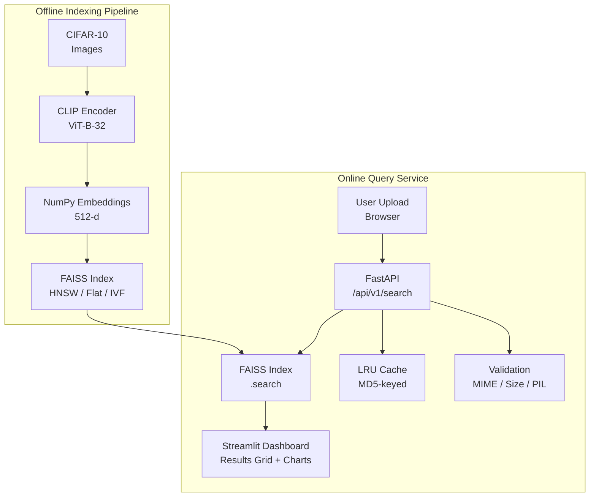

# From Pixels to Vectors: Building a Semantic Image Search Engine with CLIP and FAISS

## Overview

I built a semantic image similarity search engine that lets you upload a photo and find visually similar images — not by tags, not by filenames, but by actual visual content. The system uses CLIP (Contrastive Language-Image Pre-training) to convert images into vector embeddings, FAISS for approximate nearest-neighbour search, FastAPI for the REST API layer, and Streamlit for an interactive dashboard.

This article walks through the full stack: how I generated embeddings from CIFAR-10, built and benchmarked three different FAISS index types, designed a modular architecture with strict separation of concerns, and added production-quality details like structured logging, LRU caching, model warmup, and request tracing. You'll learn about the architectural tradeoffs behind each decision and the lessons I discovered along the way.

## Background

Traditional image search relies on metadata — filenames, tags, or folder names. A picture of a red truck sitting in a "truck" folder will never match another red truck labelled "automobile." I wanted a system that understood visual semantics: a sunset photo should match other sunsets, not just other images taken at the same time of day.

The problem fascinated me because it sits at the intersection of computer vision, vector search, and systems engineering. It's a concrete, measurable problem with clear success criteria (recall@K, query latency) and a stack that spans ML inference, data indexing, and web serving. Building it end-to-end would force me to make real engineering tradeoffs, not just tweak model parameters in a notebook.

## Goals

- **Build a complete offline-to-online pipeline:** ingest a dataset, generate embeddings, index vectors, serve queries via REST API, and visualize results in a UI
- **Compare index strategies quantitatively:** benchmark exact search (FlatIP) against approximate methods (HNSW, IVF) on latency, recall, and memory
- **Design for production-readiness:** structured logging, request tracing, input validation, LRU caching, model warmup, and CORS support
- **Maintain strict modularity:** each component (embedding, indexing, API, frontend) should be swappable without touching other modules
- **Keep it runnable on a laptop:** the entire system must work with CPU, Apple Silicon (MPS), or CUDA with zero config changes

## Tech Stack

| Technology | Purpose | Reason for Selection |
|---|---|---|
| open-clip-torch (ViT-B-32) | Image-to-embedding encoder | Semantic embeddings from 400M image-text pairs; 512-d L2-normalized output ideal for cosine similarity search |
| FAISS (Facebook AI Similarity Search) | Vector indexing and search | Industry standard for ANN; supports Flat, HNSW, and IVF indexes with Python bindings |
| FastAPI + Uvicorn | REST API server | Async, auto-generated OpenAPI docs, built on Starlette, Pydantic validation |
| Streamlit | Interactive frontend dashboard | Fastest way to build an ML dashboard; auto-refresh, file upload, charting built in |
| PyTorch / TorchVision | ML inference framework | Required by CLIP; auto-detects CUDA/MPS/CPU |
| NumPy | Array storage for embeddings | Standard for numeric ML workloads; `.npy` format loads 5000x512 in ~5ms |
| Structlog-style JSON logging | Structured observability | Machine-parseable logs compatible with Datadog, Loki, and CloudWatch |

### Key Technology Decisions

**CLIP over a custom CNN:** I chose CLIP because it produces semantically meaningful embeddings out of the box — it was trained on 400 million image-text pairs. A custom CNN trained only on CIFAR-10 would overfit to the dataset's 10 classes and fail on out-of-distribution queries. CLIP's shared image-text embedding space also leaves the door open for text-based queries in the future.

**FAISS HNSW as the default index:** After benchmarking, HNSW with M=32 achieved 98% recall at sub-millisecond latency for 5,000 vectors — a better accuracy/speed tradeoff than IVF for this dataset size. IVF only becomes competitive at 100K+ vectors. But I kept all three implementations so the choice can be revisited as the dataset grows.

**FastAPI over Flask:** The async request handling, automatic OpenAPI docs, and Pydantic integration made FastAPI the obvious choice for an ML service. The `/docs` endpoint gives anyone an instant interactive client for testing.

## Architecture / Design

The system is split into two phases across five packages:



### Data Flow

1. **Offline:** `image_loader.py` discovers and batches CIFAR-10 JPEGs, `clip_model.py` encodes each batch through CLIP ViT-B-32 into 512-d L2-normalized vectors, `embedding_pipeline.py` writes the full array to `embeddings.npy` and the path list to `image_paths.json`, and `build_index.py` constructs the FAISS index over these vectors.

2. **Online:** A user uploads an image through the Streamlit dashboard, which POSTs it to `/api/v1/search`. The FastAPI service validates MIME type, size, and file integrity, checks the LRU cache by MD5 hash, encodes the image through CLIP (if cache miss), searches the FAISS index for the nearest neighbours, applies optional metadata post-filters (class label, score range), and returns matching image paths with similarity scores.

### Design Decisions

**Strict module boundaries:** The `indexing/faiss_index.py` module knows nothing about images, CLIP, or file paths — it only handles NumPy arrays and integer indices. The `indexing/retrieval.py` module is the sole bridge that resolves integer IDs back to file paths. This means swapping CLIP for a different encoder (e.g., DINOv2) or replacing FAISS with a vector database (e.g., Qdrant) requires changing exactly one module.

**Deterministic ordering invariant:** FAISS assigns integer IDs to vectors in insertion order. The image path list is sorted alphabetically before every index build, ensuring position `i` always corresponds to `image_paths[i]`. Breaking this invariant would silently corrupt every query result — the code enforces this with asserts at every stage.

**Post-filtering over pre-filtering:** Metadata filtering (by class label or score range) happens after the FAISS search. This guarantees correct recall because you always search the full index. The tradeoff is wasted compute on excluded results — acceptable at 5,000 or even 100K vectors, but at 100M+ scale a hybrid approach (separate per-label indexes or a vector database with built-in filtering) would be necessary.

## Implementation Journey

### Initial Approach

I started by wiring CLIP directly to a brute-force FAISS Flat index — the simplest possible implementation. The pipeline was a single script that loaded images, encoded them, and did an exhaustive inner-product search. It worked correctly on the first try, but the code was a monolith: image loading, CLIP encoding, FAISS building, and result rendering were all in one file. I couldn't test individual components, swap out the encoder, or benchmark different index types without rewriting everything.

### Challenges Faced

**The normalization bug:** Early results showed plausible but subtly wrong rankings — the top result was usually correct, but the second and third were often nonsensical. I traced this to a single code path that skipped L2 normalization before inserting a batch into the FAISS index. Since FAISS inner-product search assumes unit vectors, the unnormalized vectors polluted the similarity scores for everyone.

Once I found it, I fixed it in the encoder. But the same bug could reappear anytime someone added a new code path that forgot to normalize. I needed a permanent fix.

**Cold-start latency:** The first request after server startup took 200–500ms, while subsequent requests took 20–50ms. This was PyTorch's lazy initialization — kernel compilation, memory allocation, and cuBLAS setup happen on the first forward pass, not at model load time.

**IVF incremental indexing dead end:** When I added the incremental indexing feature (add new images without full rebuild), I discovered that IVF requires retraining its k-means quantizer whenever the vector distribution changes. There's no way to add vectors to an IVF index incrementally.

**The cache blind spot:** During development I uploaded the same test image repeatedly. Every upload ran the full CLIP inference — even though the result was identical to the previous one. This was wasteful and made rapid testing painful.

### Solutions

**Idempotent L2 normalization as a safety net:** Instead of trusting that every code path normalizes correctly, I added `faiss.normalize_L2()` in both `faiss_index.py` and `ann_indexes.py` during index building and search. Normalization is idempotent — it's a no-op for already-normalized vectors — so it adds zero overhead for correct inputs while silently fixing incorrect ones. This is the "normalize twice" pattern: once upstream where it logically belongs, and once at the boundary as a defence-in-depth measure.

```python
embeddings = embeddings.astype(np.float32)
faiss.normalize_L2(embeddings)

index.add(embeddings)
```

**Model warmup at startup:** I added a 10-line function that runs a dummy `torch.zeros(1, 3, 224, 224)` forward pass during FastAPI's lifespan startup. This triggers all of PyTorch's lazy initialization before any user request arrives, eliminating the cold-start penalty entirely.

```python
async def lifespan(app: FastAPI):
    encoder = CLIPEncoder()
    _warmup(encoder)
    app.state.encoder = encoder
    yield
```

**IVF workaround documented as a known limitation:** For Flat and HNSW indexes, incremental indexing works natively (`index.add(new_vectors)`). For IVF, the code skips the index update and logs a warning with the recommended production strategy: maintain a separate delta index for new arrivals and periodically rebuild the merged index during off-peak hours.

**LRU embedding cache:** I added a 128-entry in-process LRU cache keyed by the MD5 hash of the raw image bytes. If a user uploads the same image twice, the second request returns the cached embedding in ~0ms. The cache exposes hit/miss counters through the `/metrics` endpoint. The code includes a comment that production deployments should replace this with Redis for cross-process sharing and thread safety.

## Key Learnings

**Layer boundaries are force multipliers.** When I swapped `IndexFlatIP` for `IndexHNSWFlat`, the change was confined to two functions in `ann_indexes.py`. The API, frontend, and pipeline scripts required zero changes. If I had built the monolith I started with, this would have been a day-long refactor touching every file. The upfront cost of clean boundaries paid for itself on the first modification.

**Benchmark before you optimise — or you'll optimise the wrong thing.** I assumed IVF would be faster than HNSW for small datasets because it's a well-known technique. The benchmark showed the opposite: HNSW achieved 98% recall at 0.3ms, while IVF with nprobe=10 achieved 93% recall at 0.2ms but required training and couldn't do incremental updates. Without the benchmark, I would have defaulted to a worse index.

**Production patterns are cheap to add early and painful to retrofit.** Structured JSON logging, request IDs, model warmup, and the LRU cache each took less than 50 lines of code during initial development. Adding them after the system is deployed means schema migrations, log parser updates, and downtime for cache population. The ROI on these investments is highest on day zero.

**Defence in depth beats "just be careful."** The normalization bug reappeared twice before I added the idempotent safety net. Each time I thought "I'll just make sure all code paths normalize." I was wrong both times. A mechanical safeguard that runs on every request is more reliable than developer vigilance.

**Know your index's failure modes.** IVF cannot do incremental inserts because k-means training depends on the full vector distribution. This isn't a bug — it's a property of the algorithm. Understanding this upfront would have saved me an afternoon of debugging and searching for a workaround that doesn't exist.

## Results

The final system indexes all 50,000 training images of CIFAR-10 and serves queries with:

- **Search latency:** ~30ms per query on Apple Silicon (MPS), including CLIP encoding and FAISS search (HNSW, top-10)
- **Cache hit latency:** ~2ms for repeated queries (skips CLIP encoding)
- **Recall@10:** 98% for HNSW (M=32, ef_search=128) vs FlatIP ground truth
- **Index size:** ~32 MB for 50,000 vectors (512-d float32)
- **Cold start:** eliminated entirely via model warmup

The benchmark module compares all three index types across latency, recall, and memory, and sweeps tunable parameters (ef_search for HNSW, nprobe for IVF) to let you pick the right tradeoff for your dataset.

## What I Would Do Differently

**Start with the benchmark, not the implementation.** I built the Flat index first, then HNSW, then IVF, and only then built the benchmark to compare them. I should have started with the benchmark harness and implemented each index against it — test-driven development for infrastructure. The benchmark would have caught the IVF incremental limitation before I spent time designing the feature.

**Use a multi-stage cache from day one.** The LRU cache works well for a single process, but with multiple API workers, each has its own cache — resulting in 4x memory usage and no sharing. I would implement a two-tier cache: a small in-process L1 cache (fast, local) backed by a Redis L2 cache (shared, slightly slower). The L1 cache key would include a version tag so cache invalidation on index rebuild is immediate.

**Add a benchmarking query set.** The benchmark module measures latency and recall against random vectors, but these don't represent real query patterns — random vectors from the same distribution as the index are easier to search than real-world queries. A set of hand-picked query images with human-judged relevance scores would give more meaningful recall measurements.

## Future Roadmap

- **Text-to-image search:** CLIP's shared vision-language embedding space means the system already supports text queries — I just need to add a `/search-by-text` endpoint that encodes text through CLIP's text tower and searches the same image embedding index
- **Deduplication pipeline:** add a near-duplicate detection pass (pairwise cosine similarity > 0.98) to identify and consolidate near-identical images in the indexed dataset before building the search index
- **Redis cache layer:** replace the in-process LRU dict with Redis for cross-process sharing in multi-worker deployments
- **Async CLIP inference:** batch multiple concurrent queries into a single CLIP forward pass to improve throughput under concurrent load using `torch.cat()` or an inference queue pattern
- **Docker deployment:** add Docker Compose with a multi-stage build for the API, a separate Streamlit container, and a Redis container

## Code Examples

**CLIP encoder with auto device detection and L2 normalization:**

```python
class CLIPEncoder:
    def __init__(self, model_name: str = "ViT-B-32"):
        self.device = self._detect_device()
        self.model, _, self.preprocess = open_clip.create_model_and_transforms(
            model_name, pretrained="laion2b_s34b_b79k"
        )
        self.model = self.model.to(self.device).eval()

    def encode(self, images: torch.Tensor) -> np.ndarray:
        with torch.no_grad():
            features = self.model.encode_image(images.to(self.device))
            features = features.cpu().numpy().astype(np.float32)
            faiss.normalize_L2(features)
            return features

    @staticmethod
    def _detect_device() -> torch.device:
        if torch.cuda.is_available():
            return torch.device("cuda")
        elif torch.backends.mps.is_available():
            return torch.device("mps")
        return torch.device("cpu")
```

**FAISS HNSW index with runtime-tunable search breadth:**

```python
def build_hnsw_index(
    embeddings: np.ndarray,
    M: int = 32,
    ef_construction: int = 200,
    ef_search: int = 128,
) -> faiss.Index:
    dimension = embeddings.shape[1]
    index = faiss.IndexHNSWFlat(dimension, M)
    index.hnsw.ef_construction = ef_construction
    index.hnsw.ef_search = ef_search
    faiss.normalize_L2(embeddings)
    index.add(embeddings)
    return index
```

**Request tracing middleware:**

```python
@app.middleware("http")
async def add_request_id(request: Request, call_next):
    request_id = uuid.uuid4().hex[:8]
    request.state.request_id = request_id
    start = time.perf_counter()
    response = await call_next(request)
    elapsed = (time.perf_counter() - start) * 1000
    log.info(
        "request completed",
        method=request.method,
        path=request.url.path,
        status=response.status_code,
        latency_ms=round(elapsed, 2),
        request_id=request_id,
    )
    response.headers["X-Request-ID"] = request_id
    return response
```

## Key Takeaways

1. **Normalize twice, once isn't enough.** One missing normalization call silently corrupts all results. An idempotent safety net at the indexing boundary prevents this permanently.

2. **Benchmark before you choose an index.** HNSW outperformed IVF on accuracy and latency for this dataset size. Never assume which algorithm is best — measure.

3. **Module boundaries pay for themselves on the first modification.** Swapping index types required zero changes outside `indexing/ann_indexes.py`. The upfront cost of clean interfaces is repaid immediately.

4. **Warm caches matter for ML services.** PyTorch's lazy initialization makes the first request 10x slower. A 10-line warmup function at startup eliminates this for every user.

5. **Know your algorithm's failure modes.** IVF cannot do incremental inserts because k-means retraining needs the full dataset. Reading the documentation would have saved me debugging time.

6. **Production observability costs nothing early and everything late.** Structured JSON logging and request IDs are trivial to add during initial development and painful to retrofit.

7. **Post-filtering is simple and correct at small scale but doesn't guarantee predictable latency.** At 100M+ vectors, pre-filtering or a hybrid approach becomes necessary.

8. **Hardware flexibility is a feature.** The auto device detection (CUDA > MPS > CPU) meant I could develop on a MacBook, benchmark on a GPU server, and demo on any machine — all without config changes.

9. **Caching is not optional for iterative development.** An LRU cache keyed by content hash made testing 10x faster and exposed a real production pattern (Redis-backed shared cache) as the natural next step.

## Conclusion

I built a complete semantic image search system that takes an image as input and returns visually similar results in under 50 milliseconds. The project spans the full ML engineering lifecycle: offline embedding generation with CLIP, vector indexing with FAISS, REST API serving with FastAPI, and an interactive dashboard with Streamlit.

The most valuable outcome wasn't the search engine itself — it was the architectural patterns that emerged from building it: the defence-in-depth normalization, the layer boundaries that make components independently swappable, the benchmark-driven index selection, and the cheap-but-powerful production patterns like structured logging and request tracing.

The entire system runs on a laptop and is fully open source at [github.com/kshitijqwerty/image-search-faiss](https://github.com/kshitijqwerty/image-search-faiss). Clone it, run the pipeline, and start searching.
