> **From ResNet to Vision Transformers to SAM** — a practical reference for understanding, training, and deploying computer vision models in production.

---

## Table of Contents

**Part I — Foundations & Evolution**

1. [Evolution of Vision Architectures](#1-evolution-of-vision-architectures)
2. [CNN Backbones](#2-cnn-backbones)
3. [Vision Transformers](#3-vision-transformers)

**Part II — Task-Specific Architectures**

4. [Architecture Pattern: Backbone → Neck → Head](#4-architecture-pattern-backbone--neck--head)
5. [Image Classification](#5-image-classification)
6. [Object Detection](#6-object-detection)
   - [NMS Configuration & Tuning](#65-nms-configuration--tuning)
7. [Segmentation](#7-segmentation)
8. [Vision-Language Models](#8-vision-language-models)

**Part III — Training & Data**

9. [Training Recipes & Hyperparameters](#9-training-recipes--hyperparameters)
10. [Data Augmentation](#10-data-augmentation)
    - [Data Loading Pipeline](#104-data-loading-pipeline)
11. [Evaluation Metrics](#11-evaluation-metrics)
    - [Confidence Calibration](#114-confidence-calibration)

**Part IV — Production**

12. [Deployment & Optimization](#12-deployment--optimization)
    - [Edge Deployment](#126-edge-deployment)
13. [Model Selection Guide](#13-model-selection-guide)
14. [Production Serving Patterns](#14-production-serving-patterns)
    - [Video & Streaming Inference](#145-video--streaming-inference)
    - [Active Learning Loop](#146-active-learning-loop)
    - [Model Registry & A/B Testing](#147-model-registry--ab-testing)

**Appendices**

- [Quick Reference Card](#quick-reference-card)

---

## Part I — Foundations & Evolution

---

## 1. Evolution of Vision Architectures

### Timeline

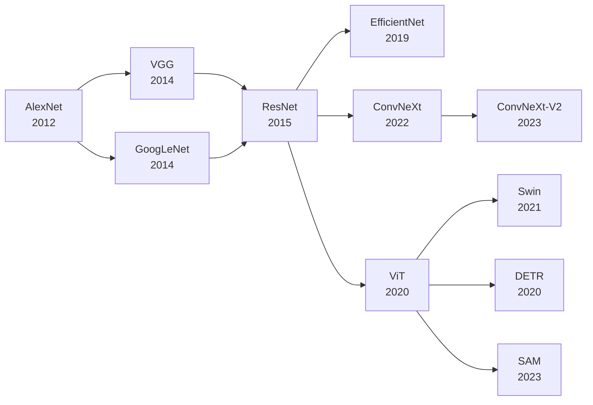

### Key Architectural Innovations

| Era | Model | Innovation | Impact |
|-----|-------|-----------|--------|
| 2012 | AlexNet | ReLU, GPU training, Dropout | Started the deep learning revolution |
| 2014 | VGG | Small 3×3 conv filters, deep stack | Established design patterns |
| 2014 | GoogLeNet | Inception modules, 1×1 conv bottleneck | Parameter efficiency |
| 2015 | ResNet | Skip connections (residual learning) | Enabled very deep networks (50-152 layers) |
| 2017 | DenseNet | Dense connections | Feature reuse, strong gradients |
| 2019 | EfficientNet | Compound scaling (depth/width/resolution) | Pareto-optimal accuracy/efficiency |
| 2020 | ViT | Pure transformer, patch embeddings | Broke CNN dominance |
| 2021 | Swin | Hierarchical transformer, shifted windows | Scalable ViT for all tasks |
| 2022 | ConvNeXt | Modernized CNN with ViT design cues | CNN renaissance |
| 2023 | SAM | Promptable segmentation transformer | Foundation model for segmentation |

### The ResNet → ViT → ConvNeXt Arc

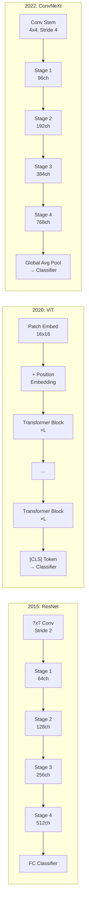

---

## 2. CNN Backbones

### 2.1 ResNet Family

The most deployed vision architecture in production. ResNet introduced **residual connections** (`x + F(x)`) that solved the vanishing gradient problem.

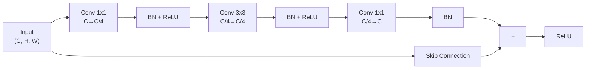

```python
import torch
import torch.nn as nn

class Bottleneck(nn.Module):
    """ResNet bottleneck block (1×1 → 3×3 → 1×1)."""
    expansion = 4

    def __init__(self, in_channels, out_channels, stride=1):
        super().__init__()
        bottleneck = out_channels // self.expansion

        self.conv1 = nn.Conv2d(in_channels, bottleneck, 1, bias=False)
        self.bn1 = nn.BatchNorm2d(bottleneck)

        self.conv2 = nn.Conv2d(bottleneck, bottleneck, 3, stride=stride, padding=1, bias=False)
        self.bn2 = nn.BatchNorm2d(bottleneck)

        self.conv3 = nn.Conv2d(bottleneck, out_channels, 1, bias=False)
        self.bn3 = nn.BatchNorm2d(out_channels)

        self.relu = nn.ReLU(inplace=True)

        self.downsample = None
        if stride != 1 or in_channels != out_channels:
            self.downsample = nn.Sequential(
                nn.Conv2d(in_channels, out_channels, 1, stride=stride, bias=False),
                nn.BatchNorm2d(out_channels),
            )

    def forward(self, x):
        identity = x

        out = self.conv1(x)
        out = self.bn1(out)
        out = self.relu(out)

        out = self.conv2(out)
        out = self.bn2(out)
        out = self.relu(out)

        out = self.conv3(out)
        out = self.bn3(out)

        if self.downsample is not None:
            identity = self.downsample(x)

        out += identity
        return self.relu(out)


def resnet50():
    """ResNet-50: [3, 4, 6, 3] bottleneck blocks."""
    return ResNet(Bottleneck, [3, 4, 6, 3])

def resnet101():
    """ResNet-101: [3, 4, 23, 3] bottleneck blocks."""
    return ResNet(Bottleneck, [3, 4, 23, 3])
```

### 2.2 ResNet Variants Comparison

| Model | Depth | Params | FLOPs | Top-1 (ImageNet) | Notes |
|-------|-------|--------|-------|-------------------|-------|
| ResNet-18 | 18 | 11.7M | 1.8G | 69.8% | Shallow, fast |
| ResNet-34 | 34 | 21.8M | 3.7G | 73.3% | Good baseline |
| ResNet-50 | 50 | 25.6M | 4.1G | 76.1% | Most popular |
| ResNet-101 | 101 | 44.5M | 7.9G | 77.4% | Higher accuracy |
| ResNet-152 | 152 | 60.2M | 11.6G | 78.3% | Diminishing returns |
| Wide ResNet-50 | 50 | 68.9M | 11.4G | 78.5% | Width > depth |
| ResNeXt-50 | 50 | 25.0M | 4.3G | 77.6% | Grouped conv |

> ResNet-50 is the default backbone for most detection/segmentation models (Mask R-CNN, RetinaNet). In production, it offers the best accuracy/compute trade-off.

### 2.3 EfficientNet

EfficientNet uses **compound scaling** — simultaneously scaling depth, width, and resolution:

```python
from torchvision.models import efficientnet_b0, efficientnet_b4, efficientnet_b7

# B0: baseline (5.3M params, 0.4G FLOPs)
model_b0 = efficientnet_b0(weights="DEFAULT")

# B4: scaled up (19M params, 4.2G FLOPs)
model_b4 = efficientnet_b4(weights="DEFAULT")

# B7: largest (66M params, 37G FLOPs)
model_b7 = efficientnet_b7(weights="DEFAULT")
```

| Variant | Params | FLOPs | Top-1 | Relative Speed |
|---------|--------|-------|-------|----------------|
| EfficientNet-B0 | 5.3M | 0.4G | 77.7% | 1× |
| EfficientNet-B1 | 7.8M | 0.7G | 79.2% | 0.7× |
| EfficientNet-B2 | 9.2M | 1.0G | 80.2% | 0.5× |
| EfficientNet-B3 | 12M | 1.8G | 81.7% | 0.3× |
| EfficientNet-B4 | 19M | 4.2G | 83.0% | 0.15× |
| EfficientNet-B5 | 30M | 9.9G | 83.7% | 0.08× |
| EfficientNet-B6 | 43M | 19G | 84.2% | 0.04× |
| EfficientNet-B7 | 66M | 37G | 84.5% | 0.02× |

### 2.4 ConvNeXt — Modernized CNN

ConvNeXt modernized CNNs by adopting design cues from ViTs:

```python
class ConvNeXtBlock(nn.Module):
    """ConvNeXt block: 7×7 DWConv → LayerNorm → 1×1 → GELU → 1×1."""
    def __init__(self, dim, layer_scale_init_value=1e-6):
        super().__init__()
        self.dwconv = nn.Conv2d(dim, dim, 7, padding=3, groups=dim)
        self.norm = nn.LayerNorm(dim, eps=1e-6)
        self.pwconv1 = nn.Linear(dim, 4 * dim)
        self.act = nn.GELU()
        self.pwconv2 = nn.Linear(4 * dim, dim)
        self.gamma = nn.Parameter(
            layer_scale_init_value * torch.ones(dim)
        ) if layer_scale_init_value > 0 else None

    def forward(self, x):
        shortcut = x
        x = self.dwconv(x)
        x = x.permute(0, 2, 3, 1)  # NCHW → NHWC
        x = self.norm(x)
        x = self.pwconv1(x)
        x = self.act(x)
        x = self.pwconv2(x)
        if self.gamma is not None:
            x = self.gamma * x
        x = x.permute(0, 3, 1, 2)  # NHWC → NCHW
        x += shortcut
        return x
```

| ConvNeXt Variant | Params | FLOPs | Top-1 | Design Difference |
|-----------------|--------|-------|-------|-------------------|
| ConvNeXt-T | 29M | 4.5G | 82.1% | Tiny |
| ConvNeXt-S | 50M | 8.7G | 83.1% | Small |
| ConvNeXt-B | 89M | 15.4G | 83.8% | Base |
| ConvNeXt-L | 198M | 34.4G | 84.3% | Large |
| ConvNeXt-XL | 350M | 60.9G | 84.6% | Extra large |

> ConvNeXt matches Swin Transformer accuracy with pure CNN ops — making inference easier (no window attention complexity).

---

## 3. Vision Transformers

### 3.1 ViT — Vision Transformer

ViT treats an image as a sequence of **patches** (typically 16×16) and applies standard Transformer encoder blocks:

```python
import torch
import torch.nn as nn

class PatchEmbed(nn.Module):
    """Image to patch embedding (conv-based)."""
    def __init__(self, img_size=224, patch_size=16, in_chans=3, embed_dim=768):
        super().__init__()
        self.proj = nn.Conv2d(in_chans, embed_dim, patch_size, stride=patch_size)

    def forward(self, x):
        # x: (B, C, H, W) → (B, N, D)
        x = self.proj(x)                         # (B, D, H/p, W/p)
        return x.flatten(2).transpose(1, 2)       # (B, N, D)


class ViT(nn.Module):
    """Vision Transformer — classification."""
    def __init__(self, img_size=224, patch_size=16, embed_dim=768,
                 depth=12, num_heads=12, num_classes=1000):
        super().__init__()
        self.patch_embed = PatchEmbed(img_size, patch_size, 3, embed_dim)
        num_patches = (img_size // patch_size) ** 2

        self.cls_token = nn.Parameter(torch.zeros(1, 1, embed_dim))
        self.pos_embed = nn.Parameter(torch.zeros(1, num_patches + 1, embed_dim))
        self.pos_drop = nn.Dropout(0.1)

        encoder_layer = nn.TransformerEncoderLayer(
            d_model=embed_dim, nhead=num_heads, dim_feedforward=embed_dim * 4,
            dropout=0.1, activation="gelu", batch_first=True,
        )
        self.blocks = nn.TransformerEncoder(encoder_layer, num_layers=depth)
        self.norm = nn.LayerNorm(embed_dim)
        self.head = nn.Linear(embed_dim, num_classes)

    def forward(self, x):
        x = self.patch_embed(x)
        x = torch.cat([self.cls_token.expand(x.size(0), -1, -1), x], dim=1)
        x = self.pos_drop(x + self.pos_embed)
        x = self.blocks(x)
        x = self.norm(x)[:, 0]  # take [CLS] token
        return self.head(x)
```

### 3.2 ViT Variants

| Variant | Patch | Embed Dim | Heads | Layers | Params | Top-1 |
|---------|-------|-----------|-------|--------|--------|-------|
| ViT-Tiny | 16 | 192 | 3 | 12 | 5.7M | 75.5% |
| ViT-Small | 16 | 384 | 6 | 12 | 22M | 79.9% |
| ViT-Base | 16 | 768 | 12 | 12 | 86M | 81.4% |
| ViT-Large | 16 | 1024 | 16 | 24 | 307M | 82.5% |
| ViT-Huge | 14 | 1280 | 16 | 32 | 632M | 83.1% |

### 3.3 Swin Transformer

Swin improves ViT with **hierarchical feature maps** and **shifted window attention** — making it suitable as a backbone for detection/segmentation:

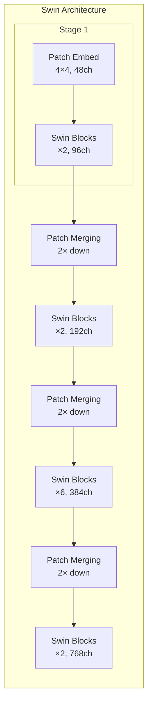

| Swin Variant | Params | FLOPs | Top-1 | Box AP (COCO) |
|-------------|--------|-------|-------|---------------|
| Swin-T | 29M | 4.5G | 81.3% | 46.0 |
| Swin-S | 50M | 8.7G | 83.0% | 48.5 |
| Swin-B | 88M | 15.4G | 83.5% | 49.2 |
| Swin-L | 197M | 34.5G | 84.0% | 51.2 |

### 3.4 DeiT — Data-Efficient ViT

DeiT uses knowledge distillation and improved training to make ViTs practical without large datasets:

```python
from torchvision.models import vit_b_16, vit_b_32

# DeiT-style ViT (trained with distillation, available in torchvision)
model = vit_b_16(weights="IMAGENET1K_V1")
```

> **Production choice**: Use ConvNeXt or Swin over vanilla ViT unless you need the simplicity of a single-scale model. ConvNeXt gives ViT-level accuracy with standard Conv ops — easier to deploy on TensorRT/OpenVINO.

---

## Part II — Task-Specific Architectures

---

## 4. Architecture Pattern: Backbone → Neck → Head

Most modern vision models follow a three-part design:

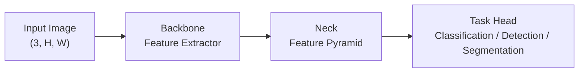

| Component | Role | Examples |
|-----------|------|----------|
| **Backbone** | Extract hierarchical features from pixels | ResNet, ConvNeXt, Swin, EfficientNet |
| **Neck** | Fuse multi-scale features, refine representations | FPN, PANet, BiFPN, NAS-FPN |
| **Head** | Produce task-specific outputs | Classifier, BBox Regressor, Mask Decoder |

### 4.1 Feature Pyramid Network (FPN) Neck

The FPN is the most widely used neck for detection and segmentation:

```python
class FPN(nn.Module):
    """Feature Pyramid Network: top-down pathway with lateral connections."""
    def __init__(self, in_channels_list, out_channels=256):
        super().__init__()
        self.lateral_convs = nn.ModuleList([
            nn.Conv2d(c, out_channels, 1) for c in in_channels_list
        ])
        self.fpn_convs = nn.ModuleList([
            nn.Conv2d(out_channels, out_channels, 3, padding=1)
            for _ in in_channels_list
        ])

    def forward(self, features):
        # features: list of tensors [C2, C3, C4, C5] from backbone
        laterals = [conv(f) for conv, f in zip(self.lateral_convs, features)]

        # Top-down pathway
        for i in range(len(laterals) - 1, 0, -1):
            laterals[i - 1] += nn.functional.interpolate(
                laterals[i], size=laterals[i - 1].shape[-2:], mode="nearest"
            )

        # Apply 3x3 conv on each level
        return [conv(f) for conv, f in zip(self.fpn_convs, laterals)]
```

---

## 5. Image Classification

### 5.1 Architecture Comparison on ImageNet

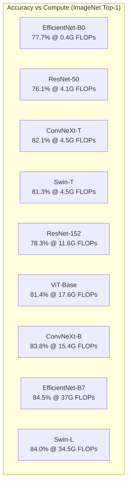

### 5.2 Choosing a Classifier

| Criteria | Recommendation | Why |
|----------|---------------|-----|
| Fastest inference | EfficientNet-B0 / MobileNet-V3 | Depthwise separable convs |
| Best accuracy/compute | ConvNeXt-T / Swin-T | Modern design, Pareto-optimal |
| Max accuracy | ConvNeXt-XL / Swin-L | Large models, high FLOPs |
| Deployment flexibility | ResNet-50 | Every framework supports it |
| Edge / mobile | MobileNet-V3 / EfficientNet-Lite | Sub-10M params, optimized |

```python
# Common classification models in torchvision
from torchvision.models import (
    resnet50, convnext_tiny, swin_t, efficientnet_b0, vit_b_16
)

# Production recommendation: Start with ConvNeXt-T, benchmark latency
model = convnext_tiny(weights="DEFAULT")
```

---

## 6. Object Detection

### 6.1 Detection Paradigms

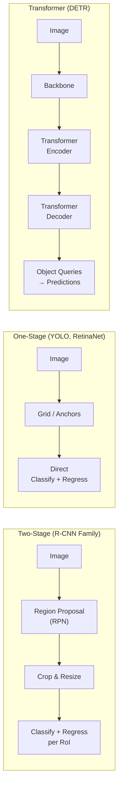

### 6.2 YOLO Family

YOLO is the dominant production detection architecture due to speed:

| Version | Released | Backbone | Key Innovation | mAP@50 (COCO) | FPS (T4) |
|---------|----------|----------|---------------|---------------|----------|
| YOLOv3 | 2018 | Darknet-53 | FPN, multi-label cls | 55.3 | 78 |
| YOLOv4 | 2020 | CSPDarknet-53 | Mosaic aug, CIoU loss | 62.8 | 65 |
| YOLOv5 | 2020 | CSPDarknet-53 | PyTorch native | 64.1 | 83 |
| YOLOv7 | 2022 | Extended ELAN | Trainable bag-of-freebies | 69.7 | 73 |
| YOLOv8 | 2023 | CSPDarknet | Anchor-free, multi-task | 72.3 | 81 |
| YOLOv9 | 2024 | Programmable Gradient Info | PGI, GELAN | 73.5 | 76 |
| YOLOv10 | 2024 | NMS-free architecture | Consistent dual assignments | 74.0 | 85 |

```python
# YOLOv8 inference (ultralytics)
from ultralytics import YOLO

model = YOLO("yolov8n.pt")  # nano: 3.2M params

results = model("image.jpg")  # returns list of Results objects

for r in results:
    boxes = r.boxes  # Boxes object for bbox outputs
    for box in boxes:
        x1, y1, x2, y2 = box.xyxy[0].tolist()
        cls = int(box.cls[0])
        conf = float(box.conf[0])
        print(f"Class {cls}: ({x1:.0f}, {y1:.0f}, {x2:.0f}, {y2:.0f}) conf={conf:.2f}")

# Available sizes: n (nano), s (small), m (medium), l (large), x (xlarge)
```

### 6.3 DETR — Transformer Detection

DETR treats detection as a **set prediction** problem, eliminating anchors and NMS:

```python
import torch
import torch.nn as nn

class DETR(nn.Module):
    """DEtection TRansformer — simplified."""
    def __init__(self, backbone, num_queries=100, num_classes=91):
        super().__init__()
        self.backbone = backbone
        self.input_proj = nn.Conv2d(2048, 256, 1)

        encoder_layer = nn.TransformerEncoderLayer(256, 8, 2048, batch_first=True)
        self.encoder = nn.TransformerEncoder(encoder_layer, 6)

        decoder_layer = nn.TransformerDecoderLayer(256, 8, 2048, batch_first=True)
        self.decoder = nn.TransformerDecoder(decoder_layer, 6)

        self.query_embed = nn.Embedding(num_queries, 256)
        self.class_embed = nn.Linear(256, num_classes + 1)  # +1 for no-object
        self.bbox_embed = nn.Sequential(
            nn.Linear(256, 256), nn.ReLU(), nn.Linear(256, 4)
        )

    def forward(self, x):
        features = self.backbone(x)[-1]  # take last feature level
        features = self.input_proj(features)

        batch, _, h, w = features.shape
        features = features.flatten(2).transpose(1, 2)  # (B, H*W, 256)
        features = self.encoder(features)

        queries = self.query_embed.weight.unsqueeze(0).repeat(batch, 1, 1)
        tgt = torch.zeros_like(queries)
        hs = self.decoder(tgt, features, memory_key_padding_mask=None)

        return {
            "logits": self.class_embed(hs),  # (B, N, C+1)
            "boxes": self.bbox_embed(hs).sigmoid(),  # (B, N, 4) normalized
        }
```

> DETR simplifies the pipeline (no anchors, no NMS, no RPN) but requires longer training (300 epochs vs 12 for Faster R-CNN) and has slower inference than YOLO.

### 6.4 Real-Time Detection: Production Choice

| Scenario | Model | Latency Target | Format |
|----------|-------|---------------|--------|
| Edge (Jetson, phone) | YOLOv8n / NanoDet | < 10ms | TensorRT / CoreML |
| Web service | YOLOv8m / RT-DETR | < 20ms | TensorRT / ONNX |
| High accuracy | YOLOv8x / DETR | < 50ms | TensorRT |
| Dense small objects | YOLOv8 with SAHI | < 100ms | ONNX + SAHI |

```python
# Export YOLOv8 to TensorRT
from ultralytics import YOLO

model = YOLO("yolov8m.pt")
model.export(format="engine", half=True)  # exports to TensorRT FP16
# Output: yolov8m.engine (< 50% size vs FP32)

# Inference with exported engine
model_engine = YOLO("yolov8m.engine")
results = model_engine("image.jpg")
```

### 6.5 NMS Configuration & Tuning

Non-Maximum Suppression (NMS) is the final post-processing step in most detectors — removing duplicate boxes around the same object.

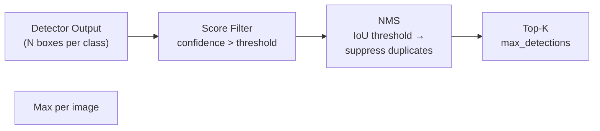

#### NMS Parameters

| Parameter | Typical Range | Effect | Tuning Guidance |
|-----------|--------------|--------|----------------|
| **Score threshold** | 0.001 – 0.5 | Lower = more candidates for NMS | Set low (0.001) and let NMS decide; raise if too many false positives |
| **IoU threshold** | 0.3 – 0.7 | Higher = fewer boxes suppressed | 0.5 for standard objects, 0.3 for dense/crowded scenes, 0.7 for overlapping instances |
| **Max detections per image** | 100 – 1000 | Upper bound on output | 100 for most datasets, 300 for dense scenes, 1000 for COCO eval |
| **Max detections per class** | 20 – 200 | Per-class limit | Useful when some classes dominate |

```python
import torch
from torchvision.ops import nms, batched_nms

def detection_postprocess(
    boxes: torch.Tensor,      # (N, 4) xyxy
    scores: torch.Tensor,     # (N,)
    labels: torch.Tensor,     # (N,)  int class IDs
    score_thresh: float = 0.05,
    iou_thresh: float = 0.5,
    max_detections: int = 300,
    max_per_class: int = 100,
):
    """Production NMS pipeline with filtering."""
    # 1. Filter by score
    keep = scores > score_thresh
    boxes, scores, labels = boxes[keep], scores[keep], labels[keep]

    if len(boxes) == 0:
        return boxes, scores, labels

    # 2. Class-aware NMS (suppress same-class duplicates)
    keep = batched_nms(boxes, scores, labels, iou_thresh=iou_thresh)

    boxes, scores, labels = boxes[keep], scores[keep], labels[keep]

    # 3. Per-class limit
    final_boxes, final_scores, final_labels = [], [], []
    for cls in labels.unique():
        cls_mask = labels == cls
        cls_boxes, cls_scores, cls_labels = (
            boxes[cls_mask][:max_per_class],
            scores[cls_mask][:max_per_class],
            labels[cls_mask][:max_per_class],
        )
        final_boxes.append(cls_boxes)
        final_scores.append(cls_scores)
        final_labels.append(cls_labels)

    if not final_boxes:
        return torch.empty(0, 4), torch.empty(0), torch.empty(0)

    boxes = torch.cat(final_boxes)
    scores = torch.cat(final_scores)
    labels = torch.cat(final_labels)

    # 4. Global top-K
    if len(boxes) > max_detections:
        topk = scores.argsort(descending=True)[:max_detections]
        boxes, scores, labels = boxes[topk], scores[topk], labels[topk]

    return boxes, scores, labels


# Alternative: Soft-NMS (decays scores instead of suppressing)
def soft_nms(boxes, scores, sigma=0.5, score_thresh=0.001):
    """Gaussian Soft-NMS: decay neighbor scores rather than remove."""
    for i in range(len(boxes)):
        ious = torchvision.ops.box_iou(boxes[i:i+1], boxes[i+1:])
        decay = torch.exp(-(ious ** 2) / sigma)
        scores[i+1:] *= decay.squeeze(0)

    keep = scores > score_thresh
    return boxes[keep], scores[keep]
```

**Production NMS tuning workflow:**

```
1. Start with score_thresh=0.001, iou_thresh=0.5, max_detections=300
2. Run validation, plot precision-recall per class
3. Raise score_thresh if too many low-confidence false positives
4. Lower iou_thresh (0.3-0.4) for crowded scenes
5. Raise iou_thresh (0.6-0.7) if objects are naturally overlapping
6. Check if Soft-NMS improves recall in dense scenes
```

> Among all detection hyperparameters, NMS IoU threshold has the single largest impact on mAP without retraining. Always tune it on your validation set.

---

## 7. Segmentation

### 7.1 Segmentation Types

| Type | Output | Example Model | Use Case |
|------|--------|--------------|----------|
| **Semantic** | Per-pixel class label | DeepLabV3+, UNet | Autonomous driving, medical imaging |
| **Instance** | Per-instance mask | Mask R-CNN | Object counting, cell segmentation |
| **Panoptic** | Combines semantic + instance | Panoptic FPN | Scene understanding |
| **Promptable** | Mask from point/box prompt | SAM | Interactive segmentation |

### 7.2 UNet — Medical & Scientific Standard

```python
class UNet(nn.Module):
    """U-Net: encoder-decoder with skip connections."""
    def __init__(self, in_channels=3, out_channels=1, features=[64, 128, 256, 512]):
        super().__init__()
        self.downs = nn.ModuleList()
        self.ups = nn.ModuleList()

        # Encoder
        for feature in features:
            self.downs.append(self._double_conv(in_channels, feature))
            in_channels = feature

        # Decoder
        for feature in reversed(features):
            self.ups.append(nn.ConvTranspose2d(feature * 2, feature, 2, 2))
            self.ups.append(self._double_conv(feature * 2, feature))

        self.bottleneck = self._double_conv(features[-1], features[-1] * 2)
        self.final = nn.Conv2d(features[0], out_channels, 1)

    def _double_conv(self, in_c, out_c):
        return nn.Sequential(
            nn.Conv2d(in_c, out_c, 3, padding=1), nn.BatchNorm2d(out_c), nn.ReLU(),
            nn.Conv2d(out_c, out_c, 3, padding=1), nn.BatchNorm2d(out_c), nn.ReLU(),
        )

    def forward(self, x):
        skip_connections = []
        for down in self.downs:
            x = down(x)
            skip_connections.append(x)
            x = nn.functional.max_pool2d(x, 2)

        x = self.bottleneck(x)
        skip_connections = skip_connections[::-1]

        for i in range(0, len(self.ups), 2):
            x = self.ups[i](x)  # transpose conv (upsample)
            skip = skip_connections[i // 2]
            if x.shape != skip.shape:
                x = nn.functional.interpolate(x, size=skip.shape[-2:])
            x = torch.cat([skip, x], dim=1)
            x = self.ups[i + 1](x)  # double conv

        return self.final(x)
```

### 7.3 Mask R-CNN — Instance Segmentation

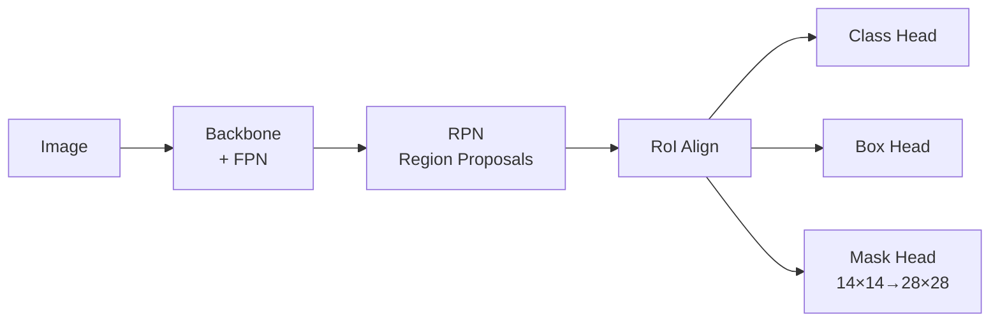

```python
from torchvision.models.detection import maskrcnn_resnet50_fpn_v2

model = maskrcnn_resnet50_fpn_v2(weights="DEFAULT")
model.eval()
model.cuda()

with torch.no_grad():
    predictions = model([image_tensor])[0]

# predictions = {
#     "boxes":       Tensor[N, 4]     xyxy format
#     "labels":      Tensor[N]        class IDs
#     "scores":      Tensor[N]        confidence
#     "masks":       Tensor[N, 1, H, W]  binary masks
# }
```

### 7.4 SAM — Segment Anything

SAM is a **promptable segmentation foundation model** that generalizes zero-shot:

```python
from segment_anything import sam_model_registry, SamPredictor

sam = sam_model_registry["vit_h"](checkpoint="sam_vit_h_4b8939.pth")
predictor = SamPredictor(sam)

predictor.set_image(image_rgb)  # image: (H, W, 3) numpy

# Point prompt
masks, scores, logits = predictor.predict(
    point_coords=np.array([[350, 400]]),
    point_labels=np.array([1]),  # 1 = foreground
    multimask_output=True,
)

# Box prompt
masks, scores, logits = predictor.predict(
    box=np.array([100, 150, 600, 500]),
    multimask_output=False,
)
```

| SAM Variant | Backbone | Params | Speed (relative) |
|-------------|----------|--------|-----------------|
| SAM-ViT-B | ViT-B | 91M | 3× faster |
| SAM-ViT-L | ViT-L | 308M | 1.5× faster |
| SAM-ViT-H | ViT-H | 637M | 1× (baseline) |
| SAM-2 | Hiera | 224M | Real-time video |

---

## 8. Vision-Language Models

### 8.1 CLIP

CLIP learns **image-text alignment** using contrastive learning:

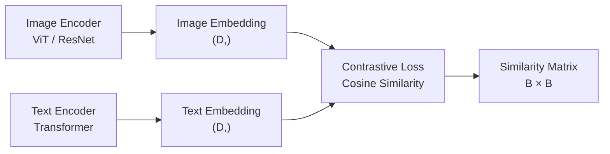

```python
import torch
from transformers import CLIPProcessor, CLIPModel

model = CLIPModel.from_pretrained("openai/clip-vit-base-patch32")
processor = CLIPProcessor.from_pretrained("openai/clip-vit-base-patch32")

image = processor(images=image_pil, return_tensors="pt")
text = processor(text=["a dog", "a cat", "a car"], return_tensors="pt",
                 padding=True)

with torch.no_grad():
    outputs = model(**{**image, **text})
    logits_per_image = outputs.logits_per_image  # image-text similarity
    probs = logits_per_image.softmax(dim=-1)

print(f"Probabilities: {probs[0].tolist()}")
# Zero-shot classification without training
```

### 8.2 Open Vocabulary Detection

```python
# OWL-ViT: open-vocabulary detection
from transformers import OwlViTProcessor, OwlViTForObjectDetection

processor = OwlViTProcessor.from_pretrained("google/owlvit-base-patch32")
model = OwlViTForObjectDetection.from_pretrained("google/owlvit-base-patch32")

text_queries = ["a photo of a cat", "a photo of a dog"]
inputs = processor(text=text_queries, images=image_pil, return_tensors="pt")
outputs = model(**inputs)

# No training needed — detects any object described in text
```

---

## Part III — Training & Data

---

## 9. Training Recipes & Hyperparameters

### 9.1 ImageNet Training Recipe (Standard)

```python
import torch
import torch.nn as nn
from torchvision.models import resnet50

def train_imagenet():
    model = resnet50(weights=None)

    # 1. Loss
    criterion = nn.CrossEntropyLoss(label_smoothing=0.1)

    # 2. Optimizer
    optimizer = torch.optim.SGD(
        model.parameters(), lr=0.1, momentum=0.9, weight_decay=1e-4
    )

    # 3. Scheduler: cosine decay
    scheduler = torch.optim.lr_scheduler.CosineAnnealingLR(
        optimizer, T_max=90, eta_min=1e-6
    )

    # 4. Mixed precision
    scaler = torch.cuda.amp.GradScaler()

    for epoch in range(90):
        model.train()
        for images, labels in train_loader:
            images, labels = images.cuda(), labels.cuda()
            optimizer.zero_grad()

            with torch.cuda.amp.autocast():
                outputs = model(images)
                loss = criterion(outputs, labels)

            scaler.scale(loss).backward()
            scaler.step(optimizer)
            scaler.update()

        scheduler.step()
```

### 9.2 Modern Training Recipe Differences

| Component | Standard (2018) | Modern (2023+) | Impact |
|-----------|----------------|----------------|--------|
| Optimizer | SGD (lr=0.1) | AdamW (lr=1e-3) | Faster convergence |
| Scheduler | Step decay / Cosine | Cosine with warmup | +0.5-1% accuracy |
| Weight decay | 1e-4 | 0.05 (AdamW default) | Better generalization |
| Epochs | 90 | 300 (ViT, ConvNeXt) | Convergence time |
| Augmentation | RandomResizedCrop + Flip | RandAugment + MixUp + CutMix | +2-3% accuracy |
| Label smoothing | No | 0.1 | +0.5% |
| Stochastic depth | No | 0.1-0.5 | Regularization |
| EMA | No | Yes (0.9999) | +0.5-1% |
| Batch size | 256 | 1024-4096 | Scaling |
| Learning rate | Linear scaling | Linear scaling + warmup | Stability |
| Precision | FP32 | AMP (FP16/BF16) | 2× speed |

### 9.3 Hyperparameter Guidelines by Model

```python
def get_classification_config(model_name, batch_size=1024):
    """Return recommended training config for common backbones."""
    configs = {
        "resnet50": {
            "optimizer": "SGD",
            "lr": 0.1 * (batch_size / 256),
            "momentum": 0.9,
            "weight_decay": 1e-4,
            "epochs": 90,
            "scheduler": "cosine",
            "label_smoothing": 0.1,
            "augmentation": "standard",  # RandomResizedCrop + Flip
        },
        "convnext_tiny": {
            "optimizer": "AdamW",
            "lr": 4e-3 * (batch_size / 1024),
            "weight_decay": 0.05,
            "epochs": 300,
            "scheduler": "cosine",
            "warmup_epochs": 20,
            "label_smoothing": 0.1,
            "mixup_alpha": 0.8,
            "cutmix_alpha": 1.0,
            "augmentation": "randaugment",
            "stochastic_depth_prob": 0.1,
        },
        "vit_base": {
            "optimizer": "AdamW",
            "lr": 3e-3 * (batch_size / 1024),
            "weight_decay": 0.3,
            "epochs": 300,
            "scheduler": "cosine",
            "warmup_epochs": 20,
            "label_smoothing": 0.1,
            "mixup_alpha": 0.8,
            "cutmix_alpha": 1.0,
            "augmentation": "randaugment",
            "dropout": 0.1,
        },
    }
    return configs.get(model_name, configs["resnet50"])
```

### 9.4 Fine-Tuning Recipes

```python
def create_finetuning_config(
    task="classification",
    num_classes=10,
    backbone_name="resnet50",
    freeze_backbone=True,
    lr=1e-3,
):
    """Create model and optimizer for fine-tuning."""
    from torchvision.models import resnet50

    model = resnet50(weights="DEFAULT")

    if freeze_backbone:
        for param in model.parameters():
            param.requires_grad = False

    # Replace classifier head
    in_features = model.fc.in_features
    model.fc = nn.Sequential(
        nn.Dropout(0.2),
        nn.Linear(in_features, num_classes),
    )

    # Only train head params if frozen
    params = model.fc.parameters() if freeze_backbone else model.parameters()
    optimizer = torch.optim.AdamW(params, lr=lr, weight_decay=1e-4)

    # Typical fine-tuning: cosine decay, shorter epochs
    scheduler = torch.optim.lr_scheduler.CosineAnnealingLR(
        optimizer, T_max=30
    )

    return model, optimizer, scheduler

# Fine-tuning best practices:
# 1. Classifier head: lr=1e-3 to 1e-4
# 2. Unfrozen backbone: lr=1e-5 to 1e-6 (10-100× lower than head)
# 3. Use differential learning rates
```

---

## 10. Data Augmentation

### 10.1 Augmentation Comparison

| Augmentation | CV Benefit | LLM Benefit | Implementation |
|-------------|-----------|-------------|---------------|
| RandomResizedCrop | Scale invariance, prevent overfitting | N/A | `torchvision.transforms` |
| HorizontalFlip | Mirror invariance (not for text) | N/A | `RandomHorizontalFlip` |
| ColorJitter | Lighting invariance | N/A | `ColorJitter(brightness=0.2)` |
| RandAugment | Auto augmentation (2 ops, 9 magnitude) | N/A | `RandAugment(num_ops=2)` |
| MixUp | Linear interpolation of images/labels | N/A | `cutmix.mixup_batch()` |
| CutMix | Patch replacement between images | N/A | `cutmix.cutmix_batch()` |
| RandomErasing | Occlusion robustness | N/A | `RandomErasing(p=0.25)` |
| Mosaic (YOLO) | 4-image composite, small obj detection | N/A | Ultralytics `mosaic=1.0` |
| Albumentations | Advanced: grid distortion, optical blur | N/A | `pip install albumentations` |

### 10.2 Augmentation Pipeline (TorchVision)

```python
import torchvision.transforms as T
from torchvision.transforms import RandAugment, TrivialAugmentWide

# Standard training transforms (ResNet era)
train_transform_standard = T.Compose([
    T.RandomResizedCrop(224),
    T.RandomHorizontalFlip(0.5),
    T.ColorJitter(0.2, 0.2, 0.2, 0.1),
    T.ToTensor(),
    T.Normalize(mean=[0.485, 0.456, 0.406], std=[0.229, 0.224, 0.225]),
])

# Modern training transforms (ViT / ConvNeXt era)
train_transform_modern = T.Compose([
    T.RandomResizedCrop(224, scale=(0.08, 1.0)),
    T.RandomHorizontalFlip(0.5),
    RandAugment(num_ops=2, magnitude=9),
    T.ToTensor(),
    T.Normalize(mean=[0.485, 0.456, 0.406], std=[0.229, 0.224, 0.225]),
    T.RandomErasing(p=0.25),
])

# Detection augmentation (YOLOv8 style)
# Uses mosaic, mixup, copy-paste, and spatial transforms
```

### 10.3 Test-Time Augmentation (TTA)

```python
def tta_predict(model, image, transforms, device="cuda"):
    """Test-time augmentation: average predictions over augmentations."""
    model.eval()
    predictions = []

    for transform in transforms:
        augmented = transform(image).unsqueeze(0).to(device)

        with torch.no_grad():
            output = model(augmented)

        # If segmentation output, flip back spatial dimensions
        if "hflip" in str(transform) and output.dim() == 4:
            output = torch.flip(output, dims=[-1])

        predictions.append(output)

    # Average predictions
    return torch.stack(predictions).mean(dim=0)

# TTA typically uses: original + horizontal flip + different crops
tta_transforms = [
    T.Compose([T.Resize(256), T.CenterCrop(224), T.ToTensor()]),
    T.Compose([T.Resize(256), T.CenterCrop(224), T.RandomHorizontalFlip(1.0), T.ToTensor()]),
]
```

### 10.4 Data Loading Pipeline

Data loading is the most common bottleneck in vision training. A misconfigured loader can leave GPUs idle 50%+ of the time.

#### DataLoader Configuration

| Parameter | Recommendation | Why |
|-----------|---------------|-----|
| `num_workers` | 4-8 per GPU | More workers = faster I/O; too many = CPU contention |
| `pin_memory` | `True` | Pins host memory for faster GPU transfer (2-3× throughput) |
| `prefetch_factor` | 2-4 | Number of batches pre-loaded per worker |
| `persistent_workers` | `True` | Keeps workers alive between epochs (avoids restart cost) |
| `batch_size` | Max that fits GPU | Higher = better throughput, larger effective batch |
| `drop_last` | `True` for training | Avoids variable batch at end of epoch (affects BN stats) |

```python
from torch.utils.data import DataLoader
from torchvision.datasets import ImageFolder

def create_train_loader(
    root_dir,
    transform,
    batch_size=256,
    num_workers=8,
    world_size=1,
    rank=0,
):
    dataset = ImageFolder(root=root_dir, transform=transform)

    # Distributed sampler for multi-GPU
    if world_size > 1:
        from torch.utils.data.distributed import DistributedSampler
        sampler = DistributedSampler(dataset, num_replicas=world_size, rank=rank)
    else:
        sampler = None

    return DataLoader(
        dataset,
        batch_size=batch_size // world_size,
        sampler=sampler,
        shuffle=sampler is None,
        num_workers=num_workers,
        pin_memory=True,
        prefetch_factor=4,
        persistent_workers=True,
        drop_last=True,
    ), dataset
```

#### Image Decoding Strategies

| Approach | Speed | CPU Usage | Format Support |
|----------|-------|-----------|----------------|
| PIL (`Image.open`) | 1× (baseline) | Moderate | All formats |
| OpenCV (`cv2.imread`) | 1.2-1.5× | Low | JPEG, PNG, WebP |
| `torchvision.io.decode_image` | 1.1-1.3× | Low | JPEG, PNG, WebP, GIF |
| `turbojpeg` (libjpeg-turbo) | 2-4× | Low | JPEG only |
| NVIDIA DALI | 3-5× (GPU decode) | Very low | JPEG, PNG, TIFF, raw |
| Hardware JPEG (NVDEC) | 5-10× | Near zero | JPEG |

```python
# Fast JPEG decode with turbojpeg
import numpy as np
from turbojpeg import TurboJPEG

jpeg = TurboJPEG()

def fast_decode(image_bytes):
    """Decode JPEG bytes to numpy array (3-4× faster than PIL)."""
    img = jpeg.decode(image_bytes)
    return cv2.cvtColor(img, cv2.COLOR_BGR2RGB)

# DALI pipeline for maximum throughput
# pip install --extra-index-url https://developer.download.nvidia.com/compute/redist nvidia-dali-cuda120
def create_dali_pipeline(data_dir, batch_size=256, num_threads=8):
    """NVIDIA DALI pipeline — GPU-accelerated image loading."""
    from nvidia.dali.pipeline import pipeline_def
    import nvidia.dali.types as types
    import nvidia.dali.fn as fn

    @pipeline_def(batch_size=batch_size, num_threads=num_threads, device_id=0)
    def dali_pipeline():
        images, labels = fn.readers.file(file_root=data_dir, random_shuffle=True)
        images = fn.decoders.image(images, device="mixed",
                                   output_type=types.RGB)
        images = fn.resize(images, resize_x=256, resize_y=256)
        images = fn.crop_mirror_normalize(
            images, crop=(224, 224),
            mean=[0.485 * 255, 0.456 * 255, 0.406 * 255],
            std=[0.229 * 255, 0.224 * 255, 0.225 * 255],
            mirror=fn.random.coin_flip(),
            dtype=types.FLOAT,
        )
        return images, labels

    return dali_pipeline()

# DALI achieves ~5000 images/s on a single GPU vs ~800 with PIL
```

#### Common Data Loading Gotchas

| Issue | Symptom | Fix |
|-------|---------|-----|
| Too many workers | 100% CPU, GPU idle | Reduce `num_workers` to 4-8 per GPU |
| `pin_memory=False` | GPU utilization spikes | Set `pin_memory=True` |
| No `prefetch_factor` | Workers always busy | Set `prefetch_factor=2-4` |
| JPEG decode bottleneck | CPU 100%, GPU ~20% | Switch to `turbojpeg` or DALI |
| Repeating augmentations per epoch | Wasted compute | Pre-compute offline if deterministic |

---

## 11. Evaluation Metrics

### 11.1 Classification Metrics

| Metric | Formula | When to Use |
|--------|---------|-------------|
| **Top-1 Accuracy** | `correct / total` | Standard benchmark |
| **Top-5 Accuracy** | `label in top 5 / total` | ImageNet eval, fine-grained |
| **Precision** | `TP / (TP + FP)` | Imbalanced classes |
| **Recall** | `TP / (TP + FN)` | False negative sensitive (medical) |
| **F1-Score** | `2 × P × R / (P + R)` | Balanced measure |
| **Per-class Accuracy** | Per class `correct / total` | Diagnose class-level issues |

### 11.2 Detection Metrics

```python
import torch
from torchvision.ops import box_iou

def compute_map(pred_boxes, pred_scores, pred_labels, gt_boxes, gt_labels,
                iou_thresh=0.5, num_classes=80):
    """Compute mAP for object detection (simplified)."""
    aps = []

    for cls in range(num_classes):
        # Filter by class
        pred_mask = pred_labels == cls
        gt_mask = gt_labels == cls

        if gt_mask.sum() == 0:
            continue

        # Sort predictions by confidence
        order = pred_scores[pred_mask].argsort(descending=True)
        pred_boxes_cls = pred_boxes[pred_mask][order]

        # Match predictions to GT
        tp = torch.zeros(len(order))
        fp = torch.zeros(len(order))
        matched_gts = set()

        for i, pred_box in enumerate(pred_boxes_cls):
            ious = box_iou(pred_box.unsqueeze(0), gt_boxes[gt_mask])
            max_iou, max_idx = ious.max(1)

            if max_iou >= iou_thresh and max_idx.item() not in matched_gts:
                tp[i] = 1
                matched_gts.add(max_idx.item())
            else:
                fp[i] = 1

        # Precision-Recall curve
        tp_cum, fp_cum = tp.cumsum(0), fp.cumsum(0)
        precisions = tp_cum / (tp_cum + fp_cum + 1e-6)
        recalls = tp_cum / gt_mask.sum()

        # AP = area under Precision-Recall curve
        ap = torch.trapezoid(precisions, recalls) if len(recalls) > 1 else torch.tensor(0.0)
        aps.append(ap)

    return torch.stack(aps).mean().item() if aps else 0.0
```

### 11.3 Segmentation Metrics

| Metric | Formula | Notes |
|--------|---------|-------|
| **mIoU** | `TP / (TP + FP + FN)` | Standard segmentation metric |
| **Pixel Accuracy** | `correct_pixels / total_pixels` | Easy but class-imbalance biased |
| **Dice Coefficient** | `2 × TP / (2 × TP + FP + FN)` | Same as F1, common in medical |
| **Boundary IoU** | IoU on boundary pixels | Better for edge quality |

```python
def compute_miou(pred_masks, gt_masks, num_classes):
    """Compute mean Intersection-over-Union."""
    ious = []
    for cls in range(num_classes):
        pred = pred_masks == cls
        gt = gt_masks == cls

        intersection = (pred & gt).sum()
        union = (pred | gt).sum()

        if union == 0:
            continue  # class not present
        ious.append((intersection / union).item())

    return sum(ious) / len(ious) if ious else 0.0
```

### 11.4 Confidence Calibration

Model confidence scores (softmax probabilities) are often **miscalibrated** — a model predicting 90% confidence may only be correct 75% of the time. Calibration is essential when deploying with confidence thresholds.

#### Calibration Metrics

| Metric | Formula | Interpretation |
|--------|---------|---------------|
| **Expected Calibration Error (ECE)** | `Σ (acc_i - conf_i) × n_i / N` | Weighted average gap between accuracy and confidence |
| **Maximum Calibration Error (MCE)** | `max\|acc_i - conf_i\|` | Worst-case calibration gap |
| **Brier Score** | `1/N Σ (p_i - y_i)²` | Mean squared probability error |

```python
import torch
import numpy as np

def compute_ece(logits, labels, n_bins=10):
    """Expected Calibration Error."""
    probs = torch.nn.functional.softmax(logits, dim=1)
    confidences, predictions = probs.max(dim=1)

    bin_boundaries = torch.linspace(0, 1, n_bins + 1)
    ece = 0.0

    for i in range(n_bins):
        in_bin = (confidences >= bin_boundaries[i]) & (confidences < bin_boundaries[i + 1])
        if in_bin.sum() == 0:
            continue

        bin_acc = (predictions[in_bin] == labels[in_bin]).float().mean()
        bin_conf = confidences[in_bin].mean()

        ece += (in_bin.sum() / len(labels)) * (bin_conf - bin_acc).abs()

    return ece.item()


def temperature_scale(logits, temperature):
    """Scale logits by temperature T > 0. Higher T = softer probabilities."""
    return logits / temperature


def find_optimal_temperature(logits_val, labels_val):
    """Optimize temperature on validation set via NLL minimization."""
    import torch.optim as optim

    temperature = torch.nn.Parameter(torch.ones(1) * 1.5)

    optimizer = optim.LBFGS([temperature], lr=0.01, max_iter=50)

    def eval_nll():
        scaled = temperature_scale(logits_val, temperature)
        loss = torch.nn.functional.cross_entropy(scaled, labels_val)
        loss.backward()
        return loss

    optimizer.step(eval_nll)
    return temperature.item()


def calibrate_pipeline(model, val_loader, device="cuda"):
    """Full calibration: predict → find T → apply."""
    model.eval()
    all_logits, all_labels = [], []

    with torch.no_grad():
        for images, labels in val_loader:
            images = images.to(device)
            logits = model(images)
            all_logits.append(logits.cpu())
            all_labels.append(labels)

    logits = torch.cat(all_logits)
    labels = torch.cat(all_labels)

    # Before calibration
    ece_before = compute_ece(logits, labels)
    print(f"ECE before calibration: {ece_before:.4f}")

    # Find optimal temperature
    T = find_optimal_temperature(logits, labels)
    print(f"Optimal temperature: {T:.3f}")

    # After calibration
    calibrated = temperature_scale(logits, T)
    ece_after = compute_ece(calibrated, labels)
    print(f"ECE after calibration:  {ece_after:.4f}")

    return T
```

#### Reliability Diagram

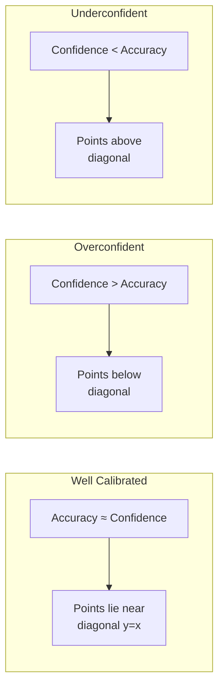

> **Production rule**: Always calibrate before setting confidence thresholds. A model with 80% accuracy at 90% confidence will generate 2× more false positives than expected. Temperature scaling is the standard fix — requires only a few hundred validation examples.

---

## Part IV — Production

---

## 12. Deployment & Optimization

### 12.1 Optimization Workflow

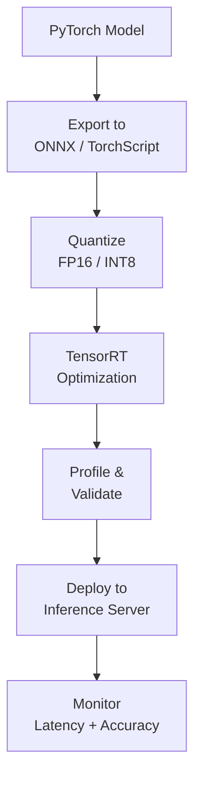

### 12.2 Export to ONNX

```python
import torch
import torch.onnx
from torchvision.models import convnext_tiny

model = convnext_tiny(weights="DEFAULT").eval()

dummy_input = torch.randn(1, 3, 224, 224)

torch.onnx.export(
    model,
    dummy_input,
    "convnext_tiny.onnx",
    input_names=["input"],
    output_names=["output"],
    dynamic_axes={
        "input": {0: "batch_size"},
        "output": {0: "batch_size"},
    },
    opset_version=18,
    do_constant_folding=True,
)

# Verify
import onnx
onnx_model = onnx.load("convnext_tiny.onnx")
onnx.checker.check_model(onnx_model)
print(f"ONNX export valid: {len(onnx_model.graph.node)} nodes")
```

### 12.3 TensorRT Optimization

```python
# Option 1: Using torch_tensorrt
import torch_tensorrt

model = convnext_tiny(weights="DEFAULT").eval().cuda()
example_input = torch.randn(1, 3, 224, 224).cuda()

trt_model = torch_tensorrt.compile(
    model,
    inputs=[torch_tensorrt.Input((1, 3, 224, 224))],
    enabled_precisions={torch.half},  # FP16
    workspace_size=1 << 30,
)

# Benchmark
import time

with torch.no_grad():
    # Warmup
    for _ in range(20):
        trt_model(example_input)

    start = time.perf_counter()
    for _ in range(1000):
        trt_model(example_input)
    elapsed = time.perf_counter() - start

print(f"TensorRT FP16: {elapsed / 1000 * 1000:.2f}ms per inference")
```

### 12.4 Quantization

```python
# Post-training quantization (PTQ)
from torchvision.models import resnet50
import torch

model = resnet50(weights="DEFAULT").eval()

# Fusion
model = torch.quantization.fuse_modules(model, [
    ["conv1", "bn1", "relu"],
    ["layer1.0.conv1", "layer1.0.bn1", "layer1.0.relu"],
    # ... fuse all Conv-BN-ReLU patterns
])

# Prepare for quantization
model.qconfig = torch.quantization.get_default_qconfig("fbgemm")
model_prepared = torch.quantization.prepare(model)

# Calibrate with representative data
def calibrate(model, calib_loader):
    model.eval()
    with torch.no_grad():
        for images, _ in calib_loader:
            model(images)

calibrate(model_prepared, calibration_loader)

# Convert to INT8
model_int8 = torch.quantization.convert(model_prepared)

# Benchmark
import time

with torch.no_grad():
    start = time.perf_counter()
    for _ in range(100):
        model_int8(example_input)
    elapsed = time.perf_counter() - start

print(f"INT8: {elapsed / 100 * 1000:.2f}ms per inference")
```

### 12.5 Deployment Formats Comparison

| Format | Size (ResNet-50) | Latency (T4) | Framework Support | Use Case |
|--------|-----------------|--------------|-------------------|----------|
| PyTorch | 98 MB | 8.5ms | PyTorch only | Research, dev |
| TorchScript | 95 MB | 7.2ms | PyTorch, libtorch | C++ deployment |
| ONNX (FP32) | 97 MB | 6.8ms | ONNX Runtime, Triton | Multi-framework |
| ONNX (FP16) | 49 MB | 4.1ms | ONNX Runtime, Triton | GPU inference |
| TensorRT (FP32) | 95 MB | 3.5ms | TensorRT, Triton | Max GPU perf |
| TensorRT (FP16) | 48 MB | 2.1ms | TensorRT, Triton | Balanced perf |
| TensorRT (INT8) | 25 MB | 1.5ms | TensorRT, Triton | Max throughput |
| CoreML (FP16) | 49 MB | 3.0ms (M1 Max) | Apple devices | iOS, macOS |
| OpenVINO (FP16) | 49 MB | 3.8ms | OpenVINO | Intel CPU/GPU |

### 12.6 Edge Deployment

Deploying vision models on edge devices (phones, cameras, IoT) requires different trade-offs than cloud serving.

#### Edge Runtime Comparison

| Runtime | Devices | Format | INT8 Support | Speed (MobileNet-V3) |
|---------|---------|--------|-------------|---------------------|
| **TensorRT** | NVIDIA Jetson | `.engine` | ✅ | 1× (baseline GPU) |
| **ONNX Runtime Mobile** | ARM Linux, Android | `.ort` | ✅ | 0.6× |
| **TFLite** | Android, Linux, MCU | `.tflite` | ✅ | 0.5× (GPU delegate: 0.8×) |
| **CoreML** | iOS, macOS | `.mlpackage` | ✅ (ANE) | 0.7× (ANE: 1.2×) |
| **NCNN** | Android, ARM Linux | `.param/.bin` | ✅ | 0.5× (Vulkan: 0.7×) |
| **OpenVINO** | Intel CPU/GPU/NPU | `.xml/.bin` | ✅ | 0.5× (NPU: 0.9×) |

```python
# Export to TFLite via ONNX — standard edge workflow
import torch
import onnx
from torchvision.models import mobilenet_v3_small

model = mobilenet_v3_small(weights="DEFAULT").eval()

# Step 1: ONNX
torch.onnx.export(model, torch.randn(1, 3, 224, 224),
                  "model.onnx", opset_version=18)

# Step 2: ONNX → TFLite (using onnx2tf)
# pip install onnx2tf
# onnx2tf -i model.onnx -o tflite_model
# Result: tflite_model/model_float32.tflite

# Step 3: Quantize to INT8
# import tensorflow as tf
# converter = tf.lite.TFLiteConverter.from_saved_model("tflite_model")
# converter.optimizations = [tf.lite.Optimize.DEFAULT]
# converter.representative_dataset = representative_dataset  # calibration
# tflite_int8 = converter.convert()
# with open("model_int8.tflite", "wb") as f:
#     f.write(tflite_int8)


# Alternative: CoreML export (macOS only)
# pip install coremltools
import coremltools as ct

model.eval()
example = torch.randn(1, 3, 224, 224)
traced = torch.jit.trace(model, example)

mlmodel = ct.convert(
    traced,
    inputs=[ct.ImageType(name="input", shape=example.shape,
                         bias=[-1, -1, -1], scale=1.0/128.0)],
)

mlmodel.save("model.mlpackage")
```

#### Edge Quantization: QAT vs PTQ

| Approach | Accuracy | Requires | Use Case |
|----------|----------|----------|----------|
| **Post-Training Quantization (PTQ)** | Good | Calibration data (~100 images) | Fast deploy, most cases |
| **Quantization-Aware Training (QAT)** | Best | Training pipeline | Accuracy-critical, INT4 |
| **PTQ + Partial QAT** | Near best | Calibration + short fine-tune | Practical compromise |

```python
# QAT with torchvision (convnext_tiny → INT8 for edge)
import torch
from torchvision.models import convnext_tiny
from torchvision.models.quantization import convnext_tiny as qat_convnext_tiny

# QAT model with fake quantization modules
model = qat_convnext_tiny(weights="DEFAULT", quantize=True)
model.train()  # QAT requires training mode

# Fine-tune for a few epochs with fake quantization
# The model learns to compensate for quantization error

# After training: convert to INT8
model.eval()
model_int8 = torch.quantization.convert(model)

# Export to edge format
torch.onnx.export(model_int8, torch.randn(1, 3, 224, 224),
                  "model_int8.onnx", opset_version=18)
# → ~8 MB (from 109 MB FP32) with < 1% accuracy loss
```

#### Edge Deployment Checklist

- [ ] Input resolution: smaller = faster (e.g. 224 → 160 → 128)
- [ ] INT8 quantization: 4× smaller, 2-3× faster, minimal accuracy loss
- [ ] Batch size 1: edge devices rarely batch
- [ ] Hardware decoder: use NPU/DSP/ANE if available (15-50 TOPS)
- [ ] Frame skipping: process every Nth frame for video
- [ ] Model pruning: remove 20-30% channels with minimal accuracy loss
- [ ] Power budget: GPU vs CPU vs NPU trade-off at same TDP

---

## 13. Model Selection Guide

### 13.1 Decision Flowchart

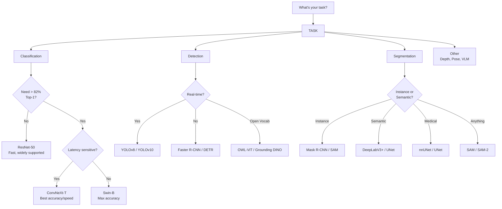

### 13.2 Model Selection Table

| Task | Best Overall | Fastest | Most Accurate | Easiest Deploy |
|------|-------------|---------|--------------|---------------|
| Classification | ConvNeXt-T | MobileNet-V3 | ConvNeXt-XL | ResNet-50 |
| Detection | YOLOv8m | YOLOv8n | YOLOv8x / DETR | YOLOv8 |
| Instance Seg | Mask R-CNN | YOLOv8m-seg | Mask R-CNN | Mask R-CNN |
| Semantic Seg | DeepLabV3+ | UNet mini | DeepLabV3+ | DeepLabV3+ |
| Few-shot / Foundation | SAM | SAM-B | SAM-H | SAM |

---

## 14. Production Serving Patterns

### 14.1 Batch Processing Pipeline

```python
import numpy as np
from PIL import Image
from torchvision.models import resnet50
from torchvision import transforms as T
import torch

class VisionInferencePipeline:
    """End-to-end vision inference with preprocessing and batching."""
    def __init__(self, model_path, device="cuda"):
        self.device = device
        self.model = resnet50(weights="DEFAULT").eval().to(device)

        self.transform = T.Compose([
            T.Resize(256),
            T.CenterCrop(224),
            T.ToTensor(),
            T.Normalize(mean=[0.485, 0.456, 0.406],
                        std=[0.229, 0.224, 0.225]),
        ])

        self.labels = self._load_imagenet_labels()

    def _load_imagenet_labels(self):
        import json
        import urllib.request
        url = "https://raw.githubusercontent.com/pytorch/hub/master/imagenet_classes.txt"
        response = urllib.request.urlopen(url)
        return [line.decode().strip() for line in response.readlines()]

    def preprocess(self, image_path_or_array):
        if isinstance(image_path_or_array, str):
            image = Image.open(image_path_or_array).convert("RGB")
        else:
            image = Image.fromarray(image_path_or_array)
        return self.transform(image).unsqueeze(0).to(self.device)

    def predict(self, images):
        if isinstance(images, list):
            batch = torch.cat([self.preprocess(img) for img in images], dim=0)
        else:
            batch = self.preprocess(images)

        with torch.no_grad():
            with torch.cuda.amp.autocast():
                outputs = self.model(batch)
                probs = torch.nn.functional.softmax(outputs, dim=1)

        top_probs, top_indices = probs.topk(5, dim=1)
        results = []
        for i in range(batch.size(0)):
            results.append({
                "top_classes": [self.labels[idx] for idx in top_indices[i]],
                "top_probs": top_probs[i].tolist(),
            })
        return results
```

### 14.2 YOLO Detection Server (FastAPI)

```python
from fastapi import FastAPI, UploadFile, File
from ultralytics import YOLO
import numpy as np
import cv2

app = FastAPI()
model = YOLO("yolov8m.engine")  # TensorRT engine

@app.post("/detect")
async def detect(file: UploadFile = File(...)):
    contents = await file.read()
    nparr = np.frombuffer(contents, np.uint8)
    img = cv2.imdecode(nparr, cv2.IMREAD_COLOR)

    results = model(img)[0]

    detections = []
    for box in results.boxes:
        detections.append({
            "class": results.names[int(box.cls[0])],
            "confidence": float(box.conf[0]),
            "bbox": box.xyxy[0].tolist(),
        })

    return {"detections": detections, "count": len(detections)}
```

### 14.3 Triton Inference Server with Vision Model

```python
# Model config for Triton (model_repository/resnet50/config.pbtxt)
"""
name: "resnet50"
platform: "onnxruntime_onnx"
max_batch_size: 64
input [
  {
    name: "input"
    data_type: TYPE_FP32
    dims: [3, 224, 224]
  }
]
output [
  {
    name: "output"
    data_type: TYPE_FP32
    dims: [1000]
  }
]
dynamic_batching {
  preferred_batch_size: [1, 4, 8, 16, 32]
  max_queue_delay_microseconds: 100
}
instance_group [
  {
    count: 2
    kind: KIND_GPU
  }
]
"""

# Triton client
import tritonclient.http as httpclient

client = httpclient.InferenceServerClient(url="localhost:8000")
input_tensor = httpclient.InferInput("input", [1, 3, 224, 224], "FP32")
input_tensor.set_data_from_numpy(preprocessed_image)

result = client.infer(model_name="resnet50", inputs=[input_tensor])
output = result.as_numpy("output")
```

### 14.4 Monitoring Vision Models

```python
def monitor_prediction_distribution(model_outputs, threshold=0.5):
    """Track prediction confidence distribution for drift detection."""
    confidences = np.max(model_outputs, axis=1)
    predicted_classes = np.argmax(model_outputs, axis=1)

    stats = {
        "mean_confidence": float(np.mean(confidences)),
        "confidence_std": float(np.std(confidences)),
        "low_confidence_ratio": float(np.mean(confidences < threshold)),
        "prediction_entropy": float(
            -np.sum(np.mean(model_outputs, axis=0) * np.log(np.mean(model_outputs, axis=0) + 1e-10))
        ),
        "class_distribution": np.bincount(predicted_classes, minlength=1000).tolist(),
    }
    return stats
```

### 14.5 Video & Streaming Inference

Real-time video inference adds frame decoding, temporal smoothing, and tracking on top of image models.

#### Video Decoding Strategies

| Method | Speed | CPU Usage | Hardware Accel | Use Case |
|--------|-------|-----------|----------------|----------|
| OpenCV `VideoCapture` | 30 fps | Moderate | ❌ | Quick prototype |
| PyAV (FFmpeg) | 60 fps | Low | ⚠️ | Production pipelines |
| NVIDIA DALI `readers.video` | 120 fps | Very low | ✅ NVDEC | GPU-accelerated |
| `torchvision.io.read_video` | 30 fps | Moderate | ❌ | PyTorch native |

```python
# Production video inference with PyAV + frame sampling
import av
import numpy as np
import torch
from torchvision.models import resnet50

model = resnet50(weights="DEFAULT").eval().cuda()

def inference_video_stream(video_path, sample_every_n=5):
    """Process video with frame sampling — skip every Nth frame."""
    container = av.open(video_path)
    stream = container.streams.video[0]
    frames, timestamps = [], []

    for i, frame in enumerate(container.decode(video=0)):
        if i % sample_every_n != 0:
            continue

        img = frame.to_rgb().to_ndarray()
        img = torch.from_numpy(img).permute(2, 0, 1).float() / 255.0
        img = torch.nn.functional.interpolate(
            img.unsqueeze(0), size=(224, 224)
        )

        with torch.no_grad():
            output = model(img.cuda())

        frames.append(output)
        timestamps.append(frame.pts / av.time_base)

    return torch.cat(frames), timestamps


# Object tracking with ByteTrack
def track_detections(detections, frame_id, tracker):
    """Associate detections across frames using ByteTrack."""
    from bytetrack import BYTETracker

    online_targets = tracker.update(detections, [1080, 1920], (1080, 1920))
    tracks = []
    for t in online_targets:
        tracks.append({
            "track_id": t.track_id,
            "bbox": t.tlbr.tolist(),
            "score": t.score,
            "class": t.class_id,
        })
    return tracks


# Stream batching — process multiple camera feeds
def batch_streams(streams, batch_size=4):
    """Read from multiple streams and batch for GPU efficiency."""
    frames = []
    stream_ids = []

    for stream_id, cap in streams.items():
        ret, frame = cap.read()
        if ret:
            frames.append(preprocess_frame(frame))
            stream_ids.append(stream_id)

        if len(frames) >= batch_size:
            break

    if not frames:
        return None

    batch = torch.stack(frames).cuda()
    return batch, stream_ids
```

### 14.6 Active Learning Loop

Active learning efficiently grows labeled data by selecting the most informative unlabeled examples for human annotation.


#### Uncertainty Sampling Strategies

| Strategy | Score | Best For | Cost |
|----------|-------|----------|------|
| **Least Confidence** | `1 - max(softmax)` | Multi-class | Low |
| **Margin Sampling** | `top1 - top2` | Fine-grained classes | Low |
| **Entropy** | `-Σ p×log(p)` | Imbalanced data | Low |
| **Core-set** | Distance to labeled set | Diverse coverage | High |
| **MONTE CARLO Dropout** | Variance over N passes | Uncertainty estimation | Medium |
| **Committee** | Disagreement across models | Robust estimation | High |

```python
import numpy as np
from sklearn.metrics import pairwise_distances

def uncertainty_sampling(model, unlabeled_loader, strategy="entropy", n_select=100):
    """Select the most uncertain examples for labeling."""
    model.eval()
    scores = []

    with torch.no_grad():
        for images in unlabeled_loader:
            images = images.cuda()

            if strategy == "mc_dropout":
                model.train()  # enable dropout
                outputs = torch.stack([
                    model(images).softmax(dim=1) for _ in range(10)
                ])
                # Monte Carlo variance
                uncertainty = outputs.var(dim=0).mean(dim=1)
                scores.append(uncertainty.cpu())
            else:
                outputs = model(images).softmax(dim=1)

                if strategy == "least_confidence":
                    uncertainty = 1 - outputs.max(dim=1)[0]
                elif strategy == "margin":
                    top2 = outputs.topk(2, dim=1)[0]
                    uncertainty = top2[:, 0] - top2[:, 1]
                elif strategy == "entropy":
                    uncertainty = -(outputs * outputs.log()).sum(dim=1)

                scores.append(uncertainty.cpu())

    scores = torch.cat(scores)
    selected = scores.argsort(descending=True)[:n_select]

    return selected.tolist()


def core_set_selection(embeddings, labeled_indices, n_select=100):
    """Greedy core-set: pick points farthest from labeled set."""
    labeled = embeddings[labeled_indices]
    unlabeled = np.delete(embeddings, labeled_indices, axis=0)
    unlabeled_indices = np.delete(np.arange(len(embeddings)), labeled_indices)

    selected = []
    for _ in range(n_select):
        dists = pairwise_distances(unlabeled, labeled, metric="cosine")
        min_dists = dists.min(axis=1)
        idx = min_dists.argmax()
        selected.append(unlabeled_indices[idx])
        labeled = np.vstack([labeled, unlabeled[idx]])
        unlabeled = np.delete(unlabeled, idx, axis=0)
        unlabeled_indices = np.delete(unlabeled_indices, idx)

    return selected
```

### 14.7 Model Registry & A/B Testing

Versioning and gradual rollout for vision models in production.

```python
import json
import shutil
from pathlib import Path
from datetime import datetime


class VisionModelRegistry:
    """Simple model registry for vision models with shadow scoring."""

    def __init__(self, base_dir="./model_registry"):
        self.base_dir = Path(base_dir)
        self.base_dir.mkdir(exist_ok=True)

    def register(self, model_path, metadata):
        """Register a new model version."""
        version = len(list(self.base_dir.glob("*")))
        version_dir = self.base_dir / f"v{version}"
        version_dir.mkdir()

        shutil.copy(model_path, version_dir / "model.onnx")

        metadata["registered_at"] = datetime.now().isoformat()
        metadata["version"] = version
        with open(version_dir / "metadata.json", "w") as f:
            json.dump(metadata, f, indent=2)

        return version

    def get_latest(self):
        versions = sorted(self.base_dir.glob("v*"))
        return versions[-1] if versions else None

    def get_metadata(self, version):
        meta_path = self.base_dir / f"v{version}" / "metadata.json"
        if meta_path.exists():
            return json.loads(meta_path.read_text())
        return None


class ABTestRouter:
    """Route traffic between model versions for evaluation."""

    def __init__(self, model_a_session, model_b_session, traffic_split=0.1):
        self.session_a = model_a_session
        self.session_b = model_b_session
        self.split = traffic_split
        self.counts = {"A": 0, "B": 0}

    def predict(self, inputs, track_metadata=True):
        import random
        use_b = random.random() < self.split

        session = self.session_b if use_b else self.session_a
        model = "B" if use_b else "A"
        self.counts[model] += 1

        outputs = session.run(None, inputs)
        return outputs, model

    def report(self):
        total = self.counts["A"] + self.counts["B"]
        if total == 0:
            return {}
        return {
            "model_a_count": self.counts["A"],
            "model_b_count": self.counts["B"],
            "model_b_pct": round(self.counts["B"] / total * 100, 1),
        }


# Production A/B workflow for detectors:
# 1. Deploy new model as shadow (traffic_split=0, log predictions)
# 2. Compare mAP on logged ground truth
# 3. Enable canary (traffic_split=0.05 — 5% of traffic)
# 4. Monitor per-class AP drift, latency p99
# 5. Gradual rollout: 5% → 25% → 50% → 100%
# 6. Rollback if any metric degrades beyond threshold
```

---

## Quick Reference Card

### Architecture Selection

| Use Case | Architecture | Deployment Format | Expected FPS (T4) |
|----------|-------------|-------------------|-------------------|
| Classification | ConvNeXt-T | TensorRT FP16 | 450 |
| Detection | YOLOv8m | TensorRT FP16 | 220 |
| Instance Seg | Mask R-CNN | TensorRT FP16 | 60 |
| Segmentation | DeepLabV3+ | TensorRT FP16 | 120 |
| Open Vocab | OWL-ViT | ONNX FP16 | 15 |
| Foundation | SAM-B | ONNX FP16 | 30 |

### Key Formulas

| What | Formula |
|------|---------|
| Classification FLOPs (Conv) | `C_out × C_in × K² × H_out × W_out` |
| Attention FLOPs (ViT) | `2 × N² × D` (N=patches, D=dim) |
| Memory (FP32 inference) | `params × 4 bytes + activations` |
| Memory (FP16 inference) | `params × 2 bytes + activations` |
| Detection mAP | Mean of AP over classes at IoU thresholds |
| Receptive field | `K_eff = Σ (K_i - 1) × stride_product + 1` |
| DataLoader throughput | `batch_size / (time_per_batch + decode_time)` |
| Optimal num_workers | `~4 × CPU cores per GPU` |
| Temperature scaling T | Optimize via NLL on validation set |

### Common CLI Commands

```bash
# Profile model latency
python -c "
import torch, time
m = torch.hub.load('pytorch/vision', 'resnet50', pretrained=True).eval().cuda()
x = torch.randn(1, 3, 224, 224).cuda()
with torch.no_grad():
    for _ in range(100): m(x)
    start = time.perf_counter()
    for _ in range(1000): m(x)
    print(f'{(time.perf_counter()-start)/1000*1000:.2f}ms')
"

# Export to ONNX
python -c "
import torch; from torchvision.models import resnet50
m = resnet50(weights="DEFAULT").eval()
torch.onnx.export(m, torch.randn(1,3,224,224), 'model.onnx', opset_version=18)
"

# Visualize model with Netron
python -m netron model.onnx

# YOLOv8 benchmark
yolo benchmark model=yolov8m.pt imgsz=640 device=0

# TensorRT conversion
trtexec --onnx=model.onnx --fp16 --saveEngine=model.engine

# ECE calibration check
python -c "
import torch; from torchvision.models import resnet50
m = resnet50(weights='DEFAULT').eval()
# ... load val set, run compute_ece(logits, labels)
print('ECE:', compute_ece(logits, labels))
"

# Video inference with PyAV
python -c "
import av; container = av.open('video.mp4')
for frame in container.decode(video=0): print(frame.pts)
"

# Active learning selection
python -c "
# entropy = -(probs * probs.log()).sum(dim=1)
# selected = entropy.argsort(descending=True)[:100]
"
```

### Python Imports Quick Reference

```python
# Core
import torch
import torch.nn as nn
import torchvision
import torchvision.transforms as T

# Models
from torchvision.models import resnet50, convnext_tiny, vit_b_16, swin_t
from ultralytics import YOLO

# Detection
from torchvision.ops import box_iou, nms
from torchvision.models.detection import maskrcnn_resnet50_fpn_v2

# Segmentation
from torchvision.models.segmentation import deeplabv3_resnet50, fcn_resnet50
from segment_anything import sam_model_registry, SamPredictor

# Data
from torch.utils.data import DataLoader, Dataset
from torchvision.datasets import ImageFolder

# Augmentation
from torchvision.transforms import RandAugment, TrivialAugmentWide
import albumentations as A

# Metrics
from sklearn.metrics import precision_recall_fscore_support

# Deployment
import onnx
import onnxruntime as ort
import tensorrt as trt

# Video / Tracking
import av
from bytetrack import BYTETracker

# Calibration
from sklearn.calibration import calibration_curve
```

### Environment Variables

```bash
# CUDA optimization
export CUDA_LAUNCH_BLOCKING=0
export TORCH_CUDNN_V8_API_ENABLED=1

# TensorRT
export TRT_ENGINE_CACHE_ENABLE=1
export TRT_ENGINE_CACHE_PATH=./trt_cache

# ONNX Runtime
export ORT_LOG_SEVERITY=2

# Torch compile
export TORCHINDUCTOR_FX_REMOTE_CACHE=1
```

### Debugging Checklist

- [ ] Input normalization matches training (mean/std)
- [ ] Image resize to expected input size
- [ ] Batch dimension present (B, C, H, W)
- [ ] Model in `.eval()` mode (not `.train()`)
- [ ] `torch.no_grad()` for inference
- [ ] AMP autocast for half-precision
- [ ] Verify output logits match expected classes
- [ ] Check for CUDA out-of-memory (reduce batch size)
- [ ] Benchmark latency vs accuracy trade-off
- [ ] Test with production image formats (JPEG, PNG, WebP)
- [ ] Validate TensorRT engine with `polygraphy run`
- [ ] DataLoader: `num_workers=4-8`, `pin_memory=True`, `prefetch_factor=4`
- [ ] NMS: tune IoU threshold (0.3-0.7) and score threshold on validation set
- [ ] Calibrate model — check ECE before setting confidence thresholds
- [ ] Edge: INT8 quantize, test on target device, check power budget

---

> *"The best vision model is the one that runs reliably in production — not the one with the highest ImageNet accuracy."*
