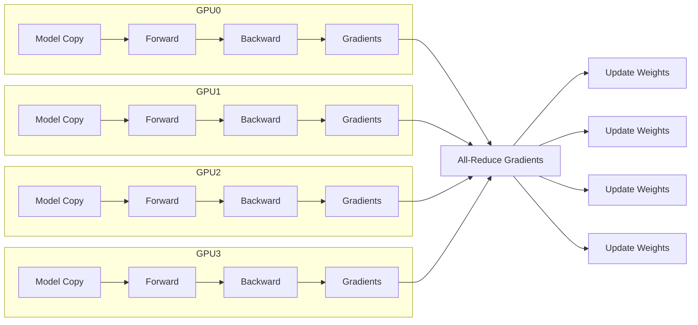
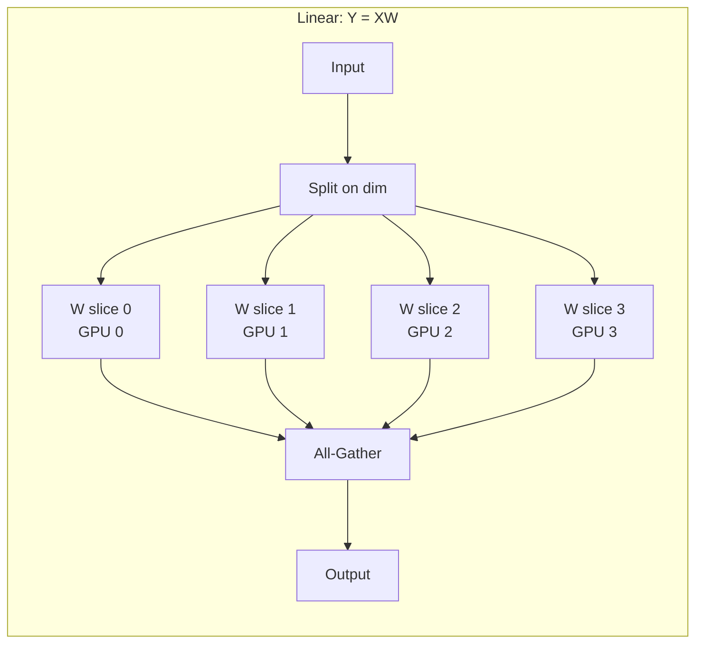
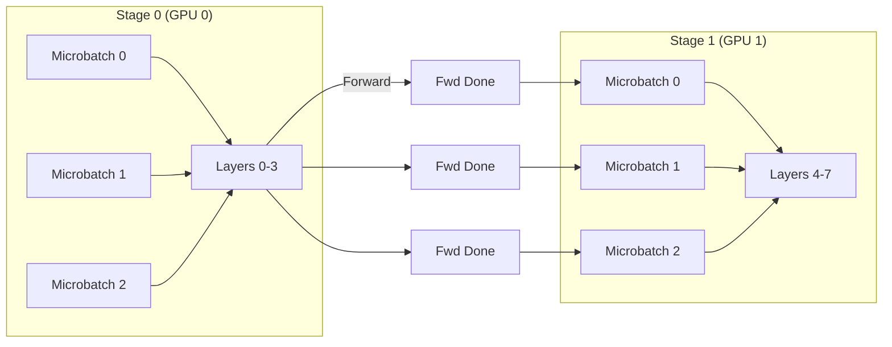
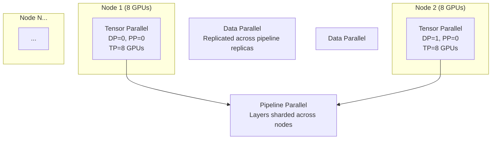
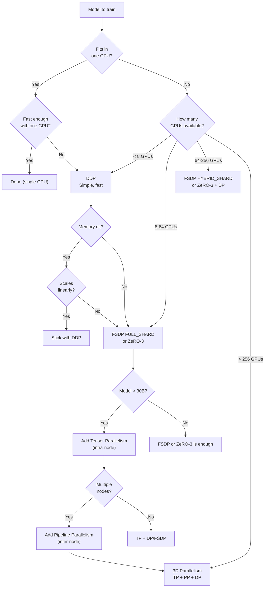

> **Distributed training** — scaling model training across multiple GPUs and nodes using data, model, and pipeline parallelism strategies.

---

## Table of Contents

- [1. Why Distribute?](#1-why-distribute)
  - [The Problem](#the-problem)
  - [What Distribution Solves](#what-distribution-solves)
- [2. Data Parallelism (DDP)](#2-data-parallelism-ddp)
  - [How It Works](#how-it-works)
  - [API — torchrun + DistributedDataParallel](#api--torchrun--distributeddataparallel)
  - [Key Parameters](#key-parameters)
  - [Gradient Bucketing](#gradient-bucketing)
  - [When DDP Breaks Down](#when-ddp-breaks-down)
- [3. Fully Sharded Data Parallelism (FSDP)](#3-fully-sharded-data-parallelism-fsdp)
  - [How It Works](#how-it-works-1)
  - [FSDP Sharding Strategies](#fsdp-sharding-strategies)
  - [FSDP in Practice](#fsdp-in-practice)
  - [Saving & Loading FSDP](#saving--loading-fsdp)
  - [FSDP v1 vs v2](#fsdp-v1-vs-v2)
  - [FSDP vs DDP Memory](#fsdp-vs-ddp-memory)
- [4. DeepSpeed ZeRO](#4-deepspeed-zero)
  - [Configuration](#configuration)
  - [Using with HuggingFace Trainer](#using-with-huggingface-trainer)
  - [ZeRO-3 with CPU Offload](#zero-3-with-cpu-offload)
  - [DeepSpeed vs FSDP](#deepspeed-vs-fsdp)
- [5. Tensor Parallelism](#5-tensor-parallelism)
  - [How It Works](#how-it-works-2)
  - [Column-Wise vs Row-Wise](#column-wise-vs-row-wise)
  - [Megatron-LM Style](#megatron-lm-style)
  - [When to Use Tensor Parallelism](#when-to-use-tensor-parallelism)
- [6. Pipeline Parallelism](#6-pipeline-parallelism)
  - [How It Works](#how-it-works-3)
  - [Schedule Types](#schedule-types)
  - [GPipe Style (Simplified)](#gpipe-style-simplified)
  - [Pipeline Parallelism Considerations](#pipeline-parallelism-considerations)
- [7. Hybrid Parallelism (3D)](#7-hybrid-parallelism-3d)
  - [Megatron-DeepSpeed Style Configuration](#megatron-deepspeed-style-configuration)
  - [Training Throughput Estimates](#training-throughput-estimates)
  - [Hybrid Sharded Data Parallelism (HSDP)](#hybrid-sharded-data-parallelism-hsdp)
- [8. Communication Collectives](#8-communication-collectives)
  - [Collective Operations](#collective-operations)
  - [Algorithm Costs](#algorithm-costs)
  - [Ring All-Reduce (Conceptual)](#ring-all-reduce-conceptual)
  - [Benchmarking Collectives](#benchmarking-collectives)
- [9. NCCL Tuning](#9-nccl-tuning)
  - [NCCL Environment Variables](#nccl-environment-variables)
  - [Protocol Comparison](#protocol-comparison)
  - [Topology-Aware Tuning](#topology-aware-tuning)
  - [Common Issues](#common-issues)
- [10. Memory Estimation](#10-memory-estimation)
  - [Per-GPU Memory Breakdown](#per-gpu-memory-breakdown)
  - [Memory Estimation Function](#memory-estimation-function)
  - [Rule of Thumb](#rule-of-thumb)
- [11. Choosing a Strategy](#11-choosing-a-strategy)
  - [Decision Flowchart](#decision-flowchart)
  - [Strategy Quick Reference](#strategy-quick-reference)
- [12. Practical Examples](#12-practical-examples)
  - [Full DDP Training Script](#full-ddp-training-script)
  - [FSDP Training with HuggingFace](#fsdp-training-with-huggingface)
  - [DeepSpeed ZeRO-3 with Custom Training Loop](#deepspeed-zero-3-with-custom-training-loop)
  - [Launch Commands](#launch-commands)
  - [Checking the Setup](#checking-the-setup)
- [Quick Reference Card](#quick-reference-card)

---

## 1. Why Distribute?

### The Problem

A single GPU has finite memory and compute. Training modern LLMs requires:

| Model | Parameters | FP16 Weights | Adam States | Gradients | Activations (est) | Total | GPUs Needed |
|-------|-----------|-------------|-------------|-----------|-------------------|-------|-------------|
| Llama-2 7B | 7B | 14 GB | 56 GB | 14 GB | ~28 GB | 112 GB | 2× A100-80GB |
| Llama-2 13B | 13B | 26 GB | 104 GB | 26 GB | ~52 GB | 208 GB | 3× A100-80GB |
| Llama-2 70B | 70B | 140 GB | 560 GB | 140 GB | ~280 GB | 1.12 TB | 8× A100-80GB |
| GPT-3 175B | 175B | 350 GB | 1.4 TB | 350 GB | ~700 GB | 2.8 TB | 36× A100-80GB |

### What Distribution Solves

| Concern | Single GPU | Distributed |
|---------|-----------|-------------|
| Memory capacity | Limited to GPU VRAM (24-80 GB) | Aggregate across GPUs |
| Training time | Sequential | Parallel (linear speedup until comms bound) |
| Batch size | Small (affects BN, gradient noise) | Large (stable training, better utilization) |
| Model size limit | Must fit in one GPU | No practical limit (shard across GPUs) |

---

## 2. Data Parallelism (DDP)

### How It Works

Each GPU holds a full copy of the model. The batch is split across GPUs. Every step:

1. Each GPU forward+backward on its micro-batch
2. Gradients are **all-reduced** across all GPUs
3. Each GPU applies the averaged gradients to its local copy
4. All GPUs end with identical weights



### API — `torchrun` + `DistributedDataParallel`

```python
# train_ddp.py
import torch
import torch.distributed as dist
import torch.multiprocessing as mp
from torch.nn.parallel import DistributedDataParallel as DDP
from torch.utils.data.distributed import DistributedSampler

def setup(rank, world_size):
    """Initialize the process group."""
    dist.init_process_group(
        backend="nccl",
        init_method="env://",
        rank=rank,
        world_size=world_size,
    )
    torch.cuda.set_device(rank)

def cleanup():
    dist.destroy_process_group()

def train(rank, world_size, model_class, dataset):
    setup(rank, world_size)
    
    model = model_class().to(rank)
    model = DDP(model, device_ids=[rank])
    
    sampler = DistributedSampler(dataset, num_replicas=world_size, rank=rank)
    loader = torch.utils.data.DataLoader(dataset, batch_size=32, sampler=sampler)
    
    optimizer = torch.optim.AdamW(model.parameters(), lr=3e-4)
    
    for epoch in range(10):
        sampler.set_epoch(epoch)
        for x, y in loader:
            x, y = x.to(rank), y.to(rank)
            
            optimizer.zero_grad()
            loss = model(x, y)
            loss.backward()
            optimizer.step()
    
    cleanup()

if __name__ == "__main__":
    world_size = torch.cuda.device_count()
    mp.spawn(train, args=(world_size, MyModel, dataset), nprocs=world_size)
```

Launch with `torchrun`:

```bash
torchrun --nproc_per_node=4 train_ddp.py
```

### Key Parameters

| Parameter | What It Does |
|-----------|-------------|
| `backend="nccl"` | NVIDIA collective comms library (GPU-only). Use `"gloo"` for CPU. |
| `init_method="env://"` | Reads `MASTER_ADDR`, `MASTER_PORT`, `WORLD_SIZE`, `RANK` from env |
| `device_ids=[rank]` | Pins DDP to the correct GPU |
| `DistributedSampler` | Shards the dataset without overlap. Call `set_epoch()` each epoch to shuffle. |

### Gradient Bucketing

DDP buckets gradients by parameter size to reduce small tensor overhead:

```python
model = DDP(
    model,
    device_ids=[rank],
    bucket_cap_mb=25,  # default — larger = fewer all-reduces, more memory
    gradient_as_bucket_view=True,  # avoids extra gradient copies
    static_graph=True,  # set if graph doesn't change (faster, less memory)
)
```

### When DDP Breaks Down

| Problem | Cause | Solution |
|---------|-------|----------|
| OOM | Model doesn't fit in one GPU | FSDP / ZeRO / model parallelism |
| Low throughput | GPU idle during all-reduce | Overlap comms with compute (`bucket_cap_mb`) |
| Linear scaling fails | Communication dominates at large scale | Gradient accumulation, or switch to FSDP |

---

## 3. Fully Sharded Data Parallelism (FSDP)

### How It Works

FSDP shards model parameters, gradients, and optimizer states across GPUs. Each GPU only holds a **fraction** of the model at any time. Before a forward pass, FSDP **all-gathers** the layer's parameters, computes, then **frees** non-owned shards.


### FSDP Sharding Strategies

| Strategy | Params | Gradients | Optimizer States | Memory | Communication |
|----------|--------|-----------|------------------|--------|---------------|
| `NO_SHARD` | Full | Full | Full | Highest (same as DDP) | Lowest |
| `SHARD_GRAD_OP` | Full | Sharded | Sharded | Medium | Medium |
| `FULL_SHARD` | Sharded | Sharded | Sharded | Lowest | Highest |

### FSDP in Practice

```python
from torch.distributed.fsdp import (
    FullyShardedDataParallel as FSDP,
    CPUOffload,
    MixedPrecision,
    BackwardPrefetch,
    ShardingStrategy,
    FullStateDictConfig,
    StateDictType,
)
from torch.distributed.fsdp.wrap import transformer_auto_wrap_policy
from torch.distributed.fsdp.api import ShardedStateDictConfig
import torch.nn as nn

def get_fsdp_config(model):
    """FSDP wrapping configuration for transformer models."""
    from transformers.models.llama.modeling_llama import LlamaDecoderLayer
    
    return {
        "auto_wrap_policy": transformer_auto_wrap_policy(
            transformer_layer_cls={LlamaDecoderLayer}
        ),
        "sharding_strategy": ShardingStrategy.FULL_SHARD,
        "cpu_offload": CPUOffload(offload_params=False),
        "mixed_precision": MixedPrecision(
            param_dtype=torch.bfloat16,
            reduce_dtype=torch.bfloat16,
            buffer_dtype=torch.bfloat16,
        ),
        "backward_prefetch": BackwardPrefetch.BACKWARD_PRE,
        "forward_prefetch": True,
        "limit_all_gathers": True,
        "device_id": torch.cuda.current_device(),
    }

def create_fsdp_model(model):
    return FSDP(model, **get_fsdp_config(model))
```

### Saving & Loading FSDP

```python
# Save
def save_fsdp(model, path):
    with FSDP.state_dict_type(
        model,
        StateDictType.FULL_STATE_DICT,
        state_dict_config=FullStateDictConfig(offload_to_cpu=True, rank0_only=True),
    ):
        state_dict = model.state_dict()
        if dist.get_rank() == 0:
            torch.save(state_dict, path)

# Load
def load_fsdp(model, path):
    with FSDP.state_dict_type(
        model,
        StateDictType.FULL_STATE_DICT,
        state_dict_config=FullStateDictConfig(offload_to_cpu=True, rank0_only=True),
    ):
        state_dict = torch.load(path, map_location="cpu") if dist.get_rank() == 0 else {}
        model.load_state_dict(state_dict)
```

### FSDP v1 vs v2

| Feature | FSDP v1 (PyTorch < 2.1) | FSDP v2 (PyTorch ≥ 2.1) |
|---------|------------------------|------------------------|
| Core implementation | Wraps `nn.Module` | Uses DTensor + `torch.distributed._tensor` |
| Memory overhead | Duplicate parameters during all-gather | More efficient DTensor sharding |
| HSDP support | Manual | Built-in hybrid sharding |
| Performance | Good | Better for large-scale (> 64 GPUs) |
| API | `FSDP(model, ...)` | Same API (backward compatible) |

### FSDP vs DDP Memory

| Model | DDP (per GPU) | FSDP FULL_SHARD (per GPU) |
|-------|--------------|--------------------------|
| 7B (fp16) | ~112 GB | ~17 GB (4 GPUs) / ~9 GB (8 GPUs) |
| 13B (fp16) | ~208 GB | ~30 GB (4 GPUs) / ~16 GB (8 GPUs) |
| 70B (fp16) | ~1.12 TB | ~140 GB (8 GPUs) / ~70 GB (16 GPUs) |

---

## 4. DeepSpeed ZeRO

ZeRO (Zero Redundancy Optimizer) eliminates memory redundancy across data-parallel processes. Three stages:

| Stage | What's Partitioned | Memory Saved vs DDP | Communication |
|-------|-------------------|-------------------|---------------|
| ZeRO-1 | Optimizer states | 4× | ~1× |
| ZeRO-2 | Optimizer states + Gradients | 8× | ~1× |
| ZeRO-3 | Optimizer states + Gradients + Parameters | N× (N = GPUs) | ~1.5× |

### Configuration

```python
# ds_config.json — used by DeepSpeed + HuggingFace Trainer
{
  "zero_optimization": {
    "stage": 3,
    "offload_optimizer": {
      "device": "cpu",
      "pin_memory": true
    },
    "offload_param": {
      "device": "cpu",
      "pin_memory": true
    },
    "overlap_comm": true,
    "contiguous_gradients": true,
    "sub_group_size": 1e9,
    "reduce_bucket_size": "auto",
    "stage3_prefetch_bucket_size": "auto",
    "stage3_param_persistence_threshold": "auto",
    "stage3_max_live_parameters": 1e9,
    "stage3_max_reuse_distance": 1e9,
    "memory_efficient_linear": true
  },
  "bf16": {
    "enabled": true
  },
  "gradient_accumulation_steps": 4,
  "gradient_clipping": 1.0,
  "train_batch_size": 128,
  "train_micro_batch_size_per_gpu": 4,
  "wall_clock_breakdown": false
}
```

### Using with HuggingFace Trainer

```python
from transformers import TrainingArguments, Trainer

training_args = TrainingArguments(
    output_dir="./output",
    per_device_train_batch_size=4,
    gradient_accumulation_steps=4,
    learning_rate=3e-4,
    fp16=False,
    bf16=True,
    deepspeed="ds_config.json",
    logging_steps=10,
    save_steps=500,
    num_train_epochs=3,
    report_to="wandb",
)

trainer = Trainer(
    model=model,
    args=training_args,
    train_dataset=dataset,
    data_collator=collator,
)
trainer.train()
```

### ZeRO-3 with CPU Offload

ZeRO-3 + CPU offload lets you train models much larger than GPU memory:

```python
# With CPU offload enabled in ds_config.json:
# 70B model on 4× A100-80GB becomes feasible
# (parameters offloaded to CPU when not in use)

# Expected throughput (Llama-70B, 8× A100-80GB):
# ZeRO-3, no offload:   ~1800 tokens/s
# ZeRO-3, CPU offload:  ~400 tokens/s  (CPU-GPU bandwidth bottleneck)
```

### DeepSpeed vs FSDP

| Aspect | DeepSpeed ZeRO-3 | FSDP |
|--------|-----------------|------|
| Memory efficiency | Equivalent | Equivalent |
| CPU offload | ✅ Mature | ✅ Supported |
| Overlap comms | ✅ `overlap_comm: true` | ✅ `backward_prefetch` |
| Ease of use | Config file | Python API |
| HuggingFace integration | Native (`deepspeed` arg) | Native (`fsdp` arg) |
| Mixed precision | Explicit config | `MixedPrecision` class |
| Custom CUDA kernels | Yes (fused optimizers) | No |
| Community adoption | Very high (Megatron, etc.) | High (PyTorch native) |

---

## 5. Tensor Parallelism

### How It Works

Tensor parallelism splits individual operations (like `nn.Linear`) across GPUs. Each GPU processes a **column or row slice** of the weight matrix. Requires **fast intra-node connectivity** (NVLink/NVSwitch).



### Column-Wise vs Row-Wise

```python
import torch
import torch.nn as nn
import torch.distributed as dist

class ColumnParallelLinear(nn.Module):
    """Split weight matrix along columns. Input is replicated, output is sharded."""
    
    def __init__(self, in_features, out_features, world_size, rank):
        super().__init__()
        self.world_size = world_size
        self.rank = rank
        
        # Each GPU holds out_features / world_size columns
        local_out = out_features // world_size
        self.weight = nn.Parameter(torch.randn(local_out, in_features))
        
    def forward(self, x):
        # x: [batch, in_features] — same on every GPU
        # local_output: [batch, local_out]
        local_output = torch.mm(x, self.weight.T)
        # All-gather along the feature dim to reconstruct full output
        outputs = [torch.zeros_like(local_output) for _ in range(self.world_size)]
        dist.all_gather(outputs, local_output)
        return torch.cat(outputs, dim=-1)


class RowParallelLinear(nn.Module):
    """Split weight matrix along rows. Input is sharded, output is replicated."""
    
    def __init__(self, in_features, out_features, world_size, rank):
        super().__init__()
        self.world_size = world_size
        self.rank = rank
        
        local_in = in_features // world_size
        self.weight = nn.Parameter(torch.randn(out_features, local_in))
        
    def forward(self, x):
        # x: [batch, local_in] — only the chunk for this GPU
        local_output = torch.mm(x, self.weight.T)
        # All-reduce to sum partial results
        dist.all_reduce(local_output)
        return local_output  # [batch, out_features] — complete on every GPU
```

### Megatron-LM Style

NVIDIA's Megatron-LM tensor parallelism — the standard for training large transformers:

```python
# Transformer layer with tensor parallelism
class ParallelTransformerLayer(nn.Module):
    def __init__(self, config, tp_group):
        super().__init__()
        world_size, rank = tp_group
        
        # Attention: QKV projections as column-parallel
        self.qkv = ColumnParallelLinear(config.hidden_size, 3 * config.hidden_size, world_size, rank)
        self.o_proj = RowParallelLinear(config.hidden_size, config.hidden_size, world_size, rank)
        
        # MLP: gate + up as column-parallel, down as row-parallel
        self.gate_proj = ColumnParallelLinear(config.hidden_size, config.intermediate_size, world_size, rank)
        self.up_proj = ColumnParallelLinear(config.hidden_size, config.intermediate_size, world_size, rank)
        self.down_proj = RowParallelLinear(config.intermediate_size, config.hidden_size, world_size, rank)
        
        self.norm1 = nn.LayerNorm(config.hidden_size)
        self.norm2 = nn.LayerNorm(config.hidden_size)
    
    def forward(self, x):
        # Self-attention
        residual = x
        x = self.norm1(x)
        qkv = self.qkv(x)  # column-parallel — output is sharded
        # ... fused attention (requires all-to-all for full attention scores)
        attn_output = self.o_proj(attn_output)  # row-parallel — all-reduce inside
        
        # MLP
        x = residual + attn_output
        residual = x
        x = self.norm2(x)
        gate = self.gate_proj(x)
        up = self.up_proj(x)
        output = self.down_proj(torch.silu(gate) * up)  # row-parallel — all-reduce inside
        return residual + output
```

### When to Use Tensor Parallelism

| Scenario | Recommendation |
|----------|---------------|
| Single node (8 GPUs) | TP + DP is usually sufficient |
| Cross-node (TP 8) | TP across nodes is **slow** (NVLink required) |
| Very large models (> 100B) | TP across 8 GPUs, then pipeline or FSDP across nodes |
| High batch size | TP reduces per-GPU activation memory at batch size cost |

---

## 6. Pipeline Parallelism

### How It Works

Layers are partitioned across GPUs. Each GPU runs a subset of layers. Micro-batches flow through stages like an assembly line.



### Schedule Types

| Schedule | Bubble Idle | Memory | Notes |
|----------|------------|--------|-------|
| GPipe | High (O(N_stages - 1)) | Low | Synchronous, simple |
| 1F1B (One-Forward-One-Backward) | Lower | Medium | Standard in Megatron |
| Interleaved 1F1B | Lowest | Higher | 2× more stages, reduces bubble |

### GPipe Style (Simplified)

```python
class PipelineStage(nn.Module):
    def __init__(self, layers, rank, world_size):
        super().__init__()
        self.layers = layers
        self.rank = rank
        self.world_size = world_size
        self.fwd_output = None
    
    def forward(self, x):
        for layer in self.layers:
            x = layer(x)
        # Send to next stage (if not last)
        if self.rank < self.world_size - 1:
            dist.send(x, dst=self.rank + 1)
        self.fwd_output = x
        return x
    
    def backward_input(self, grad):
        # Receive gradient from next stage
        if self.rank < self.world_size - 1:
            grad = torch.zeros_like(self.fwd_output)
            dist.recv(grad, src=self.rank + 1)
        return grad
```

### Pipeline Parallelism Considerations

| Factor | Impact |
|--------|--------|
| **Bubble overhead** | Idle time at start/end of pipeline. Mitigate with more micro-batches. |
| **Micro-batches** | More micro-batches → smaller bubble, more memory (activations stored until backward) |
| **Load balancing** | Uneven layers per stage → some GPUs idle waiting |
| **Gradient accumulation** | Naturally integrates with pipeline schedule |
| **Cross-node** | Works well (only activations passed between stages) |

---

## 7. Hybrid Parallelism (3D)

The most common large-scale training setup combines all three: **data parallelism + tensor parallelism + pipeline parallelism**.



### Megatron-DeepSpeed Style Configuration

```python
# Distributed training config for a 175B model on 64× A100-80GB
config = {
    # 3D Parallelism
    "tensor_model_parallel_size": 8,      # TP within node (NVLink)
    "pipeline_model_parallel_size": 4,     # PP across 4 nodes of 8 GPUs = 32 GPUs
    "data_parallel_size": 2,               # DP = total / (TP × PP) = 64 / (8 × 4) = 2
    
    # DeepSpeed ZeRO (for optimizer states only)
    "zero_optimization": {
        "stage": 1,  # ZeRO-1 (only optimizer states) — ZeRO-3 conflicts with TP/PP
    },
    
    # Batch
    "train_micro_batch_size_per_gpu": 4,
    "gradient_accumulation_steps": 4,
    "train_batch_size": 1024,  # 4 × 4 × 64 = 1024
    
    # Mixed precision
    "fp16": {
        "enabled": True,
        "loss_scale": 0,
        "loss_scale_window": 1000,
        "hysteresis": 2,
        "min_loss_scale": 1,
    },
}
```

### Training Throughput Estimates

| Model | GPUs | Parallelism | Tokens/s | MFU |
|-------|------|-------------|----------|-----|
| 7B | 8× A100 | DDP (FSDP) | ~50K | ~45% |
| 13B | 8× A100 | TP=8, DP=1 | ~20K | ~42% |
| 70B | 32× A100 | TP=8, PP=2, DP=2 | ~10K | ~38% |
| 175B | 64× A100 | TP=8, PP=4, DP=2 | ~3K | ~35% |
| 1T (est) | 384× A100 | TP=8, PP=8, DP=6 | ~500 | ~30% |

MFU (Model FLOPs Utilization) — fraction of theoretical peak FLOPs achieved.

### Hybrid Sharded Data Parallelism (HSDP)

PyTorch ≥ 2.1: combines FSDP sharding within a node + DDP across nodes:

```python
from torch.distributed.fsdp import ShardingStrategy

# Shard within the node (FSDP), replicate across nodes (DDP)
model = FSDP(
    model,
    sharding_strategy=ShardingStrategy.HYBRID_SHARD,
    auto_wrap_policy=transformer_auto_wrap_policy(...),
    device_id=torch.cuda.current_device(),
)
```

- **Within node**: FSDP all-gather/reduce-scatter (saves memory)
- **Across nodes**: DDP all-reduce (no on-device memory saved across nodes, but lower communication cost)

---

## 8. Communication Collectives

### Collective Operations

| Collective | What It Does | Use In | Bandwidth Cost |
|-----------|-------------|--------|---------------|
| **Broadcast** | One rank → all others | Parameter init, loading | 1× data size |
| **All-Reduce** | Sum across ranks, result to all | DDP gradient averaging | 2× data size |
| **Reduce-Scatter** | Sum across ranks, shard result | FSDP gradient reduction | 1× data size |
| **All-Gather** | Gather all shards to each rank | FSDP parameter gathering | (N-1)/N × data size |
| **Reduce** | Sum across ranks, result to one | Pipeline loss aggregation | 1× data size |
| **Scatter** | One rank → shards to all | Parameter distribution | (N-1)/N × data size |
| **All-to-All** | Every rank to every rank | TP attention score distribution | N × data size |

### Algorithm Costs

Assume N ranks, each with K elements per rank, total data D = N × K:

| Operation | Communication Volume | Steps (ring) |
|-----------|--------------------|-------------|
| Broadcast | (N-1) × K | N-1 |
| Reduce | (N-1) × K | N-1 |
| All-Reduce (ring) | 2 × (N-1) × K | 2 × (N-1) |
| Reduce-Scatter | (N-1) × K | N-1 |
| All-Gather | (N-1) × K | N-1 |
| All-to-All | (N-1) × K | N-1 |

### Ring All-Reduce (Conceptual)

```python
def ring_all_reduce(tensor, rank, world_size):
    """Conceptual ring all-reduce — 2 phases."""
    chunk_size = tensor.numel() // world_size
    recv_buf = torch.empty(chunk_size, device=tensor.device)
    
    # Phase 1: Reduce-Scatter
    send_rank = (rank + 1) % world_size
    recv_rank = (rank - 1) % world_size
    
    send_chunk = tensor[rank * chunk_size:(rank + 1) * chunk_size].clone()
    for i in range(world_size - 1):
        recv_rank = (rank - 1 - i) % world_size
        src_chunk_idx = (recv_rank) % world_size
        
        dist.send(send_chunk, send_rank)
        dist.recv(recv_buf, recv_rank)
        
        # Accumulate
        send_chunk += recv_buf
        # Rotate: the accumulated data moves to next send
        src_chunk = tensor[src_chunk_idx * chunk_size:(src_chunk_idx + 1) * chunk_size].copy_(send_chunk)
    
    # Phase 2: All-Gather (broadcast accumulated shards)
    for i in range(world_size - 1):
        dist.send(send_chunk, send_rank)
        dist.recv(recv_buf, recv_rank)
        dest_chunk_idx = (rank - 1 - i) % world_size
        tensor[dest_chunk_idx * chunk_size:(dest_chunk_idx + 1) * chunk_size] = recv_buf
```

### Benchmarking Collectives

```python
import torch.distributed as dist

def benchmark_collective(collective_fn, tensor_size_mb=128, warmup=10, iters=100):
    """Benchmark a collective operation."""
    tensor = torch.randn(tensor_size_mb * 256 * 1024, device="cuda")  # ~128 MB
    
    # Warmup
    for _ in range(warmup):
        collective_fn(tensor)
    
    torch.cuda.synchronize()
    start = torch.cuda.Event(enable_timing=True)
    end = torch.cuda.Event(enable_timing=True)
    
    start.record()
    for _ in range(iters):
        collective_fn(tensor)
    end.record()
    
    torch.cuda.synchronize()
    elapsed_ms = start.elapsed_time(end) / iters
    
    bus_bw = (tensor_size_mb * 2) / (elapsed_ms / 1000)  # GB/s (all-reduce: 2× data)
    alg_bw = tensor_size_mb / (elapsed_ms / 1000)  # GB/s
    
    return {"latency_ms": round(elapsed_ms, 2), "bus_bw_gbs": round(bus_bw, 2)}

# Usage
# dist.all_reduce(tensor, op=dist.ReduceOp.SUM)
# results = benchmark_collective(lambda t: dist.all_reduce(t, op=dist.ReduceOp.SUM))
```

---

## 9. NCCL Tuning

### NCCL Environment Variables

```bash
# Network interface selection
export NCCL_SOCKET_IFNAME=^docker0,lo  # exclude loopback and docker
export NCCL_IB_HCA=mlx5_0,mlx5_1       # InfiniBand HCAs (IB-only)
export NCCL_NET=IB                      # Force InfiniBand (or Socket)

# Protocol tuning
export NCCL_PROTO=Simple                # Simple (default), LL, LL128
export NCCL_ALGO=Ring                   # Ring, Tree, CollNet, NVLS

# Buffer sizes
export NCCL_BUFFSIZE=4194304            # 4 MB (default)
export NCCL_NTHREADS=512                # Threads per communicator

# Timeout and retry
export NCCL_TIMEOUT=30                  # seconds
export NCCL_RETRY_CNT=5

# Debugging
export NCCL_DEBUG=INFO                  # or WARN, VERSION
export NCCL_DEBUG_SUBSYS=INIT,COLL      # subsystems to debug
export NCCL_DEBUG_FILE=/tmp/nccl.log

# Cross-node (Ethernet)
export NCCL_SOCKET_NTHREADS=8           # Threads for socket communication
export NCCL_NSOCKS_PERTHREAD=4          # Sockets per thread
```

### Protocol Comparison

| Protocol | Latency | Bandwidth | Notes |
|----------|---------|-----------|-------|
| `Simple` | Highest | Highest | Best for large messages (≥ 256 KB) |
| `LL` (Low Latency) | Lowest | Low | Polling-based, best for small messages |
| `LL128` | Low | Medium | 128-byte aligned, good balance |

### Topology-Aware Tuning

```bash
# Detect NVLink topology
nvidia-smi topo -m

# Show NCCL topology detection
export NCCL_DEBUG=INFO
# Look for: NCCL TOPO: rank=... NVLink=... HCA=...

# Cross-node: tune based on topology
export NCCL_MIN_NCHANNELS=16           # increase for multi-node
export NCCL_NCHANNELS_PER_NET_PEER=4    # per-peer network channels

# Disable P2P (non-NVLink GPUs)
export NCCL_P2P_DISABLE=1
```

### Common Issues

| Symptom | Cause | Fix |
|---------|-------|-----|
| `NCCL WARN Connect timeout` | Firewall or wrong IB device | Set `NCCL_SOCKET_IFNAME` to correct interface |
| `NCCL WARN duplicated tag` | Process collision | Use `dist.init_process_group` with unique `rank` |
| Slow cross-node all-reduce | TCP instead of RDMA | Check `NCCL_DEBUG=INFO` — should say `NET/IB` not `NET/Socket` |
| OOM from NCCL buffers | NCCL allocates internal buffers | Reduce `NCCL_BUFFSIZE` or `NCCL_NCHANNELS` |
| `NCCL ERROR bus id not found` | Mixed GPU architectures (e.g., A100 + V100) | Use homogeneous GPUs |

---

## 10. Memory Estimation

### Per-GPU Memory Breakdown

| Component | Formula | Example (7B, fp16, 8 GPUs, FSDP) |
|-----------|---------|----------------------------------|
| Model weights | P × bytes × shard_factor | 7B × 2 × 1/8 = 1.75 GB |
| Gradients | P × bytes × shard_factor | 7B × 2 × 1/8 = 1.75 GB |
| Optimizer states | P × bytes × stages × shard_factor | 7B × 4 × 3 × 1/8 = 10.5 GB |
| Activations | layers × hidden × batch × precision | ~5 GB (estimate) |
| Communication buffers | NCCL internal buffers | ~1 GB |
| **Total** | | **~20 GB** |

Without sharding (DDP, single GPU): 7B fp16 = 14 GB weights + 28 GB optimizer + 14 GB gradients + ~28 GB activations = **~84 GB** (fits only in 80GB with small batch).

### Memory Estimation Function

```python
def estimate_memory(
    model_params: int = 7e9,
    precision_bytes: int = 2,       # 2 for fp16/bf16, 4 for fp32
    world_size: int = 1,
    zero_stage: int = 0,            # 0=DDP, 1=ZeRO-1, 2=ZeRO-2, 3=ZeRO-3
    batch_size: int = 4,
    seq_len: int = 2048,
    hidden_size: int = 4096,
    num_layers: int = 32,
    num_heads: int = 32,
    activation_bytes: int = 2,
    activation_checkpointing: bool = True,
):
    """Estimate per-GPU memory in GB for training."""
    
    # Weights
    shard_factor = {0: 1, 1: 1, 2: 1, 3: world_size}[zero_stage]
    weights_gb = model_params * precision_bytes / shard_factor / 1e9
    
    # Gradients
    grad_factor = {0: 1, 1: 1, 2: world_size, 3: world_size}[zero_stage]
    gradients_gb = model_params * precision_bytes / grad_factor / 1e9
    
    # Optimizer states (Adam: fp32 moments, 8 bytes per param)
    opt_factor = {0: 1, 1: world_size, 2: world_size, 3: world_size}[zero_stage]
    optimizer_gb = model_params * 8 / opt_factor / 1e9
    
    # Activations (rough estimate)
    if activation_checkpointing:
        # Only checkpointed layers stored
        activation_gb = (
            batch_size * seq_len * hidden_size * num_layers * activation_bytes
            / 1e9 / 100  # checkpointing saves ~100×
        )
    else:
        activation_gb = (
            batch_size * seq_len * hidden_size * num_layers * activation_bytes
            / 1e9
        )
    
    # Attention: KV projection (simplified)
    attention_gb = batch_size * seq_len * hidden_size * num_layers * 2 * activation_bytes / 1e9
    
    total = weights_gb + gradients_gb + optimizer_gb + activation_gb + 2  # misc overhead
    return {
        "weights_gb": round(weights_gb, 1),
        "gradients_gb": round(gradients_gb, 1),
        "optimizer_gb": round(optimizer_gb, 1),
        "activations_gb": round(activation_gb + attention_gb, 1),
        "total_estimated_gb": round(total, 1),
    }

# Example
print(estimate_memory(
    model_params=7e9, precision_bytes=2,
    world_size=8, zero_stage=3,
    batch_size=4, seq_len=2048,
    hidden_size=4096, num_layers=32,
    activation_checkpointing=True,
))
```

### Rule of Thumb

| Scenario | Memory (fp16 params + Adam) | Formula |
|----------|---------------------------|---------|
| DDP (single GPU) | P × 16 bytes | Full: 14 (weights) + 14 (grad) + 56 (adam) |
| ZeRO-1 (N GPUs) | P × (2 + 2 + 8/N) bytes | Saves optimizer only |
| ZeRO-2 (N GPUs) | P × (2 + 2/N + 8/N) bytes | Saves optimizer + gradients |
| ZeRO-3 (N GPUs) | P × (2/N + 2/N + 8/N) bytes | Saves everything |
| FSDP FULL_SHARD | Same as ZeRO-3 | — |

---

## 11. Choosing a Strategy

### Decision Flowchart



### Strategy Quick Reference

| Model Size | GPUs | Recommended Strategy | Memory per GPU | Communication |
|-----------|------|--------------------|----------------|---------------|
| < 1B | 1-4 | DDP | Full model | Low |
| 1B-7B | 4-8 | DDP or FSDP-ZeRO-2 | Moderate | Moderate |
| 7B-13B | 8-32 | FSDP FULL_SHARD or ZeRO-3 | Low (~1/N) | High |
| 13B-70B | 16-64 | FSDP HYBRID_SHARD or ZeRO-3 | Very low | High |
| 70B-175B | 32-128 | TP=8 + PP + DP (Megatron-style) | Low (sharded) | Very high |
| > 175B | 128+ | 3D TP+PP+DP | Low (sharded) | Extreme |

---

## 12. Practical Examples

### Full DDP Training Script

```python
#!/usr/bin/env python
"""DDP training with logging, checkpointing, and gradient clipping."""
import torch
import torch.nn as nn
import torch.distributed as dist
from torch.nn.parallel import DistributedDataParallel as DDP
from torch.utils.data import DataLoader, Dataset
from torch.utils.data.distributed import DistributedSampler
import argparse
import os

def parse_args():
    parser = argparse.ArgumentParser()
    parser.add_argument("--epochs", type=int, default=5)
    parser.add_argument("--batch_size", type=int, default=32)
    parser.add_argument("--lr", type=float, default=3e-4)
    parser.add_argument("--grad_clip", type=float, default=1.0)
    parser.add_argument("--log_interval", type=int, default=10)
    parser.add_argument("--save_interval", type=int, default=1000)
    parser.add_argument("--checkpoint_dir", type=str, default="./checkpoints")
    return parser.parse_args()

def train():
    args = parse_args()
    rank = int(os.environ["RANK"])
    local_rank = int(os.environ["LOCAL_RANK"])
    world_size = int(os.environ["WORLD_SIZE"])
    
    dist.init_process_group(backend="nccl")
    torch.cuda.set_device(local_rank)
    
    # Model
    model = nn.Transformer(
        d_model=512, nhead=8, num_encoder_layers=6, num_decoder_layers=6
    ).to(local_rank)
    model = DDP(model, device_ids=[local_rank])
    
    # Data
    dataset = MyDataset(...)  # your dataset
    sampler = DistributedSampler(dataset, num_replicas=world_size, rank=rank)
    loader = DataLoader(dataset, batch_size=args.batch_size, sampler=sampler)
    
    optimizer = torch.optim.AdamW(model.parameters(), lr=args.lr)
    scaler = torch.amp.GradScaler()
    
    for epoch in range(args.epochs):
        sampler.set_epoch(epoch)
        model.train()
        
        for step, (x, y) in enumerate(loader):
            x, y = x.to(local_rank), y.to(local_rank)
            
            with torch.amp.autocast("cuda"):
                loss = model(x, y)
            
            scaler.scale(loss).backward()
            
            # Gradient clipping (unscale first)
            scaler.unscale_(optimizer)
            torch.nn.utils.clip_grad_norm_(model.parameters(), args.grad_clip)
            
            scaler.step(optimizer)
            scaler.update()
            optimizer.zero_grad()
            
            if rank == 0 and step % args.log_interval == 0:
                print(f"Epoch {epoch}, Step {step}, Loss: {loss.item():.4f}")
            
            if rank == 0 and step % args.save_interval == 0:
                torch.save(model.module.state_dict(), f"{args.checkpoint_dir}/step_{step}.pt")
    
    # Save final
    if rank == 0:
        torch.save(model.module.state_dict(), f"{args.checkpoint_dir}/final.pt")
    
    dist.destroy_process_group()
```

### FSDP Training with HuggingFace

```python
from transformers import (
    AutoModelForCausalLM, AutoTokenizer,
    TrainingArguments, Trainer, DataCollatorForLanguageModeling
)
from datasets import load_dataset
import torch

model_name = "meta-llama/Llama-2-7b-hf"
model = AutoModelForCausalLM.from_pretrained(
    model_name,
    torch_dtype=torch.bfloat16,
    use_cache=False,  # required for gradient checkpointing
)

tokenizer = AutoTokenizer.from_pretrained(model_name)
tokenizer.pad_token = tokenizer.eos_token

dataset = load_dataset("your_dataset", split="train")

def tokenize_fn(examples):
    return tokenizer(examples["text"], truncation=True, max_length=2048)

dataset = dataset.map(tokenize_fn, batched=True)

training_args = TrainingArguments(
    output_dir="./fsdp-llama",
    per_device_train_batch_size=4,
    gradient_accumulation_steps=4,
    gradient_checkpointing=True,
    bf16=True,
    learning_rate=2e-5,
    num_train_epochs=3,
    logging_steps=10,
    save_steps=500,
    save_total_limit=3,
    fsdp="full_shard auto_wrap",
    fsdp_config={
        "backward_prefetch": "backward_pre",
        "forward_prefetch": True,
        "limit_all_gathers": True,
        "activation_checkpointing": True,
    },
    report_to="wandb",
    ddp_find_unused_parameters=False,
)

trainer = Trainer(
    model=model,
    args=training_args,
    train_dataset=dataset,
    data_collator=DataCollatorForLanguageModeling(tokenizer, mlm=False),
)

trainer.train()
```

### DeepSpeed ZeRO-3 with Custom Training Loop

```python
import deepspeed
import torch
import torch.nn as nn

def train_deepspeed():
    model = nn.Transformer(d_model=4096, nhead=32, num_encoder_layers=32)
    
    # Parameters
    optimizer = torch.optim.AdamW(model.parameters(), lr=3e-4)
    
    # DeepSpeed engine
    model_engine, optimizer, _, _ = deepspeed.initialize(
        model=model,
        optimizer=optimizer,
        config_params="ds_config.json",  # ZeRO-3 config
        model_parameters=model.parameters(),
    )
    
    dataset = MyDataset(...)
    loader = torch.utils.data.DataLoader(dataset, batch_size=4)
    
    for epoch in range(3):
        for x, y in loader:
            x, y = x.to(model_engine.device), y.to(model_engine.device)
            
            loss = model_engine(x, y)
            model_engine.backward(loss)
            model_engine.step()
    
    # Save ZeRO-3 checkpoint
    if model_engine.global_rank == 0:
        model_engine.save_checkpoint("./deepspeed_checkpoint")
```

### Launch Commands

```bash
# Single node, 4 GPUs
torchrun --nproc_per_node=4 train_ddp.py

# Multi-node (SLURM)
# sbatch script:
# #SBATCH --nodes=2
# #SBATCH --ntasks-per-node=8
# #SBATCH --gres=gpu:8

# torchrun multi-node
torchrun \
    --nnodes=2 \
    --nproc_per_node=8 \
    --rdzv_endpoint=$MASTER_ADDR:29500 \
    --rdzv_backend=c10d \
    train_ddp.py

# DeepSpeed launcher
deepspeed --num_gpus=8 train_deepspeed.py --deepspeed ds_config.json

# HF Trainer with FSDP
torchrun --nproc_per_node=8 train_hf_fsdp.py

# HF Trainer with DeepSpeed
deepspeed --num_gpus=8 train_hf_deepspeed.py --deepspeed ds_config.json
```

### Checking the Setup

```python
# quick_check.py
import torch
import torch.distributed as dist

def check_distributed():
    rank = dist.get_rank() if dist.is_initialized() else 0
    world_size = dist.get_world_size() if dist.is_initialized() else 1
    local_rank = int(torch.cuda.current_device()) if torch.cuda.is_available() else -1
    
    print(f"Rank: {rank}/{world_size}, GPU: {local_rank} ({torch.cuda.get_device_name(local_rank)})")
    print(f"PyTorch version: {torch.__version__}")
    print(f"CUDA available: {torch.cuda.is_available()}")
    print(f"GPU count: {torch.cuda.device_count()}")
    
    if dist.is_initialized():
        # Test all-reduce
        t = torch.tensor([rank], device="cuda")
        dist.all_reduce(t)
        print(f"All-reduce test: {t.item()} (expected: {sum(range(world_size))})")

if __name__ == "__main__":
    if torch.cuda.device_count() > 1:
        import torch.multiprocessing as mp
        mp.spawn(lambda r, _: check_distributed(), nprocs=torch.cuda.device_count())
    else:
        check_distributed()
```

---

## Quick Reference Card

### Memory Formulas

| Component | DDP | ZeRO-1 | ZeRO-2 | ZeRO-3 / FSDP |
|-----------|-----|--------|--------|--------------|
| Weights | P × bytes | P × bytes | P × bytes | P × bytes / N |
| Gradients | P × bytes | P × bytes | P × bytes / N | P × bytes / N |
| Optimizer fp32 | 8 × P | 8 × P / N | 8 × P / N | 8 × P / N |
| Activations | B × L × H × 2 | Same | Same | Same (can recompute) |

P = param count, bytes = precision (2 for fp16/bf16), N = GPUs, B = batch, L = layers, H = hidden size

### Communication Volume (per step, N GPUs)

| Strategy | Volume | Key Operation |
|----------|--------|---------------|
| DDP | 2 × P × bytes | All-reduce gradients |
| ZeRO-2 | ~2 × P × bytes | Reduce-scatter + all-gather |
| ZeRO-3 | ~3 × P × bytes | All-gather params + reduce-scatter grads |
| TP | O(hidden²) per layer | All-reduce/all-gather per operation |

### Key Environment Variables for Multi-Node

```bash
# Required for torchrun multi-node
export MASTER_ADDR="hostname_or_ip"
export MASTER_PORT="29500"
export WORLD_SIZE=16   # total GPUs across all nodes
export RANK=0           # global rank (set per process)
export LOCAL_RANK=0     # local GPU index (set per process)
```

### Scaling Laws

| Scenario | Expected Speedup | Bottleneck |
|----------|-----------------|------------|
| DDP, strong scaling (fixed total batch) | Sub-linear after 8 GPUs | All-reduce overhead |
| DDP, weak scaling (batch per GPU fixed) | Near-linear up to 128 GPUs | Gradient sync |
| FSDP, weak scaling | Near-linear up to 256 GPUs | All-gather + reduce-scatter |
| TP (intra-node) | Sub-linear | Bandwidth-bound (NVLink speed) |
| PP (inter-node) | Near-linear with enough micro-batches | Bubble overhead |

### Debugging Checklist

- [ ] NCCL backend: `dist.init_process_group(backend="nccl")`
- [ ] Correct `MASTER_ADDR` / `MASTER_PORT` on all nodes
- [ ] All GPUs visible: `torch.cuda.device_count()`
- [ ] Homogeneous GPUs (same model/speed across nodes)
- [ ] `NCCL_DEBUG=INFO` for communication diagnostics
- [ ] `DistributedSampler` used and `set_epoch()` called every epoch
- [ ] `find_unused_parameters=False` in DDP/FSDP
- [ ] `use_cache=False` for LLM with gradient checkpointing
- [ ] `ddp_bucket_cap_mb` tuned for throughput
- [ ] Checkpoint saved only on rank 0
