> **Facebook AI Similarity Search** — efficient similarity search and clustering of dense vectors.

---

## Table of Contents

**Part I — Foundations**

1. [Architecture Overview](#1-architecture-overview)
2. [Quantization Fundamentals](#2-quantization-fundamentals)
3. [Distance Metrics Reference](#3-distance-metrics-reference)

**Part II — Index Building Blocks**

4. [Product Quantization (PQ)](#4-product-quantization-pq)
5. [Inverted File Index (IVF)](#5-inverted-file-index-ivf)
6. [IVFPQ: IVF + PQ](#6-ivfpq-ivf--pq)
7. [HNSW: Hierarchical Navigable Small World](#7-hnsw-hierarchical-navigable-small-world)
8. [Binary Indexes](#8-binary-indexes)

**Part III — Quantizers In Depth**

9. [Quantizer Types in FAISS](#9-quantizer-types-in-faiss)
10. [Residual Quantizer (RQ / RVQ)](#10-residual-quantizer-rq--rvq)

**Part IV — Training, Memory & Lifecycle**

11. [Training Procedure](#11-training-procedure)
12. [Clustering with FAISS](#12-clustering-with-faiss)
13. [Memory Formulas & Comparison](#13-memory-formulas--comparison)
14. [Index Lifecycle](#14-index-lifecycle)

**Part V — Search Flow & Tuning**

15. [Full Search Flow Pipeline](#15-full-search-flow-pipeline)
16. [Search Parameters & Per-Query Tuning](#16-search-parameters--per-query-tuning)
17. [Performance Tuning](#17-performance-tuning)
18. [Auto-Tuning](#18-auto-tuning)

**Part VI — Advanced Operations**

19. [ID Management: Custom IDs, Removal, Reconstruction](#19-id-management-custom-ids-removal-reconstruction)
20. [IndexRefine: Two-Stage (Coarse + Refinement)](#20-indexrefine-two-stage-coarse--refinement)
21. [IndexPreTransform & Preprocessing](#21-indextransform--preprocessing)
22. [Range Search](#22-range-search)
23. [Merge & Batch Operations](#23-merge--batch-operations)

**Part VII — Infrastructure & Scaling**

24. [SIMD, Threading & Parallel Modes](#24-simd-threading--parallel-modes)
25. [GPU Support](#25-gpu-support)
26. [Distributed & Parallel Indexes](#26-distributed--parallel-indexes)

---

## Part I — Foundations

---

## 1. Architecture Overview

FAISS is structured as a **layered quantization system**. At its core is a simple idea: trade precision for memory and speed by compressing vectors.

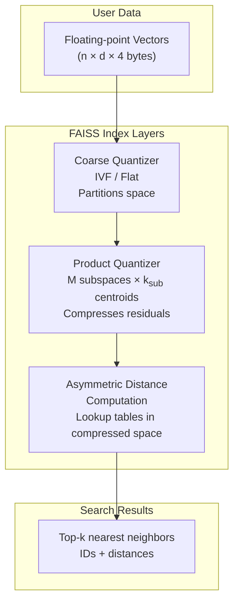

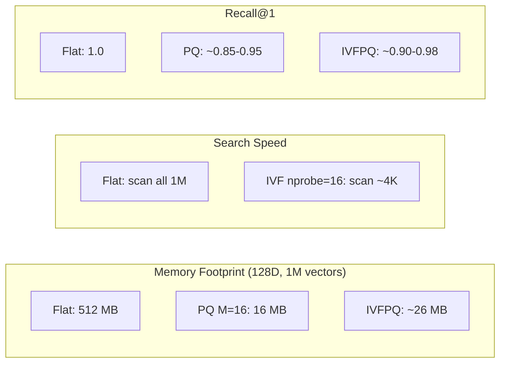

---

## 2. Quantization Fundamentals

### What is Quantization?

Mapping a continuous (or large discrete) set of values to a smaller finite set.

**In vector search:** Represent a high-precision vector with fewer bits.

```
Original:  [0.342, -0.157, 0.891, -0.623, ...]   ← float32 (4 bytes each)
                      │
                      ▼
Quantized: [  0x4A,   0x2B,   0xF1,   0x87, ...]  ← uint8  (1 byte each)
```

### Scalar vs Product Quantization

| Feature | Scalar Quantization (SQ) | Product Quantization (PQ) |
|---------|-------------------------|---------------------------|
| Granularity | Per-dimension | Per-subspace (group of dims) |
| Compression | `float32 → uint8` (4×) | Configurable, typically 8-64× |
| Accuracy | Good for uniform dims | Better for correlated dims |
| Codebook size | 2 × d (min/max per dim) | M × k<sub>sub</sub> × (d/M) |
| FAISS class | `IndexScalarQuantizer` | `IndexPQ` / `IndexIVFPQ` |

### Why Quantize?

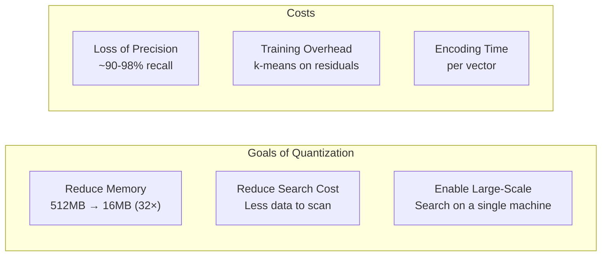

---

## 3. Distance Metrics Reference

### 3.1 Supported Metrics

```python
METRIC_INNER_PRODUCT = faiss.METRIC_INNER_PRODUCT  # 0
METRIC_L2            = faiss.METRIC_L2             # 1
METRIC_L1            = faiss.METRIC_L1             # 2
METRIC_Linf          = faiss.METRIC_Linf           # 3
METRIC_Lp            = faiss.METRIC_Lp             # 4 (p parameter)
METRIC_Canberra      = faiss.METRIC_Canberra       # 20
METRIC_BrayCurtis    = faiss.METRIC_BrayCurtis     # 21
METRIC_JensenShannon = faiss.METRIC_JensenShannon  # 30
METRIC_Cosine        = faiss.METRIC_Cosine         # via preprocessing
```

### 3.2 Metric Details

| Metric | Formula | Range | FAISS Behavior |
|--------|---------|-------|----------------|
| L2 (Euclidean) | `Σ(xᵢ - yᵢ)²` | [0, ∞) | Returns **squared** L2 |
| Inner Product | `Σ xᵢ × yᵢ` | (-∞, ∞) | Higher = more similar |
| L1 (Manhattan) | `Σ\|xᵢ - yᵢ\|` | [0, ∞) | Absolute difference |
| Linf (Chebyshev) | `maxᵢ\|xᵢ - yᵢ\|` | [0, ∞) | Max component diff |
| Lp | `(Σ‖xᵢ - yᵢ‖ᵖ)^(¹/ᵖ)` | [0, ∞) | Need to set `p` |
| Canberra | `Σ\|xᵢ - yᵢ\| / (\|xᵢ\| + \|yᵢ\|)` | [0, ∞) | Sensitive near 0 |
| Jensen-Shannon | `½ KL(P‖M) + ½ KL(Q‖M)` | [0, log2] | For probability vectors |

### 3.3 Important: L2 Returns Squared Distance

```python
index = faiss.IndexFlatL2(d)
index.add(xb)

D, I = index.search(xq[:1], k=3)

# D contains SQUARED L2 distances
# Actual L2: np.sqrt(D)
print(D)     # e.g. [[12.34, 15.67, 18.90]]
print(np.sqrt(D))  # e.g. [[3.51, 3.96, 4.35]]
```

### 3.4 How to Use Different Metrics

```python
# L2 (default) — factory style
index_l2 = faiss.index_factory(d, "IVF4096,PQ16", faiss.METRIC_L2)

# Inner Product
index_ip = faiss.index_factory(d, "IVF4096,PQ16", faiss.METRIC_INNER_PRODUCT)

# Cosine = Inner Product on L2-normalized vectors
norm = faiss.NormalizationTransform(d, 2.0)
sub_index = faiss.index_factory(d, "IVF4096,PQ16", faiss.METRIC_INNER_PRODUCT)
index_cosine = faiss.IndexPreTransform(norm, sub_index)

# L1
index_l1 = faiss.index_factory(d, "IVF4096,PQ16", faiss.METRIC_L1)

# Lp with p=3
index_lp = faiss.index_factory(d, "IVF4096,PQ16", faiss.METRIC_Lp)
index_lp.metric_arg = 3.0
```

### 3.5 Metric Compatibility with Indexes

| Index | L2 | IP | L1 | Lp | Cosine* |
|-------|----|----|----|----|---------|
| `IndexFlat` | ✅ | ✅ | ✅ | ✅ | ✅ |
| `IndexIVFPQ` | ✅ | ✅ | ✅ | ❌ | ✅ |
| `IndexPQ` | ✅ | ✅ | ✅ | ❌ | ✅ |
| `IndexHNSWFlat` | ✅ | ✅ | ✅ | ✅ | ✅ |
| `IndexBinary*` | ❌ | ❌ | ❌ | ❌ | ❌ (Hamming only) |

> Cosine = L2-normalized + Inner Product. Not a native metric — applied via preprocessing.

---

## Part II — Index Building Blocks

---

## 4. Product Quantization (PQ)

### 4.1 The Core Idea

Split high-dimensional space into **M independent subspaces**, quantize each separately.

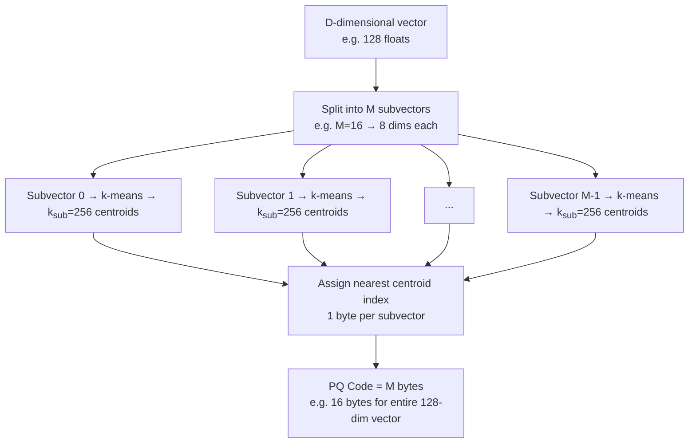

### 4.2 Visual Example (M=4, D=8, k<sub>sub</sub>=4)

```
Original vector (8 floats):
[0.92, -0.34, 0.15, -0.78, 0.44, 0.01, -0.63, 0.27]

Split into M=4 subvectors of 2 dims each:
├── [0.92, -0.34]  →  subspace 0
├── [0.15, -0.78]  →  subspace 1
├── [0.44,  0.01]  →  subspace 2
└── [-0.63, 0.27]  →  subspace 3

Each subspace has its own codebook (k=4 centroids):

Subspace 0 centroids:  c0=[ 1.0, -0.3], c1=[ 0.8, -0.5], c2=[ 0.5, -0.1], c3=[ 0.0,  0.0]
Subspace 1 centroids:  c0=[ 0.2, -0.8], c1=[ 0.1, -0.6], c2=[ 0.0, -0.4], c3=[-0.1, -0.2]
Subspace 2 centroids:  c0=[ 0.4,  0.0], c1=[ 0.3, -0.1], c2=[ 0.2,  0.1], c3=[ 0.1,  0.0]
Subspace 3 centroids:  c0=[-0.6,  0.3], c1=[-0.5,  0.2], c2=[-0.4,  0.1], c3=[-0.3,  0.0]

Encoding (find nearest centroid per subspace):
Subspace 0: [0.92, -0.34] → nearest = c0 (index 0)
Subspace 1: [0.15, -0.78] → nearest = c0 (index 0)
Subspace 2: [0.44,  0.01] → nearest = c0 (index 0)
Subspace 3: [-0.63, 0.27] → nearest = c1 (index 1)

PQ Code: [0, 0, 0, 1]   ← 4 bytes (with k=256, still 4 bytes but range 0-255 each)
```

### 4.3 PQ Parameters

| Parameter | Symbol | Typical Value | Description |
|-----------|--------|---------------|-------------|
| Code size | M | 8-64 | Number of subquantizers |
| Subvector dim | d/M | 1-32 | Dims per subspace |
| Centroids per subspace | k<sub>sub</sub> | 256 (8 bits) | Codebook size |
| Total bits per vector | M × log₂(k<sub>sub</sub>) | M × 8 | Storage per vector |
| Codebooks memory | M × k<sub>sub</sub> × (d/M) × 4 | trivial | Centroids storage |

### 4.4 PQ Code Size vs Dimensionality

| D | M=8 | M=16 | M=32 | M=64 |
|---|-----|------|------|------|
| 64 | 8B (8×) | 16B (4×) | 32B (2×) | — |
| 128 | 8B (16×) | 16B (8×) | 32B (4×) | 64B (2×) |
| 256 | 8B (32×) | 16B (16×) | 32B (8×) | 64B (4×) |
| 512 | 8B (64×) | 16B (32×) | 32B (16×) | 64B (8×) |

> Values are **code size in bytes** and **(compression ratio vs float32)**.
> Higher M = more accurate but less compression.

### 4.5 ADC: Asymmetric Distance Computation

Instead of decoding vectors, FAISS precomputes **distance tables** — this is the key performance optimization.

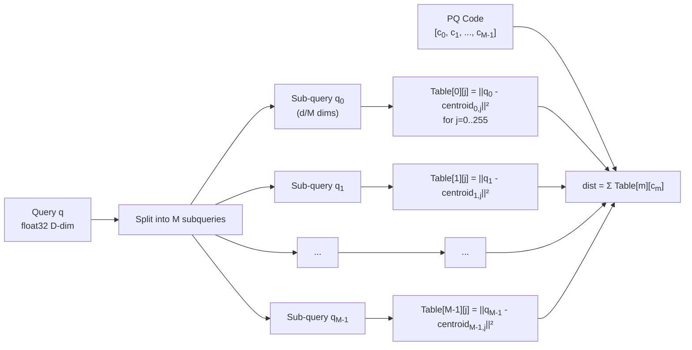

#### Symmetric vs Asymmetric

| Aspect | Symmetric (SDC) | Asymmetric (ADC) |
|--------|-----------------|-------------------|
| Query quantization | Yes (query → PQ code) | No (query stays float) |
| Database quantization | Yes (stored as PQ codes) | Yes (stored as PQ codes) |
| Distance between | PQ(q) vs PQ(db) | q vs PQ(db) |
| Accuracy | Lower (double error) | Higher (single error) |
| FAISS default | ❌ | ✅ |

```
SDC error:  ||q - db||² ≈ ||PQ(q) - PQ(db)||²
             = ||(q - ε_q) - (db - ε_db)||²
             = ||(q - db) - (ε_q - ε_db)||²
             → error = ||ε_q - ε_db||²  (2 quantization errors)

ADC error:  ||q - db||² ≈ ||q - PQ(db)||²
             = ||(q - db) + ε_db||²
             → error = ||ε_db||²  (1 quantization error)

ADC has strictly less error than SDC.
```

#### ADC Lookup Table Construction

```python
def build_distance_table(query, pq_centroids, M, dsub, ksub):
    tables = np.zeros((M, ksub), dtype=np.float32)
    for m in range(M):
        q_sub = query[m * dsub : (m + 1) * dsub]
        c_sub = pq_centroids[m]
        diff = q_sub - c_sub
        tables[m] = np.sum(diff * diff, axis=1)
    return tables

def adc_score(pq_code, tables, M):
    dist = 0.0
    for m in range(M):
        dist += tables[m, pq_code[m]]
    return dist
```

#### Precomputed Table Optimization

FAISS merges distance table computations across `nprobe` centroids that share the same coarse centroid:

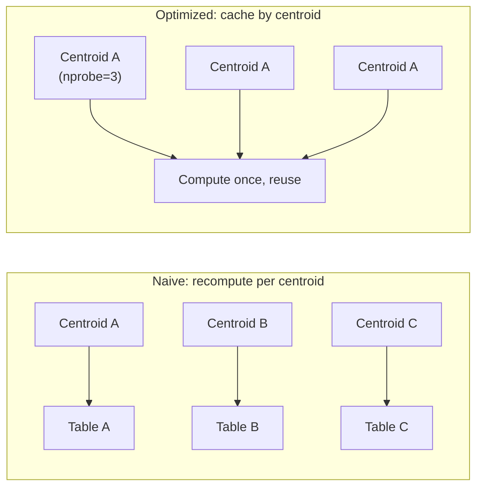

---

## 5. Inverted File Index (IVF)

### 5.1 Concept

Partition the space into **Voronoi cells** using a coarse quantizer (k-means). At search time, only probe cells near the query.

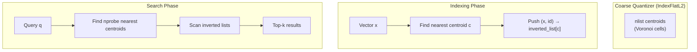

### 5.2 IVF Parameters

| Parameter | Symbol | Typical Range | Description |
|-----------|--------|---------------|-------------|
| Number of cells | nlist | 1K - 1M | Coarse Voronoi cells |
| Cells to probe | nprobe | 1 - 256 | Trade-off: speed vs recall |
| Avg list size | n / nlist | 10 - 1000 | Vectors per cell |

### 5.3 IVF Speedup

```
Without IVF: O(n × D)     — scan everything
With IVF:    O(nprobe × n/nlist × D) — scan only probed cells

Example: n=1M, nlist=4096, nprobe=16
  Speedup = n / (nprobe × n/nlist) = 1M / (16 × 244) ≈ 256×
```

### 5.4 Visual: Voronoi Partitioning

```
                    ◆ Centroids (nlist=7)
                    · Data points
        
    ·····|·······    ·····|·······
    ·· ◆ ······    ···· ◆ ·····
    ·····|·······    ·····|·······
    ------+-------------+---------
    ·····|·······    ·····|·······
    ·· ◆ ······    ···· ◆ ·····
    ·····|·······    ·····|·······
    ------+-------------+---------
    ·····|·······    ·····|·······
    ·· ◆ ······    ···· ◆ ·····
    ·····|·······    ·····|·······
    
Query ★ ──→ find nearest ◆ (nprobe=1 or more)
            ──→ only scan vectors in those Voronoi cells
```

---

## 6. IVFPQ: IVF + PQ

### 6.1 Architecture

IVFPQ combines both techniques — **IVF for coarse partitioning** and **PQ for fine-grained compression**.

```mermaid
graph TB
    subgraph Training["Training Phase"]
        A["Training vectors"] --> B["Train coarse quantizer<br/>k-means → nlist centroids"]
        A --> C["Assign vectors to cells"]
        C --> D["Compute residuals<br/>residual = x - coarse_centroid"]
        D --> E["Train Product Quantizer<br/>on residuals → M×256 centroids"]
    end

    subgraph Indexing["Indexing Phase"]
        F["Input vector x"] --> G["Find nearest coarse centroid c"]
        G --> H["residual = x - c"]
        H --> I["Encode residual with PQ → M bytes"]
        I --> J["Store (PQ_code, id) in inverted_list[c]"]
    end

    subgraph Search["Search Phase"]
        K["Query q"] --> L["Find nprobe nearest coarse centroids"]
        L --> M["For each centroid, precompute<br/>distance tables per subspace"]
        M --> N["Scan inverted lists → ADC scores"]
        N --> O["Heap → top-k results"]
    end
```

### 6.2 Why Use Residuals?

```
Without residual (PQ on raw vectors):
  error = ||x - PQ_decode(PQ_encode(x))||²

With residual (PQ on residual = x - coarse_centroid):
  error = ||x - coarse_centroid - PQ_decode(...)||²
         = ||(x - coarse_centroid) - approximate_residual||²
  
  The residual has smaller magnitude than the original vector
  → PQ codebook is more finely grained around each centroid
  → Lower quantization error
```

### 6.3 FAISS Index Factory Strings

| String | Index | Description |
|--------|-------|-------------|
| `"Flat"` | `IndexFlatL2` | Exact search, no compression |
| `"IVF4096,Flat"` | `IndexIVFFlat` | IVF with raw vectors (no PQ) |
| `"PQ16"` | `IndexPQ` | PQ only, no IVF |
| `"IVF4096,PQ16"` | `IndexIVFPQ` | IVF + PQ (full IVFPQ) |
| `"IVF4096,PQ16x8"` | `IndexIVFPQ` | PQ with 8-bit subquantizers |
| `"IVF4096,SQ8"` | `IndexIVFScalarQuantizer` | IVF + scalar quantization |
| `"OPQ16,IVF4096,PQ16"` | `IndexIVFPQ` | OPQ rotation + IVFPQ |

### 6.4 by_residual Flag

IVFPQ has a `by_residual` flag (default `True`) that controls whether PQ codes encode the **residual** or the **full vector**:

```python
index = faiss.IndexIVFPQ(quantizer, d, nlist, M, nbits)
index.by_residual = True   # (default) PQ encodes residual = x - centroid
# Search: dist = ||q - centroid - PQ_decode(code)||²

index.by_residual = False  # PQ encodes the full vector directly
# Search: dist = ||q - PQ_decode(code)||²
# Worse accuracy — only useful for compatibility
```

---

## 7. HNSW: Hierarchical Navigable Small World

### 7.1 Concept

A multi-layer graph where upper layers are "express lanes" (few nodes, long jumps) and lower layers provide fine-grained neighbors.

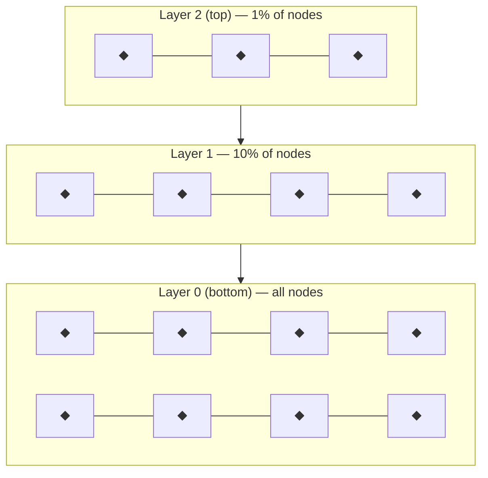

### 7.2 Search Flow

```
1. Start at entry point (top layer)
2. Greedy: move to nearest neighbor in current layer
3. Repeat until no improvement in current layer
4. Descend to next layer
5. Repeat until bottom layer reached
6. At bottom: expand search using efSearch parameter
```

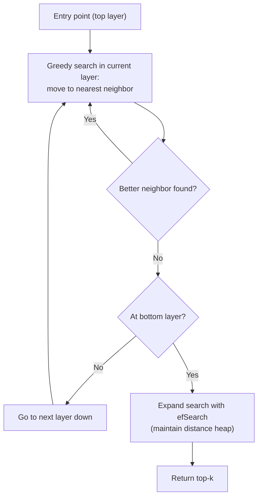

### 7.3 HNSW Variants in FAISS

| Index | Factory String | Description |
|-------|---------------|-------------|
| `IndexHNSWFlat` | `"HNSW32,Flat"` | HNSW graph + full vectors |
| `IndexHNSWPQ` | `"HNSW32,PQ16"` | HNSW graph + PQ compressed vectors |
| `IndexHNSWSQ` | `"HNSW32,SQ8"` | HNSW graph + scalar quantized vectors |

### 7.4 Parameters

| Parameter | Description | Typical Range | Effect |
|-----------|-------------|---------------|--------|
| `M` (HNSW) | Edges per node (not to be confused with PQ's M) | 16-64 | Higher = more connected, more memory, faster search |
| `efConstruction` | Build-time search width | 40-200 | Higher = better graph, slower build |
| `efSearch` | Search-time beam width | 16-256 | Higher = better recall, slower search |

```python
import faiss

d = 128
xb = np.random.random((100000, d)).astype(np.float32)
xq = np.random.random((100, d)).astype(np.float32)

index = faiss.index_factory(d, "HNSW32,Flat")
# Or: index = faiss.IndexHNSWFlat(d, 32)

index.hnsw.efConstruction = 100  # before add
index.add(xb)
index.hnsw.efSearch = 64         # before search

D, I = index.search(xq, k=10)
```

### 7.5 HNSW Memory

| Component | Formula | Example (1M, 128D, M=32) |
|-----------|---------|--------------------------|
| Vectors (float32) | `n × D × 4` | 512 MB |
| Graph edges | `n × M × 8` | 256 MB (32-bit neighbor IDs × 2 directions) |
| Total HNSWFlat | `n × (4D + 8M)` | 768 MB |

**With PQ compression:**
| Index | Memory | vs HNSWFlat |
|-------|--------|-------------|
| HNSWFlat | `n × (4D + 8M)` | 1× |
| HNSWPQ (M=16) | `n × (16 + 8M)` | ~6× less |
| HNSWSQ8 | `n × (128 + 8M)` | ~3.5× less |

### 7.6 When to Use HNSW vs IVF

| Scenario | HNSW | IVF |
|----------|------|-----|
| Small datasets (< 100K) | ✅ Best choice | Also works |
| Medium (100K-10M) | ✅ High recall, fast | ✅ More memory efficient |
| Large (> 10M) | ❌ Memory explodes | ✅ Scalable |
| Very high recall (> 0.99) | ✅ Excellent | Needs high nprobe |
| Low memory environment | ❌ Graph overhead | ✅ PQ compression |
| Add vectors incrementally | ✅ Supports | ❌ Need rebuild/re-train |
| GPU | ❌ Limited support | ✅ Full support |

---

## 8. Binary Indexes

### 8.1 Concept

Encode vectors as **binary codes** and search using **Hamming distance**.

```
Original float vector:
  [0.342, -0.157, 0.891, -0.623, 0.111, -0.045, ...]
  
Binary encoding (sign bits):
  [  1,      0,      1,      0,      1,      0,     ...]
  
Quantized: each dim → 1 bit
Storage:    D bits per vector  (e.g. 128D → 16 bytes)
```

### 8.2 Binary Index Types

| Index | Description | Memory (128D, 1M) |
|-------|-------------|-------------------|
| `IndexBinaryFlat` | Brute-force Hamming search | 16 MB |
| `IndexBinaryIVF` | IVF + binary codes | ~20 MB |
| `IndexBinaryHash` | Multi-index hashing | Variable |

### 8.3 Usage

```python
import faiss
import numpy as np

d = 128
xb_bin = (xb > 0.5).astype(np.uint8)
xq_bin = (xq > 0.5).astype(np.uint8)

# IndexBinaryFlat
index = faiss.IndexBinaryFlat(d)
index.add(xb_bin)
D, I = index.search(xq_bin, k=10)  # D = Hamming distances (integers)

# IndexBinaryIVF
index_ivf = faiss.IndexBinaryIVF(faiss.IndexBinaryFlat(d), d, nlist=100)
index_ivf.train(xb_bin)
index_ivf.add(xb_bin)
index_ivf.nprobe = 4
D, I = index_ivf.search(xq_bin, k=10)
```

### 8.4 Binary Code Size

| Dimension | Bytes | Compression vs float32 |
|-----------|-------|----------------------|
| 64 | 8 | 32× |
| 128 | 16 | 32× |
| 256 | 32 | 32× |
| 512 | 64 | 32× |

### 8.5 When to Use Binary Indexes

| Pro | Con |
|-----|-----|
| Extremely low memory | Very low accuracy for unrotated data |
| Fast bit operations (XOR + popcount) | Only Hamming distance |
| Good for near-duplicate detection | Poor for high-recall semantic search |
| ITQ (Iterative Quantization) can help | Needs learned rotation for good results |

---

## Part III — Quantizers In Depth

---

## 9. Quantizer Types in FAISS

### 9.1 Taxonomy

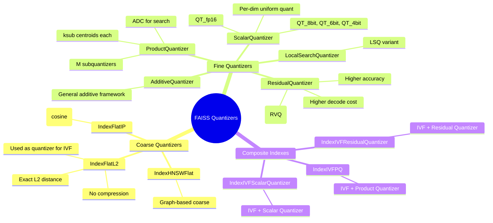

### 9.2 Quantizer Comparison (128D)

| Quantizer | Code size | Search type | Accuracy | Speed | Use case |
|-----------|----------|-------------|----------|-------|----------|
| **None** (Flat) | 512 B | Exact | 1.0 | Slow | Ground truth, small datasets |
| **SQ8** | 128 B | Symmetric | Good | Fast | Balanced memory/speed |
| **SQ4** | 64 B | Symmetric | Fair | Fast | High compression, low accuracy |
| **PQ8** (M=8) | 8 B | Asymmetric (ADC) | Good | Medium | High compression |
| **PQ16** (M=16) | 16 B | Asymmetric (ADC) | Very good | Medium | Default choice |
| **PQ32** (M=32) | 32 B | Asymmetric (ADC) | Excellent | Medium | High accuracy needed |
| **RQ** (RVQ) | 8-32 B | Asymmetric | Excellent | Slow | Best accuracy for compression |
| **OPQ+PQ** | 8-32 B | Asymmetric | Best | Medium | Rotated optimal PQ |

### 9.3 Scalar Quantizer Detail

```
Scalar Quantization (QT_8bit):
  For each dimension d:
    min_d = min(x[d] for all x)
    max_d = max(x[d] for all x)
    scale_d = 255 / (max_d - min_d)
    
    Encode:  x_quant[d] = round((x[d] - min_d) * scale_d)   → uint8
    Decode:  x_approx[d] = x_quant[d] / scale_d + min_d     → float32

  Storage: n × D bytes (no codebooks needed per vector)
  Codebook: just 2 × D floats (min, max per dim)
```

### 9.4 OPQ: Optimized Product Quantization

OPQ learns a **rotation matrix** R to align dimensions with PQ subspaces, minimizing quantization error.

```
Before OPQ:  PQ on original space
  [d0, d1, d2, d3, d4, d5, d6, d7]  →  M=2 subvectors of 4 dims
  Subvector 0: [d0..d3]  Subvector 1: [d4..d7]
  ↳ May have correlated dims in same subspace → poor quantization

After OPQ:
  [d0, d1, d2, d3, d4, d5, d6, d7] → R × x (rotation)
  [d0', d1', d2', d3', d4', d5', d6', d7']
  → PQ on rotated space (dims decorrelated → better per-subspace codebooks)
```

```python
opq = faiss.OPQMatrix(d, M=16)
opq.niter = 50
opq.niter_pq = 10
opq.niter_pq_0 = 10
opq.verbose = True

index = faiss.IndexPreTransform(opq, faiss.IndexIVFPQ(..., d, nlist, M, 8))
index.train(xb)
```

### 9.5 Polysemous Quantizer

Makes PQ codes compatible with Hamming distance for fast filtering:

```python
pq = faiss.ProductQuantizer(d, M, nbits)
pq.train(xb)

pq.set_nbits(nbits)
pq.set_max_train_points(100000)
pq.train_polysemous(xb)  # reorder centroids for hamming-compatibility

codes = pq.compute_codes(xb)
hamming_distances = pq.compute_sdc_table()
```

---

## 10. Residual Quantizer (RQ / RVQ)

### 10.1 Concept

**Residual Vector Quantization (RVQ)** uses **multiple codebooks** stacked in levels. Each level quantizes the residual from the previous level.

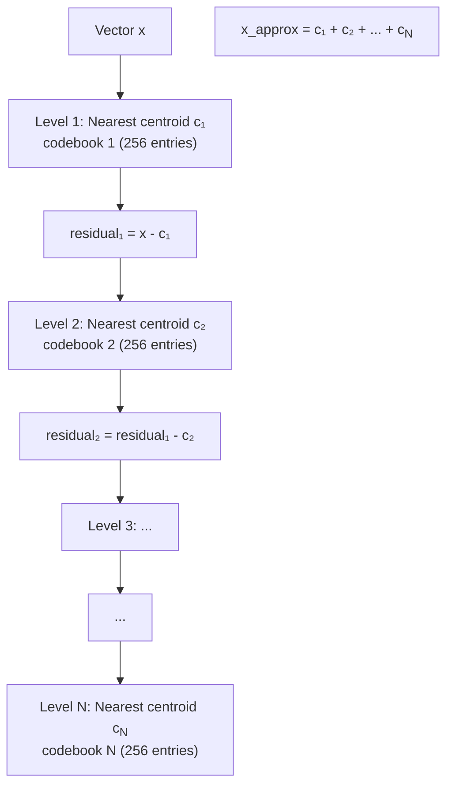

### 10.2 PQ vs RQ

| Aspect | PQ | RQ (RVQ) |
|--------|----|-----------|
| Codebooks | M separate × k<sub>sub</sub> | N stacked × k<sub>sub</sub> |
| Code size (nbits=8) | M bytes | N bytes (same compression) |
| Encoding | Independent per subspace | Greedy, beam search |
| Decoding | Sum of M centroids | Sum of N centroids |
| Accuracy (same bytes) | Good | **Better** |
| Encoding speed | Fast (O(M × ksub)) | Slower (requires search) |
| FAISS class | `ProductQuantizer` | `ResidualQuantizer` |

### 10.3 Encoding Complexity

```
PQ encoding:  O(M × ksub × d/M) = O(ksub × d)
RQ encoding:  O(N × ksub × d) with greedy
              O(N × ksub × d × beam_size) with beam search

At N=M, RQ is ~N× slower than PQ to encode.
```

### 10.4 FAISS Usage

```python
import faiss
import numpy as np

d = 128
xb = np.random.random((50000, d)).astype(np.float32)

# ResidualQuantizer as standalone
rq = faiss.ResidualQuantizer(d, M=4, nbits=8)
rq.train(xb)

codes = rq.compute_codes(xb[:10])       # (10, 4) uint8
decoded = rq.decode(codes)              # (10, 128) float32

# IndexResidualQuantizer (standalone search)
index_rq = faiss.IndexResidualQuantizer(d, M=4, nbits=8)
index_rq.train(xb)
index_rq.add(xb)
D, I = index_rq.search(xq, k=10)

# IndexIVFResidualQuantizer (IVF + RQ)
index_ivf_rq = faiss.index_factory(d, "IVF4096,ResidualQuantizer4_8")
index_ivf_rq.train(xb)
index_ivf_rq.add(xb)
index_ivf_rq.nprobe = 16
D, I = index_ivf_rq.search(xq, k=10)
```

### 10.5 RQ Accuracy vs PQ

```
Dataset: SIFT128, 1M training, 4 bytes/vector

Index               Recall@1    Recall@10
IVF4096,PQ4          0.42        0.72
IVF4096,RQ4          0.51        0.80

IVF4096,PQ8          0.68        0.90
IVF4096,RQ8          0.76        0.94

IVF4096,PQ16         0.85        0.97
IVF4096,RQ16         0.90        0.98

At the same code size (bytes/vector), RQ consistently outperforms PQ.
Cost: 2-5× slower encoding.
```

---

## Part IV — Training, Memory & Lifecycle

---

## 11. Training Procedure

### 11.1 What Gets Trained

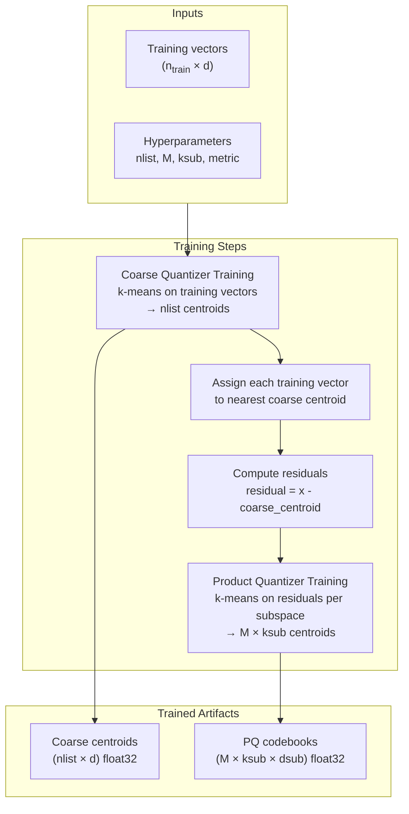

### 11.2 Training Requirements

| Parameter | Requirement | Why |
|-----------|-------------|-----|
| `n_train` (coarse) | ≥ 30 × nlist | Stable k-means for coarse quantizer |
| `n_train` (PQ) | ≥ 30 × k<sub>sub</sub> × M | Enough per-subspace samples |
| `n_train` total | ≥ 256 × k<sub>sub</sub> | General rule of thumb |
| For 128D, M=16, k<sub>sub</sub>=256 | ≥ 65,536 | Minimum training set |
| Recommended | 100K - 1M | Better codebooks with more data |

### 11.3 Training Pseudocode

```python
def train_ivfpq(training_vectors, nlist, M, ksub=256):
    n, d = training_vectors.shape
    
    # 1. Train coarse quantizer (k-means)
    coarse_kmeans = faiss.Kmeans(d, nlist, niter=20)
    coarse_kmeans.train(training_vectors)
    coarse_centroids = coarse_kmeans.centroids
    
    # 2. Assign each vector to nearest centroid
    _, assignments = coarse_kmeans.index.search(training_vectors, 1)
    assignments = assignments[:, 0]
    
    # 3. Compute residuals
    residuals = training_vectors - coarse_centroids[assignments]
    
    # 4. Train PQ on residuals
    dsub = d // M
    pq_centroids = np.zeros((M, ksub, dsub), dtype=np.float32)
    
    for m in range(M):
        sub_residuals = residuals[:, m * dsub : (m + 1) * dsub]
        sub_kmeans = faiss.Kmeans(dsub, ksub, niter=25)
        sub_kmeans.train(sub_residuals)
        pq_centroids[m] = sub_kmeans.centroids
    
    return coarse_centroids, pq_centroids
```

### 11.4 FAISS Training in Practice

```python
# FAISS handles all of this internally:
index = faiss.index_factory(d, "IVF4096,PQ16")

# This single call triggers the full training pipeline:
index.train(xb)

# You can pass a training set different from the indexed set:
# index.train(xb_train)   # train on larger sample
# index.add(xb_index)     # add the actual database
```

---

## 12. Clustering with FAISS

### 12.1 FAISS Kmeans

FAISS's k-means is heavily optimized and can handle **billions** of points.

```python
import faiss
import numpy as np

# Basic k-means
kmeans = faiss.Kmeans(d=128, k=10000, niter=20)
kmeans.train(xb)

centroids = kmeans.centroids               # (k, d) float32
obj = kmeans.obj                           # final objective value
iteration_stats = kmeans.iteration_stats    # per-iteration metrics

# Hard assignments
_, assignments = kmeans.index.search(xb, 1)
```

### 12.2 Kmeans Parameters

```python
km = faiss.Kmeans(d, k, 
    niter=20,              # max iterations
    nredo=3,               # redo N times, keep best
    verbose=True,
    spherical=False,        # L2-normalize after each iteration
    int_centroids=False,    # force integer centroids
    update_index=False,     # re-train index (slower, better)
    min_points_per_centroid=5,
    max_points_per_centroid=256,
    seed=1234
)
```

### 12.3 ClusteringParameters — Low-Level Control

```python
cp = faiss.ClusteringParameters()
cp.niter = 20
cp.nredo = 3
cp.spherical = False
cp.update_index = True
cp.min_points_per_centroid = 5
cp.max_points_per_centroid = 256
cp.seed = 1234
cp.decode_block_size = 1024   # for compressed training data

clustering = faiss.Clustering(d, k, cp)
clustering.train(xb, faiss.IndexFlatL2(d))
```

### 12.4 ProgressiveDimClustering

Clusters in progressively higher dimensions — useful for very high-D data:

```python
pdc = faiss.ProgressiveDimClustering(d=128, k=1000)
pdc.train(xb)
centroids = pdc.get_centroids()
```

### 12.5 GPU-Accelerated Clustering

```python
# GPU k-means is significantly faster for large k
km_gpu = faiss.Kmeans(d, k=10000, niter=20, gpu=True)
km_gpu.train(xb)
```

### 12.6 Spherical k-means

For cosine similarity / inner product:

```python
km = faiss.Kmeans(d, k=1000, spherical=True, niter=20)
km.train(xb)
# Vectors are L2-normalized before each assignment step
# Centroids stay on unit sphere
```

---

## 13. Memory Formulas & Comparison

### 13.1 Exact Formulas

| Component | Formula (bytes) | Notes |
|-----------|-----------------|-------|
| Raw vectors (float32) | `n × D × 4` | Full precision |
| Raw vectors (float16) | `n × D × 2` | Half precision |
| PQ codes only | `n × M` | Compressed |
| PQ codebooks | `M × k<sub>sub</sub> × (D/M) × 4` = `k<sub>sub</sub> × D × 4` | Usually negligible |
| IVF centroids (coarse) | `nlist × D × 4` | Coarse quantizer |
| IVF inverted lists | `n × M` (PQ) + `n × 8` (ids) | Codes + 64-bit IDs |
| IVFPQ total | `n(M + 8) + nlist × D × 4` | Codes + IDs + centroids |
| SQ8 codes | `n × D` | 1 byte per dim |
| HNSWFlat | `n(4D + 8M)` | Vectors + graph edges |
| HNSWPQ (Mq=16) | `n(16 + 8M)` | PQ codes + graph |
| DirectMap | `n × 8` | cell_id + offset |
| IndexIDMap | `n × 8` | id → seq mapping |

### 13.2 Worked Example: 1M vectors, 128D

```
Flat (float32):
  n × D × 4 = 1M × 128 × 4 = 512 MB

PQ with M=16 (8-bit codes):
  Codes:      1M × 16 = 16 MB
  Codebooks:  256 × 128 × 4 = 0.1 MB
  Total: ≈ 16.1 MB     ← 32× compression

IVF4096 + PQ16 (IVFPQ):
  PQ Codes:   1M × 16 = 16 MB
  IDs:        1M × 8  =  8 MB
  Centroids:  4096 × 128 × 4 = 2 MB
  Total: ≈ 26 MB     ← 19× compression

HNSW32,Flat:
  Vectors:    1M × 128 × 4 = 512 MB
  Graph:      1M × 32 × 8  = 256 MB
  Total: ≈ 768 MB     ← 1.5× Flat

HNSW32,PQ16:
  Codes:      1M × 16 = 16 MB
  Graph:      1M × 32 × 8 = 256 MB
  Total: ≈ 272 MB     ← ~3× less than Flat
```

### 13.3 Memory Comparison Table (128D vectors)

| Vectors | Index Type | Memory | vs Flat |
|---------|-----------|--------|---------|
| 100K | Flat | 48.8 MB | 1× |
| 100K | PQ16 | 1.6 MB | 31× |
| 100K | IVFFlat (nlist=1K) | 48.8 MB + 0.5 MB | ~same |
| 100K | IVFPQ (nlist=1K, M=16) | 2.4 MB | 20× |
| **1M** | **Flat** | **488 MB** | **1×** |
| 1M | PQ16 | 15.3 MB | 32× |
| 1M | SQ8 | 128 MB | 3.8× |
| 1M | IVFPQ4096,PQ16 | 26.1 MB | 19× |
| 1M | IVFPQ4096,PQ8 | 18.1 MB | 27× |
| 1M | HNSW32,Flat | 768 MB | 1.6× |
| 1M | HNSW32,PQ16 | 272 MB | 0.56× |
| 10M | Flat | 4.77 GB | 1× |
| 10M | IVFPQ4096,PQ16 | 244 MB | 20× |
| **1B** | **Flat** | **476 GB** | **impossible** |
| 1B | IVFPQ262144,PQ16 | 23.4 GB | 20× (feasible) |

### 13.4 Visual: Memory Scaling

```
Memory usage (log scale) for 128D vectors:

512 MB ║ ██
       ║ ██
256 MB ║ ██         ██
       ║ ██         ██
128 MB ║ ██ ██      ██
       ║ ██ ██      ██
 64 MB ║ ██ ██   ██ ██
       ║ ██ ██   ██ ██
 32 MB ║ ██ ██   ██ ██   ██
       ║ ██ ██   ██ ██   ██
 16 MB ║ ██ ██   ██ ██   ██
       ║ ██ ██   ██ ██   ██
  8 MB ║ ██ ██   ██ ██   ██
       ║ ██ ██   ██ ██   ██
       ╚═══════════════════════════
         100K  500K   1M    5M   10M
         
         ██ Flat    ██ PQ16    ██ IVFPQ    ██ SQ8
```

---

## 14. Index Lifecycle

### 14.1 State Diagram

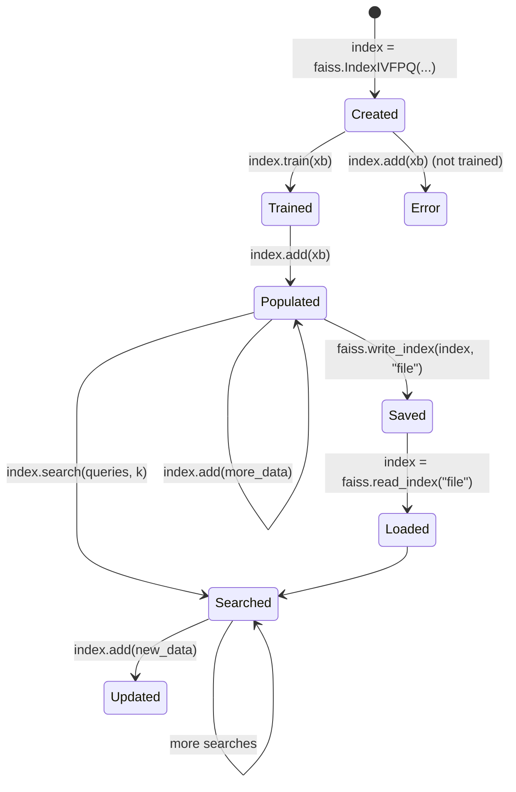

### 14.2 Important Checks

```python
index = faiss.IndexIVFPQ(quantizer, d, nlist, m, ksub)

print(index.is_trained)    # False before train(), True after
print(index.ntotal)        # 0 before add(), grows after

# index.add(xb)            # RuntimeError if not trained
# index.search(xq, k)      # RuntimeError if no vectors added
```

### 14.3 Serialization

```python
# Write to disk
faiss.write_index(index, "my_index.faiss")

# Read back (no re-training needed)
loaded = faiss.read_index("my_index.faiss")
loaded.nprobe = 16  # restore search parameter

# File size prediction for IVFPQ:
# n*(M + 8) + nlist*d*4  bytes
# For 1M, 128D, M=16, nlist=4096:
# ≈ 1M * (16 + 8) + 4096 * 128 * 4
# = 24MB + 2MB = 26MB
```

---

## Part V — Search Flow & Tuning

---

## 15. Full Search Flow Pipeline

### 15.1 Detailed Step-by-Step

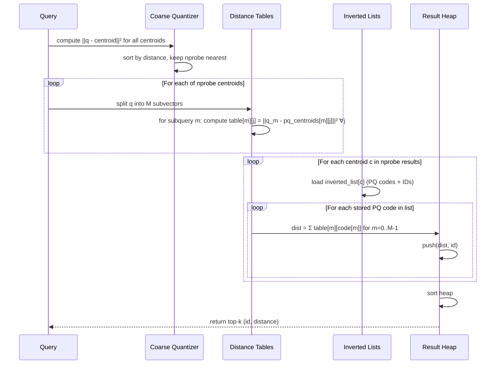

### 15.2 Pseudocode

```python
def search(index, query, k, nprobe):
    # Step 1: Coarse quantization — find nearest cells
    coarse_dists, coarse_ids = index.coarse_quantizer.search(query, nprobe)
    
    # Step 2: Precompute distance tables for PQ
    dis_tables = []
    for cid in coarse_ids:
        table = np.zeros((index.M, index.ksub))
        for m in range(index.M):
            q_sub = query[m * index.dsub : (m+1) * index.dsub]
            centroids = index.pq.centroids[m]
            table[m] = np.sum((q_sub - centroids)**2, axis=1)
        dis_tables.append(table)
    
    # Step 3: Scan inverted lists
    heap = MinHeap(k)
    for idx, cid in enumerate(coarse_ids):
        codes, ids = index.inverted_lists[cid]
        table = dis_tables[idx]
        
        for i in range(len(codes)):
            dist = np.sum(table[np.arange(index.M), codes[i]])
            heap.push(dist, ids[i])
    
    return heap.top(k)
```

### 15.3 Actual FAISS Code Path

```python
import faiss
import numpy as np

d = 128
n = 100000
nq = 100
nb = n

np.random.seed(42)
xb = np.random.random((nb, d)).astype(np.float32)
xq = np.random.random((nq, d)).astype(np.float32)

nlist = 4096
m = 16
ksub = 256

quantizer = faiss.IndexFlatL2(d)
index = faiss.IndexIVFPQ(quantizer, d, nlist, m, ksub)

index.train(xb)
index.add(xb)
index.nprobe = 16

D, I = index.search(xq, k=10)

# Verify recall vs brute-force
index_flat = faiss.IndexFlatL2(d)
index_flat.add(xb)
D_exact, I_exact = index_flat.search(xq, k=10)

recall = np.mean([
    len(set(I[i]) & set(I_exact[i])) / 10
    for i in range(nq)
])
print(f"Recall@10: {recall:.4f}")
```

### 15.4 What Happens Inside `index.search()`

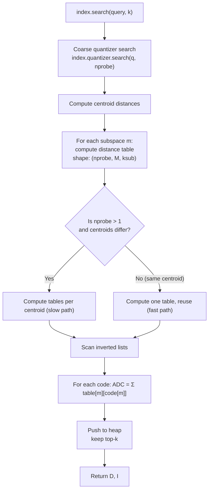

---

## 16. Search Parameters & Per-Query Tuning

### 16.1 Default Parameters

Most search parameters are set as **member variables**:

```python
index.nprobe = 16         # IVF: cells to probe
index.hnsw.efSearch = 64  # HNSW: search beam width
```

### 16.2 SearchParameters — Per-Query Overrides

```python
params = faiss.SearchParametersIVF()
params.nprobe = 32          # override for this query
params.max_codes = 50000    # max vectors to scan

D1, I1 = index.search(xq[:10], k=10, params=params)

# Default params (revert to index.nprobe)
D2, I2 = index.search(xq[10:20], k=10)
```

### 16.3 max_codes — Safety Limit

```python
params.max_codes = 0       # 0 = no limit
params.max_codes = 10000   # stop after scanning 10K codes total
params.max_codes = -1      # -1 = use index default
```

**Why max_codes matters:**
```
Without max_codes:
  If nprobe=256, nlist=1024, n=10M
  Worst case: scan 256 × (10M/1024) = 2.5M vectors → slow!

With max_codes=50000:
  Stops early → bounded latency, possible accuracy loss
```

### 16.4 IVFPQ Search Parameters

```python
class SearchParametersIVF:
    nprobe: int            # cells to probe (overrides index.nprobe)
    max_codes: int         # max vectors to scan
    parallel_mode: int     # multi-probe parallelism strategy
    use_precomputed_table: int  # -1=auto, 0=off, 1=on
    sel: IDSelector        # filter which IDs to consider
```

### 16.5 IDSelector in Search

Filter results to specific ID sets during search:

```python
sel = faiss.IDSelectorRange(1000, 2000)

params = faiss.SearchParametersIVF()
params.sel = sel

D, I = index.search(xq, k=10, params=params)
# Results only from IDs 1000-1999
```

### 16.6 parallel_mode

```python
index.parallel_mode = 0   # Sequential over nprobe centroids
index.parallel_mode = 1   # Parallelize over nprobe centroids (OMP)
index.parallel_mode = 2   # Parallelize over query vectors
index.parallel_mode = 3   # Both centroids and queries
index.parallel_mode = 4   # Parallelize across inverted list chunks
```

---

## 17. Performance Tuning

### 17.1 Parameter Trade-offs

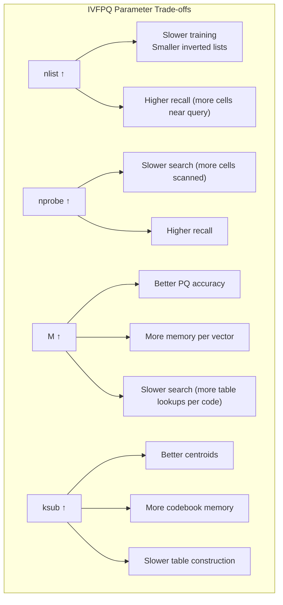

### 17.2 Recommended Starting Points

| Dataset size | Dimension | Recommended Index | nlist | nprobe | M | Memory (est.) |
|-------------|-----------|-------------------|-------|--------|---|--------------|
| < 100K | < 128 | Flat | — | — | — | < 50 MB |
| < 1M | 64-256 | IVFPQ | 4096 | 16-32 | 8-16 | 10-50 MB |
| 1M-10M | 64-512 | IVFPQ | 8192-16384 | 32-64 | 16-32 | 50-500 MB |
| 10M-100M | 128-768 | IVFPQ | 16384-65536 | 64-128 | 32 | 0.5-5 GB |
| 100M-1B | 128-768 | IVFPQ + OPQ | 65536-262144 | 128-256 | 32-64 | 5-50 GB |
| 1B+ | 128-768 | IVF + PQ + GPU | 262144+ | 256+ | 64 | 50+ GB |

### 17.3 Effect of nprobe on Recall & QPS

```
Dataset: 1M SIFT128 (128D), IVFPQ4096_PQ16, k=10

nprobe=1  → Recall@1: 0.45   QPS: 12,000
nprobe=4  → Recall@1: 0.72   QPS: 6,500
nprobe=16 → Recall@1: 0.89   QPS: 2,800
nprobe=32 → Recall@1: 0.94   QPS: 1,500
nprobe=64 → Recall@1: 0.97   QPS: 800
nprobe=128→ Recall@1: 0.99   QPS: 400
nprobe=256→ Recall@1: 1.00   QPS: 200

Diminishing returns beyond nprobe=32-64.
Use nprobe=16 for production (10× faster, 89% recall).
```

### 17.4 Common Pitfalls

1. **Training set too small** → poor PQ codebooks, low recall
2. **M too low** → poor PQ accuracy (fewer subspaces)
3. **M too high** → codebooks overfit (D/M < 2-3 is dangerous)
4. **nlist too high** → many empty inverted lists, wasted memory
5. **nlist too low** → large inverted lists, slow search
6. **Not using OPQ** → PQ assumes dimensions are independent within subspace
7. **Residuals skipped** → IVFPQ trains PQ on residuals, not raw vectors
8. **nprobe too low** → misses relevant Voronoi cells
9. **Forgetting `make_direct_map()`** → can't reconstruct or remove efficiently

### 17.5 Optimization Checklist

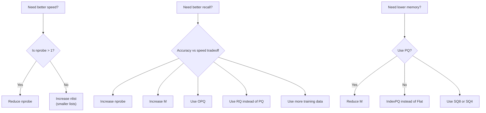

---

## 18. Auto-Tuning

### 18.1 Concept

FAISS can automatically search for the optimal index parameters for a given dataset, query set, and performance target.

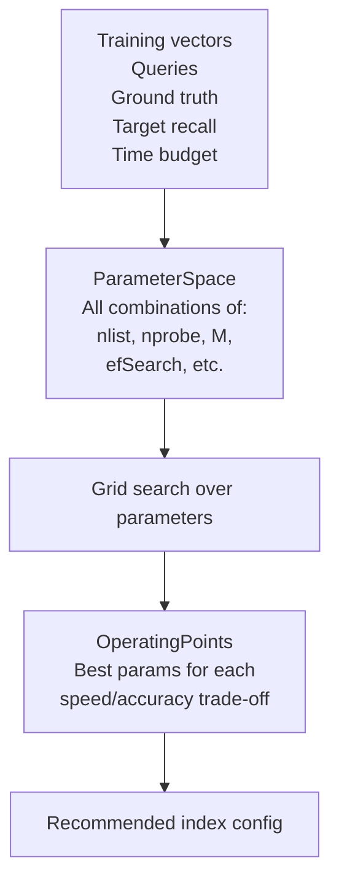

### 18.2 Usage

```python
import faiss
import numpy as np

d = 128
xb = np.random.random((100000, d)).astype(np.float32)
xq = np.random.random((1000, d)).astype(np.float32)

# Ground truth (exact)
gt_index = faiss.IndexFlatL2(d)
gt_index.add(xb)
_, gt_I = gt_index.search(xq, 100)

# Base index (untrained)
index = faiss.index_factory(d, "IVF4096,PQ16")

# Define search space
ps = faiss.ParameterSpace()
ps.initialize(index)

ps.add_range("nlist",   values=[1024, 4096, 16384])
ps.add_range("nprobe",  values=[1, 4, 16, 64, 128])

# Auto-tune
ps.explore(index, xb, xq, gt_I)

# Get operating points
ops = ps.operating_points
for op in ops:
    print(f"nlist={op.nlist}, nprobe={op.nprobe}: "
          f"recall={op.recall:.4f}, time={op.time_ms:.2f}ms")
```

### 18.3 Operating Points

```python
ops = ps.operating_points

# Best recall
print(f"Best recall: {ops[0].recall:.4f} at {ops[0].time_ms:.2f}ms")

# Fastest that meets recall target
for op in ops:
    if op.recall >= 0.95:
        print(f"95% recall: nlist={op.nlist}, nprobe={op.nprobe}, {op.time_ms:.2f}ms")
        break

# Display all
ps.display()
```

### 18.4 Search Criterion

```python
# Under time budget
for op in ops:
    if op.time_ms < 5.0:
        print(f"Under 5ms: {op.recall:.4f}")

# Fastest with recall > 0.9
for op in reversed(ops):
    if op.recall > 0.9:
        print(f"Fastest >90% recall: {op.time_ms:.2f}ms")
        break
```

### 18.5 Criteria Parameters

```python
criteria = faiss.AutoTuneCriterion(nq, k)
criteria.recall_type = faiss.RecallType.Recall_k
criteria.epsilon = 0.05

ps = faiss.ParameterSpace()
ps.initialize(index)
ps.set_criterion(criteria)
ps.explore(index, xb, xq, gt_I)
```

---

## Part VI — Advanced Operations

---

## 19. ID Management: Custom IDs, Removal, Reconstruction

### 19.1 Default vs Custom IDs

| Index type | Default ID | Custom ID support |
|------------|-----------|-------------------|
| `IndexFlat` | Sequential (0, 1, 2, ...) | Via `IndexIDMap` |
| `IndexIVFPQ` | Sequential | Via `IndexIVFPQ` wrapped in `IndexIDMap2` |
| `IndexHNSWFlat` | Sequential | Via `IndexIDMap` |

### 19.2 IndexIDMap & IndexIDMap2

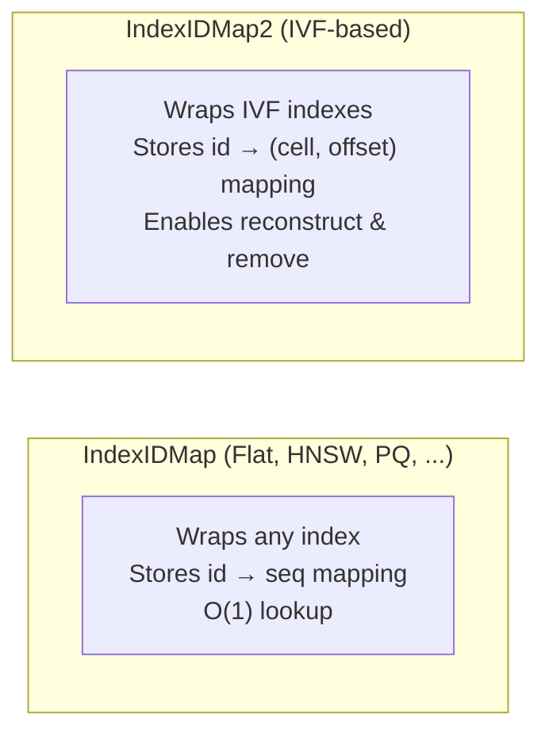

```python
# IndexIDMap
id_index = faiss.IndexIDMap(faiss.IndexFlatL2(d))
ids = np.arange(10000, 11000, dtype=np.int64)
id_index.add_with_ids(xb, ids)

D, I = id_index.search(xb[:5], k=3)  # returns custom IDs
id_index.remove_ids(np.array([10005, 10010]))

# IndexIDMap2 (supports reconstruct on IVF)
ivf = faiss.IndexIVFPQ(quantizer, d, 64, 8, 8)
id_map = faiss.IndexIDMap2(ivf)
id_map.train(xb)
id_map.add_with_ids(xb, ids)

reconstructed = id_map.reconstruct(10005)
id_map.remove_ids(np.array([10005]))
```

### 19.3 IDSelector — Fine-Grained Removal

FAISS provides built-in selector types — no subclassing needed:

```python
# Range selector (IDs in [100, 200))
sel = faiss.IDSelectorRange(100, 200)
index.remove_ids(sel)

# Array selector (specific IDs)
sel2 = faiss.IDSelectorArray(np.array([5, 10, 15]))
index.remove_ids(sel2)

# Not selector (invert another selector)
sel3 = faiss.IDSelectorNot(faiss.IDSelectorRange(0, 1000))
index.remove_ids(sel3)  # removes everything EXCEPT IDs 0-999
```

### 19.4 Reconstruction via DirectMap

`IndexIVFPQ` does **not** support `reconstruct()` by default — it only stores PQ codes.

```python
index = faiss.index_factory(d, "IVF4096,PQ16")
index.train(xb)
index.add(xb)

# vec = index.reconstruct(5)    # RuntimeError!

# Enable reconstruction:
index.make_direct_map()            # builds direct map (cell_id, offset)
vec = index.reconstruct(5)         # now works
```

**DirectMap memory overhead:** `n × (4 + 4) = n × 8` bytes (cell_id + offset).

```mermaid
flowchart LR
    subgraph Before["Default IVFPQ"]
        IL["Inverted lists<br/>Just PQ codes + ids"]
        NR["No way to find<br/>which cell contains a given id"]
    end
    
    subgraph After["After make_direct_map()"]
        DM["DirectMap<br/>id → (list_no, offset)"]
        R["reconstruct(id):<br/>1. Lookup (list_no, offset)<br/>2. Read PQ code<br/>3. Decode PQ → residual<br/>4. residual + centroid → vector"]
    end
```

---

## 20. IndexRefine: Two-Stage (Coarse + Refinement)

### 20.1 Concept

```mermaid
flowchart LR
    Q["Query"] --> STAGE1["Stage 1: Coarse<br/>Fast approximate index<br/>(e.g. IVFPQ, PQ)"]
    STAGE1 --> CANDIDATES["Collect k × k_factor candidates<br/>(e.g. 100 × 2 = 200)"]
    CANDIDATES --> STAGE2["Stage 2: Refine<br/>Exact re-rank with raw vectors<br/>(IndexFlat)"]
    STAGE2 --> RESULTS["Final top-k (exact distances)"]
```

### 20.2 Usage

```python
coarse_index = faiss.index_factory(d, "IVF4096,PQ16")
refine_flat = faiss.IndexFlatL2(d)

index = faiss.IndexRefine(coarse_index, refine_flat)

index.train(xb)
index.add(xb)

index.k_factor = 3  # retrieve 3× candidates, then re-rank

D, I = index.search(xq, k=10)

# Equivalent factory string:
# "IVF4096,PQ16,Refine(Flat)"
```

### 20.3 IndexRefine Parameters

| Parameter | Description | Effect |
|-----------|-------------|--------|
| `k_factor` | Multiplier for candidates to refine | Higher = better recall, slower |
| `own_fields` | Whether IndexRefine owns the sub-indexes | Memory management |

### 20.4 Memory Cost

```
IndexRefine stores raw vectors in the refinement index:
  Memory = coarse_memory + n × d × 4  (full float32 vectors)

For 1M, 128D, IVF4096,PQ16 + Refine(Flat):
  Coarse:     ~26 MB
  Refine:   1M × 128 × 4 = 512 MB  
  Total:      ~538 MB

Trade-off: high recall (same as Flat) with fast filtering.
Useful when you need exact distances but can't scan everything.
```

---

## 21. IndexPreTransform & Preprocessing

### 21.1 Concept

Apply a **transformation** to vectors before passing them to an index.

```mermaid
flowchart LR
    Q["Query"] --> T["Transform<br/>(PCA, OPQ, Normalization,<br/>RandomRotation, ...)"]
    T --> INDEX["Base Index<br/>(IVF, Flat, HNSW, ...)"]
    INDEX --> R["Results"]
```

### 21.2 Available Transforms

| Transform | Class | Purpose |
|-----------|-------|---------|
| **OPQ** | `OPQMatrix` | Learn rotation to minimize PQ error |
| **PCA** | `PCAMatrix` | Dimensionality reduction |
| **ITQ** | `ITQMatrix` | Learn rotation for binary hashing |
| **Normalization** | `NormalizationTransform` | L2-normalize vectors |
| **Random Rotation** | `RandomRotationMatrix` | Random orthogonal rotation |
| **Dim remapping** | `RemapDimensionsTransform` | Pad/truncate dims |

### 21.3 Factory Strings with Transforms

| Factory String | What it does |
|----------------|-------------|
| `"OPQ16,IVF4096,PQ16"` | Learn 16-subspace rotation → IVF → PQ |
| `"PCA64,IVF4096,PQ16"` | Reduce 128D → 64D PCA → IVF → PQ |
| `"PCAR64,IVF4096,PQ16"` | PCA with random sampling (faster) |
| `"L2norm,IVF4096,PQ16"` | L2 normalize → IVF → PQ |
| `"ITQ,IVF4096,PQ16"` | ITQ rotation → IVF → PQ |

### 21.4 Manual Construction

```python
# PCA + L2 normalization + IVF
pca_matrix = faiss.PCAMatrix(d, 64, eigen_power=-0.5)
norm_transform = faiss.NormalizationTransform(64, 2.0)

seq = faiss.SequentialTransform()
seq.add(pca_matrix)
seq.add(norm_transform)

base_index = faiss.index_factory(64, "IVF4096,PQ16")
index = faiss.IndexPreTransform(seq, base_index)

index.train(xb)  # trains transform + index
index.add(xb)
D, I = index.search(xq, k=10)
```

### 21.5 When Preprocessing Helps

| Transform | Helps When | Hurts When |
|-----------|-----------|------------|
| OPQ | Using PQ, dimensions are correlated | D < M (can't split) |
| PCA | Very high D (> 256), memory constrained | Information loss acceptable |
| L2 normalization | Using inner product / cosine | Data is already normalized |
| ITQ | Building binary indexes | Using non-binary indexes |
| Random Rotation | OPQ training is too expensive | Accuracy is critical |

---

## 22. Range Search

### 22.1 k-NN vs Range Search

| Aspect | k-NN (`search()`) | Range (`range_search()`) |
|--------|-------------------|-------------------------|
| Result count | Fixed (k) | Variable (all within radius) |
| Return type | `(D, I)` arrays | `(lims, D, I)` triplet |
| Use case | Top-k retrieval | Radius-based filtering |
| Supported by | All indexes | Most indexes (Flat, IVF, HNSW) |

### 22.2 Usage

```python
# Flat
index = faiss.IndexFlatL2(d)
index.add(xb)

radius = 10.0 ** 2  # L2² threshold
lims, D, I = index.range_search(xq[:1], radius)

# lims: boundaries for each query (like CSR matrix)
# lims[0], lims[1] = start, end for query 0
n_results = lims[1] - lims[0]
print(f"Found {n_results} results within radius")
for i in range(n_results):
    print(f"  id={I[lims[0]+i]}, dist={D[lims[0]+i]:.4f}")

# With IVFPQ
index_ivf = faiss.index_factory(d, "IVF256,PQ16")
index_ivf.train(xb)
index_ivf.add(xb)
index_ivf.nprobe = 16

lims, D, I = index_ivf.range_search(xq, radius)
counts = np.diff(lims)  # results per query
```

---

## 23. Merge & Batch Operations

### 23.1 Merging Indexes

```python
index1 = faiss.index_factory(d, "IVF4096,PQ16")
index1.train(xb[:50000])
index1.add(xb[:50000])

index2 = faiss.index_factory(d, "IVF4096,PQ16")
index2.is_trained = True  # Skip training, use index1's state
index2.add(xb[50000:])

index1.merge_from(index2)       # index1 now has all 100K vectors
index2.ntotal == 0              # index2 is now empty
```

### 23.2 copy_sub_index_to

```python
sub_index = faiss.index_factory(d, "IVF4096,PQ16")
sub_index.copy_sub_index_to(0, 1000, index)
# Copies first 1000 vectors from `index` to `sub_index`
```

### 23.3 Concatenating Indexes

```python
from faiss import combine_indexes

index1 = faiss.index_factory(d, "IVF4096,PQ16")
index1.train(xb[:30000])
index1.add(xb[:30000])

index2 = faiss.index_factory(d, "IVF4096,PQ16")
index2.train(xb[30000:60000])
index2.add(xb[30000:60000])

combined = combine_indexes([index1, index2])
```

### 23.4 Requirements for Merge

| Condition | Required? | Why |
|-----------|-----------|-----|
| Same index factory string | ✅ Yes | Different structure = incompatible |
| Same trained quantizers | ✅ Yes | Centroids must match |
| Same dimensionality | ✅ Yes | Obvious |
| Same metric type | ✅ Yes | L2 vs IP incompatible |
| `merge_from` target trained | ✅ Yes | Must accept same code format |

---

## Part VII — Infrastructure & Scaling

---

## 24. SIMD, Threading & Parallel Modes

### 24.1 SIMD Usage

FAISS automatically uses SIMD instructions when available:

| Instruction Set | Available On | Used For |
|----------------|--------------|----------|
| SSE | Most x86 CPUs | L2 / IP distance computations |
| SSE3 | Most x86 CPUs | Additional precision |
| SSE4.1 | Intel Penryn+, AMD | PQ distance computations |
| SSE4.2 | Intel Nehalem+, AMD | Popcount for binary |
| AVX | Intel Sandy Bridge+ | Distance computations |
| AVX2 | Intel Haswell+ | Distance + dot product |
| AVX-512 | Intel Skylake X+ | Wide vector operations |
| NEON | ARM (Apple Silicon) | Distance computations |

### 24.2 SIMD Impact by Operation

| Operation | SIMD Benefit |
|-----------|-------------|
| L2 distance: `Σ(a - b)²` | 4-8 floats per instruction |
| Inner product: `Σ a × b` | 4-8 floats per instruction |
| PQ distance table (subspace) | Parallel subspace distances |
| ADC scan (table lookups) | Indirect — memory bound, not compute |
| k-selection (heap) | Comparison tree |
| Hamming distance (popcount) | `_mm_popcnt_u64` intrinsic |

### 24.3 Threading with OpenMP

```python
import faiss

faiss.omp_set_num_threads(8)
n_threads = faiss.omp_get_max_threads()

# Affects: training (parallel k-means), search (parallel queries), indexing
```

### 24.4 Batch Processing

```python
# Query batching — vastly more efficient than single queries
batch_size = 1000
xq = np.random.random((10000, d)).astype(np.float32)

all_D, all_I = [], []
for i in range(0, len(xq), batch_size):
    batch = xq[i:i + batch_size]
    D, I = index.search(batch, k=10)
    all_D.append(D)
    all_I.append(I)

# Batch of 1000 is ~10× faster per query than 100 separate calls
```

---

## 25. GPU Support

### 25.1 GPU Index Types

| GPU Index | CPU Equivalent | Supported? |
|-----------|---------------|------------|
| `GpuIndexFlatL2` | `IndexFlatL2` | ✅ Full |
| `GpuIndexFlatIP` | `IndexFlatIP` | ✅ Full |
| `GpuIndexIVFPQ` | `IndexIVFPQ` | ✅ Full |
| `GpuIndexIVFFlat` | `IndexIVFFlat` | ✅ Full |
| `GpuIndexIVFScalarQuantizer` | `IndexIVFScalarQuantizer` | ✅ Full |
| `GpuIndexBinaryFlat` | `IndexBinaryFlat` | ✅ Full |
| HNSW (any variant) | — | ❌ Not supported |

### 25.2 Architecture

```mermaid
flowchart TD
    subgraph CPU["CPU Side"]
        INDEX["faiss.IndexIVFPQ (CPU)"] 
    end
    
    subgraph GPU["GPU Side"]
        GI["GpuIndexIVFPQ"]
        RC["Resident codes<br/>(PQ codes in GPU memory)"]
        DT["Distance table computation<br/>on GPU"]
        KF["k-selection (heap)<br/>on GPU"]
    end
    
    INDEX --> GI
    QC["Coarse quantizer on CPU"] --> GI
    GI --> DT
    DT --> KF
```

**Key detail:** The coarse quantizer still runs on CPU. Only PQ code scanning and distance computation are GPU-accelerated.

### 25.3 Standard Usage

```python
# Method 1: Create GPU index directly
res = faiss.StandardGpuResources()
gpu_index = faiss.GpuIndexIVFPQ(res, d, 4096, 16, 8, faiss.METRIC_L2)
gpu_index.train(xb)
gpu_index.add(xb)
gpu_index.nprobe = 16
D, I = gpu_index.search(xq, k=10)

# Method 2: Convert CPU index to GPU
cpu_index = faiss.index_factory(d, "IVF4096,PQ16")
cpu_index.train(xb)
cpu_index.add(xb)
gpu_index = faiss.index_cpu_to_gpu(res, 0, cpu_index)

# Method 3: Back to CPU
cpu_index_again = faiss.index_gpu_to_cpu(gpu_index)

# Multiple GPUs
gpu_index = faiss.index_cpu_to_all_gpus(cpu_index, ngpu=4)
```

### 25.4 GPU Memory Management

| Component | Memory | Notes |
|-----------|--------|-------|
| PQ codes | `n × M` | Resident on GPU |
| IDs | `n × 8` | Resident on GPU |
| PQ codebooks | `M × 256 × (d/M) × 4` | Resident on GPU |
| Query distance tables | `nprobe × M × 256 × 4` | Temporary, per-query |
| Coarse centroids | `nlist × d × 4` | On CPU, accessed per query |

**Memory budget example (1M, 128D, M=16):**
```
PQ codes:     1M × 16   = 16 MB
IDs:          1M × 8    =  8 MB
Codebooks:    256 × 8 × 8 × 4 = 0.06 MB
Total GPU:    ≈ 24 MB

Compare to Flat on GPU: 1M × 128 × 4 = 512 MB
```

### 25.5 GpuIndexIVFPQ Specific Options

```python
config = faiss.GpuIndexIVFPQConfig()
config.device = 0
config.usePrecomputed = False     # Compute tables on-the-fly vs precompute
config.useFloat16CoarseQuantizer = False
config.indicesOptions = faiss.INDICES_32_BIT
config.memorySpace = faiss.MemorySpace.Device

res = faiss.StandardGpuResources()
res.setTempMemory(512 * 1024 * 1024)  # 512 MB temp buffer

gpu_index = faiss.GpuIndexIVFPQ(res, d, nlist, M, nbits, faiss.METRIC_L2, config)
```

### 25.6 GPU vs CPU Performance

```
Dataset: 1M SIFT128, IVFPQ4096,PQ16, nprobe=16, k=10

                  QPS (queries/sec)
CPU (Xeon 32-core):   ~2,500-3,000
GPU (V100):           ~25,000-35,000
GPU (A100):           ~50,000-70,000

Speedup: 10-20×
```

---

## 26. Distributed & Parallel Indexes

### 26.1 IndexShards — Distribute Data Across Indexes

```mermaid
flowchart TD
    Q["Query"] --> M["Merger"]
    subgraph SHARD1["Shard 0"]
        I1["IndexIVFPQ<br/>50K vectors"]
    end
    subgraph SHARD2["Shard 1"]
        I2["IndexIVFPQ<br/>50K vectors"]
    end
    subgraph SHARD3["Shard 2"]
        I3["IndexIVFPQ<br/>50K vectors"]
    end
    subgraph SHARD4["Shard 3"]
        I4["IndexIVFPQ<br/>50K vectors"]
    end
    
    Q --> I1
    Q --> I2
    Q --> I3
    Q --> I4
    I1 --> M
    I2 --> M
    I3 --> M
    I4 --> M
    M --> RESULT["Top-k merged results"]
```

```python
shard_indices = []
data_splits = np.split(xb, 4)

for i, split in enumerate(data_splits):
    sub_index = faiss.index_factory(dim, "IVF256,PQ8")
    sub_index.train(split)
    sub_index.add(split)
    shard_indices.append(sub_index)

shard = faiss.IndexShards(dim)
for idx in shard_indices:
    shard.add_shard(idx)

D, I = shard.search(xq, k=10)

# IndexShardsIVF (IVF-aware, threaded)
shard_ivf = faiss.IndexShardsIVF(dim, faiss.METRIC_L2, True)
```

### 26.2 IndexReplicas — Load Balancing & Fault Tolerance

```python
replicas = faiss.IndexReplicas()
for _ in range(3):
    idx = faiss.index_factory(dim, "IVF4096,PQ16")
    replicas.add_replica(idx)

replicas.train(xb)
replicas.add(xb)  # replicated to all

D, I = replicas.search(xq, k=10)  # round-robins
```

### 26.3 IndexSplitVectors — Dimension-Wise Splitting

```
Original vector (128D)
├── Split 0: dims 0-31 (32D)
├── Split 1: dims 32-63 (32D)
├── Split 2: dims 64-95 (32D)
└── Split 3: dims 96-127 (32D)
```

```python
split_index = faiss.IndexSplitVectors(128, 4, True)
for i in range(4):
    sub_idx = faiss.IndexFlatIP(32)
    split_index.add_sub_index(sub_idx)

split_index.train(xb)
split_index.add(xb)

D, I = split_index.search(xq, k=10)
# Only works well if dimensions are independent
```

### 26.4 Thread Safety

| Operation | Thread Safe? | Notes |
|-----------|-------------|-------|
| `search()` on same index | ❌ No | Use IndexReplicas for concurrent reads |
| `search()` on different indexes | ✅ Yes | Independent objects |
| `add()` while searching | ❌ No | Not supported |
| `train()` | ✅ Single-threaded | Uses OMP internally |

---

## Quick Reference Card

### Key Formulas

| What | Formula |
|------|---------|
| PQ code size | `M × log₂(k<sub>sub</sub>)` bits |
| IVFPQ memory | `n(M + 8) + nlist × d × 4` bytes |
| Avg list size | `n / nlist` |
| Search complexity | `O(nprobe × (n/nlist) × M)` |
| ADC distance | `Σₘ table[m][code[m]]` |
| OPQ rotation | `x' = R × x` where R minimizes quantization error |
| HNSWFlat memory | `n(4d + 8M)` bytes |
| DirectMap memory | `n × 8` bytes |
| IndexIDMap memory | `n × 8` bytes |
| IndexRefine memory | `coarse + n × d × 4` bytes |

### Index Factory Cheat Sheet

| String | Index | Use |
|--------|-------|-----|
| `"Flat"` | `IndexFlatL2` | Exact, small data |
| `"HNSW32,Flat"` | `IndexHNSWFlat` | Fast exact, medium data |
| `"IVF4096,Flat"` | `IndexIVFFlat` | Fast inexact, no compression |
| `"PQ16"` | `IndexPQ` | Compressed only, slow search |
| `"IVF4096,PQ16"` | `IndexIVFPQ` | **Default general-purpose** |
| `"OPQ16,IVF4096,PQ16"` | `IndexIVFPQ` | Higher accuracy |
| `"IVF4096,SQ8"` | `IndexIVFScalarQuantizer` | Balanced |
| `"IVF4096,ResidualQuantizer"` | `IndexIVFResidualQuantizer` | High accuracy |
| `"IVF4096,PQ16,Refine(Flat)"` | `IndexRefine` | Two-stage coarse+exact |

### API Quick Reference

```python
# Create
index = faiss.index_factory(d, "IVF4096,PQ16", faiss.METRIC_L2)

# Train & Add
index.train(xb)
index.add(xb)

# Configure search
index.nprobe = 16

# Search
D, I = index.search(xq, k=10)

# Read / Write
faiss.write_index(index, "index.faiss")
index = faiss.read_index("index.faiss")

# Reconstruction (IVFPQ)
index.make_direct_map()
vec = index.reconstruct(5)

# Custom IDs
id_map = faiss.IndexIDMap2(faiss.index_factory(d, "IVF4096,PQ16"))
id_map.train(xb)
id_map.add_with_ids(xb, custom_ids)

# GPU
res = faiss.StandardGpuResources()
gpu_index = faiss.index_cpu_to_gpu(res, 0, index)

# Range search
lims, D, I = index.range_search(xq, radius)

# Remove
index.remove_ids(faiss.IDSelectorRange(0, 100))

# Merge
index1.merge_from(index2)
```

---

> *"All vector search is a trade-off between memory, speed, and accuracy. FAISS gives you the knobs to tune all three."*
