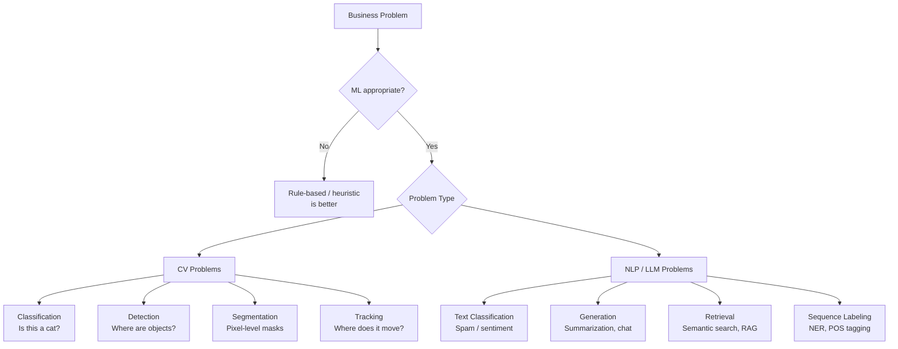
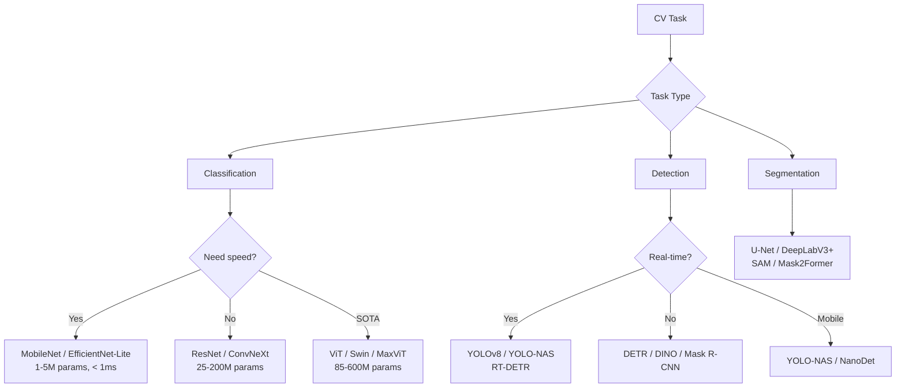
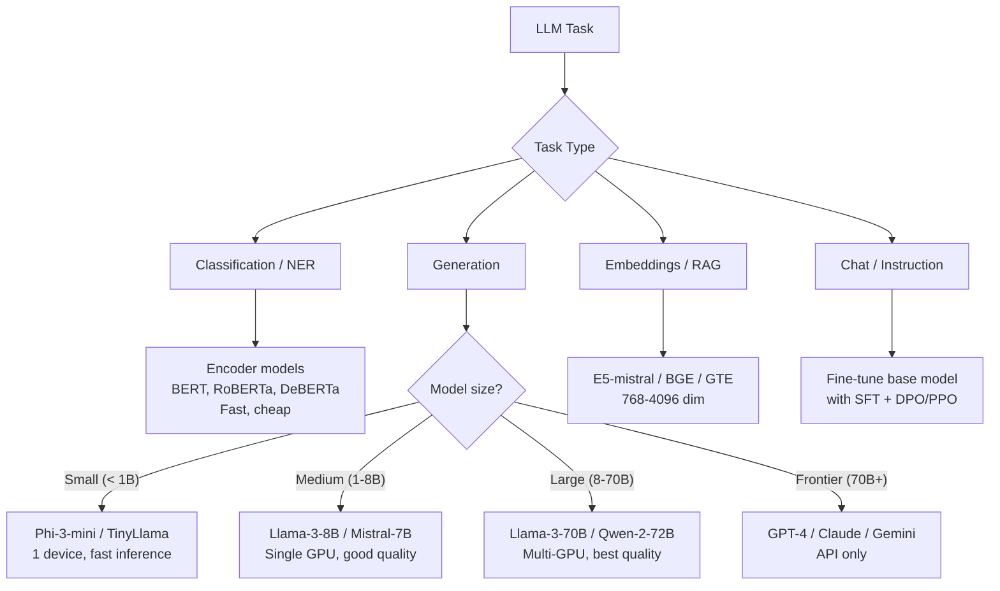
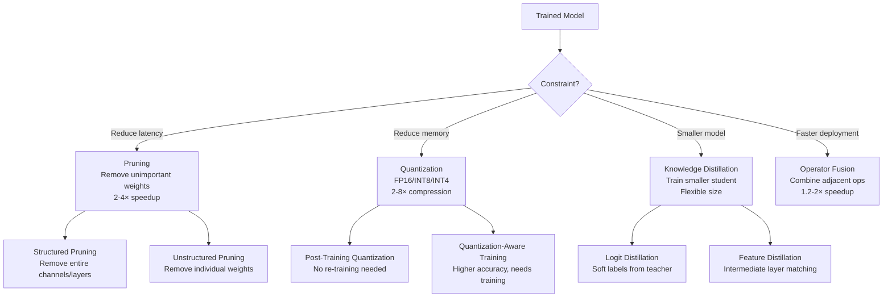
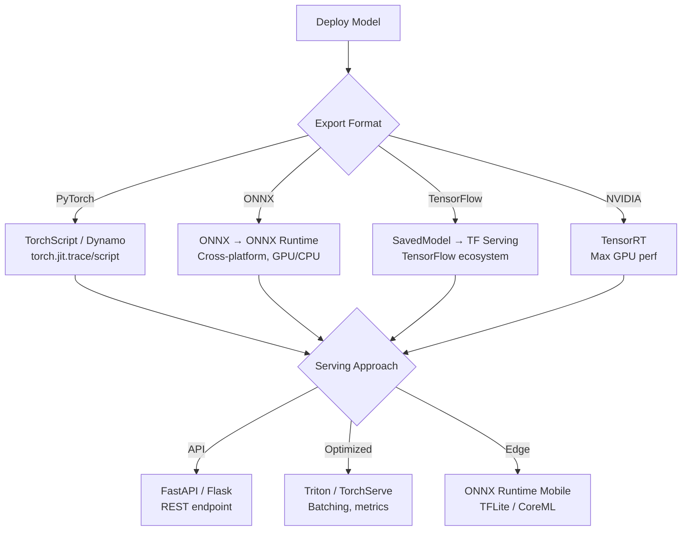

> **End-to-end reference** — data preparation, training, evaluation, optimization, deployment, and monitoring for Computer Vision and Large Language Model workflows.

---

## Table of Contents

1. [Problem Definition & Scoping](#1-problem-definition--scoping)
2. [Data Collection & Preparation](#2-data-collection--preparation)
3. [Exploratory Data Analysis (EDA)](#3-exploratory-data-analysis-eda)
4. [Data Preprocessing & Augmentation](#4-data-preprocessing--augmentation)
5. [Model Selection](#5-model-selection)
6. [Training Infrastructure & Setup](#6-training-infrastructure--setup)
7. [Training Loop & Monitoring](#7-training-loop--monitoring)
8. [Evaluation & Validation](#8-evaluation--validation)
9. [Optimization (Quantization, Pruning, Distillation)](#9-optimization-quantization-pruning-distillation)
10. [Deployment](#10-deployment)
11. [Monitoring & Maintenance](#11-monitoring--maintenance)
12. [Tool & Library Reference](#12-tool--library-reference)

---

## 1. Problem Definition & Scoping

### Decision Framework



### Success Metrics by Problem Type

| Problem Type | Primary Metric | Secondary Metrics | Acceptable Baseline |
|-------------|----------------|-------------------|---------------------|
| **Image Classification** | Top-1 / Top-5 Accuracy | Precision, Recall, F1 | > 80% top-1 |
| **Object Detection** | mAP@0.5:0.95 | AP per class, FPS | > 0.4 mAP |
| **Instance Segmentation** | mAP mask | AP box, inference time | > 0.35 mAP |
| **Image Segmentation** | mIoU | Dice, Pixel Acc | > 0.7 mIoU |
| **Text Classification** | F1 (weighted) | Accuracy, ROC-AUC | > 0.85 F1 |
| **Text Generation** | Perplexity | ROUGE, BLEU, human eval | < 20 perplexity |
| **Summarization** | ROUGE-L | BERTScore, Factuality | > 0.2 ROUGE-L |
| **Semantic Search / RAG** | Recall@k, MRR | NDCG, latency p50/p99 | > 0.8 Recall@10 |

### Resource Estimation

```python
import psutil, torch

def estimate_training_resources(params_billions, model_type="llm"):
    """Quick resource estimation for training."""
    if model_type == "llm":
        # Memory breakdown for LLM training
        # Adam optimizer: 16 bytes per param (fp16 weights + adam states)
        params = params_billions * 1e9
        model_mem = params * 2   # fp16 weights: 2 bytes
        optimizer_mem = params * 8  # adam: fp32 master copy + momentum + variance
        grad_mem = params * 2    # fp16 gradients
        activation_mem = params * 4  # ~4x for transformers (varies with seq_len)
        
        total_gb = (model_mem + optimizer_mem + grad_mem + activation_mem) / 1e9
        return {
            "total_gpu_memory_gb": round(total_gb, 1),
            "model_weights_gb": round(model_mem / 1e9, 1),
            "optimizer_states_gb": round(optimizer_mem / 1e9, 1),
            "activation_memory_gb": round(activation_mem / 1e9, 1),
            "recommended_gpus": max(1, round(total_gb / 40)),  # A100-40GB
        }
    
    elif model_type == "cv":
        # CV models are smaller, dominated by image size and batch
        return {"typical_gpu_memory_gb": 8 - 24, "typical_setup": "1-4 GPUs"}
    
    return {}

# Inference-only estimation
def estimate_inference_memory(params_billions, precision="fp16"):
    bytes_per_param = {"fp32": 4, "fp16": 2, "int8": 1, "int4": 0.5}
    params = params_billions * 1e9
    mem_gb = params * bytes_per_param[precision] / 1e9
    return round(mem_gb, 1)

models = {
    "ResNet-50": 0.025,
    "YOLOv8x": 0.068,
    "ViT-L": 0.307,
    "BERT-base": 0.110,
    "BERT-large": 0.340,
    "Llama-7B": 7,
    "Llama-70B": 70,
}
for model, params in models.items():
    fp16 = estimate_inference_memory(params, "fp16")
    int8 = estimate_inference_memory(params, "int8")
    print(f"  {model:12s} ({params:5.1f}B) → fp16={fp16:5.1f}GB  int8={int8:5.1f}GB")
```

---

## 2. Data Collection & Preparation

### Data Sources

| Modality | Sources | Typical Volume | Storage |
|----------|---------|---------------|---------|
| **CV — Images** | Camera feeds, web scrape, public datasets (ImageNet, COCO) | 10K-100M images | Raw: 100KB-10MB per image |
| **CV — Video** | CCTV, dashcam, user uploads | 1K-10M hours | Raw: 1-5 GB/hour |
| **LLM — Text** | Web crawl (CommonCrawl, C4), books, Wikipedia, code | 100B-10T tokens | Raw: 2-3 bytes/token |
| **LLM — Instructions** | Human annotations, synthetic (GPT), RLHF data | 10K-10M examples | JSONL: ~1KB per example |
| **Vision+Language** | Image-text pairs (LAION, CC12M) | 10M-5B pairs | Raw: 10KB-100KB per pair |

### Dataset Splits

```python
import numpy as np
from sklearn.model_selection import train_test_split

def create_splits(ids, train_ratio=0.8, val_ratio=0.1, test_ratio=0.1, stratify=None):
    """Create train/val/test splits."""
    assert abs(train_ratio + val_ratio + test_ratio - 1.0) < 1e-6
    
    # First split: train vs temp
    train_ids, temp_ids = train_test_split(
        ids, test_size=(1 - train_ratio),
        stratify=stratify, random_state=42
    )
    
    # Second split: val vs test from temp
    val_fraction = val_ratio / (val_ratio + test_ratio)
    val_ids, test_ids = train_test_split(
        temp_ids, test_size=(1 - val_fraction),
        stratify=stratify[train_indices]  # careful with indexing
        if stratify is not None else None,
        random_state=42
    )
    
    return train_ids, val_ids, test_ids

# Special considerations:
# CV:  Ensure no identical images across splits (deduplicate by hash)
# LLM: Ensure no document overlap (train/test leakage is common)
# Both: Stratify by domain/class for imbalanced datasets
```

---

## 3. Exploratory Data Analysis (EDA)

### CV EDA Checklist

```python
import matplotlib.pyplot as plt
import numpy as np
from collections import Counter

def cv_eda(image_paths, labels):
    """Run standard CV EDA and print diagnostics."""
    
    # 1. Class distribution
    class_counts = Counter(labels)
    print("=== Class Distribution ===")
    for cls, count in class_counts.most_common():
        print(f"  {cls}: {count} ({count/len(labels)*100:.1f}%)")
    
    # 2. Image properties
    from PIL import Image
    widths, heights, ratios = [], [], []
    for path in image_paths[:1000]:  # sample
        img = Image.open(path)
        w, h = img.size
        widths.append(w)
        heights.append(h)
        ratios.append(w / h)
    
    print(f"\n=== Image Dimensions ===")
    print(f"  Width:  min={min(widths)}  max={max(widths)}  mean={np.mean(widths):.0f}")
    print(f"  Height: min={min(heights)}  max={max(heights)}  mean={np.mean(heights):.0f}")
    print(f"  Aspect: min={min(ratios):.2f}  max={max(ratios):.2f}  mean={np.mean(ratios):.2f}")
    
    # 3. Check for corrupt images
    corrupt = 0
    for path in image_paths:
        try:
            Image.open(path).verify()
        except:
            corrupt += 1
    print(f"\n  Corrupt images: {corrupt}/{len(image_paths)} ({corrupt/len(image_paths)*100:.1f}%)")
    
    # 4. Check for duplicates (perceptual hash)
    # imagehash.average_hash(Image.open(path)) — group by hash
```

### LLM EDA Checklist

```python
import json
import numpy as np
from collections import Counter

def llm_eda(texts_or_path):
    """Run standard LLM EDA on a text dataset."""
    
    texts = texts_or_path
    if isinstance(texts, str):
        with open(texts) as f:
            texts = [json.loads(line)["text"] for line in f]
    
    # 1. Length distribution
    lengths = [len(t.split()) for t in texts]
    print("=== Length Distribution (tokens) ===")
    print(f"  min: {min(lengths)}")
    print(f"  max: {max(lengths)}")
    print(f"  mean: {np.mean(lengths):.0f}")
    print(f"  median: {np.median(lengths):.0f}")
    print(f"  p90: {np.percentile(lengths, 90):.0f}")
    
    # 2. Character-level stats
    chars = sum(len(t) for t in texts)
    print(f"\n=== Volume ===")
    print(f"  Documents: {len(texts):,}")
    print(f"  Total words: {sum(lengths):,}")
    print(f"  Total chars: {chars:,}")
    
    # 3. Repetition / dedup ratio
    unique = len(set(texts))
    print(f"\n=== Deduplication ===")
    print(f"  Unique docs: {unique} ({unique/len(texts)*100:.1f}%)")
    print(f"  Duplicate ratio: {(1 - unique/len(texts))*100:.1f}%")
    
    # 4. Language detection (using fasttext or langdetect)
    # from langdetect import detect
    # langs = [detect(t[:1000]) for t in texts[:100]]
    # print(f"\nLanguages: {Counter(langs).most_common(5)}")
    
    # 5. Toxicity / quality filtering
    # Use a quality classifier to flag low-quality examples
    
    return {
        "n_docs": len(texts),
        "total_tokens": sum(lengths),
        "mean_tokens": np.mean(lengths),
    }
```

---

## 4. Data Preprocessing & Augmentation

### CV Preprocessing Pipeline

```python
import torch
import torchvision.transforms as T
import torchvision.transforms.functional as TF
import random

class CVPipeline:
    """Standard CV preprocessing and augmentation."""
    
    @staticmethod
    def train_transform(resize=224):
        return T.Compose([
            T.RandomResizedCrop(resize, scale=(0.08, 1.0)),
            T.RandomHorizontalFlip(p=0.5),
            T.ColorJitter(brightness=0.2, contrast=0.2, saturation=0.2, hue=0.1),
            T.RandomAffine(degrees=15, translate=(0.1, 0.1)),
            T.ToTensor(),
            T.Normalize(mean=[0.485, 0.456, 0.406], std=[0.229, 0.224, 0.225]),
        ])
    
    @staticmethod
    def val_transform(resize=224):
        return T.Compose([
            T.Resize(int(resize * 1.14)),  # slightly larger for center crop
            T.CenterCrop(resize),
            T.ToTensor(),
            T.Normalize(mean=[0.485, 0.456, 0.406], std=[0.229, 0.224, 0.225]),
        ])
    
    @staticmethod
    def detection_transform():
        """For object detection / segmentation."""
        # Use torchvision's transforms v2:
        # T.RandomPhotometricDistort, T.RandomZoomOut, T.RandomIoUCrop
        from torchvision.transforms import v2
        return v2.Compose([
            v2.RandomPhotometricDistort(p=0.5),
            v2.RandomZoomOut(fill=0),
            v2.RandomIoUCrop(),
            v2.SanitizeBoundingBoxes(),
            v2.ToImageTensor(),
            v2.ConvertDtype(),
        ])

```

### Common Augmentations Comparison

| Augmentation | Use Case | Effect | Compute Cost |
|-------------|----------|--------|--------------|
| RandomResizedCrop | Classification | Invariance to scale/position | Low |
| HorizontalFlip | General | Doubles data, cheap | Minimal |
| ColorJitter | Outdoor/natural | Invariance to lighting | Low |
| RandAugment | SOTA image cls | Best accuracy gain | Medium |
| MixUp / CutMix | Classification | Regularization, smoother | Low |
| Mosaic | Detection | Small object context | Medium (stitch 4) |
| Copy-Paste | Segmentation | Rare class balancing | High |
| RandomErasing | General | Robustness to occlusion | Low |


### LLM Preprocessing Pipeline

```python
from transformers import AutoTokenizer
import numpy as np

class LLMPreprocessor:
    """Text preprocessing and tokenization for LLM training."""
    
    def __init__(self, model_name="gpt2", max_length=2048):
        self.tokenizer = AutoTokenizer.from_pretrained(model_name)
        self.max_length = max_length
    
    def preprocess_text(self, text):
        """Cleaning pipeline for raw text."""
        # Order matters:
        text = text.strip()
        # 1. Normalize whitespace
        import re
        text = re.sub(r'\s+', ' ', text)
        # 2. Remove control characters
        text = re.sub(r'[\x00-\x08\x0b\x0c\x0e-\x1f]', '', text)
        # 3. Unescape HTML entities (if web data)
        # import html; text = html.unescape(text)
        # 4. Filter by length
        # if len(text.split()) < 10: return None
        return text
    
    def tokenize(self, texts, padding=False, truncation=True):
        return self.tokenizer(
            texts,
            max_length=self.max_length,
            padding=padding,
            truncation=truncation,
            return_tensors="pt",
        )
    
    def pack_documents(self, texts):
        """Pack multiple documents into sequences for efficient training.
        
        Instead of padding short sequences, concatenate documents
        with an EOS token separator.
        """
        eos = self.tokenizer.eos_token_id
        all_tokens = []
        for text in texts:
            tokens = self.tokenizer.encode(text)
            all_tokens.extend(tokens + [eos])
        
        # Chop into max_length chunks
        chunks = []
        for i in range(0, len(all_tokens) - self.max_length, self.max_length):
            chunk = all_tokens[i:i + self.max_length]
            chunks.append({"input_ids": chunk, "labels": chunk})
        
        return chunks

```

### Tokenization Speed Comparison

| Tokenizer | Vocab Size | Speed (tokens/s) | Memory (model) | Best For |
|-----------|-----------|------------------|----------------|----------|
| GPT-2 BPE | 50,257 | ~50K/s | Baseline | GPT models |
| Llama SentencePiece | 32,000 | ~60K/s | Smaller vocab | Llama, Mistral |
| tiktoken (cl100k) | 100,000 | ~200K/s (Rust) | Larger vocab | GPT-4, embeddings |
| WordPiece | 30,000 | ~40K/s | Baseline | BERT |
| Unigram (SPM) | 32,000 | ~55K/s | Smaller vocab | T5, Gemma |


---

## 5. Model Selection

### CV Model Selection Guide



| Task | Backbone Options | FLOPs | mAP/Acc | Latency (V100) |
|------|-----------------|-------|---------|----------------|
| Classification (ImageNet) | ResNet-50 | 4.1B | 76.1% | 0.3ms |
| | ConvNeXt-T | 4.5B | 82.1% | 0.5ms |
| | ViT-B | 17.6B | 84.5% | 1.2ms |
| | EfficientNet-B0 | 0.4B | 77.7% | 0.2ms |
| Detection (COCO) | YOLOv8n | 8.7B | 37.3 mAP | 0.6ms |
| | YOLOv8x | 257B | 53.9 mAP | 3.5ms |
| | RT-DETR-L | 110B | 53.0 mAP | 3.0ms |
| | DINO-R50 | 86B | 49.0 mAP | 10ms |
| Segmentation (ADE20K) | DeepLabV3+ R50 | 86B | 42.4 mIoU | 4ms |
| | Mask2Former-T | 46B | 46.5 mIoU | 6ms |

### LLM Model Selection Guide



| Model | Params | Context | Perplexity (Wiki2) | Inference Cost | Use Case |
|-------|--------|---------|-------------------|----------------|----------|
| BERT-base | 110M | 512 | — | $0.01/1K queries | Classification, NER |
| BERT-large | 340M | 512 | — | $0.03/1K queries | Classification |
| DeBERTa-v3 | 304M | 512 | — | $0.03/1K queries | SOTA classification |
| Gemma-2B | 2B | 8K | 10.4 | $0.05/1K tokens | Small generation |
| Phi-3-mini | 3.8B | 128K | 8.3 | $0.08/1K tokens | Edge, on-device |
| Mistral-7B | 7B | 32K | 5.7 | $0.15/1K tokens | General generation |
| Llama-3-8B | 8B | 128K | 5.3 | $0.20/1K tokens | QA, chat, code |
| Llama-3-70B | 70B | 128K | 3.9 | $1.50/1K tokens | Best open LLM |
| GPT-4o | ~1.8T | 128K | — | $2.50/1K input | General (API) |

---

## 6. Training Infrastructure & Setup

### Hardware Selection

```python
def recommend_hardware(model_params_b, dataset_size, task="llm"):
    """Recommend GPU setup based on model and data."""
    
    if task == "llm":
        training_mem = model_params_b * 16  # 16 bytes/param for fp16+adam
        if training_mem <= 24:
            return "1× RTX 4090 (24GB) or 1× L4"
        elif training_mem <= 80:
            return "1× A100-80GB or 2× RTX 6000 Ada"
        elif training_mem <= 320:
            return f"4× A100-80GB (with FSDP)"
        elif training_mem <= 1280:
            return f"8× A100-80GB (with FSDP or DeepSpeed ZeRO-3)"
        else:
            return f"{training_mem // 80}× A100-80GB (ZeRO-3 + activation offloading)"
    
    if task == "cv":
        if model_params_b < 0.1:
            return "Any GPU (RTX 3060+)"
        elif model_params_b < 0.5:
            return "RTX 4090 (24GB) — batch size 64-128"
        else:
            return "A100-40GB or 2× RTX 4090"

# Training time estimation
def estimate_training_time(params_b, tokens_b, gpu_flops=312, gpu_util=0.5):
    """
    params_b: model params in billions
    tokens_b: training tokens in billions
    gpu_flops: TFLOPS per GPU (A100-80GB = 312)
    gpu_util: utilization fraction (typically 0.4-0.6)
    
    Formula: time ≈ 6 × params × tokens / (gpu_flops × 1e12 × gpu_util)
    """
    # 6 = forward + backward FLOPs per token per param
    total_flops = 6 * params_b * 1e9 * tokens_b * 1e9
    gpu_throughput = gpu_flops * 1e12 * gpu_util
    gpu_days = total_flops / gpu_throughput / 86400
    
    return {
        "total_gpu_days": round(gpu_days, 1),
        "with_8_gpus_days": round(gpu_days / 8, 1),
        "with_64_gpus_days": round(gpu_days / 64, 1),
    }

# Examples:
examples = [
    ("Llama-3-8B", 8, 2000),     # 8B model, 2T tokens
    ("Mistral-7B", 7, 1000),
    ("BERT-base pretrain", 0.11, 137),  # 137B tokens (BookCorpus+Wiki)
]
for name, params, tokens in examples:
    est = estimate_training_time(params, tokens)
    print(f"{name:25s}: {est['total_gpu_days']:6.1f} GPU-days  "
          f"({est['with_8_gpus_days']:5.1f}d on 8 GPUs)")
```

### Training Frameworks

### CV Training Frameworks

| Framework | Best For | Distributed | Deployment | Notes |
|-----------|----------|-------------|------------|-------|
| PyTorch + torchvision | Research, custom models | DDP | ONNX/TorchScript | Most flexible |
| PyTorch Lightning | Standardized training | DDP/FSDP | ONNX | Less boilerplate |
| Detectron2 | Detection/segmentation | DDP | ONNX | Facebook AI, mature |
| MMDetection | Detection zoo | DDP | ONNX | 300+ configs |
| Ultralytics YOLO | Detection/tracking | Auto | Exported models | Easiest to start |
| TensorFlow + TF Hub | Production Keras | TF Distribution | TF Serving/SavedModel | Enterprise |

### LLM Training Frameworks

| Framework | Best For | Distributed | Memory Saving | Config |
|-----------|----------|-------------|---------------|--------|
| HuggingFace Transformers | Fine-tuning | DDP/FSDP | Gradient Checkpoint | Trainer API |
| HuggingFace TRL | SFT/DPO/PPO | FSDP | LoRA/QLoRA | SFTTrainer, DPOTrainer |
| Axolotl | SFT/DPO fine-tuning | FSDP/DeepSpeed | LoRA, QLoRA | YAML config |
| Lit-GPT / Lit-LLaMA | Pretraining | FSDP | — | Lightning-based |
| NanoGPT | Pretraining (small) | DDP | — | Minimal, educational |
| Megatron-LM | Large pretraining | Tensor > Pipeline > Data | Activation offloading | NVIDIA, production |
| DeepSpeed | Large-scale training | ZeRO-1/2/3 | ZeRO, offload | Plugin to any framework |
| Unsloth | Fine-tuning (speed) | — | LoRA, 2× faster | Optimized kernels |

```python
def lora_config(r=16, alpha=32, dropout=0.05, target_modules=None):
    """LoRA configuration for PEFT."""
    from peft import LoraConfig
    
    if target_modules is None:
        target_modules = ["q_proj", "v_proj"]  # default for Llama
        
    return LoraConfig(
        r=r,                    # rank — higher = more capacity, more memory
        lora_alpha=alpha,        # scaling factor (alpha / r)
        lora_dropout=dropout,
        target_modules=target_modules,
        bias="none",
        task_type="CAUSAL_LM",
    )
```

---

## 7. Training Loop & Monitoring

### CV Training Loop

```python
import torch
import torch.nn as nn
from torch.cuda.amp import autocast, GradScaler
from tqdm import tqdm
import wandb

def train_cv_epoch(model, loader, optimizer, scaler, device, epoch, use_amp=True):
    model.train()
    total_loss = 0
    correct = 0
    total = 0
    pbar = tqdm(loader, desc=f"Epoch {epoch} [train]")
    
    for batch_idx, (images, labels) in enumerate(pbar):
        images, labels = images.to(device), labels.to(device)
        
        optimizer.zero_grad()
        
        if use_amp:
            with autocast(device_type="cuda"):
                outputs = model(images)
                loss = nn.functional.cross_entropy(outputs, labels)
            scaler.scale(loss).backward()
            scaler.step(optimizer)
            scaler.update()
        else:
            outputs = model(images)
            loss = nn.functional.cross_entropy(outputs, labels)
            loss.backward()
            optimizer.step()
        
        total_loss += loss.item()
        _, predicted = outputs.max(1)
        total += labels.size(0)
        correct += predicted.eq(labels).sum().item()
        
        # Log per batch
        pbar.set_postfix({
            "loss": f"{loss.item():.4f}",
            "acc": f"{100.*correct/total:.2f}%",
        })
        
        if batch_idx % 50 == 0:
            wandb.log({
                "train/loss_step": loss.item(),
                "train/lr": optimizer.param_groups[0]["lr"],
                "train/epoch": epoch + batch_idx / len(loader),
            })
    
    return total_loss / len(loader), 100. * correct / total


def validate_cv_epoch(model, loader, device):
    model.eval()
    total_loss = 0
    correct = 0
    total = 0
    
    with torch.no_grad():
        for images, labels in tqdm(loader, desc="[val]"):
            images, labels = images.to(device), labels.to(device)
            outputs = model(images)
            loss = nn.functional.cross_entropy(outputs, labels)
            
            total_loss += loss.item()
            _, predicted = outputs.max(1)
            total += labels.size(0)
            correct += predicted.eq(labels).sum().item()
    
    return total_loss / len(loader), 100. * correct / total
```

### LLM Training Loop

```python
from transformers import (
    AutoModelForCausalLM, AutoTokenizer,
    Trainer, TrainingArguments, DataCollatorForLanguageModeling
)
from datasets import Dataset
import torch

def setup_llm_training(
    model_name="microsoft/phi-3-mini",
    output_dir="./phi3-finetuned",
    lora_r=16,
    use_qlora=True,
):
    """Set up LLM fine-tuning with QLoRA."""
    
    from peft import get_peft_model, LoraConfig, prepare_model_for_kbit_training
    from transformers import BitsAndBytesConfig
    
    # 4-bit quantization config
    quant_config = BitsAndBytesConfig(
        load_in_4bit=use_qlora,
        bnb_4bit_use_double_quant=True,
        bnb_4bit_quant_type="nf4",
        bnb_4bit_compute_dtype=torch.bfloat16,
    )
    
    # Load model
    model = AutoModelForCausalLM.from_pretrained(
        model_name,
        quantization_config=quant_config if use_qlora else None,
        torch_dtype=torch.bfloat16,
        device_map="auto",
    )
    
    if use_qlora:
        model = prepare_model_for_kbit_training(model)
    
    # LoRA adapter
    lora_config = LoraConfig(
        r=lora_r,
        lora_alpha=lora_r * 2,
        target_modules=["q_proj", "k_proj", "v_proj", "o_proj"],
        lora_dropout=0.05,
        bias="none",
        task_type="CAUSAL_LM",
    )
    model = get_peft_model(model, lora_config)
    model.print_trainable_parameters()
    # e.g. "trainable params: 4.2M / 3.8B (0.11%)"
    
    return model

# Training arguments for LLM
def get_llm_training_args(
    output_dir, batch_size=4, grad_accum=8, learning_rate=2e-4,
    num_epochs=3, max_length=2048, use_fsdp=False,
):
    return TrainingArguments(
        output_dir=output_dir,
        per_device_train_batch_size=batch_size,
        per_device_eval_batch_size=batch_size,
        gradient_accumulation_steps=grad_accum,
        learning_rate=learning_rate,
        warmup_ratio=0.03,
        lr_scheduler_type="cosine",
        num_train_epochs=num_epochs,
        logging_steps=10,
        save_steps=500,
        eval_steps=500,
        save_total_limit=2,
        load_best_model_at_end=True,
        evaluation_strategy="steps",
        bf16=True,
        tf32=True,
        gradient_checkpointing=True,
        optim="adamw_torch_fused",
        report_to="wandb",
        ddp_find_unused_parameters=False,
        fsdp="full_shard auto_wrap" if use_fsdp else None,
        max_grad_norm=1.0,
        dataloader_num_workers=4,
    )

### Learning Rate Selection Guide

| Scenario | Learning Rate | Warmup | Scheduler |
|----------|--------------|--------|-----------|
| Full fine-tune (LLM) | 1e-5 to 3e-5 | 3-10% | Cosine |
| LoRA fine-tune (LLM) | 1e-4 to 5e-4 | 3% | Cosine |
| CV classification | 1e-3 to 3e-3 | 5 epochs | Cosine / Step |
| CV detection (backbone frozen) | 1e-3 | 500 steps | Cosine |
| CV detection (full) | 1e-4 | 500 steps | Cosine |
| Reward model (RLHF) | 1e-5 to 3e-5 | 3% | Cosine |
| DPO fine-tune | 5e-7 to 1e-6 | 3% | Cosine |

```

### Training Monitoring Checklist

```python
# LearningRateConfig / DataLoader / Optimizer — see Section 6 for full setup
```

### Training Monitoring Checklist

| What to Monitor | CV | LLM | Red Flag |
|-----------------|----|-----|----------|
| Loss (train) | ↓ steadily | ↓ steadily | Up = diverging |
| Loss (val) | ↓ then plateaus | ↓ then plateaus | Up = overfitting |
| Gradient norm | 0.5-10 | 0.1-1 | > 100 = exploding, < 1e-4 = vanishing |
| Learning rate | Follows schedule | Follows schedule | Spikes = instability |
| GPU utilization | > 80% | > 80% | < 50% = data loading bottleneck |
| Memory | < 90% | < 90% | OOM imminent |
| Throughput (samples/s) | Stable | Stable | ↓ = bottleneck |
| Batch time | Consistent | Consistent | ↑ = I/O issue |
| Accuracy (train) | ↑ steadily | — | Plateau = need more capacity |
| Perplexity (val) | — | ↓ steadily | Up = overfitting |


---

## 8. Evaluation & Validation

### CV Evaluation

```python
from sklearn.metrics import (
    accuracy_score, precision_recall_fscore_support,
    confusion_matrix, classification_report, average_precision_score
)
import numpy as np

def evaluate_classification(y_true, y_pred, y_scores, class_names=None):
    """Full classification evaluation."""
    
    accuracy = accuracy_score(y_true, y_pred)
    precision, recall, f1, _ = precision_recall_fscore_support(
        y_true, y_pred, average="weighted"
    )
    
    print(f"Accuracy:  {accuracy:.4f}")
    print(f"Precision: {precision:.4f}")
    print(f"Recall:    {recall:.4f}")
    print(f"F1:        {f1:.4f}")
    
    # Per-class breakdown
    print("\nPer-class metrics:")
    print(classification_report(y_true, y_pred, target_names=class_names))
    
    return {"accuracy": accuracy, "f1": f1, "precision": precision, "recall": recall}


def evaluate_detection(pred_boxes, pred_scores, pred_labels, gt_boxes, gt_labels, iou_thresh=0.5):
    """Compute mAP for object detection."""
    from torchvision.ops import box_iou
    
    # Per-class AP
    aps = []
    for cls in set(gt_labels):
        # Filter by class
        pred_mask = pred_labels == cls
        gt_mask = gt_labels == cls
        
        if sum(pred_mask) == 0 and sum(gt_mask) == 0:
            continue
        
        # Sort by confidence
        scores = pred_scores[pred_mask]
        order = scores.argsort(descending=True)
        
        tp = np.zeros(len(order))
        fp = np.zeros(len(order))
        
        for i, idx in enumerate(order):
            if sum(gt_mask) == 0:
                fp[i] = 1
                continue
            
            ious = box_iou(pred_boxes[pred_mask][idx:idx+1], gt_boxes[gt_mask])
            max_iou, max_idx = ious.max(1)
            
            if max_iou >= iou_thresh:
                tp[i] = 1
                # Remove matched GT
                gt_labels_remaining = list(gt_boxes[gt_mask].numpy())
                # Simplification — real mAP needs careful matching
        
        # Cumulative precision/recall
        tp_cum = tp.cumsum()
        fp_cum = fp.cumsum()
        recall = tp_cum / max(sum(gt_mask), 1)
        precision = tp_cum / (tp_cum + fp_cum + 1e-6)
        
        # AP = area under precision-recall curve
        ap = np.trapz(precision, recall)
        aps.append(ap)
    
    mAP = np.mean(aps) if aps else 0
    print(f"mAP@{iou_thresh}: {mAP:.4f}")
    return mAP


def evaluate_segmentation(pred_masks, gt_masks, num_classes):
    """Compute mIoU for segmentation."""
    ious = []
    for cls in range(num_classes):
        pred = (pred_masks == cls)
        gt = (gt_masks == cls)
        
        intersection = (pred & gt).sum()
        union = (pred | gt).sum()
        
        iou = intersection / (union + 1e-6)
        ious.append(iou)
    
    miou = np.mean(ious)
    print(f"mIoU: {miou:.4f}")
    print(f"Per-class IoU: {[f'{iou:.4f}' for iou in ious]}")
    return miou
```

### LLM Evaluation

```python
from transformers import AutoModelForCausalLM
import torch

def evaluate_perplexity(model, tokenizer, eval_texts, max_length=2048, stride=512):
    """Compute perplexity over a corpus."""
    model.eval()
    total_loss = 0
    total_tokens = 0
    
    for text in eval_texts:
        encodings = tokenizer(text, return_tensors="pt")
        input_ids = encodings.input_ids.to(model.device)
        
        with torch.no_grad():
            # Sliding window perplexity
            nlls = []
            for i in range(0, input_ids.size(1) - max_length, stride):
                start = i
                end = i + max_length
                chunk = input_ids[:, start:end]
                labels = chunk.clone()
                
                outputs = model(chunk, labels=labels)
                nll = outputs.loss * (end - start)
                nlls.append(nll)
            
            if nlls:
                total_nll = torch.stack(nlls).sum()
                total_tokens += sum(
                    min(stride, input_ids.size(1) - max_length - i)
                    for i in range(0, input_ids.size(1) - max_length, stride)
                )
                total_loss += total_nll
    
    perplexity = torch.exp(total_loss / total_tokens)
    return perplexity.item()


```

### Evaluation Benchmarks (LLM)

| Task | Benchmark | Metric | Good Score | Great Score |
|------|-----------|--------|------------|-------------|
| Classification | GLUE | F1/Acc | > 85 | > 90 |
| QA | SQuAD 2.0 | F1 | > 80 | > 88 |
| Reasoning | MMLU | Accuracy | > 65% | > 80% |
| Code | HumanEval | pass@1 | > 30% | > 50% |
| Math | GSM8K | Accuracy | > 50% | > 80% |
| Summarization | CNN/DailyMail | ROUGE-L | > 38 | > 42 |
| Translation | WMT | BLEU | > 25 | > 35 |
| Safety | TruthfulQA | MC1 | > 40% | > 55% |
| General knowledge | ARC-Challenge | Accuracy | > 55% | > 70% |

### Evaluation Benchmarks (CV)

| Task | Benchmark | Metric | Good Score | Great Score |
|------|-----------|--------|------------|-------------|
| Classification | ImageNet-1K | Top-1 Acc | > 78% | > 84% |
| Detection | COCO | mAP@0.5:0.95 | > 0.42 | > 0.50 |
| Segmentation | ADE20K | mIoU | > 0.40 | > 0.50 |
| Instance Seg | COCO | mAP mask | > 0.35 | > 0.42 |
| Pose estimation | COCO keypoints | AP | > 0.65 | > 0.75 |
| Tracking | MOT17 | MOTA | > 60 | > 70 |


---

## 9. Optimization (Quantization, Pruning, Distillation)

### Optimization Techniques Comparison



### Quantization Cheatsheet

| Method | Precision | Model Size | Speedup | Accuracy | Framework | Effort |
|--------|-----------|------------|---------|----------|-----------|-------|
| FP32 baseline | 32-bit | 100% | 1× | Baseline | Any | None |
| FP16 | 16-bit | 50% | 1.5-2× | ~Same | AMP / ONNX | Low |
| INT8 (PTQ) | 8-bit | 25% | 2-4× | -0.5-2% | ONNX / TensorRT | Low |
| INT8 (QAT) | 8-bit | 25% | 2-4× | -0.1-0.5% | ONNX / PyTorch | Medium |
| INT4 (weight) | 4-bit | 12.5% | 2-3× | -1-3% | GPTQ / AWQ / GGUF | Medium |
| INT4 (GPTQ) | 4-bit | 12.5% | 2-3× | -0.5-1% | AutoGPTQ | Medium |
| NF4 (QLoRA) | 4-bit | 12.5% | — | ~Same for fine-tune | bitsandbytes | Medium |
| FP8 (H100) | 8-bit | 25% | 2× | ~Same | Transformer Engine | Low |

### PyTorch Quantization Code

```python
def quantize_pytorch(model, calib_loader=None, method="dynamic"):
    """Quantize a PyTorch model."""
    import torch.quantization as quant
    
    if method == "dynamic":
        # Post-training dynamic quantization (best for LLM)
        quantized = torch.quantization.quantize_dynamic(
            model, {torch.nn.Linear}, dtype=torch.qint8
        )
        return quantized
    
    elif method == "static":
        # Post-training static quantization (best for CV)
        model.qconfig = quant.get_default_qconfig("fbgemm")
        model_prepared = quant.prepare(model)
        
        # Calibrate
        model_prepared.eval()
        with torch.no_grad():
            for images, _ in calib_loader:
                model_prepared(images)
        
        quantized = quant.convert(model_prepared)
        return quantized


# ONNX Runtime quantization
def quantize_onnx(model_path, output_path, method="dynamic"):
    from onnxruntime.quantization import quantize_dynamic, quantize_static
    
    if method == "dynamic":
        quantize_dynamic(model_path, output_path)
    elif method == "static":
        # Requires calibration data reader
        # quantize_static(model_path, output_path, calibration_data_reader)
        pass
    
    import os
    ratio = os.path.getsize(output_path) / os.path.getsize(model_path)
    print(f"Compression: {ratio:.1%}  ({os.path.getsize(output_path)/1e6:.0f} MB vs "
          f"{os.path.getsize(model_path)/1e6:.0f} MB)")
```

### LLM-Specific Optimization

```python
# LLM quantization — GPTQ / AWQ
def quantize_llm_4bit(model_name, dataset="c4"):
    """Quantize a language model to 4-bit using GPTQ."""
    from auto_gptq import AutoGPTQForCausalLM, BaseQuantizeConfig
    
    quantize_config = BaseQuantizeConfig(
        bits=4,
        group_size=128,        # smaller group = better accuracy, larger file
        desc_act=True,          # activate desc_act for better accuracy
        damp_percent=0.01,
    )
    
    model = AutoGPTQForCausalLM.from_pretrained(
        model_name, quantize_config=quantize_config
    )
    
    # Calibration
    from datasets import load_dataset
    dataset = load_dataset(dataset, split="train")
    
    model.quantize(
        dataset,
        batch_size=1,
        use_triton=True,        # faster kernels
    )
    
    model.save_quantized("model-4bit-gptq")
    return model


# AWQ quantization (alternative to GPTQ)
def quantize_awq(model_name):
    """AWQ quantization — often better than GPTQ for same bits."""
    from awq import AutoAWQForCausalLM
    
    model = AutoAWQForCausalLM.from_pretrained(model_name)
    tokenizer = AutoTokenizer.from_pretrained(model_name)
    
    # Calibration data
    from datasets import load_dataset
    dataset = load_dataset("wikitext", "wikitext-2-raw-v1", split="train")
    
    model.quantize(
        tokenizer,
        quant_config={"zero_point": True, "q_group_size": 128, "w_bit": 4, "version": "GEMM"},
        calib_dataset=dataset,
    )
    
    model.save_quantized("model-4bit-awq")
    return model
```

### Knowledge Distillation

```python
def distillation_loss(student_logits, teacher_logits, labels, temperature=4.0, alpha=0.5):
    """Knowledge distillation loss.
    
    L = α * CE(student, labels) + (1-α) * T² * KL(student/T || teacher/T)
    """
    import torch.nn.functional as F
    
    # Hard loss (ground truth)
    hard_loss = F.cross_entropy(student_logits, labels)
    
    # Soft loss (teacher knowledge)
    soft_student = F.log_softmax(student_logits / temperature, dim=-1)
    soft_teacher = F.softmax(teacher_logits / temperature, dim=-1)
    soft_loss = F.kl_div(soft_student, soft_teacher, reduction="batchmean")
    soft_loss *= temperature ** 2
    
    total_loss = alpha * hard_loss + (1 - alpha) * soft_loss
    return total_loss
```

### Typical Teacher-Student Size Ratios

| Teacher | Student | Size Ratio | Accuracy Retention |
|---------|---------|------------|-------------------|
| ViT-L (307M) | ViT-B (86M) | 3.6× | > 98% |
| ResNet-152 (60M) | ResNet-18 (11M) | 5.5× | > 96% |
| Llama-70B | Llama-8B | 8.8× | > 95% (with lots of data) |
| BERT-large (340M) | DistilBERT (66M) | 5.2× | 97% |
| GPT-4 (est) | Small student | ~100× | 80-90% (needs extensive data) |


---

## 10. Deployment

### Deployment Options



### Export & Serve Pipeline

```python
# Step 1: Export to ONNX
import torch

def export_to_onnx(model, dummy_input, output_path="model.onnx", dynamic_batch=True):
    model.eval()
    with torch.no_grad():
        torch.onnx.export(
            model,
            dummy_input,
            output_path,
            opset_version=18,
            input_names=["input"],
            output_names=["output"],
            dynamic_axes={
                "input": {0: "batch_size"},
                "output": {0: "batch_size"},
            } if dynamic_batch else None,
        )
    print(f"Exported to {output_path}")


# Step 2: Optimize with ONNX Runtime
import onnxruntime as ort

def create_optimized_session(model_path, providers=None):
    sess_options = ort.SessionOptions()
    sess_options.graph_optimization_level = ort.GraphOptimizationLevel.ORT_ENABLE_ALL
    sess_options.optimized_model_filepath = model_path.replace(".onnx", "_opt.onnx")
    sess_options.intra_op_num_threads = 4
    
    if providers is None:
        available = ort.get_available_providers()
        if "TensorrtExecutionProvider" in available:
            providers = ["TensorrtExecutionProvider", "CUDAExecutionProvider", "CPUExecutionProvider"]
        elif "CUDAExecutionProvider" in available:
            providers = ["CUDAExecutionProvider", "CPUExecutionProvider"]
        else:
            providers = ["CPUExecutionProvider"]
    
    return ort.InferenceSession(model_path, sess_options, providers=providers)


# Step 3: Deploy as API
def create_fastapi_app(model_path):
    """Minimal FastAPI serving app."""
    from fastapi import FastAPI
    from pydantic import BaseModel
    import numpy as np
    
    app = FastAPI()
    session = create_optimized_session(model_path)
    
    class PredictRequest(BaseModel):
        data: list
    
    class PredictResponse(BaseModel):
        predictions: list
        latency_ms: float
    
    @app.post("/predict")
    async def predict(req: PredictRequest):
        import time
        inputs = np.array(req.data, dtype=np.float32)
        start = time.perf_counter()
        outputs = session.run(None, {"input": inputs})
        latency = (time.perf_counter() - start) * 1000
        return PredictResponse(predictions=outputs[0].tolist(), latency_ms=round(latency, 2))
    
    @app.get("/health")
    async def health():
        return {"status": "healthy", "model": model_path}
    
    return app

### Deployment Comparison

| Platform | CV | LLM | Batching | GPU | Best For |
|----------|----|-----|----------|-----|----------|
| FastAPI + ONNX | ✅ | ✅ | Manual | ✅ | Simple, custom |
| TorchServe | ✅ | ⚠️ | Auto | ✅ | PyTorch ecosystem |
| NVIDIA Triton | ✅ | ✅ | Dynamic | ✅ | Production, multi-model |
| vLLM | ❌ | ✅ | Continuous | ✅ | LLM serving only |
| TGI (HF) | ❌ | ✅ | Continuous | ✅ | HuggingFace LLMs |
| TensorRT-LLM | ❌ | ✅ | In-flight batching | ✅ | Max LLM throughput |
| SageMaker | ✅ | ✅ | Auto | ✅ | AWS ecosystem |
| BentoML | ✅ | ✅ | Auto | ✅ | Cloud-agnostic |
| Ray Serve | ✅ | ✅ | Auto | ✅ | Distributed, complex |

LLM serving throughput (approximate — Llama-2-7B, A100-80GB):

| Engine | Batch=1 | Batch=16 | Batch=64 |
|--------|---------|----------|----------|
| vLLM (w/ PagedAttention) | 25 tok/s | 250 tok/s | 600 tok/s |
| TGI | 22 tok/s | 200 tok/s | 500 tok/s |
| TensorRT-LLM | 30 tok/s | 350 tok/s | 800 tok/s |
| HuggingFace (naive) | 12 tok/s | 80 tok/s | OOM |


---

## 11. Monitoring & Maintenance

### Metrics to Track

| Category | Metric | What it Detects | Alert Threshold |
|----------|--------|-----------------|-----------------|
| Latency | p50, p99 (ms) | Slow inference | p99 > 200ms |
| Throughput | Requests/sec | Capacity pressure | < 50% expected |
| Errors | Error rate | Model/API crashes | > 1% |
| Drift | Input distribution | Data shift | PSI > 0.2 |
| Drift | Prediction distribution | Label shift | KL > 0.1 |
| Resource | GPU memory (GB) | Leaks | > 90% |
| Resource | GPU utilization (%) | Under-utilization | < 30% |
| Quality | Accuracy (ground-truth lagged) | Model degradation | > 5% drop |
| Quality | Human feedback score | User satisfaction | < 3.5/5 |

### Drift Detection

```python
def detect_drift(reference_dist, current_dist, method="psi"):
    """Detect distribution shift between reference and current data."""
    import numpy as np
    from scipy.stats import ks_2samp, entropy
    
    if method == "psi":
        # Population Stability Index
        # PSI = Σ (P_i - Q_i) × ln(P_i / Q_i)
        eps = 1e-10
        psi = np.sum(
            (reference_dist - current_dist) *
            np.log((reference_dist + eps) / (current_dist + eps))
        )
        # PSI < 0.1: no shift, 0.1-0.25: minor, > 0.25: significant
        return {"psi": round(psi, 4), "status": "drift" if psi > 0.25 else "stable"}
    
    elif method == "ks":
        # Kolmogorov-Smirnov test
        stat, pval = ks_2samp(reference_dist, current_dist)
        return {"ks_stat": round(stat, 4), "p_value": round(pval, 4), "drift": pval < 0.05}
    
    elif method == "kl":
        kl_div = entropy(reference_dist + eps, current_dist + eps)
        return {"kl_divergence": round(kl_div, 4)}


# Data drift monitoring — text
def monitor_text_drift(reference_embeddings, current_embeddings, threshold=0.1):
    """Monitor drift in embedding space."""
    from sklearn.metrics.pairwise import cosine_distances
    from scipy.stats import wasserstein_distance
    
    # Earth mover's distance on the first principal component
    from sklearn.decomposition import PCA
    pca = PCA(n_components=1)
    ref_1d = pca.fit_transform(reference_embeddings)
    cur_1d = pca.transform(current_embeddings)
    
    emd = wasserstein_distance(ref_1d.ravel(), cur_1d.ravel())
    
    return {
        "emd": round(emd, 4),
        "drift_detected": emd > threshold,
        "alert": "⚠️ Distribution shift detected" if emd > threshold else "✅ stable",
    }
```

### Model Retraining Decision

```python
def should_retrain(metrics, drift_scores, accuracy_current, accuracy_threshold=0.85):
    """Decision logic for model retraining."""
    
    reasons = []
    
    # 1. Accuracy drop
    if accuracy_current < accuracy_threshold:
        reasons.append(f"Accuracy below threshold ({accuracy_current:.2f} < {accuracy_threshold})")
    
    # 2. Data drift
    for feature, drift in drift_scores.items():
        if drift.get("psi", 0) > 0.25:
            reasons.append(f"Feature '{feature}' has significant drift (PSI={drift['psi']:.2f})")
    
    # 3. Time-based
    days_since_deploy = metrics.get("days_since_deploy", 0)
    if days_since_deploy > 30:
        reasons.append(f"Deployed {days_since_deploy} days ago — scheduled retraining")
    
    # 4. Error rate
    if metrics.get("error_rate", 0) > 0.02:
        reasons.append(f"Error rate elevated ({metrics['error_rate']*100:.1f}%)")
    
    if reasons:
        print("🔄 Should retrain:")
        for r in reasons:
            print(f"  • {r}")
        return True
    
    print("✅ Model is healthy, no retraining needed")
    return False
```

---

## 12. Tool & Library Reference

### CV Tools

| Tool | Purpose | Install |
|------|---------|---------|
| **torchvision** | Models, transforms, datasets | `pip install torchvision` |
| **Ultralytics** | YOLO, detection, tracking | `pip install ultralytics` |
| **Detectron2** | Detection, segmentation | `pip install detectron2` |
| **MMDetection** | Detection zoo (300+ configs) | `pip install mmdet` |
| **MMSegmentation** | Segmentation zoo | `pip install mmsegmentation` |
| **Albumentations** | Fast image augmentations | `pip install albumentations` |
| **Kornia** | Differentiable CV | `pip install kornia` |
| **OpenCV** | Image I/O, basic ops | `pip install opencv-python` |
| **Pillow** | Image I/O (simpler) | `pip install Pillow` |
| **FiftyOne** | Dataset visualization, curation | `pip install fiftyone` |

### LLM Tools

| Tool | Purpose | Install |
|------|---------|---------|
| **transformers** | Models, tokenizers, pipelines | `pip install transformers` |
| **datasets** | Dataset loading, preprocessing | `pip install datasets` |
| **accelerate** | Device placement, mixed precision | `pip install accelerate` |
| **peft** | LoRA, QLoRA, adapter methods | `pip install peft` |
| **trl** | SFT, DPO, PPO training | `pip install trl` |
| **bitsandbytes** | 4/8-bit quantization | `pip install bitsandbytes` |
| **vllm** | Fast LLM serving | `pip install vllm` |
| **tiktoken** | Fast BPE tokenization | `pip install tiktoken` |
| **langchain** | LLM application framework | `pip install langchain` |
| **llama-cpp-python** | GGUF quantization, inference | `pip install llama-cpp-python` |

### General ML Tools

| Tool | Purpose | Install |
|------|---------|---------|
| **onnxruntime** | Cross-platform inference | `pip install onnxruntime` |
| **onnxruntime-gpu** | GPU-accelerated inference | `pip install onnxruntime-gpu` |
| **tensorrt** | NVIDIA inference optimizer | Via NVIDIA |
| **onnx** | ONNX model manipulation | `pip install onnx` |
| **onnxsim** | ONNX model simplification | `pip install onnx-simplifier` |
| **wandb** | Experiment tracking | `pip install wandb` |
| **mlflow** | ML lifecycle management | `pip install mlflow` |
| **dvc** | Data version control | `pip install dvc` |
| **ray** | Distributed training, serving | `pip install ray` |

### Hardware Compatibility Matrix

| Hardware | FP32 | FP16 | BF16 | INT8 | INT4 | Best For |
|----------|------|------|------|------|------|----------|
| NVIDIA V100 | ✅ 7.8 | ✅ (2×) | ❌ | ❌ | ❌ | CV inference, training |
| NVIDIA A100 | ✅ 19.5 | ✅ (2×) | ✅ | ✅ | ❌ | LLM training, all CV |
| NVIDIA H100 | ✅ 60 | ✅ (2×) | ✅ | ✅ (FP8) | ❌ | LLM training, inference |
| RTX 4090 | ✅ | ✅ | ✅ | ❌ | ❌ | Fine-tuning, local dev |
| RTX 6000 Ada | ✅ | ✅ | ✅ | ❌ | ❌ | Workstation, server |
| Apple M1-M3 | ✅ | ✅ (ANE) | ❌ | ❌ | ❌ | Edge, on-device |
| Intel Xeon (AMX) | ✅ | ❌ | ❌ | ✅ | ❌ | CPU inference |
| Intel Gaudi 2 | ✅ | ✅ | ✅ | ✅ | ❌ | LLM training alternative |
| AWS Trainium | ✅ | ✅ | ✅ | ❌ | ❌ | LLM training |

Note: Numbers are TFLOPS (FP32). TensorRT-optimized models may have better throughput.


---

## Quick Reference Card

### Memory Estimation

| Component | Formula (per parameter) | Example (7B model) |
|-----------|------------------------|-------------------|
| FP32 weights | 4 bytes | 28 GB |
| FP16 weights | 2 bytes | 14 GB |
| INT8 weights | 1 byte | 7 GB |
| INT4 weights | 0.5 byte | 3.5 GB |
| Adam optimizer states | 8 bytes (fp32 moments) | 56 GB |
| Gradients (fp16) | 2 bytes | 14 GB |
| Activations (training) | ~4-8 bytes (varies) | ~28-56 GB |
| KV cache (inference, per token) | 2 × layers × hidden × bytes | ~2 MB/token (7B) |

### FLOPs Formulas

| Operation | FLOPs |
|-----------|-------|
| Attention forward | `4 × seq² × d_model` per layer |
| MLP forward | `6 × seq × d_model × d_ff` per layer |
| Transformer forward (total) | `layers × (attention + MLP)` |
| Training FLOPs per token | `6 × params` |
| Inference FLOPs per token | `2 × params` |

### Training Time Formula

```
Training time (GPU-days) = 6 × params × tokens / (GPU_TFLOPS × 1e12 × utilization)
utilization ≈ 0.4-0.6 (varies with framework, distributed config)

Example: Llama-7B, 1T tokens, A100-80GB (312 TFLOPS, 50% util)
  = 6 × 7e9 × 1e12 / (312 × 1e12 × 0.5) / 86400
  = 42e21 / 156e12 / 86400
  = 311 GPU-days
  = 39 days on 8 A100s
```

### Common CLI Commands

```bash
# GPU info
nvidia-smi
nvidia-smi dmon -s pucvmet  # detailed monitoring

# Training monitoring (watch GPU)
watch -n 1 nvidia-smi

# PyTorch distributed
torchrun --nproc_per_node=8 train.py

# DeepSpeed
deepspeed --num_gpus=8 train.py --deepspeed ds_config.json

# ONNX
python -c "import onnxruntime as ort; print(ort.get_available_providers())"

# HuggingFace
python -m transformers.onnx --model=bert-base-uncased --feature=sequence-classification onnx/

# vLLM serving
python -m vllm.entrypoints.openai.api_server --model meta-llama/Llama-2-7b-chat-hf

# Monitor GPU during serving
nvidia-smi --query-gpu=utilization.gpu,memory.used,temperature.gpu --format=csv -l 1
```

---

> *"The best model architecture is worthless if the data pipeline is broken. The best training pipeline is worthless if the monitoring doesn't catch drift."*
