> **Open Neural Network Exchange** — an open format to represent machine learning models, with ONNX Runtime as the cross-platform inference engine.

---

## Table of Contents

**Part I — Foundations**

1. [What is ONNX?](#1-what-is-onnx)
2. [ONNX IR: How a Model is Structured](#2-onnx-ir-how-a-model-is-structured)
3. [ONNX Runtime Architecture](#3-onnx-runtime-architecture)

**Part II — Model Conversion (PyTorch → ONNX)**

4. [torch.onnx.export — The Complete Guide](#4-torchonnxexport--the-complete-guide)
5. [Dynamic Axes & Variable Shapes](#5-dynamic-axes--variable-shapes)
6. [Common Conversion Pitfalls](#6-common-conversion-pitfalls)
7. [Model Validation & Simplification](#7-model-validation--simplification)

**Part III — ONNX Runtime Python API**

8. [Session Configuration & Lifecycle](#8-session-configuration--lifecycle)
9. [Execution Providers](#9-execution-providers)
10. [I/O Binding & Memory Management](#10-io-binding--memory-management)
11. [Multi-Session & Batching](#11-multi-session--batching)

**Part IV — Graph Optimization**

12. [ORT Optimization Pass Pipeline](#12-ort-optimization-pass-pipeline)
13. [Operator Fusion & Layout Optimization](#13-operator-fusion--layout-optimization)
14. [External Graph Simplification Tools](#14-external-graph-simplification-tools)

**Part V — Quantization**

15. [Quantization Concepts in ONNX](#15-quantization-concepts-in-onnx)
16. [Dynamic Quantization](#16-dynamic-quantization)
17. [Static Quantization](#17-static-quantization)
18. [Weight-Only Quantization for LLMs](#18-weight-only-quantization-for-llms)

**Part VI — Profiling & Performance**

19. [ORT Profiling with Chrome Trace](#19-ort-profiling-with-chrome-trace)
20. [Performance Tuning Checklist](#20-performance-tuning-checklist)
21. [Benchmarking Methodology](#21-benchmarking-methodology)

**Part VII — Debugging & Troubleshooting**

22. [Shape Inference & Error Messages](#22-shape-inference--error-messages)
23. [Operator Support by Execution Provider](#23-operator-support-by-execution-provider)
24. [Model Inspection & Validation Tools](#24-model-inspection--validation-tools)

**Part VIII — Production Deployment**

25. [Model Serving Patterns](#25-model-serving-patterns)
26. [Versioning & A/B Testing](#26-versioning--ab-testing)
27. [Monitoring & Observability](#27-monitoring--observability)

---

## Part I — Foundations

---

## 1. What is ONNX?

ONNX is an **intermediate representation (IR)** for neural networks. It bridges training frameworks (PyTorch, TensorFlow, JAX) to inference engines (ONNX Runtime, TensorRT, OpenVINO).

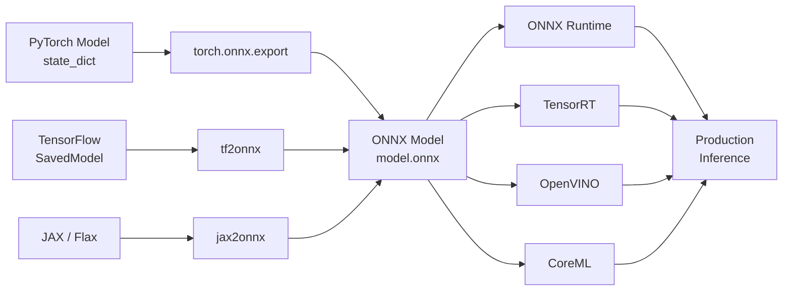

### Why ONNX?

| Benefit | Why it matters to an ML Engineer |
|---------|----------------------------------|
| **Framework independence** | Train in PyTorch, deploy on anything |
| **Graph optimization** | ORT fuses ops, constant-folds, eliminates dead code |
| **Cross-platform** | Windows, Linux, macOS, ARM, mobile |
| **Hardware acceleration** | Single model runs on CPU, CUDA, TensorRT, OpenVINO, CoreML |
| **Quantization** | INT8/FP16 without source code changes |
| **Versioned opsets** | Stable op definitions, backwards compatible |

### ONNX Versioning

| Component | Version Source | Latest Stable |
|-----------|---------------|---------------|
| **IR version** | `ModelProto.ir_version` | 9 |
| **Opset version** | `ModelProto.opset_import` | 21 (ai.onnx) |
| **ONNX Runtime** | `onnxruntime.__version__` | 1.18+ |

```python
import onnxruntime as ort
print(ort.__version__)         # e.g. 1.18.0
print(ort.get_device())        # e.g. "GPU"
print(ort.get_available_providers())  # e.g. ['CUDAExecutionProvider', 'CPUExecutionProvider']
```

---

## 2. ONNX IR: How a Model is Structured

### 2.1 Protobuf Hierarchy

```
ModelProto
├── ir_version: int
├── producer_name: str           # "pytorch", "pytorch_onnx"
├── producer_version: str
├── graph: GraphProto
│   ├── node: NodeProto[]        # computation ops
│   ├── initializer: TensorProto[]  # weights, biases — stored as raw bytes
│   ├── input: ValueInfoProto[]  # graph inputs (names + shapes)
│   ├── output: ValueInfoProto[] # graph outputs
│   └── value_info: ValueInfoProto[]  # intermediate tensor shapes
│
│   NodeProto
│   ├── input: string[]          # input tensor names
│   ├── output: string[]         # output tensor names
│   ├── op_type: string          # "Gemm", "LayerNormalization", "Softmax", ...
│   ├── domain: string           # "" for standard, "com.microsoft" for contrib
│   └── attribute: AttributeProto[]
│       ├── name: string
│       ├── type: int             # FLOAT, INT, STRING, TENSOR, GRAPH, ...
│       └── value: *              # value depends on type
│
└── opset_import: OperatorSetIdProto[]
    ├── domain: string            # "ai.onnx" or "com.microsoft"
    └── version: int              # 21 for ai.onnx
```

### 2.2 Visual: What a Simple Model Looks Like

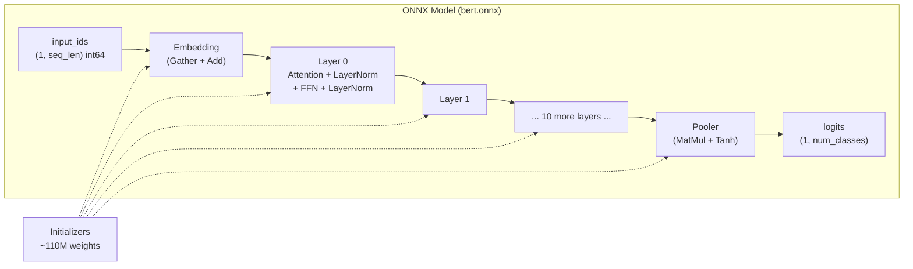

### 2.3 Model Size Breakdown

```
Model file = serialized Protobuf bytes.

Components:
  Initializers (weights):   ~440 MB  (110M × 4 bytes float32)
  Graph definition (nodes): ~1-5 MB
  Shape info (value_info):  ~0.5-2 MB
  
  Total:                    ~445 MB  (for BERT-base)

Compression after quantization:
  INT8:                     ~112 MB  (110M × 1 byte + graph)
  FP16:                     ~222 MB  (110M × 2 bytes + graph)
```

### 2.4 Inspecting a Model

```python
import onnx

model = onnx.load("model.onnx")

# Top-level info
print(f"IR version: {model.ir_version}")          # 9
print(f"Producer: {model.producer_name} {model.producer_version}")
print(f"Opset: {model.opset_import[0].version}")  # 21

# Graph
graph = model.graph
print(f"Nodes: {len(graph.node)}")                # e.g. 824
print(f"Initializers: {len(graph.initializer)}")  # e.g. 214
print(f"Inputs: {len(graph.input)}")              # e.g. 3
print(f"Outputs: {len(graph.output)}")            # e.g. 1

# Input shapes
for inp in graph.input:
    shape = [d.dim_value for d in inp.type.tensor_type.shape.dim]
    print(f"  Input '{inp.name}': {shape}")

# Output shapes
for out in graph.output:
    shape = [d.dim_value for d in out.type.tensor_type.shape.dim]
    print(f"  Output '{out.name}': {shape}")

# First few nodes
for node in graph.node[:5]:
    print(f"{node.op_type:25s} → {node.output[0]}")
    # e.g. "EmbedLayerNormalization" → "embedding_output"
    #       "Attention"              → "attention_output_0"
```

### 2.5 Key ONNX Op Domains

| Domain | Prefix | Purpose | Common Ops |
|--------|--------|---------|------------|
| `ai.onnx` (default) | — | Standard opset | Gemm, Conv, Relu, Softmax, LayerNormalization |
| `ai.onnx.ml` | — | Classic ML | SVM, TreeEnsemble, LabelEncoder |
| `com.microsoft` | `MS` | Microsoft contrib | Attention, EmbedLayerNormalization, FastGelu |
| `com.microsoft.nchwc` | `NCHWc` | Blocked layout optimizations | Conv, Pool |

```python
# Count ops by domain
from collections import Counter
op_domains = Counter((node.op_type, node.domain) for node in graph.node)
for (op, domain), count in op_domains.most_common(10):
    domain_str = domain or "ai.onnx"
    print(f"  {op:30s} [{domain_str}] × {count}")
```

---

## 3. ONNX Runtime Architecture

### 3.1 High-Level Flow

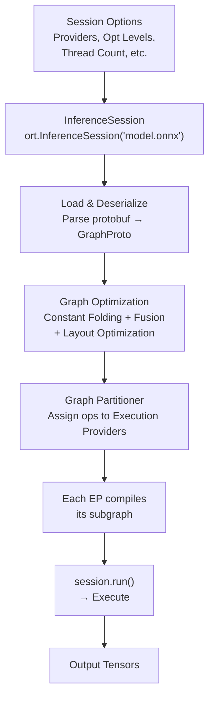

### 3.2 InferenceSession Lifecycle

```python
import onnxruntime as ort
import numpy as np

# 1. Create options
sess_options = ort.SessionOptions()
sess_options.optimized_model_filepath = "optimized.onnx"
sess_options.graph_optimization_level = ort.GraphOptimizationLevel.ORT_ENABLE_ALL
sess_options.intra_op_num_threads = 4
sess_options.inter_op_num_threads = 2
sess_options.enable_profiling = True

# 2. Create session (loads, optimizes, partitions)
session = ort.InferenceSession(
    "model.onnx",
    sess_options,
    providers=['CUDAExecutionProvider', 'CPUExecutionProvider']
)

# 3. Inspect session
for inp in session.get_inputs():
    print(f"Input: {inp.name}  shape={inp.shape}  type={inp.type}")
for out in session.get_outputs():
    print(f"Output: {out.name}  shape={out.shape}  type={out.type}")

# 4. Run inference
inputs = {
    "input_ids": np.random.randint(0, 30000, (1, 128), dtype=np.int64),
    "attention_mask": np.ones((1, 128), dtype=np.int64)
}
outputs = session.run(None, inputs)   # None = return all outputs
# outputs = [np.ndarray, ...] in the order of session.get_outputs()

# 5. Run with selected outputs
logits = session.run(["logits"], inputs)  # only fetch "logits"
```

### 3.3 Session Configuration Reference

```python
sess_options = ort.SessionOptions()

# Optimization
sess_options.graph_optimization_level = ort.GraphOptimizationLevel.ORT_ENABLE_EXTENDED
# Levels: ORT_DISABLE_ALL (0), ORT_ENABLE_BASIC (1),
#         ORT_ENABLE_EXTENDED (2), ORT_ENABLE_ALL (99)

# Threading
sess_options.intra_op_num_threads = 4      # threads per op (e.g. MatMul)
sess_options.inter_op_num_threads = 2      # threads for parallel ops

# Memory
sess_options.enable_cpu_mem_arena = True   # pre-allocate memory pool
sess_options.enable_mem_pattern = True     # reuse memory across runs
sess_options.execution_mode = ort.ExecutionMode.ORT_SEQUENTIAL
# ORT_SEQUENTIAL (default) or ORT_PARALLEL

# IO
sess_options.optimized_model_filepath = "opt_model.onnx"
sess_options.enable_profiling = True

# Logging
sess_options.log_severity_level = 2        # 0=VERBOSE, 1=INFO, 2=WARNING, 3=ERROR
sess_options.log_verbosity_level = 0       # per-logger detail

# Custom
sess_options.add_session_config_entry("session.intra_op.allow_spinning", "0")
```

### 3.4 Execution Providers

```python
# Provider priority order (first = preferred)
session = ort.InferenceSession(
    "model.onnx",
    providers=[
        "CUDAExecutionProvider",      # NVIDIA GPU — fastest if model fits
        "TensorrtExecutionProvider",   # NVIDIA + TensorRT — optimal for fused ops
        "OpenVINOExecutionProvider",   # Intel CPU/GPU/VPU
        "CoreMLExecutionProvider",     # Apple Silicon
        "CPUExecutionProvider",        # Fallback — runs everything
    ],
    provider_options=[                 # options per provider (same order)
        {"device_id": 0, "gpu_mem_limit": 6 * 1024 * 1024 * 1024},
        {"trt_engine_cache_enable": True, "trt_engine_cache_path": "./cache"},
        {},
        {},
        {},
    ]
)

# Available providers for this build
print(ort.get_available_providers())
```

---

## Part II — Model Conversion (PyTorch → ONNX)

---

## 4. torch.onnx.export — The Complete Guide

### 4.1 Basic Export

```python
import torch
import torch.onnx

model = BertModel.from_pretrained("bert-base-uncased")
model.eval()

# Dummy input (shape + dtype that models sees in production)
dummy_input = torch.randint(0, 30000, (1, 128))  # (batch, seq_len)
dummy_mask = torch.ones((1, 128), dtype=torch.long)

torch.onnx.export(
    model,                           # model to export
    (dummy_input, dummy_mask),       # tuple of inputs (or dict)
    "bert.onnx",                     # output file
    input_names=["input_ids", "attention_mask"],
    output_names=["logits"],
    dynamic_axes={
        "input_ids": {0: "batch", 1: "seq_len"},
        "attention_mask": {0: "batch", 1: "seq_len"},
        "logits": {0: "batch"},
    },
    opset_version=18,                # target opset
    do_constant_folding=True,        # fold constants before export
    export_params=True,              # include trained weights
    verbose=True,                    # print exported ops
)
```

### 4.2 Export Modes

| Mode | How it works | Pros | Cons |
|------|-------------|------|------|
| **TorchScript tracing** (default) | Run model with dummy input, trace all operations | Simple, fast | Misses control flow; only follows traced path |
| **TorchScript scripting** | `torch.jit.script(model)` | Captures control flow | May fail on dynamic Python constructs |
| **Dynamo export** (new) | `torch.onnx.export(dynamo=True)` | Handles dynamic shapes better | Newer, less mature |

```python
# TorchScript tracing
torch.onnx.export(model, dummy_input, "model.onnx")  # default

# Dynamo export (ONNX export via TorchDynamo)
torch.onnx.export(
    model, dummy_input, "model_dynamo.onnx",
    dynamo=True,                    # use Dynamo backend
    opset_version=18,
)
```

### 4.3 Setting Up Dynamic Axes

**The single most common source of export failures.** Always test with your production shapes.

```python
dynamic_axes = {
    "input_ids": {0: "batch_size", 1: "sequence_length"},
    "attention_mask": {0: "batch_size", 1: "sequence_length"},
    "token_type_ids": {0: "batch_size", 1: "sequence_length"},
    "logits": {0: "batch_size", 1: "sequence_length"},
}

# Test with different shapes after export
test_model = onnxruntime.InferenceSession("model.onnx")
for batch, seq in [(1, 64), (4, 128), (8, 256)]:
    test_input = np.random.randint(0, 30000, (batch, seq)).astype(np.int64)
    test_mask = np.ones((batch, seq), dtype=np.int64)
    outputs = test_model.run(None, {
        "input_ids": test_input,
        "attention_mask": test_mask,
    })
    print(f"batch={batch}, seq={seq} → output shape={outputs[0].shape}")
```

### 4.4 Custom Ops / Symbolic Override

When an op isn't natively supported, register a symbolic override:

```python
from torch.onnx import register_custom_op_symbolic

# Before export, register a custom symbolic for an unsupported op
register_custom_op_symbolic("::gelu", lambda g, x: g.op("com.microsoft::Gelu", x), 1)

# Or disable certain ops:
torch.onnx.symbolic_helper._set_op_broken("aten::native_dropout", 1)
```

### 4.5 Export Checklist

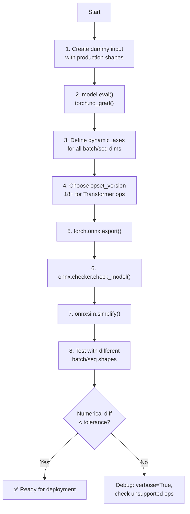

---

## 5. Dynamic Axes & Variable Shapes

### 5.1 Static vs Dynamic

```
Static shapes:
  input_ids: (1, 128)  ← always batch=1, seq=128
  → ORT pre-allocates fixed buffers, max throughput

Dynamic shapes:
  input_ids: (batch, seq_len)  ← variable per request
  → ORT reallocates, more flexible, slightly slower
  
Hybrid:
  input_ids: (batch, 128)  ← fixed seq, variable batch
  → Best of both: dynamic batch, fixed memory pattern
```

### 5.2 How Dynamic Axes Work in the Graph

```python
# Before export (static):   input_ids shape = (1, 128)
# After export (dynamic):   input_ids shape = ("batch", "seq_len")

# Check the exported model's input shapes
model = onnx.load("model.onnx")
for inp in model.graph.input:
    shape = []
    for dim in inp.type.tensor_type.shape.dim:
        if dim.dim_param:  # dynamic dimension
            shape.append(dim.dim_param)  # e.g. "batch"
        else:
            shape.append(dim.dim_value)  # e.g. 128
    print(f"{inp.name}: {shape}")
```

### 5.3 Dynamic Shapes and ORT Performance

```
Dynamic shapes cause:
1. Memory reallocation on each run (slower)
2. Some optimizations skipped (shape-dependent fusions)
3. CUDA EP may use less optimized kernels

Mitigation strategies:
- Pad to nearest power of 2 (64, 128, 256)
- Use fixed seq_len, dynamic batch
- Warm up with expected shapes before production
```

```python
# Warmup: run with representative shapes
warmup_shapes = [(1, 128), (4, 128), (8, 128)]
for batch, seq in warmup_shapes:
    session.run(None, {
        "input_ids": np.zeros((batch, seq), dtype=np.int64),
        "attention_mask": np.ones((batch, seq), dtype=np.int64),
    })
```

---

## 6. Common Conversion Pitfalls

### 6.1 Error Reference Table

| Error Message | Root Cause | Fix |
|--------------|------------|-----|
| `RuntimeError: Exporting the operator ... to ONNX opset ... is not supported` | Unsupported PyTorch op | Use newer opset, register symbolic, or rewrite model to avoid this op |
| `Unsupported: ONNX export of Slice with non-zero axis` | Dynamic slicing with non-zero start | Use `x[:, :, start:end]` instead of `x[:, :, start:]` |
| `RuntimeError: input.size() must be fixed` | `torch.onnx.export` traced fixed shape | Ensure `dynamic_axes` is correctly set |
| `ONNX BackendChecker: Unexpected tuple size` | Model returns Python tuple | Wrap with `torch.cat` or return single tensor |
| `RuntimeError: dimension cannot be negative` | Dynamic `view`/`reshape` with inferred dim | Use `reshape` with explicit dims or `torch.onnx.symbolic_helper._export_from_list()` |
| `ShapeInferenceError: Input 1 of node 'Concat' has shape ... but expected ...` | Shape mismatch from dynamic ops | Add `onnx.shape_inference.infer_shapes()` to debug |
| `Segfault / OOM during export` | Model too large for tracing | Increase memory, use `export_params=True` with chunking |

### 6.2 The `if` Statement Problem

TorchScript tracing only follows the **executed** branch. The other branch is never exported.

```python
# BAD: Control flow is lost during tracing
def forward(self, x):
    if x.shape[0] > 1:
        return self.branch_a(x)
    else:
        return self.branch_b(x)

# GOOD: Use masking instead of control flow
def forward(self, x):
    mask = (x.shape[0] > 1).float()
    return mask * self.branch_a(x) + (1 - mask) * self.branch_b(x)

# GOOD: Use scripting
scripted = torch.jit.script(model)
torch.onnx.export(scripted, dummy_input, "model.onnx")
```

### 6.3 The `None` Input Problem

ONNX doesn't support optional inputs in the standard opset.

```python
# BAD: Model forward takes optional inputs
def forward(self, x, mask=None, token_type_ids=None):
    if token_type_ids is None:
        token_type_ids = torch.zeros_like(x)
    ...

# GOOD: Always provide dummy tensors
dummy_input = (
    torch.randint(0, 30000, (1, 128)),
    torch.ones((1, 128), dtype=torch.long),
    torch.zeros((1, 128), dtype=torch.long),  # always supply
)

# GOOD: Separate model that always expects 3 inputs
```

### 6.4 Debugging with torch.onnx.export(verbose=True)

```python
# Verbose export prints every op being converted
torch.onnx.export(
    model, dummy_input, "model.onnx",
    verbose=True,  # ← watch this output
)

# Look for:
#   * 0 ops converted after a certain line → unsupported op
#   * "WARNING:" lines
#   * Unexpected shapes

# Better: catch warnings
import warnings
warnings.filterwarnings("error", category=torch.onnx.errors.OnnxExporterWarning)
```

---

## 7. Model Validation & Simplification

### 7.1 ONNX Checker

```python
import onnx

model = onnx.load("model.onnx")

# Full structural check
try:
    onnx.checker.check_model(model)
    print("✅ Model is valid")
except onnx.checker.ValidationError as e:
    print(f"❌ Invalid: {e}")

# Specific checks
onnx.checker.check_model(model, full_check=True)  # strict mode
```

### 7.2 Shape Inference

```python
from onnx import shape_inference

# Run shape inference to add intermediate tensor shapes
inferred = shape_inference.infer_shapes(model)
onnx.save(inferred, "model_inferred.onnx")

# Compare before and after
print(f"Before: {len(model.graph.value_info)} value_info entries")
# Before: 0 (tracing may strip shape info)
print(f"After: {len(inferred.graph.value_info)} value_info entries")
# After: 824 (all intermediate tensor shapes known)

# ORT can also do this:
session = ort.InferenceSession("model.onnx")  # runs shape inference internally
```

### 7.3 Model Simplification with onnx-simplifier

Eliminates redundant ops (identity, transpose, reshape chains, dead code).

```bash
pip install onnx-simplifier
```

```python
import onnxsim

# Simplify
model_simp, check = onnxsim.simplify("model.onnx")
onnx.save(model_simp, "model_simplified.onnx")

# Verify numerical correctness
print(f"Simplification valid: {check}")
# If check=False, the simplified model produced different outputs

# Compare size
import os
orig_size = os.path.getsize("model.onnx") / 1e6
simp_size = os.path.getsize("model_simplified.onnx") / 1e6
print(f"Original: {orig_size:.1f} MB → Simplified: {simp_size:.1f} MB")
```

### 7.4 Numerical Verification

```python
import onnxruntime as ort
import numpy as np
import torch

# Run both models on same input
def verify_numerical(pytorch_model, onnx_path, dummy_inputs, atol=1e-4):
    # PyTorch
    with torch.no_grad():
        torch_outputs = pytorch_model(*dummy_inputs)
    if isinstance(torch_outputs, torch.Tensor):
        torch_outputs = [torch_outputs]
    torch_outputs = [t.numpy() for t in torch_outputs]

    # ONNX
    session = ort.InferenceSession(onnx_path)
    onnx_inputs = {
        name: t.numpy() for name, t in zip(
            [inp.name for inp in session.get_inputs()],
            dummy_inputs
        )
    }
    onnx_outputs = session.run(None, onnx_inputs)

    # Compare
    for i, (torch_out, onnx_out) in enumerate(zip(torch_outputs, onnx_outputs)):
        diff = np.max(np.abs(torch_out - onnx_out))
        status = "✅" if diff < atol else "❌"
        print(f"{status} Output {i}: max_diff={diff:.6f}  "
              f"torch_shape={torch_out.shape}  onnx_shape={onnx_out.shape}")

# Run
verify_numerical(model, "model.onnx", (dummy_input, dummy_mask))
```

---

## Part III — ONNX Runtime Python API

---

## 8. Session Configuration & Lifecycle

### 8.1 Session Creation Options

```python
import onnxruntime as ort
import psutil

# Production-grade session config
sess_options = ort.SessionOptions()

# Memory
sess_options.enable_cpu_mem_arena = True     # pre-allocate memory arena
sess_options.enable_mem_pattern = True       # reuse memory across runs

# Threads = number of physical cores
num_cores = psutil.cpu_count(logical=False)
sess_options.intra_op_num_threads = num_cores   # for parallel ops
sess_options.inter_op_num_threads = 2           # for op-level parallelism

# Optimization
sess_options.graph_optimization_level = ort.GraphOptimizationLevel.ORT_ENABLE_ALL
sess_options.optimized_model_filepath = "model_opt.onnx"

# Logging
sess_options.log_severity_level = 2  # WARNING

# Create
session = ort.InferenceSession(
    "model.onnx",
    sess_options,
    providers=ort.get_available_providers()
)
```

### 8.2 Session Methods Reference

```python
# Create from file
session = ort.InferenceSession("model.onnx")

# Create from bytes
with open("model.onnx", "rb") as f:
    model_bytes = f.read()
session = ort.InferenceSession(model_bytes)

# Create from path string
session = ort.InferenceSession(model_bytes, providers=["CPUExecutionProvider"])

# Session metadata
print(session.get_modelmeta().producer_name)       # "pytorch"
print(session.get_modelmeta().version)             # 0
print(session.get_modelmeta().custom_metadata_map) # {"key": "value"}

# Input/Output metadata
for inp in session.get_inputs():
    print(f"{inp.name}: {inp.shape} {inp.type}")
for out in session.get_outputs():
    print(f"{out.name}: {out.shape} {out.type}")

# Execution provider info
print(session.get_providers())        # e.g. ['CUDAExecutionProvider', ...]
print(session.get_provider_options()) # dict of provider configs
```

### 8.3 Running Inference

```python
# Run all outputs
outputs = session.run(None, input_dict)

# Run specific outputs (faster if you need only some)
logits = session.run(["logits"], input_dict)  # only compute "logits"

# Run with output names in specific order
outputs = session.run(["logits", "hidden_states"], input_dict)

# Run with feed dict (string keys)
outputs = session.run(None, {"input_ids": arr1, "attention_mask": arr2})

# Pre-allocate output buffer
output_tensor = np.zeros((1, 128), dtype=np.float32)
outputs = session.run(
    None,
    input_dict,
    [ort.OrtValue.ortvalue_from_numpy(output_tensor)]  # pre-allocated outputs
)
```

---

## 9. Execution Providers

### 9.1 Provider Comparison

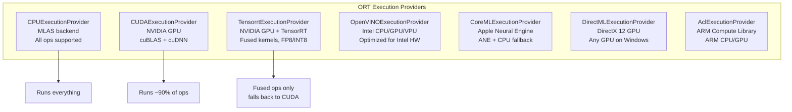

### 9.2 Provider Performance Guide

| Provider | Device | Best For | Warmup Needed? | Batch Size |
|----------|--------|----------|----------------|------------|
| `CPUExecutionProvider` | Any CPU | Small models, fallback | No | 1-4 |
| `CUDAExecutionProvider` | NVIDIA GPU | General GPU inference | Yes | 1-64 |
| `TensorrtExecutionProvider` | NVIDIA GPU | Max throughput, fused ops | Yes (engine build) | 1-128 |
| `OpenVINOExecutionProvider` | Intel CPU/GPU | Intel hardware deployment | No | 1-32 |
| `CoreMLExecutionProvider` | Apple Silicon | Mac deployment | No | 1-8 |
| `DirectMLExecutionProvider` | Any DirectX GPU | Windows deployment | No | 1-16 |

### 9.3 Provider Selection Strategies

```python
# Strategy 1: Let ORT decide (first available in list)
session = ort.InferenceSession(
    "model.onnx",
    providers=ort.get_available_providers()  # auto-prioritize
)

# Strategy 2: Explicit priority with fallback
session = ort.InferenceSession("model.onnx", providers=[
    "TensorrtExecutionProvider",
    "CUDAExecutionProvider",
    "CPUExecutionProvider",  # always last
])

# Strategy 3: Check availability first
providers = []
if "CUDAExecutionProvider" in ort.get_available_providers():
    providers.append("CUDAExecutionProvider")
providers.append("CPUExecutionProvider")
session = ort.InferenceSession("model.onnx", providers=providers)

# Strategy 4: Provider options per provider
session = ort.InferenceSession("model.onnx", providers=[
    ("CUDAExecutionProvider", {
        "device_id": "0",
        "gpu_mem_limit": str(4 * 1024 * 1024 * 1024),  # 4 GB
        "arena_extend_strategy": "kNextPowerOfTwo",
    }),
    ("CPUExecutionProvider", {}),
])
```

### 9.4 TensorRT Integration

```python
# TensorRT EP options
trt_options = {
    "trt_engine_cache_enable": True,       # cache compiled engines
    "trt_engine_cache_path": "./trt_cache",# where to save
    "trt_fp16_enable": True,               # use FP16 if supported
    "trt_int8_enable": True,               # use INT8 (needs calibration)
    "trt_int8_calibration_table": "./calibration.table",
    "trt_max_workspace_size": 4 * 1024 * 1024 * 1024,  # 4 GB
    "trt_dump_subgraphs": True,            # debug: dump TRT subgraphs
}

session = ort.InferenceSession("model.onnx", providers=[
    ("TensorrtExecutionProvider", trt_options),
    "CUDAExecutionProvider",
    "CPUExecutionProvider",
])

# First run builds TensorRT engine (slow)
# Subsequent runs load cached engine (fast)
```

### 9.5 Provider-Specific Ops

Not all ops run on every provider. ORT handles this via graph partitioning:

```python
# See which ops fall back to CPU
session = ort.InferenceSession("model.onnx", providers=[
    "CUDAExecutionProvider",
    "CPUExecutionProvider",
])

# Graph partition info (ORT 1.17+)
for partition in session.get_modelmeta().custom_metadata_map:
    if "partition" in partition.lower():
        print(f"Partition info: {partition}")

# Debug: force all ops to be logged
sess_options.log_severity_level = 0  # VERBOSE
sess_options.log_verbosity_level = 1
# Look for: "Compiling kernel ..." and "Fallback to CPU for ..."
```

---

## 10. I/O Binding & Memory Management

### 10.1 Why I/O Binding?

By default, ORT copies input/output tensors between Python and device memory. I/O binding eliminates these copies.

```python
# Default: copies happen
outputs = session.run(None, {"input": numpy_array})

# With I/O binding: zero-copy
io_binding = session.io_binding()
io_binding.bind_cpu_input("input", numpy_array)
io_binding.bind_output("output")
session.run_with_iobinding(io_binding)
result = io_binding.get_outputs()[0].numpy()
```

### 10.2 Binding to CUDA

```python
import onnxruntime as ort
import numpy as np
from onnxruntime.capi import _pybind_state as C

session = ort.InferenceSession("model.onnx", providers=["CUDAExecutionProvider"])

io_binding = session.io_binding()

# Bind input: numpy → CUDA (zero-copy from PyTorch)
io_binding.bind_input(
    name="input_ids",
    device_type="cuda",
    device_id=0,
    element_type=np.int64,
    shape=(1, 128),
    buffer_ptr=torch_tensor.data_ptr()  # PyTorch tensor pointer
)

# Bind output
io_binding.bind_output(
    name="logits",
    device_type="cuda",
    device_id=0
)

# Run with I/O binding
session.run_with_iobinding(io_binding)

# Get output
ort_output = io_binding.get_outputs()[0]

# Copy to numpy if needed
result = ort_output.numpy()

# Or get as OrtValue (zero-copy)
ort_value = io_binding.get_outputs()[0]
```

### 10.3 OrtValue API

```python
# Create OrtValue from numpy
ort_val = ort.OrtValue.ortvalue_from_numpy(numpy_array)
print(ort_val.shape(), ort_val.data_type(), ort_val.device_name())

# Create OrtValue from PyTorch tensor (CUDA)
import torch
tensor = torch.zeros((1, 128), device="cuda")
ort_val = ort.OrtValue.ortvalue_from_numpy(tensor, device_type="cuda", device_id=0)

# Use OrtValue in run
outputs = session.run(None, {"input": ort_val})

# Or with I/O binding
io_binding = session.io_binding()
io_binding.bind_ortvalue_input("input", ort_val)
io_binding.bind_output("output")
session.run_with_iobinding(io_binding)
```

### 10.4 Memory Arena Tuning

```python
# CPU arena
sess_options.enable_cpu_mem_arena = True  # default: True
# Pre-allocates a large memory pool on CPU
# Reduces malloc overhead at cost of peak memory

# CUDA arena (via provider options)
cuda_options = {
    "gpu_mem_limit": str(6 * 1024 * 1024 * 1024),   # 6 GB limit
    "arena_extend_strategy": "kNextPowerOfTwo",       # growth strategy
    "cudnn_conv_algo_search": "EXHAUSTIVE",           # best conv algo
    "do_copy_in_default_stream": "1",                 # async copies
}

# Memory pattern
sess_options.enable_mem_pattern = True
# Reuses memory allocations across runs with same shapes
# Disable if shapes vary widely between runs
```

---

## 11. Multi-Session & Batching

### 11.1 Multiple Sessions

```python
# Load multiple models in one process
session_a = ort.InferenceSession("bert.onnx")
session_b = ort.InferenceSession("resnet.onnx")

# Each session is independent, thread-safe for run()
# Safe to call in parallel threads:

import concurrent.futures

def run_model(session, inputs):
    return session.run(None, inputs)

with concurrent.futures.ThreadPoolExecutor(max_workers=4) as pool:
    f1 = pool.submit(run_model, session_a, inputs_a)
    f2 = pool.submit(run_model, session_b, inputs_b)
    result_a = f1.result()
    result_b = f2.result()
```

### 11.2 Dynamic Batching

```python
# Pad to batch size with attention mask
def pad_batch(inputs, max_batch=32):
    batch = len(inputs)
    padded = np.zeros((max_batch, 128), dtype=np.int64)
    mask = np.zeros((max_batch, 128), dtype=np.int64)
    for i, inp in enumerate(inputs):
        padded[i] = inp
        mask[i] = 1
    return padded, mask, batch

# Run padded batch
padded, mask, real_batch = pad_batch(batch_inputs)
outputs = session.run(None, {"input_ids": padded, "attention_mask": mask})

# Extract real outputs
real_outputs = outputs[0][:real_batch]
```

### 11.3 Throughput vs Latency Trade-off

```python
# Latency mode: batch=1, sequential
for input in inputs:
    output = session.run(None, input)

# Throughput mode: batch=N, parallel
batch = np.stack(inputs[:32])
outputs = session.run(None, {"input": batch})

# Benchmark
import time

def benchmark(session, input_fn, batch_sizes=[1, 4, 16, 32, 64]):
    for batch in batch_sizes:
        data = input_fn(batch)
        
        # Warmup
        for _ in range(10):
            session.run(None, data)
        
        # Measure
        start = time.perf_counter()
        for _ in range(100):
            session.run(None, data)
        elapsed = time.perf_counter() - start
        
        latency = elapsed / 100 * 1000  # ms per inference
        throughput = batch * 100 / elapsed  # samples/sec
        print(f"batch={batch:3d}  latency={latency:6.2f}ms  "
              f"throughput={throughput:8.0f} samples/s")
```

---

## Part IV — Graph Optimization

---

## 12. ORT Optimization Pass Pipeline

### 12.1 Optimization Levels

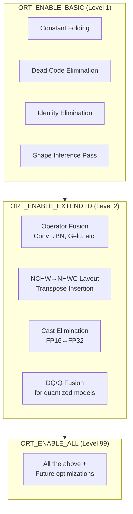

### 12.2 What Each Pass Does

```python
# Constant Folding
#   Mul(3, Add(x, 0)) → Mul(3, x)   →   3*x
#   Reshape(x, [4, 32]) with static dims evaluated at load time
#   → Smaller graph, fewer runtime ops

# Dead Code Elimination
#   Removes nodes whose outputs are never used
#   Common after constant folding (folded nodes become dead)

# Identity Elimination
#   Replaces Identity(x) nodes with direct x references
#   (common from tracing exports)

# Shape Inference
#   Propagates shapes forward through the graph
#   Enables subsequent passes that depend on known shapes
```

### 12.3 Controlling Optimization

```python
# Option A: Set level
sess_options.graph_optimization_level = ort.GraphOptimizationLevel.ORT_ENABLE_EXTENDED

# Option B: Disable all (debugging)
sess_options.graph_optimization_level = ort.GraphOptimizationLevel.ORT_DISABLE_ALL

# Option C: Enable all
sess_options.graph_optimization_level = ort.GraphOptimizationLevel.ORT_ENABLE_ALL

# Save optimized model to inspect
sess_options.optimized_model_filepath = "model_opt.onnx"

session = ort.InferenceSession("model.onnx", sess_options)
```

### 12.4 Inspecting the Optimized Graph

```python
# Load the saved optimized model
opt_model = onnx.load("model_opt.onnx")

# Compare node count
orig_model = onnx.load("model.onnx")
print(f"Nodes: {len(orig_model.graph.node)} → {len(opt_model.graph.node)}")
# e.g. 824 → 672 (18% reduction)

# See what ops survived
from collections import Counter
orig_ops = Counter(n.op_type for n in orig_model.graph.node)
opt_ops = Counter(n.op_type for n in opt_model.graph.node)

for op in sorted(set(list(orig_ops.keys()) + list(opt_ops.keys()))):
    before = orig_ops.get(op, 0)
    after = opt_ops.get(op, 0)
    if before != after:
        print(f"  {op:30s}: {before:4d} → {after:4d}")
```

---

## 13. Operator Fusion & Layout Optimization

### 13.1 Key Fusions

| Fused Op | Composed From | Benefit |
|----------|--------------|---------|
| `Gelu` | `Div → Erf → Add → Mul → Mul` | Single kernel, no intermediate memory |
| `FastGelu` | `Gelu with approximation` | Faster than exact Gelu, minimal accuracy loss |
| `BiasGelu` | `Add → Gelu` | Fuse bias into Gelu kernel |
| `LayerNormalization` | `ReduceMean → Sub → Pow → ReduceMean → Add → Sqrt → Div → Mul → Add` | Single kernel, 7 ops → 1 |
| `SkipLayerNormalization` | `Add → LayerNormalization` | Fuse residual add |
| `EmbedLayerNormalization` | `Gather → Gather → Add → LayerNormalization → Dropout` | Fuse entire embedding layer |
| `Attention` | `MatMul → Add → Reshape → Transpose → ... → Softmax → MatMul` | Fuse entire self-attention |
| `Conv+BN` | `Conv → BatchNormalization` | Absorb BN into Conv weights at export |
| `MatMul+BiasAdd` (Gemm) | `MatMul → Add` | Single kernel (Gemm) |

### 13.2 Checking Which Fusions Occurred

```python
model = onnx.load("model_opt.onnx")
fused_ops = {"Attention", "Gelu", "FastGelu", "BiasGelu",
             "LayerNormalization", "SkipLayerNormalization",
             "EmbedLayerNormalization"}

found = set()
for node in model.graph.node:
    if node.op_type in fused_ops:
        found.add(node.op_type)
        if node.domain:
            print(f"  {node.op_type} [{node.domain}]")

if "Attention" in found:
    print("✅ Self-attention fused into single op")
if "Gelu" in found or "FastGelu" in found:
    print("✅ Activation fused")
if "EmbedLayerNormalization" in found:
    print("✅ Embedding layer fused")
```

### 13.3 Layout Optimization: NHWC vs NCHW

```
NCHW (default):  batch × channels × height × width
NHWC (optimized): batch × height × width × channels

ONNX default: NCHW
cuDNN/TensorRT preferred: NHWC (faster for conv)
ORT layout optimizer inserts Transpose ops to convert

When it helps:
  - CNN models (ResNet, EfficientNet, YOLO)
  - Models with many Conv ops
  - NVIDIA GPU deployment

When it doesn't:
  - Transformer models (no spatial conv)
  - CPU-only deployment
```

---

## 14. External Graph Simplification Tools

### 14.1 onnx-simplifier

Removes unnecessary ops and simplifies the graph.

```python
import onnxsim
import onnx

# Basic simplification
model, check = onnxsim.simplify("model.onnx")
onnx.save(model, "model_simple.onnx")

# With dynamic shapes preserved
model, check = onnxsim.simplify(
    "model.onnx",
    dynamic_input_shape=True,  # preserve dynamic axes
    input_shapes={             # provide example shapes
        "input_ids": (1, 128),
        "attention_mask": (1, 128),
    }
)

# Skip shape inference if already done
model, check = onnxsim.simplify(
    "model.onnx",
    skip_shape_inference=True,
)

print(f"Simplification valid: {check}")
```

### 14.2 onnxoptimizer

```bash
pip install onnxoptimizer
```

```python
import onnxoptimizer

model = onnx.load("model.onnx")
optimized = onnxoptimizer.optimize(model)

# Or with specific passes
passes = [
    "eliminate_identity",
    "eliminate_deadend",
    "eliminate_nop_dropout",
    "eliminate_nop_cast",
    "eliminate_nop_pad",
    "fuse_consecutive_squeezes",
    "fuse_consecutive_transposes",
    "fuse_transpose_into_gemm",
    "fuse_matmul_add_bias_into_gemm",
]
optimized = onnxoptimizer.optimize(model, passes)

print(f"Nodes: {len(model.graph.node)} → {len(optimized.graph.node)}")
```

### 14.3 onnx_graphsurgeon (NVIDIA)

Part of TensorRT — inspect and manipulate ONNX graphs.

```python
import onnx_graphsurgeon as gs

graph = gs.import_onnx(onnx.load("model.onnx"))

# Find all nodes
for node in graph.nodes:
    print(f"{node.name or 'unnamed'}: {node.op}  "
          f"inputs={[i.name for i in node.inputs]}")

# Remove a specific op
tensors = graph.tensors()
old_node = [n for n in graph.nodes if n.op == "Identity"]
for n in old_node:
    n.outputs[0].replace(n.inputs[0])  # skip identity
    graph.nodes.remove(n)

graph.cleanup().toposort()

# Export back
onnx.save(gs.export_onnx(graph), "model_cleaned.onnx")
```

---

## Part V — Quantization

---

## 15. Quantization Concepts in ONNX

### 15.1 How Quantization is Represented

ONNX uses a **DQ/Q (DequantizeLinear → Op → QuantizeLinear)** pattern:

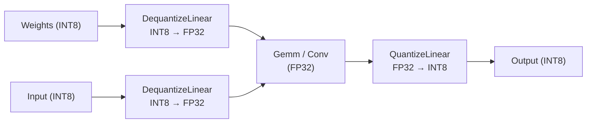

For **quantized ops** (TensorRT, QNN), the pattern simplifies:

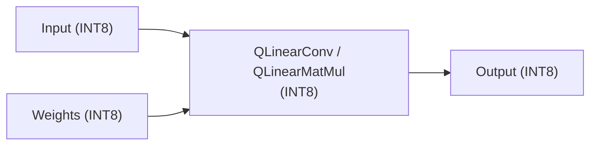

### 15.2 QuantizeLinear / DequantizeLinear

```
QuantizeLinear(input, scale, zero_point) = clamp(round(input / scale) + zero_point)

DequantizeLinear(input, scale, zero_point) = (input - zero_point) × scale
```

```python
# What these ops look like in the graph:
# QuantizeLinear:
#   input:  float32 tensor
#   scale:  float32 scalar (or per-channel)
#   zero_point: int8/uint8 scalar
#   output: int8/uint8 tensor

# DequantizeLinear:
#   input:  int8/uint8 tensor
#   scale:  float32 scalar (or per-channel)
#   zero_point: int8/uint8 scalar
#   output: float32 tensor
```

### 15.3 Quantization Approaches

| Approach | Calibration | Pre-compute | Speedup | Accuracy |
|----------|------------|-------------|---------|----------|
| **Dynamic** | None (at runtime) | No | 1.5-2× | Good |
| **Static** | Representative dataset | Scale/ZP per tensor | 2-3× | Very Good |
| **QAT** | Training (+ fake quantization) | Weights during training | 2-4× | Best |

### 15.4 Memory Savings

```
Model: BERT-base (110M params)

Precision   Memory    Speedup (GPU)   Accuracy (SQuAD F1)
FP32        440 MB    1×              88.5
FP16        220 MB    1.5-2×          88.4
INT8 dynamic 110 MB   2-3×            87.8
INT8 static  110 MB   2-4×            88.1
INT8 QAT     110 MB   2-4×            88.3

Weights: FP32 → INT8 = 4× compression
Activations: remain FP32 in dynamic, INT8 in static
```

---

## 16. Dynamic Quantization

### 16.1 What Gets Quantized

```
Dynamic quantization:
  ✓ Weights: INT8 (quantized at model load)
  ✓ Activations: FP32 (quantized per-inference)
  ✓ Bias: FP32 (kept in FP32 for precision)

Only Linear/MatMul and Embedding ops are quantized.
Most common for: NLP models (BERT, GPT, Llama on CPU)
```

### 16.2 Usage

```python
from onnxruntime.quantization import quantize_dynamic, QuantType

# Basic dynamic quantization
quantized_model = quantize_dynamic(
    "model.onnx",              # input model
    "model_dynamic.onnx",      # output model
    weight_type=QuantType.QInt8,  # INT8 weights
)

# With op types to quantize (default: all supported)
quantized_model = quantize_dynamic(
    "model.onnx",
    "model_dynamic.onnx",
    op_types_to_quantize=["MatMul", "Add"],  # only these ops
    per_channel=True,         # per-channel quantization
)

# Compare size
import os
orig = os.path.getsize("model.onnx") / 1e6
quant = os.path.getsize("model_dynamic.onnx") / 1e6
print(f"Original: {orig:.0f} MB → Dynamic INT8: {quant:.0f} MB")
print(f"Compression: {orig/quant:.1f}×")
```

### 16.3 Performance on CPU

```python
# Benchmark dynamic quantization on CPU
import time

def benchmark_ort(model_path, inputs, n_runs=100):
    session = ort.InferenceSession(model_path, providers=["CPUExecutionProvider"])
    
    # Warmup
    for _ in range(10):
        session.run(None, inputs)
    
    # Measure
    start = time.perf_counter()
    for _ in range(n_runs):
        session.run(None, inputs)
    elapsed = time.perf_counter() - start
    
    latency = elapsed / n_runs * 1000
    return latency

lat_fp32 = benchmark_ort("model.onnx", inputs)
lat_int8 = benchmark_ort("model_dynamic.onnx", inputs)

print(f"FP32: {lat_fp32:.1f}ms  INT8: {lat_int8:.1f}ms  "
      f"Speedup: {lat_fp32/lat_int8:.1f}×")
```

---

## 17. Static Quantization

### 17.1 Calibration

Static quantization needs a **calibration dataset** to determine activation scales.

```python
from onnxruntime.quantization import quantize_static, QuantType
from onnxruntime.quantization import CalibrationMethod

# Calibration data loader
class CalibrationDataReader:
    def __init__(self, dataset, batch_size=1):
        self.dataset = dataset
        self.batch_size = batch_size
        self.idx = 0
    
    def get_next(self):
        if self.idx >= len(self.dataset):
            return None
        batch = self.dataset[self.idx]
        self.idx += 1
        return {
            "input_ids": np.array([batch["input_ids"]], dtype=np.int64),
            "attention_mask": np.array([batch["attention_mask"]], dtype=np.int64),
        }
    
    def rewind(self):
        self.idx = 0

# Create calibrator and quantize
calib_reader = CalibrationDataReader(calibration_dataset)

quantized_model = quantize_static(
    "model.onnx",
    "model_static.onnx",
    calibration_data_reader=calib_reader,
    quant_format=QuantFormat.QDQ,  # DQ/Q pattern (default)
    per_channel=True,
    activation_type=QuantType.QInt8,
    weight_type=QuantType.QInt8,
    calibrate_method=CalibrationMethod.MinMax,  # or Entropy, Percentile
    extra_options={
        "ActivationSymmetric": True,
        "WeightSymmetric": True,
        "EnableSubgraph": True,
    }
)
```

### 17.2 Calibration Methods Comparison

| Method | Description | Best For | Pros | Cons |
|--------|-------------|----------|------|------|
| `MinMax` | Scale = max(abs(tensor)) | Simple models | Fast, simple | Outliers dominate |
| `Entropy` (KL divergence) | Minimize KL divergence between FP32 and INT8 | NLP, transformers | Better for non-uniform | Slower calibration |
| `Percentile` | Scale = percentile value | Outlier-prone models | Ignores extreme outliers | Need tuning percentile |

### 17.3 Per-Channel vs Per-Tensor

```
Per-tensor quantization:
  One scale and zero_point for the entire weight tensor
  Compression: 4× (same for all)
  Accuracy: Lower (different channels have different ranges)

Per-channel quantization:
  One scale and zero_point per output channel
  Compression: 4× (stored per channel)
  Accuracy: Higher (captures per-channel distribution)
  Overhead: Minimal (extra scales in graph)

Recommended: Use per_channel=True for weights
```

### 17.4 Static Quantization Pipeline

```python
from onnxruntime.quantization import (
    quantize_static,
    QuantFormat,
    QuantType,
    CalibrationMethod,
    create_calibrator,
)
import numpy as np

# Full pipeline
def static_quantize_pipeline(model_path, output_path, calib_loader):
    # Step 1: Create calibrator
    calibrator = create_calibrator(
        model_path,
        op_types_to_calibrate=["MatMul", "Add", "Conv"],
        augmented_model_path="calib_model.onnx",  # augmented with QDQ nodes
        calibrate_method=CalibrationMethod.Entropy,
    )
    
    # Step 2: Collect statistics
    for data in calib_loader:
        calibrator.collect_data(data)
    
    # Step 3: Compute scales (Entropy/MinMax/Percentile)
    tensors_range = calibrator.compute_range()
    
    # Step 4: Quantize
    quantize_static(
        model_path,
        output_path,
        calibration_data_reader=calib_loader,
        quant_format=QuantFormat.QDQ,
        per_channel=True,
        activation_type=QuantType.QInt8,
        weight_type=QuantType.QInt8,
    )
    
    return output_path
```

---

## 18. Weight-Only Quantization for LLMs

### 18.1 MatMulNBits (INT4/INT8)

For large language models where activation quantization is too costly, ORT supports weight-only quantization via `MatMulNBits`.

```python
from onnxruntime.quantization import quantize_dynamic
from onnxruntime.quantization.matmul_quantizer import quantize_matmul_4bits

# INT4 weight-only quantization
quantize_matmul_4bits(
    "llm_model.onnx",
    "llm_model_int4.onnx",
    block_size=32,          # group size for quantization
    nodes_to_quantize=None, # None = all MatMul nodes
)

# Result: weights stored as 4-bit (packed 2 weights per byte)
# Memory: 110M params × 0.5 bytes = 55 MB (vs 440 MB FP32)
```

### 18.2 Memory Savings for LLMs

```
Model        Params   FP32      FP16       INT8       INT4 (4-bit)
Llama-7B     7B       28 GB     14 GB      7 GB       3.5 GB
Llama-13B    13B      52 GB     26 GB      13 GB      6.5 GB
Llama-70B    70B      280 GB    140 GB     70 GB      35 GB
CodeLlama-34B 34B     136 GB    68 GB      34 GB      17 GB
```

### 18.3 Accuracy Impact (Perplexity)

```
Model: Llama-2-7B, WikiText-2 perplexity ↓

Precision   Perplexity
FP32        5.12
FP16        5.12
INT8        5.15
INT4 (g32)  5.28
INT4 (g128) 5.41

Key: Group size matters. Smaller groups = better accuracy,
     but slightly less compression.
```

---

## Part VI — Profiling & Performance

---

## 19. ORT Profiling with Chrome Trace

### 19.1 Enabling Profiling

```python
import onnxruntime as ort

sess_options = ort.SessionOptions()
sess_options.enable_profiling = True      # enables profiler
# sess_options.profile_file_prefix = "ort_profile"  # output prefix

session = ort.InferenceSession("model.onnx", sess_options)

# Run inference (profiling data collected)
for _ in range(100):
    session.run(None, inputs)

# Stop profiling and get output file
prof_file = session.end_profiling()
print(f"Profile saved to: {prof_file}")
# Output: "ort_profile_<timestamp>.json"

# Open in Chrome: chrome://tracing → Load file
```

### 19.2 What the Profile Shows

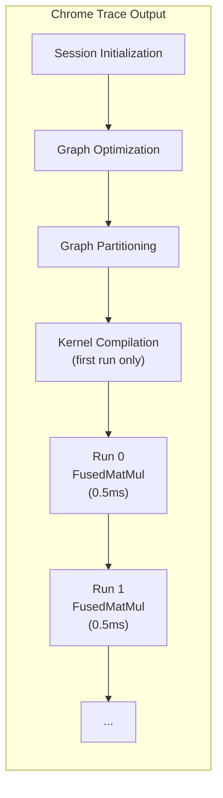

**Key things to look for in the trace:**

| Event | What it means | Red Flag |
|-------|--------------|----------|
| `kernel_compute` | Actual op execution | Long duration |
| `data_transfer` | CPU↔GPU copy | High frequency |
| `session_initialization` | Model loading + optimization | >5 seconds |
| `graph_partitioning` | Provider assignment | Fallbacks to CPU |
| `Fence` | Synchronization | Too many = sync overhead |

### 19.3 Analyzing Profile Data Programmatically

```python
import json
import pandas as pd
from collections import Counter

# Load profile
with open(prof_file) as f:
    profile = json.load(f)

# Extract events
events = []
for event in profile["traceEvents"]:
    if event.get("cat") == "kernel_compute":
        events.append({
            "name": event.get("name", ""),
            "dur": event.get("dur", 0),  # microseconds
            "args": event.get("args", {}),
        })

# Total time per op type
op_times = Counter()
for event in events:
    dur_us = event["dur"]
    op_name = event["name"].split("_")[0]  # "FusedMatMul_123" → "FusedMatMul"
    op_times[op_name] += dur_us

# Print breakdown
total = sum(op_times.values())
print(f"Total kernel time: {total / 1000:.2f}ms")
for op, dur_us in op_times.most_common(10):
    pct = dur_us / total * 100
    print(f"  {op:30s}: {dur_us/1000:8.2f}ms ({pct:5.1f}%)")

# Top 10 slowest individual kernels
sorted_events = sorted(events, key=lambda e: e["dur"], reverse=True)
print("\nSlowest kernels:")
for ev in sorted_events[:5]:
    print(f"  {ev['name']:40s} {ev['dur']/1000:8.2f}ms")
```

### 19.4 Interpreting the Profile

```
Scenario 1: Most time in "Memcpy" or "data_transfer"
  → I/O bottleneck. Use I/O binding, pin memory, reduce copies.

Scenario 2: One op dominates (e.g. 80% in "MatMul")
  → Compute bound. Consider FP16, TensorRT, or model distillation.

Scenario 3: First run much slower than subsequent runs
  → Kernel compilation overhead. Warm up before production.

Scenario 4: Many small kernel launches (e.g. 1000 ops of 0.01ms each)
  → Fusion opportunities. Use ORT_ENABLE_ALL optimization level.
  → TensorRT EP can fuse these into single kernels.
```

---

## 20. Performance Tuning Checklist

### 20.1 Quick Wins (in order of impact)

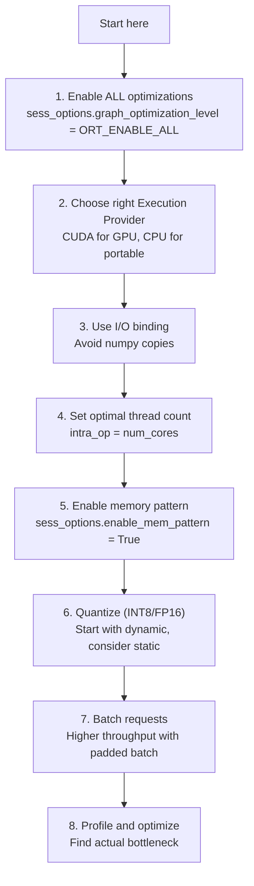

### 20.2 Configuration Template

```python
def create_optimized_session(model_path, provider="auto"):
    sess_options = ort.SessionOptions()
    
    # Optimization level
    sess_options.graph_optimization_level = ort.GraphOptimizationLevel.ORT_ENABLE_ALL
    sess_options.optimized_model_filepath = model_path.replace(".onnx", "_opt.onnx")
    
    # Threading
    import os
    num_cores = os.cpu_count()
    sess_options.intra_op_num_threads = num_cores
    sess_options.inter_op_num_threads = 2
    
    # Memory
    sess_options.enable_cpu_mem_arena = True
    sess_options.enable_mem_pattern = True
    
    # IO
    sess_options.execution_mode = ort.ExecutionMode.ORT_SEQUENTIAL
    
    # Logging
    sess_options.log_severity_level = 2  # WARNING
    
    # Provider selection
    available = ort.get_available_providers()
    if provider == "auto":
        if "TensorrtExecutionProvider" in available:
            providers = [("TensorrtExecutionProvider", {
                "trt_fp16_enable": "True",
                "trt_engine_cache_enable": "True",
                "trt_engine_cache_path": "./trt_cache",
            }), "CUDAExecutionProvider", "CPUExecutionProvider"]
        elif "CUDAExecutionProvider" in available:
            providers = ["CUDAExecutionProvider", "CPUExecutionProvider"]
        else:
            providers = ["CPUExecutionProvider"]
    else:
        providers = [provider]
    
    return ort.InferenceSession(model_path, sess_options, providers=providers)
```

### 20.3 Bottleneck Detection Flow

```python
def diagnose_performance(model_path, inputs):
    print("=" * 60)
    print("Performance Diagnosis")
    print("=" * 60)
    
    # 1. Provider
    session = ort.InferenceSession(model_path)
    print(f"Providers: {session.get_providers()}")
    
    # 2. First-run vs steady-state latency
    import time
    
    # First run (includes kernel compilation)
    start = time.perf_counter()
    session.run(None, inputs)
    first_lat = (time.perf_counter() - start) * 1000
    
    # Steady state
    for _ in range(20):
        session.run(None, inputs)
    start = time.perf_counter()
    for _ in range(100):
        session.run(None, inputs)
    steady_lat = (time.perf_counter() - start) * 10  # ms per inference
    
    print(f"First run:  {first_lat:.1f}ms  (kernel compilation)")
    print(f"Steady:     {steady_lat:.1f}ms")
    print(f"Overhead:   {(first_lat/steady_lat):.1f}×")
    
    # 3. Profile for bottleneck op
    sess_options = ort.SessionOptions()
    sess_options.enable_profiling = True
    prof_session = ort.InferenceSession(model_path, sess_options)
    for _ in range(50):
        prof_session.run(None, inputs)
    prof_file = prof_session.end_profiling()
    
    # Parse
    with open(prof_file) as f:
        profile = json.load(f)
    
    # Find slowest kernel
    kernels = [
        e for e in profile["traceEvents"]
        if e.get("cat") == "kernel_compute"
    ]
    if kernels:
        slowest = max(kernels, key=lambda e: e.get("dur", 0))
        print(f"Slowest op: {slowest.get('name', 'unknown')} "
              f"({slowest.get('dur', 0)/1000:.2f}ms)")
    
    return {"first_latency_ms": first_lat, "steady_latency_ms": steady_lat}
```

---

## 21. Benchmarking Methodology

### 21.1 Comprehensive Benchmark

```python
import time
import numpy as np
import onnxruntime as ort
import pandas as pd
from typing import Dict, List, Callable

def benchmark(
    model_path: str,
    input_factory: Callable,
    batch_sizes: List[int] = [1, 4, 8, 16, 32],
    seq_lens: List[int] = [64, 128, 256],
    n_warmup: int = 20,
    n_runs: int = 200,
    providers: List[str] = None,
) -> pd.DataFrame:
    
    results = []
    
    for batch in batch_sizes:
        for seq in seq_lens:
            inputs = input_factory(batch, seq)
            
            session = ort.InferenceSession(
                model_path,
                providers=providers or ort.get_available_providers()
            )
            
            # Warmup
            for _ in range(n_warmup):
                session.run(None, inputs)
            
            # Measure latency
            latencies = []
            start = time.perf_counter()
            for _ in range(n_runs):
                loop_start = time.perf_counter()
                session.run(None, inputs)
                latencies.append((time.perf_counter() - loop_start) * 1000)
            total = time.perf_counter() - start
            
            results.append({
                "batch": batch,
                "seq_len": seq,
                "p50": np.percentile(latencies, 50),
                "p90": np.percentile(latencies, 90),
                "p99": np.percentile(latencies, 99),
                "avg_latency_ms": np.mean(latencies),
                "throughput": batch * n_runs / total,
                "samples_per_sec": batch / (total / n_runs),
            })
            
            print(f"batch={batch:2d} seq={seq:3d}  "
                  f"p50={results[-1]['p50']:6.2f}ms  "
                  f"throughput={results[-1]['throughput']:8.0f} samples/s")
    
    return pd.DataFrame(results)

# Usage
results = benchmark(
    "model.onnx",
    input_factory=lambda b, s: {
        "input_ids": np.random.randint(0, 30000, (b, s)).astype(np.int64),
        "attention_mask": np.ones((b, s), dtype=np.int64),
    },
    batch_sizes=[1, 4, 8, 16],
    seq_lens=[64, 128],
)
```

### 21.2 Comparing Providers

```python
def compare_providers(model_path, input_factory, batch=1, seq=128):
    inputs = input_factory(batch, seq)
    results = {}
    
    provider_sets = [
        ["CPUExecutionProvider"],
        ["CUDAExecutionProvider", "CPUExecutionProvider"],
        ["TensorrtExecutionProvider", "CUDAExecutionProvider", "CPUExecutionProvider"],
    ]
    
    for providers in provider_sets:
        try:
            session = ort.InferenceSession(model_path, providers=providers)
            name = providers[0].replace("ExecutionProvider", "")
            
            # Warmup
            for _ in range(10):
                session.run(None, inputs)
            
            # Measure
            start = time.perf_counter()
            for _ in range(100):
                session.run(None, inputs)
            elapsed = time.perf_counter() - start
            
            results[name] = {
                "latency_ms": elapsed / 100 * 1000,
                "samples_per_sec": 100 / elapsed,
            }
        except Exception as e:
            results[providers[0]] = {"error": str(e)}
    
    for name, r in results.items():
        if "error" in r:
            print(f"  {name:20s}: ❌ {r['error']}")
        else:
            print(f"  {name:20s}: {r['latency_ms']:6.2f}ms  "
                  f"({r['samples_per_sec']:8.0f} samples/s)")
    
    return results
```

---

## Part VII — Debugging & Troubleshooting

---

## 22. Shape Inference & Error Messages

### 22.1 Common Runtime Errors

```python
# Error: "Input ... has shape ... but expected ..."
# Root cause: shape mismatch between model definition and runtime input

# Debug step 1: Check expected shapes
session = ort.InferenceSession("model.onnx")
for inp in session.get_inputs():
    print(f"{inp.name}: shape={inp.shape} type={inp.type}")
# Input: "input_ids" shape=['batch', 'seq_len'] type=tensor(int64)

# Debug step 2: Check actual input shapes
print(f"Actual input shape: {input_ids.shape}")
# torch.Size([1, 128])

# Debug step 3: Verify dynamic axes export
model = onnx.load("model.onnx")
for inp in model.graph.input:
    shape_desc = []
    for dim in inp.type.tensor_type.shape.dim:
        if dim.dim_param:
            shape_desc.append(dim.dim_param)
        else:
            shape_desc.append(str(dim.dim_value))
    print(f"{inp.name}: [{', '.join(shape_desc)}]")
```

### 22.2 Shape Inference Debugging

```python
# Run ORT shape inference explicitly
session = ort.InferenceSession(
    "model.onnx",
    providers=["CPUExecutionProvider"]
)

# This already performs shape inference internally.
# For debugging, use onnx shape_inference:
from onnx import shape_inference, helper

try:
    inferred = shape_inference.infer_shapes(
        onnx.load("model.onnx"),
        strict_mode=True
    )
    print("✅ Shape inference succeeded")
except onnx.shape_inference.InferenceError as e:
    print(f"❌ Shape inference failed: {e}")
    
    # Find the problematic node
    # Look for nodes with "?" in their output shapes
    model = onnx.load("model.onnx")
    for node in model.graph.node:
        if "?" in str(node.output):
            print(f"Problematic: {node.op_type}  outputs={node.output}")
```

### 22.3 Error Resolution Table

| Runtime Error | Likely Cause | Fix |
|--------------|--------------|-----|
| `FAIL: type cast failed` | Input dtype doesn't match model | Cast input: `x.astype(np.int64)` |
| `Input must be ... contiguously allocated` | Non-contiguous tensor | `np.ascontiguousarray(x)` |
| `Shape mismatch ... got ... expected ...` | Wrong sequence length | Pad/crop input to expected dim |
| `Unsupported operator` | Op not in this opset | Upgrade opset or use newer ORT |
| `Ort::Exception ... out of memory` | GPU memory exhausted | Reduce batch size, enable memory limit |
| `CUDA driver error` | GPU driver version mismatch | Update CUDA driver, check compatibility |
| `No kernel registered for ...` | Op not supported on this EP | Fall back to CPU EP for this op |
| `Could not find file` | Model path wrong | Use absolute path `os.path.abspath()` |

### 22.4 Debugging with Environment Variables

```bash
# ORT verbose logging
export ORT_LOG_SEVERITY=0           # VERBOSE
export ORT_LOG_VERBOSITY=1
python inference.py

# CUDA debug
export CUDA_LAUNCH_BLOCKING=1       # synchronous CUDA (easier stack traces)
export ORT_CUDA_BLOCK_ALLOCATOR=0   # disable CUDA memory caching

# Memory debug
export ORT_ENABLE_MEM_DEBUG=1       # track memory allocations
```

---

## 23. Operator Support by Execution Provider

### 23.1 Checking Op Coverage

```python
import onnxruntime as ort

# List all ops registered for each provider
providers = ort.get_available_providers()
for provider in providers:
    ops = ort.capi._pybind_state.get_operator_provider_info()
    print(f"\n{provider}:")
    # Note: this is build-specific. Check the ORT documentation
    # for the full op support matrix per version.
    
# For TensorRT specifically:
# Check if model can be fully run on TRT
session = ort.InferenceSession(
    "model.onnx",
    providers=["TensorrtExecutionProvider"]
)
# ORT partitions the graph: TRT-compatible ops → TRT, rest → CPU
# Check the partition:
for partition in session.get_modelmeta().custom_metadata_map:
    if "partition" in partition.lower():
        print(f"  {partition}: {session.get_modelmeta().custom_metadata_map[partition]}")
```

### 23.2 Common Ops and EP Support

| Op | CPU | CUDA | TensorRT | OpenVINO | CoreML | Notes |
|----|-----|------|----------|----------|--------|-------|
| Gemm / MatMul | ✅ | ✅ | ✅ | ✅ | ✅ | Core op, widely supported |
| Attention (MS) | ✅ | ✅ | ✅ | ⚠️ | ⚠️ | MS contrib, check version |
| LayerNormalization | ✅ | ✅ | ✅ | ✅ | ✅ | |
| Gelu | ✅ | ✅ | ✅ | ✅ | ✅ | |
| Softmax | ✅ | ✅ | ✅ | ✅ | ✅ | |
| Conv | ✅ | ✅ | ✅ | ✅ | ✅ | |
| Reshape | ✅ | ✅ | ✅ | ✅ | ✅ | |
| EmbedLayerNorm (MS) | ✅ | ✅ | ✅ | ⚠️ | ⚠️ | MS contrib |
| SkipLayerNorm (MS) | ✅ | ✅ | ✅ | ⚠️ | ⚠️ | MS contrib |
| NMS (NonMaxSuppression) | ✅ | ✅ | ❌ | ⚠️ | ❌ | CPU fallback |

### 23.3 Fallback Strategy

```python
# ORT automatically handles fallback:
# ops that don't support CUDA → run on CPU
# But CPU fallback can be slow due to data transfer

# To minimize fallback:
# 1. Check which ops fall back
sess_options.log_severity_level = 0  # VERBOSE
session = ort.InferenceSession(model_path, sess_options)
# Look for "Fallback to CPU" in logs

# 2. Identify specific ops
model = onnx.load(model_path)
cpu_only_ops = []
for node in model.graph.node:
    if node.domain == "com.microsoft":
        cpu_only_ops.append(node.op_type)
print(f"MS contrib ops (may not be GPU-accelerated): {set(cpu_only_ops)}")
```

---

## 24. Model Inspection & Validation Tools

### 24.1 onnx.inspect

```python
import onnx

# Quick summary
onnx.inspect("model.onnx")
# IR version: 8
# Producer: pytorch 2.1.0
# Opset: ai.onnx v18
# Graph inputs: input_ids (int64), attention_mask (int64)
# Graph outputs: logits (float32)
# Nodes: 824

# Detailed
onnx.inspect("model.onnx", detailed=True)
```

### 24.2 Netron (Visual Model Viewer)

```python
# Netron is a web-based model visualizer
# Install: pip install netron

import netron

# Launch browser with model graph
netron.start("model.onnx")
# Opens http://localhost:8080

# Or use the command line:
# python -m netron model.onnx
```

### 24.3 Polygraphy (NVIDIA Debugging Tool)

```bash
pip install polygraphy
```

```python
# Run inference on both ORT and TensorRT, compare outputs
import subprocess

# Compare ORT (CUDA) vs TensorRT
result = subprocess.run([
    "polygraphy", "run",
    "model.onnx",
    "--onnxrt", "--trt",
    "--fp16",
    "--verbose",
], capture_output=True, text=True)

print(result.stdout)
```

### 24.4 ONNX Runtime Extensions Tools

```python
# Model size breakdown
def model_size_report(model_path):
    model = onnx.load(model_path)
    
    init_size = sum(
        len(init.raw_data) for init in model.graph.initializer
    )
    node_count = len(model.graph.node)
    
    # Size per op type
    from collections import defaultdict
    op_size = defaultdict(int)
    init_map = {init.name: len(init.raw_data) for init in model.graph.initializer}
    
    for node in model.graph.node:
        for input_name in node.input:
            if input_name in init_map:
                op_size[node.op_type] += init_map[input_name]
    
    print(f"Total initializer size: {init_size / 1e6:.1f} MB")
    print(f"Total nodes: {node_count}")
    print("\nWeight size by op type:")
    for op, size in sorted(op_size.items(), key=lambda x: -x[1]):
        print(f"  {op:30s}: {size / 1e6:7.2f} MB")
    
    # Check for unusually large ops
    for node in model.graph.node:
        node_init_size = sum(
            init_map.get(n, 0) for n in node.input if n in init_map
        )
        if node_init_size > 100 * 1024 * 1024:  # > 100 MB
            print(f"\n⚠️ Large node: {node.op_type}  "
                  f"({node_init_size / 1e6:.1f} MB)")

model_size_report("model.onnx")
```

---

## Part VIII — Production Deployment

---

## 25. Model Serving Patterns

### 25.1 Basic Serving with FastAPI

```python
from fastapi import FastAPI, HTTPException
from pydantic import BaseModel
import onnxruntime as ort
import numpy as np
from typing import List, Optional

app = FastAPI()

# Load model at startup
class ModelServer:
    def __init__(self, model_path: str):
        self.session = ort.InferenceSession(
            model_path,
            providers=ort.get_available_providers()
        )
        self.input_name = self.session.get_inputs()[0].name
        self.output_name = self.session.get_outputs()[0].name
    
    def predict(self, input_ids: np.ndarray, mask: np.ndarray) -> np.ndarray:
        return self.session.run(
            [self.output_name],
            {self.input_name: input_ids, "attention_mask": mask}
        )[0]

model_server = ModelServer("model.onnx")

class PredictRequest(BaseModel):
    input_ids: List[List[int]]
    attention_mask: Optional[List[List[int]]] = None

class PredictResponse(BaseModel):
    logits: List[List[float]]
    latency_ms: float

@app.post("/predict", response_model=PredictResponse)
async def predict(request: PredictRequest):
    import time
    
    input_ids = np.array(request.input_ids, dtype=np.int64)
    mask = np.array(request.attention_mask or [
        [1] * len(request.input_ids[0])
    ], dtype=np.int64)
    
    start = time.perf_counter()
    logits = model_server.predict(input_ids, mask)
    latency = (time.perf_counter() - start) * 1000
    
    return PredictResponse(
        logits=logits.tolist(),
        latency_ms=round(latency, 2),
    )

# Run: uvicorn server:app --host 0.0.0.0 --port 8000
```

### 25.2 Batching in Production

```python
from collections import deque
import threading
import time
import numpy as np
import onnxruntime as ort

class BatchedInferenceServer:
    """Accumulates requests and processes them in batches."""
    
    def __init__(self, model_path, max_batch=32, max_wait=0.01):
        self.session = ort.InferenceSession(model_path)
        self.max_batch = max_batch
        self.max_wait = max_wait
        self.queue = deque()
        self.lock = threading.Lock()
        self.event = threading.Event()
        
        self._worker = threading.Thread(target=self._process_loop, daemon=True)
        self._worker.start()
    
    def predict(self, input_ids, mask):
        event = threading.Event()
        result = [None]
        
        with self.lock:
            self.queue.append((input_ids, mask, result, event))
            self.event.set()
        
        event.wait()
        return result[0]
    
    def _process_loop(self):
        while True:
            self.event.wait()
            time.sleep(self.max_wait)  # accumulate
            
            batch = []
            events = []
            with self.lock:
                while self.queue and len(batch) < self.max_batch:
                    item = self.queue.popleft()
                    batch.append(item)
                if not self.queue:
                    self.event.clear()
            
            if not batch:
                continue
            
            # Pad batch
            max_seq = max(inp.shape[1] for inp, _, _, _ in batch)
            batched_inputs = []
            batched_masks = []
            
            for inp, mask, _, _ in batch:
                if inp.shape[1] < max_seq:
                    pad_len = max_seq - inp.shape[1]
                    inp = np.pad(inp, ((0, 0), (0, pad_len)))
                    mask = np.pad(mask, ((0, 0), (0, pad_len)))
                batched_inputs.append(inp)
                batched_masks.append(mask)
            
            batch_input = np.concatenate(batched_inputs, axis=0)
            batch_mask = np.concatenate(batched_masks, axis=0)
            
            # Run
            outputs = self.session.run(None, {
                "input_ids": batch_input,
                "attention_mask": batch_mask,
            })
            
            # Distribute results
            offset = 0
            for item, out_single in zip(batch, outputs[0]):
                inp, mask, result, event = item
                length = inp.shape[0]
                result[0] = out_single[offset:offset + length]
                offset += length
                event.set()
```

### 25.3 Model Warmup

```python
def warmup_model(model_path, batch_sizes=[1, 4, 8], seq_len=128, n_runs=10):
    """Run warmup inferences to trigger kernel compilation."""
    session = ort.InferenceSession(model_path)
    
    for batch in batch_sizes:
        inputs = {
            "input_ids": np.zeros((batch, seq_len), dtype=np.int64),
            "attention_mask": np.ones((batch, seq_len), dtype=np.int64),
        }
        for _ in range(n_runs):
            session.run(None, inputs)
        print(f"Warmed up: batch={batch}, seq={seq_len}")

# Call during server startup
warmup_model("model.onnx")
```

---

## 26. Versioning & A/B Testing

### 26.1 Model Version Management

```python
import os
from datetime import datetime

class ModelRegistry:
    def __init__(self, base_dir="./models"):
        self.base_dir = base_dir
        self.versions = {}
    
    def register(self, name, model_path, metadata=None):
        """Register a model version."""
        timestamp = datetime.now().isoformat()
        version = len(self.versions) + 1
        self.versions[version] = {
            "name": name,
            "path": model_path,
            "created": timestamp,
            "metadata": metadata or {},
        }
        return version
    
    def load(self, version=None):
        """Load a session for a given version (latest by default)."""
        if version is None:
            version = max(self.versions.keys())
        model_info = self.versions[version]
        return ort.InferenceSession(model_info["path"]), model_info

# Usage
registry = ModelRegistry()
registry.register("bert-v1", "bert_v1.onnx", {"accuracy": 0.92})
registry.register("bert-v2", "bert_v2.onnx", {"accuracy": 0.94})  # quantized

session_v1, info_v1 = registry.load(1)
session_v2, info_v2 = registry.load(2)
```

### 26.2 A/B Testing Framework

```python
import random
import onnxruntime as ort

class ABTestRouter:
    def __init__(self, model_a_path, model_b_path, traffic_split=0.5):
        self.session_a = ort.InferenceSession(model_a_path)
        self.session_b = ort.InferenceSession(model_b_path)
        self.traffic_split = traffic_split  # fraction to model B
        self.counts = {"A": 0, "B": 0}
    
    def predict(self, inputs):
        if random.random() < self.traffic_split:
            self.counts["B"] += 1
            return self.session_b.run(None, inputs), "B"
        else:
            self.counts["A"] += 1
            return self.session_a.run(None, inputs), "A"

# Usage
router = ABTestRouter("model_fp32.onnx", "model_int8.onnx", traffic_split=0.1)
for _ in range(1000):
    outputs, model_used = router.predict(inputs)
    # Log outputs + model_used for analysis
print(f"Traffic: {router.counts}")
```

---

## 27. Monitoring & Observability

### 27.1 Metrics Collection

```python
import time
import threading
from collections import deque
import json

class MetricsCollector:
    def __init__(self, window_size=100):
        self.latencies = deque(maxlen=window_size)
        self.errors = 0
        self.total = 0
        self.lock = threading.Lock()
    
    def record(self, latency_ms, success=True):
        with self.lock:
            self.latencies.append(latency_ms)
            self.total += 1
            if not success:
                self.errors += 1
    
    def snapshot(self):
        with self.lock:
            if not self.latencies:
                return {}
            lat_list = list(self.latencies)
            return {
                "p50_ms": sorted(lat_list)[len(lat_list) // 2],
                "p90_ms": sorted(lat_list)[int(len(lat_list) * 0.9)],
                "p99_ms": sorted(lat_list)[int(len(lat_list) * 0.99)],
                "avg_ms": sum(lat_list) / len(lat_list),
                "error_rate": self.errors / max(self.total, 1),
                "total_requests": self.total,
            }

# Usage in production
metrics = MetricsCollector()

def predict_with_monitoring(session, inputs):
    start = time.perf_counter()
    try:
        outputs = session.run(None, inputs)
        latency = (time.perf_counter() - start) * 1000
        metrics.record(latency, success=True)
        return outputs
    except Exception as e:
        latency = (time.perf_counter() - start) * 1000
        metrics.record(latency, success=False)
        raise

# Health check endpoint
def health_check():
    snapshot = metrics.snapshot()
    snapshot["status"] = "healthy" if snapshot.get("error_rate", 0) < 0.01 else "degraded"
    return snapshot
```

### 27.2 Prometheus Integration

```python
# pip install prometheus_client

from prometheus_client import Histogram, Counter, Gauge, start_http_server
import time

# Define metrics
INFERENCE_LATENCY = Histogram(
    'onnx_inference_latency_ms',
    'ONNX Runtime inference latency in milliseconds',
    buckets=[1, 5, 10, 25, 50, 100, 250, 500, 1000],
)

INFERENCE_COUNT = Counter(
    'onnx_inference_total',
    'Total ONNX inferences',
    ['model', 'status'],
)

BATCH_SIZE = Gauge(
    'onnx_batch_size',
    'Current inference batch size',
)

# Start metrics server (port 8000)
start_http_server(8000)

# In your inference code:
def predict(session, inputs, model_name="bert"):
    batch = inputs["input_ids"].shape[0]
    BATCH_SIZE.set(batch)
    
    start = time.perf_counter()
    try:
        outputs = session.run(None, inputs)
        INFERENCE_COUNT.labels(model=model_name, status="success").inc()
        INFERENCE_LATENCY.observe((time.perf_counter() - start) * 1000)
        return outputs
    except Exception as e:
        INFERENCE_COUNT.labels(model=model_name, status="error").inc()
        raise

# Prometheus can scrape http://localhost:8000/metrics
```

### 27.3 Structured Logging

```python
import logging
import json
import time

# Structured JSON logger
class InferenceLogger:
    def __init__(self, name="onnx_inference"):
        self.logger = logging.getLogger(name)
        self.logger.setLevel(logging.INFO)
        handler = logging.StreamHandler()
        handler.setFormatter(logging.Formatter(json.dumps({
            "timestamp": "%(asctime)s",
            "level": "%(levelname)s",
            "message": "%(message)s",
        })))
        self.logger.addHandler(handler)
    
    def log_inference(self, model_version, batch_size, seq_len,
                      latency_ms, status="success", error=None):
        entry = {
            "model_version": model_version,
            "batch_size": batch_size,
            "seq_len": seq_len,
            "latency_ms": round(latency_ms, 2),
            "status": status,
        }
        if error:
            entry["error"] = str(error)
        self.logger.info(json.dumps(entry))

# Usage
logger = InferenceLogger()

def predict_with_logging(session, inputs, model_version="v1"):
    batch = inputs["input_ids"].shape[0]
    seq = inputs["input_ids"].shape[1]
    
    start = time.perf_counter()
    try:
        outputs = session.run(None, inputs)
        latency = (time.perf_counter() - start) * 1000
        logger.log_inference(model_version, batch, seq, latency)
        return outputs
    except Exception as e:
        latency = (time.perf_counter() - start) * 1000
        logger.log_inference(model_version, batch, seq, latency,
                             status="error", error=e)
        raise
```

---

## Quick Reference Card

### Key Formulas

| What | Formula |
|------|---------|
| Model size (FP32) | `params × 4` bytes |
| Model size (FP16) | `params × 2` bytes |
| Model size (INT8) | `params × 1` bytes |
| Model size (INT4) | `params × 0.5` bytes |
| Dynamic quantization speedup | `1.5-2×` on CPU |
| Static quantization speedup | `2-4×` on CPU |
| TensorRT speedup (FP16) | `2-3×` over CUDA FP32 |
| Memory limit per GPU | `gpu_mem_limit` in provider options |

### Common CLI Commands

```bash
# Model info
python -c "import onnx; m=onnx.load('model.onnx'); print(len(m.graph.node), 'nodes')"

# Check model
python -m onnx.checker model.onnx

# Simplify
python -m onnxsim model.onnx model_simple.onnx

# Shape inference
python -c "from onnx import shape_inference; \
  m=shape_inference.infer_shapes(onnx.load('model.onnx')); \
  onnx.save(m, 'model_inferred.onnx')"

# Visualize (opens browser)
python -m netron model.onnx

# Export from PyTorch
python -c "
import torch, torch.onnx
model = torch.load('model.pt')
model.eval()
torch.onnx.export(model, dummy_input, 'model.onnx', opset_version=18)
"

# Profile
python -c "
import onnxruntime as ort
s = ort.SessionOptions(); s.enable_profiling=True
session = ort.InferenceSession('model.onnx', s)
session.run(None, inputs)
print(session.end_profiling())
"
```

### ONNX Runtime Provider Priority

```
Priority order for optimal performance:
1. TensorrtExecutionProvider  (NVIDIA GPU + TensorRT)
2. CUDAExecutionProvider      (NVIDIA GPU, no TensorRT)
3. OpenVINOExecutionProvider  (Intel hardware)
4. CoreMLExecutionProvider    (Apple Silicon)
5. DirectMLExecutionProvider  (Windows, any GPU)
6. CPUExecutionProvider       (fallback, all platforms)
```

### Quantization Decision Flow

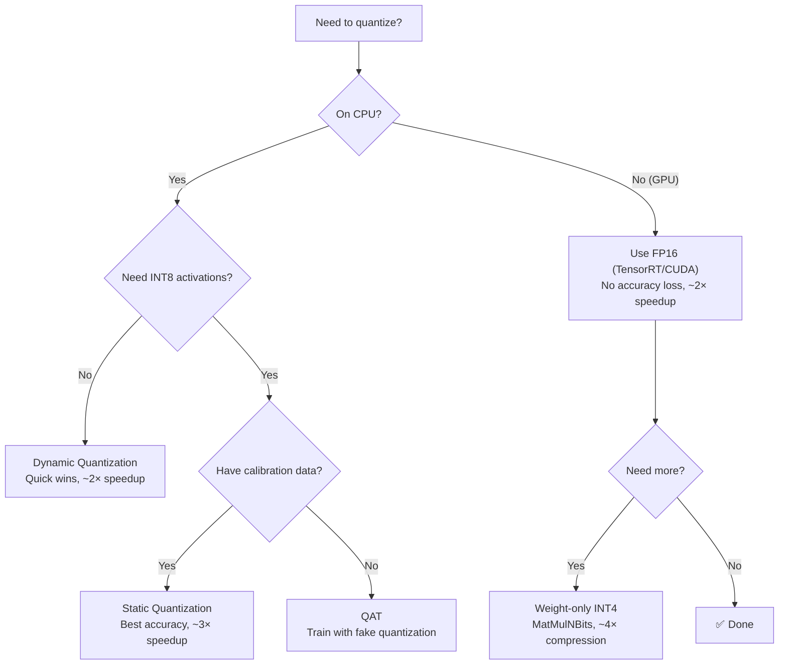

### Python Imports Quick Reference

```python
# Core
import onnx                          # model manipulation
import onnxruntime as ort            # inference
import torch.onnx                    # export

# Optimization
import onnxsim                       # model simplification
import onnxoptimizer                 # graph optimization pass

# Quantization
from onnxruntime.quantization import (
    quantize_dynamic, quantize_static,
    QuantType, QuantFormat, CalibrationMethod,
)
from onnxruntime.quantization.matmul_quantizer import (
    quantize_matmul_4bits,
)

# Debugging
from onnx import shape_inference, checker, helper
import netron                         # visualizer

# Profiling
import json
import time
```

### Environment Variables

```bash
# Verbose logging
export ORT_LOG_SEVERITY=0
export ORT_LOG_VERBOSITY=1

# CUDA debug
export CUDA_LAUNCH_BLOCKING=1

# Memory debug
export ORT_ENABLE_MEM_DEBUG=1

# TensorRT
export TRT_ENGINE_CACHE_ENABLE=1
```

---

> *"ONNX doesn't make your model smarter. It makes your model runnable everywhere. The optimization is up to you."*
