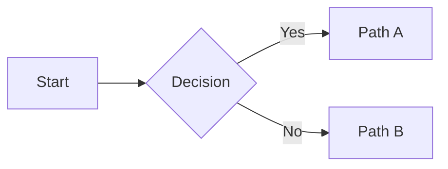
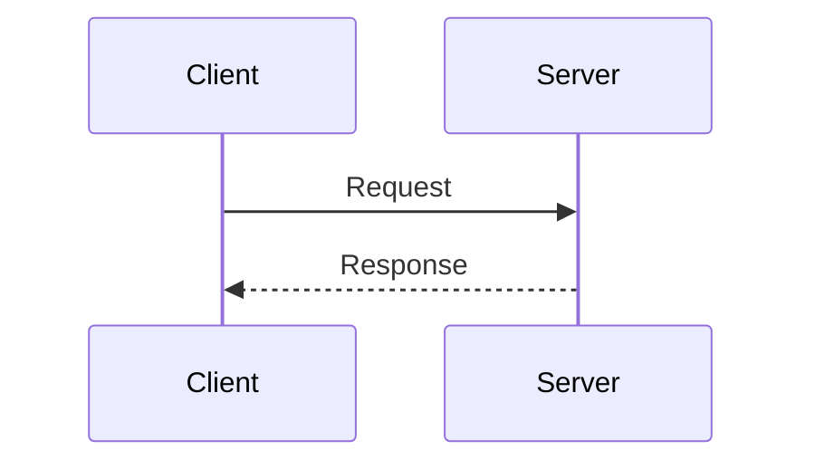

> **Bold intro tagline** — a one-line elevator pitch for the topic.

---

## Table of Contents

- [1. Section One](#1-section-one)
  - [Subsection A](#subsection-a)
  - [Subsection B](#subsection-b)
- [2. Section Two](#2-section-two)
- [Quick Reference Card](#quick-reference-card)

---

## 1. Section One

### Subsection A

Introductory text. Use code blocks for any code:

```python
import torch

def example():
    return torch.tensor([1, 2, 3])
```

Use tables for structured comparisons:

| Concept | Column A | Column B |
|---------|----------|----------|
| Item 1 | Value | Value |
| Item 2 | Value | Value |

Use Mermaid for architecture/flow diagrams:





Use blockquotes for callouts:

> A notable observation or gotcha worth remembering.

Use bullet lists for unordered items:

- Item one
- Item two
- Item three

Use numbered lists for sequential steps:

1. First step
2. Second step
3. Third step

### Subsection B

Use `inline code` for references. Use **bold** for emphasis.

Keep Python-only code examples (no C++). Target audience: ML engineers.

---

## 2. Section Two

### Quick Code Reference

```python
# Short focused code blocks with comments
from dataclasses import dataclass

@dataclass
class Config:
    key: str
    value: int
```

### Common Issues Table

| Issue | Cause | Fix |
|-------|-------|-----|
| Error message | Root cause | Solution |
| Another error | Another cause | Another fix |

---

## Quick Reference Card

### Key Formulas

| Formula | Description |
|---------|-------------|
| `n × d × 4` | Memory for n vectors of dimension d (fp32) |

### Environment Variables

```bash
export VAR_NAME=value
```

### Debugging Checklist

- [ ] Check imports
- [ ] Verify tensor shapes
- [ ] Validate edge cases
