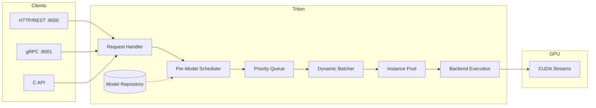
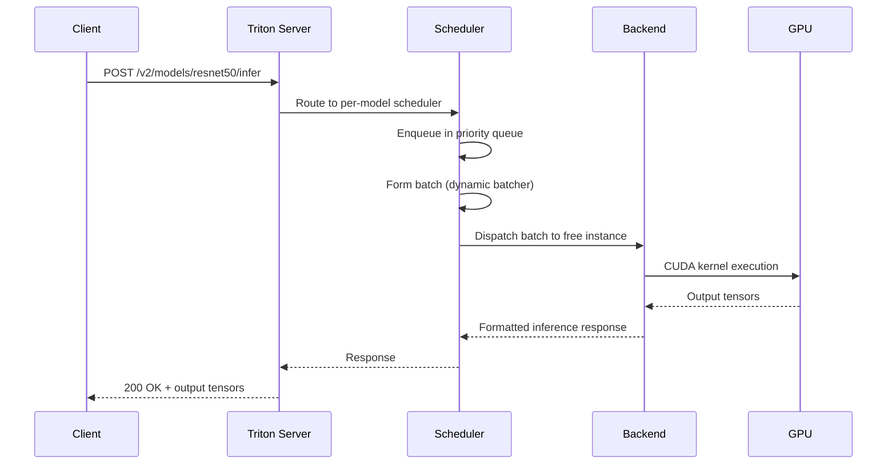
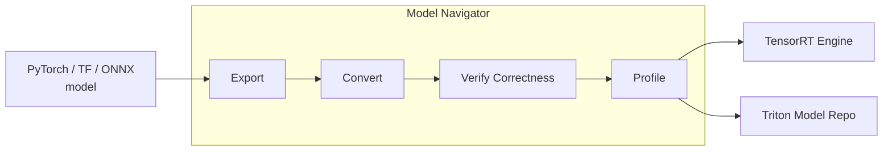
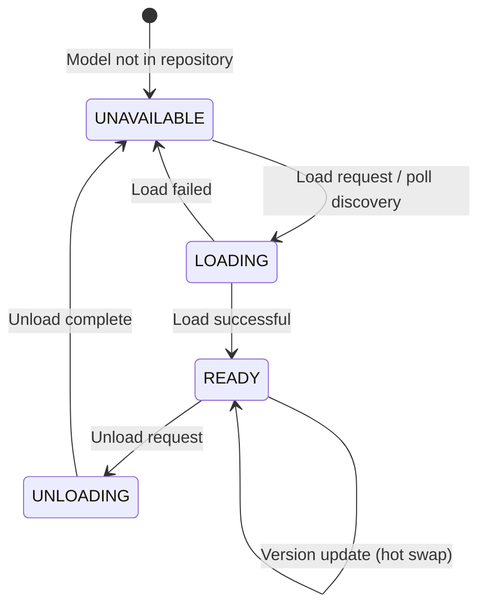
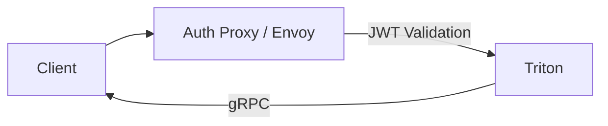
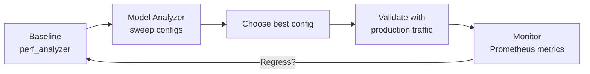
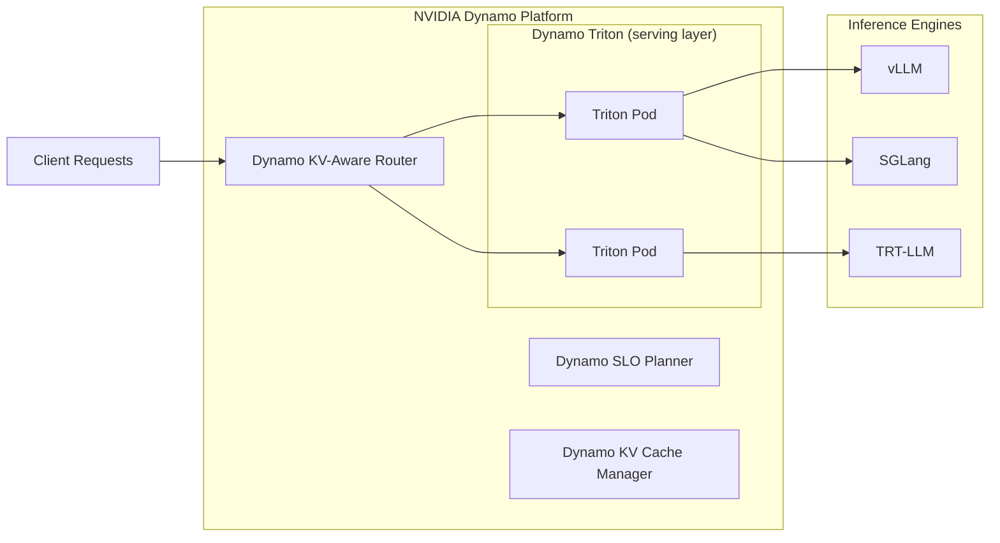

> **The production standard for multi-framework inference serving** — deploy PyTorch, TensorRT, ONNX, and vLLM models side by side on the same GPUs with dynamic batching, concurrent execution, Prometheus observability, and Kubernetes-native autoscaling.

---

## Table of Contents

- [1. What Is Triton Inference Server?](#1-what-is-triton-inference-server)
- [2. Architecture & Request Flow](#2-architecture--request-flow)
- [3. Model Repository & Configuration](#3-model-repository--configuration)
- [4. Core Serving Features](#4-core-serving-features)
- [5. Production Deployment Pipeline (Model Navigator)](#5-production-deployment-pipeline-model-navigator)
- [6. Kubernetes Deployment](#6-kubernetes-deployment)
- [7. Multi-GPU & Multi-Node Configuration](#7-multi-gpu--multi-node-configuration)
- [8. KServe v2 Protocol & Client SDK](#8-kserve-v2-protocol--client-sdk)
- [9. Model Lifecycle & Management](#9-model-lifecycle--management)
- [10. Security: TLS, Authentication, & Model Encryption](#10-security-tls-authentication--model-encryption)
- [11. Rate Limiting, Prioritization, & Queue Configuration](#11-rate-limiting-prioritization--queue-configuration)
- [12. Performance Tuning & Optimization](#12-performance-tuning--optimization)
- [13. LLM Serving with Triton](#13-llm-serving-with-triton)
- [14. NVIDIA Dynamo: The Next Generation](#14-nvidia-dynamo-the-next-generation)
- [15. When to Use Triton vs Alternatives](#15-when-to-use-triton-vs-alternatives)
- [16. Best Practices & Common Pitfalls](#16-best-practices--common-pitfalls)
- [Quick Reference Card](#quick-reference-card)

---

## 1. What Is Triton Inference Server?

NVIDIA Triton Inference Server is an open-source serving layer that lets you deploy trained models from **any framework** through a single HTTP/REST, gRPC, or C API — all within one server process. It supports NVIDIA GPUs, x86/ARM CPUs, and AWS Inferentia across cloud, data center, edge, and embedded devices.

What makes Triton distinct from purpose-built LLM servers is that it is **backend-agnostic**. A single Triton process can serve:

- An **LLM** via the vLLM backend (PagedAttention, continuous batching)
- A **CLIP vision encoder** via the ONNX Runtime backend
- A **BERT reranker** via the TensorRT backend
- A **custom preprocessor** via the Python backend

All sharing the same GPUs, with unified observability and model lifecycle management.

> **March 2025 note**: NVIDIA rebranded Triton as **NVIDIA Dynamo Triton**, part of the broader NVIDIA Dynamo platform. Triton remains the general-purpose serving layer; Dynamo adds a distributed orchestration layer on top (see [Section 14](#14-nvidia-dynamo-the-next-generation)).

### Why Triton for Production

| Challenge | Triton's Solution |
|---|---|
| Multiple models, different frameworks | Single server with backend abstraction |
| Poor GPU utilization | Dynamic batching + concurrent execution |
| Complex preprocessing/postprocessing | Python backend, Ensemble, BLS |
| Production monitoring | Prometheus metrics, health endpoints |
| Zero-downtime model updates | Load/unload API, model versioning |
| Multi-GPU distribution | Instance groups, tensor parallelism |
| Kubernetes-native autoscaling | Prometheus custom metrics HPA |
| Compliance & enterprise | NVIDIA AI Enterprise, production branch |

---

## 2. Architecture & Request Flow





The request path:

1. **Inference requests** arrive via HTTP/REST (port 8000), gRPC (port 8001), or C API
2. The **request handler** validates the request against the KServe v2 protocol and routes to the per-model scheduler
3. The **scheduler** enqueues the request in a priority queue, optionally coalesces it with other requests (dynamic batching), and awaits a free execution instance
4. The **backend** executes the batch — different backends handle this differently (TensorRT runs a CUDA engine, Python executes your script, vLLM manages continuous batching)
5. **Outputs** are formatted as KServe v2 response tensors and sent back through the same path

> **Latency budget breakdown**: In a well-tuned Triton deployment, total latency = `network + queue + batcher_delay + compute + network`. The batcher delay dominates tuning decisions — too long increases p99 latency, too short leaves throughput on the table.

---

## 3. Model Repository & Configuration

### Repository Layout

Every model served by Triton lives in a **model repository** — a directory tree on local filesystem, S3, or GCS. Repositories can be polled for changes or managed explicitly via the model control API.

```
model_repository/
├── resnet50/
│   ├── config.pbtxt
│   ├── 1/
│   │   └── model.plan          # TensorRT engine
│   └── 2/                      # Version 2 — hot-loaded at runtime
│       └── model.plan
├── bert_onnx/
│   ├── config.pbtxt
│   └── 1/
│       └── model.onnx
├── llama-3-8b/
│   ├── config.pbtxt
│   └── 1/
│       ├── model.py            # vLLM Python backend entry point
│       └── checkpoint/         # HF model weights
└── my_pipeline/
    ├── config.pbtxt            # Ensemble = combined DAG
    └── 1/
```

**Key rules:**
- Version directories must be **numeric strings** (`1`, `2`, `3`)
- Default model filenames: `model.plan` (TensorRT), `model.onnx` (ONNX), `model.pt` (PyTorch), `model.py` (Python), `model.xml + model.bin` (OpenVINO)
- `config.pbtxt` is **optional** for TensorRT, ONNX, and PyTorch — Triton auto-generates from the model file
- S3/GCS URIs are specified at server start: `--model-repository=s3://bucket/path` or `--model-repository=gs://bucket/path`

### Model Configuration (config.pbtxt)

```protobuf
name: "resnet50"
backend: "tensorrt"
max_batch_size: 8

input [
  {
    name: "input"
    data_type: TYPE_FP32
    dims: [3, 224, 224]
  }
]

output [
  {
    name: "output"
    data_type: TYPE_FP32
    dims: [1000]
  }
]

dynamic_batching {
  preferred_batch_size: [1, 2, 4, 8]
  max_queue_delay_microseconds: 100
  priority_levels: 3
  default_priority_level: 2
}

instance_group [
  {
    count: 2
    kind: KIND_GPU
    gpus: [0]
  }
]

version_policy {
  latest { num_versions: 2 }
}

model_transaction_policy {
  decoupled: false
}

response_cache {
  enable: true
}
```

**Fields at a glance:**

| Field | Purpose | Production Recommendation |
|---|---|---|
| `name` | Must match the model directory | Same as your tracking system model ID |
| `backend` | Which backend engine | Match to optimized format (TensorRT for GPU perf) |
| `max_batch_size` | Upper bound on dynamic batching | Match to TensorRT optimization profile max |
| `input`/`output` | Tensor names, dtypes, shapes | Use `--log-verbose=1` to verify inferred values |
| `dynamic_batching` | Enable request coalescing | Always enable for stateless models |
| `priority_levels` | Queue priority tiers (see Section 11) | Set 2-3 levels for production |
| `instance_group` | Concurrency and device placement | Tune with Model Analyzer |
| `version_policy` | Which model versions to serve | `latest` for normal, `specific` for canary |
| `response_cache` | Cache identical request outputs | Enable for idempotent models |

### S3 / GCS Model Repository Configuration

```bash
# S3 — set AWS credentials via env vars or IAM role
docker run --gpus=1 \
  -e AWS_ACCESS_KEY_ID=... \
  -e AWS_SECRET_ACCESS_KEY=... \
  nvcr.io/nvidia/tritonserver:25.04-py3 \
  tritonserver --model-repository=s3://my-bucket/models

# GCS — uses application default credentials
docker run --gpus=1 \
  -v /path/to/gcp-sa-key.json:/credentials.json:ro \
  -e GOOGLE_APPLICATION_CREDENTIALS=/credentials.json \
  nvcr.io/nvidia/tritonserver:25.04-py3 \
  tritonserver --model-repository=gs://my-bucket/models
```

> **Production tip**: Use a remote repository (S3/GCS) for all multi-node deployments. Every pod reads from the same repo, and model updates are atomic — upload the new version, notify Triton via the model control API.

### Supported Backends

| Backend | Framework | Model File | Use Case |
|---|---|---|---|
| TensorRT | NVIDIA TensorRT | `.plan` | Maximum GPU perf, FP16/INT8/FP8 |
| PyTorch | LibTorch | `.pt` (TorchScript) | Simple PyTorch deployment |
| ONNX Runtime | ONNX | `.onnx` | Framework-agnostic, wide opset |
| TensorFlow | TF 1.x / 2.x | SavedModel | Legacy TF models |
| OpenVINO | Intel OpenVINO | `.xml` + `.bin` | CPU inference, Intel accelerators |
| Python | Python | `.py` | Custom logic, tokenization, HF models |
| vLLM | vLLM | HF checkpoint dir | LLM serving (Llama, Mistral, Qwen) |
| TensorRT-LLM | TRT-LLM | Engine dir | Max LLM throughput on NVIDIA GPUs |
| FIL | XGBoost / LightGBM | `.bst`, `.ubj` | Tree-based models |
| DALI | NVIDIA DALI | `.dali` | Data preprocessing pipelines |

### Python Backend — The Swiss Army Knife

```python
import triton_python_backend_utils as pb_utils

class TritonPythonModel:
    def initialize(self, args):
        self.model_config = json.loads(args["model_config"])
        self.max_batch_size = max(
            self.model_config.get("max_batch_size", 0), 1
        )
        # Load tokenizer, model weights, etc.
        # Cache expensive resources across requests

    def execute(self, requests):
        responses = []
        for request in requests:
            inp = pb_utils.get_input_tensor_by_name(request, "input")
            out_tensor = pb_utils.Tensor("output", inp.as_numpy() * 2)
            responses.append(
                pb_utils.InferenceResponse(output_tensors=[out_tensor])
            )
        return responses

    def finalize(self):
        pass  # Release GPU memory, close connections
```

> The Python backend is performance-limited compared to C++ backends. Use it for pre/post-processing, model composition (BLS), and wrapping models that lack a dedicated backend. For latency-critical paths, prefer TensorRT or ONNX Runtime.

---

## 4. Core Serving Features

### Dynamic Batching

Dynamic batching is the single highest-leverage performance knob. Triton **transparently coalesces** concurrent requests in the scheduler queue.

```mermaid
flowchart LR
  subgraph Incoming
    A[A] B[B] C[C] D[D] E[E]
  end
  subgraph "Without Batching (5 serial)"
    A1["[A]"] --> B1["[B]"] --> C1["[C]"] --> D1["[D]"] --> E1["[E]"]
  end
  subgraph "With Batching (2 batches)"
    A2["[A][B][C]"] --> D2["[D][E]"]
  end
  subgraph "With Delay (1 batch)"
    A3["[A][B][C][D][E]"]
  end
```

Configuration:

```protobuf
dynamic_batching {
  preferred_batch_size: [2, 4, 8, 16]
  max_queue_delay_microseconds: 100
  preserve_ordering: false
  priority_levels: 3
  default_priority_level: 2
}
```

| Parameter | Effect | Production Note |
|---|---|---|
| `preferred_batch_size` | Batcher aims to fill these sizes | Must match TensorRT optimization profiles or ONNX Runtime's best-performing batch dims |
| `max_queue_delay_microseconds` | How long to wait for a full batch | Set to your SLO budget minus compute and network time |
| `preserve_ordering` | Maintain request arrival order | Disable for throughput, enable for time-series |
| `priority_levels` | Separate queues at different priorities | Use for premium vs best-effort traffic |

> **The latency/throughput trade-off**: Doubling the batch size typically yields 1.5-1.8× throughput but increases p99 latency by the queue delay. The optimal `max_queue_delay_microseconds` is model-dependent — use Model Analyzer to find the sweet spot.

### Concurrent Model Execution

Triton runs **multiple model instances** on one GPU by overlapping CUDA streams:

```protobuf
instance_group [
  {
    count: 3
    kind: KIND_GPU
    gpus: [0]
  }
]
```

When to increase `count`:
- Your model is **compute-light** per request (small MLPs, embedding lookups)
- You have **idle GPU cycles** between kernel launches
- The model is **CPU-bound** (set `kind: KIND_CPU`)

> **Memory overhead**: Each instance loads its own copy of model weights. For a 7B parameter model in FP16, each instance consumes ~14 GB. Three instances = 42 GB just for weights. Monitor `nv_gpu_memory_total_bytes` to avoid OOM.

### Sequence & Ragged Batching

**Sequence batching** routes all requests in a conversation to the same instance and maintains state (e.g., KV cache). Use for conversational AI, RNNs, and streaming models.

**Ragged batching** avoids padding when inputs have different lengths:

```protobuf
input [
  {
    name: "tokens"
    data_type: TYPE_INT32
    dims: [-1]
    allow_ragged_batch: true
  }
]
```

Triton concatenates ragged inputs into a 1D tensor and attaches metadata describing per-request boundaries.

### Model Pipelines: Ensemble & BLS

#### Ensemble (Declarative DAG)

```protobuf
name: "rag_pipeline"
platform: "ensemble"
max_batch_size: 8

ensemble_scheduling {
  step [
    {
      model_name: "tokenizer"
      model_version: -1
      input_map: { key: "query", value: "input" }
      output_map: { key: "input_ids", value: "tokens" }
    },
    {
      model_name: "bert_encoder"
      model_version: -1
      input_map: { key: "input_ids", value: "tokens" }
      output_map: { key: "embeddings", value: "features" }
    },
    {
      model_name: "retriever"
      model_version: -1
      input_map: { key: "embeddings", value: "features" }
      output_map: { key: "results", value: "final" }
    }
  ]
}
```

Data stays on GPU between steps — no CPU round-trips.

#### BLS (Programmable Python)

```python
import triton_python_backend_utils as pb_utils

class TritonPythonModel:
    def execute(self, requests):
        responses = []
        for request in requests:
            input_tensor = pb_utils.get_input_tensor_by_name(request, "input")

            # Conditionally call different models
            if self.should_route_to_model_a(input_tensor):
                infer_request = pb_utils.InferenceRequest(
                    model_name="model_a", inputs=[input_tensor]
                )
            else:
                infer_request = pb_utils.InferenceRequest(
                    model_name="model_b", inputs=[input_tensor]
                )

            infer_response = infer_request.exec()
            output_tensor = pb_utils.get_output_tensor_by_name(
                infer_response, "output"
            )
            responses.append(
                pb_utils.InferenceResponse(output_tensors=[output_tensor])
            )
        return responses
```

| Approach | Flexibility | Overhead | Best For |
|---|---|---|---|
| Ensemble | Static DAG | Zero (same process) | Fixed pipelines |
| BLS | Full Python logic | Slight (Python exec) | Conditionals, loops, dynamic routing |

---

## 5. Production Deployment Pipeline (Model Navigator)

Getting a model from training into Triton involves: **export → convert → verify → profile → deploy**. The **Triton Model Navigator** automates this entire pipeline.



### Basic Usage

```python
import model_navigator as nav

# Single line: export to all formats, profile, select the best
nav.optimize(
    model=model,                      # PyTorch nn.Module, TF model, or callable
    dataloader=dataloader,            # Sample inputs for shape/profiling
    batching=True,                    # Enable batch dimension
    input_names=["input"],
    output_names=["output"],
    input_shapes={"input": [1, 3, 224, 224]},
    target_formats=[                  # Try all, keep the fastest
        nav.Format.TENSORRT,
        nav.Format.ONNX,
        nav.Format.TORCHSCRIPT,
    ],
    target_precisions=[
        nav.Precision.FP16,
        nav.Precision.INT8,
    ],
    max_batch_sizes=[1, 2, 4, 8, 16],
    profiling_samples=100,
)
```

### What Navigator Does

| Step | Action | Output |
|---|---|---|
| Export | `model.export()` for each target format | `.onnx`, `.pt` |
| Convert | Build TensorRT engines from ONNX | `.plan` with optimization profiles |
| Verify | Compare output against original model | Correctness report (cosine similarity, max diff) |
| Profile | Latency & throughput for each format+precision+batch combo | Performance CSV |
| Deploy | Generate `config.pbtxt` + model files | Ready-to-use model repository directory |

> **Production workflow**: Navigator runs as a step in your CI/CD pipeline. When a new model version is trained, a CI job runs `nav.optimize()`, verifies correctness, uploads the resulting model repo to S3, and sends a load request to the Triton model control API.

### Inplace Optimization for Pipelines

For complex pipelines (Stable Diffusion, Whisper, HuggingFace pipelines), Navigator can replace individual `nn.Module` objects in-place:

```python
pipe.unet = nav.Module(
    pipe.unet,
    name="unet",
    precision=nav.Precision.FP16,
)
pipe.vae.decoder = nav.Module(
    pipe.vae.decoder,
    name="vae_decoder",
)
# Run optimization over the entire pipeline
nav.optimize(pipe, dataloader=dataloader)
```

---

## 6. Kubernetes Deployment

### Helm Chart

Triton ships an official Helm chart that handles GPU scheduling, Prometheus metrics scraping, and autoscaling:

```bash
helm repo add triton https://nvidia.github.io/triton-inference-server
helm install triton triton/triton-server \
  --set image.repository=nvcr.io/nvidia/tritonserver \
  --set image.tag=25.04-py3 \
  --set modelRepositoryPath=s3://my-bucket/models \
  --set replicaCount=3 \
  --set gpuCount=1 \
  --set autoscaling.enabled=true \
  --set autoscaling.targetMetric=avg_gpu_utilization \
  --set autoscaling.targetValue=70
```

### Production Deployment YAML

```yaml
apiVersion: apps/v1
kind: Deployment
metadata:
  name: triton-server
spec:
  replicas: 3
  selector:
    matchLabels:
      app: triton-server
  template:
    metadata:
      labels:
        app: triton-server
    spec:
      containers:
      - name: triton
        image: nvcr.io/nvidia/tritonserver:25.04-py3
        args:
        - "tritonserver"
        - "--model-repository=s3://my-bucket/models"
        - "--model-control-mode=explicit"
        - "--repository-poll-secs=0"
        - "--strict-model-config=false"
        - "--log-verbose=0"
        - "--pinned-memory-pool-byte-size=268435456"
        - "--cuda-memory-pool-byte-size=4294967296"
        ports:
        - containerPort: 8000
        - containerPort: 8001
        - containerPort: 8002
        env:
        - name: CUDA_VISIBLE_DEVICES
          value: "0"
        resources:
          limits:
            nvidia.com/gpu: 1
            memory: "64Gi"
            cpu: "16"
          requests:
            nvidia.com/gpu: 1
            memory: "32Gi"
            cpu: "8"
        readinessProbe:
          httpGet:
            path: /v2/health/ready
            port: 8000
          initialDelaySeconds: 30
        livenessProbe:
          httpGet:
            path: /v2/health/live
            port: 8000
          initialDelaySeconds: 60
---
apiVersion: v1
kind: Service
metadata:
  name: triton-service
spec:
  type: ClusterIP
  ports:
  - name: http
    port: 8000
    targetPort: 8000
  - name: grpc
    port: 8001
    targetPort: 8001
  - name: metrics
    port: 8002
    targetPort: 8002
  selector:
    app: triton-server
```

### Autoscaling with Prometheus Custom Metrics

```yaml
apiVersion: autoscaling/v2
kind: HorizontalPodAutoscaler
metadata:
  name: triton-hpa
spec:
  scaleTargetRef:
    apiVersion: apps/v1
    kind: Deployment
    name: triton-server
  minReplicas: 2
  maxReplicas: 20
  metrics:
  - type: Pods
    pods:
      metric:
        name: nv_inference_queue_duration_us
      target:
        type: AverageValue
        averageValue: 5000  # Scale up when queue exceeds 5ms
  - type: Pods
    pods:
      metric:
        name: nv_gpu_utilization
      target:
        type: AverageValue
        averageValue: 75  # Scale up when GPU > 75%
```

> **Autoscaling strategy**: Scale on queue duration (leading indicator) rather than GPU utilization (lagging). A sustained queue build-up means requests are waiting — add pods before latency SLOs are breached.

### Multi-Instance GPU (MIG) on A100/H100

MIG partitions a GPU into isolated instances with dedicated memory and compute. Each MIG slice runs its own Triton pod:

```yaml
apiVersion: v1
kind: Pod
metadata:
  name: triton-mig
spec:
  containers:
  - name: triton
    image: nvcr.io/nvidia/tritonserver:25.04-py3
    resources:
      limits:
        nvidia.com/gpu: 1
        nvidia.com/mig-profile: "1g.10gb"  # 1 slice, 10 GB
```

```bash
# Configure MIG on the node before deployment
sudo nvidia-smi -i 0 -mig 1
sudo nvidia-smi mig -i 0 -cgi 19,19,19,19,19,19,19 -C
# Creates 7 MIG slices on an A100 (1g.10gb each)
```

---

## 7. Multi-GPU & Multi-Node Configuration

### Tensor Parallelism (Single Node, Multiple GPUs)

For models too large for one GPU, shard layers across devices:

```protobuf
name: "llama-3-70b"
backend: "tensorrtllm"

parameters [
  { key: "tensor_parallel_size", value: { string_value: "4" } },
  { key: "pipeline_parallel_size", value: { string_value: "1" } }
]

instance_group [
  {
    count: 1
    kind: KIND_GPU
    gpus: [0, 1, 2, 3]    # Uses 4 GPUs per instance
  }
]
```

| Parallelism Strategy | What It Splits | Communication | When to Use |
|---|---|---|---|
| **Tensor Parallelism** | Each layer across GPUs | All-reduce per layer (high bandwidth) | Single node, NVLink-connected GPUs |
| **Pipeline Parallelism** | Layers split across GPUs | Point-to-point (lower bandwidth) | Multi-node, slower interconnects |
| **Data Parallelism** | Requests across model copies | None (independent) | High throughput, small models |

### Multi-Node (Distributed Serving)

For models exceeding a single node's GPU memory (e.g., Llama 405B, Mixture-of-Experts models), use the Helm chart's multi-node configuration:

```bash
helm install triton-multi triton/triton-server \
  --set modelRepositoryPath=s3://my-bucket/models \
  --set tensorParallelSize=8 \
  --set pipelineParallelSize=2 \
  --set nodeCount=2 \
  --set distributedProtocol=nccl
```

Each model deployment is composed of a **leader** pod and a configurable number of **worker** pods, discovered via a headless Kubernetes service.

> **Multi-node networking**: Tensor parallelism requires high-bandwidth, low-latency interconnects (NVLink, InfiniBand). Pipeline parallelism is more forgiving and works over Ethernet for moderately sized models.

---

## 8. KServe v2 Protocol & Client SDK

Triton implements the **KServe v2 inference protocol** (formerly V2 Inference Protocol), which is the community standard for model serving APIs.

### Request / Response JSON Schema

```json
// POST /v2/models/resnet50/infer
{
  "id": "req-001",
  "inputs": [
    {
      "name": "input",
      "shape": [1, 3, 224, 224],
      "datatype": "FP32",
      "data": [0.1, 0.2, ...]   // flattened row-major
    }
  ],
  "outputs": [
    {
      "name": "output"
    }
  ],
  "parameters": {
    "sequence_id": 0,
    "sequence_start": false,
    "sequence_end": false,
    "priority": 2
  }
}

// Response
{
  "model_name": "resnet50",
  "model_version": "1",
  "id": "req-001",
  "outputs": [
    {
      "name": "output",
      "shape": [1, 1000],
      "datatype": "FP32",
      "data": [0.01, 0.5, ...]
    }
  ]
}
```

### Python Client Library

```python
import tritonclient.http as httpclient
import numpy as np

client = httpclient.InferenceServerClient(url="localhost:8000")

# Health checks
assert client.is_server_live()
assert client.is_model_ready("resnet50")

# Model metadata
metadata = client.get_model_metadata("resnet50")
print(metadata["inputs"])  # [{'name': 'input', 'datatype': 'FP32', 'shape': [-1, 3, 224, 224]}]

# Inference request
input_data = np.random.randn(1, 3, 224, 224).astype(np.float32)
input_tensor = httpclient.InferInput("input", input_data.shape, "FP32")
input_tensor.set_data_from_numpy(input_data)

result = client.infer(
    model_name="resnet50",
    inputs=[input_tensor],
    outputs=[httpclient.InferRequestedOutput("output")],
    request_id="req-001",
    parameters={"priority": 2},
)

output = result.as_numpy("output")
print(output.shape)  # (1, 1000)
```

### gRPC Client

```python
import tritonclient.grpc as grpcclient

client = grpcclient.InferenceServerClient(url="localhost:8001")
# Identical API shape to HTTP client
```

| Transport | Latency | Throughput | Use Case |
|---|---|---|---|
| HTTP/REST | Higher per-request | Lower | Prototyping, curl, language-agnostic |
| gRPC | Lower per-request | Higher (streaming) | Production, large tensors, streaming |

### Streaming Inference (Decoupled Models)

For LLM text generation (token-by-token streaming), use gRPC streaming:

```python
import tritonclient.grpc as grpcclient

client = grpcclient.InferenceServerClient(url="localhost:8001")

# Streaming response handler
def callback(result, error):
    if error:
        print(f"Error: {error}")
    else:
        token = result.as_numpy("output")
        print(token, end="", flush=True)

# Decoupled (streaming) inference
client.start_stream(callback=callback)
client.async_stream_infer(
    model_name="llama-3-8b",
    inputs=[input_tensor],
    parameters={"stream": True},
)
```

---

## 9. Model Lifecycle & Management

### Lifecycle States

Every model in Triton transitions through these states:



Query states via the management API:

```bash
# Get detailed state for all models
curl -s http://localhost:8000/v2/models | jq .

# Output:
# {
#   "models": [
#     {
#       "name": "resnet50",
#       "version": "2",
#       "state": "READY",
#       "reason": ""
#     },
#     {
#       "name": "bert_onnx",
#       "version": "1",
#       "state": "LOADING",
#       "reason": ""
#     }
#   ]
# }
```

### Model Control API

```bash
# Load a specific version
curl -X POST http://localhost:8000/v2/repository/models/resnet50/load \
  -d '{"parameters": {"version": "2"}}'

# Unload
curl -X POST http://localhost:8000/v2/repository/models/resnet50/unload

# Load from a different repository path
curl -X POST http://localhost:8000/v2/repository/models/resnet50/load \
  -d '{"parameters": {"model_repository_path": "/models/canary/resnet50"}}'

# Get index of all models and versions
curl http://localhost:8000/v2/repository/index
```

### Model Management Modes

| Mode | Flag | Use Case |
|---|---|---|
| **Polling** (default) | `--model-control-mode=poll` | Development, simple deployments |
| **Explicit** | `--model-control-mode=explicit` | Production — you control load/unload |
| **None** | `--model-control-mode=none` | Immutable model set, boot-time loading only |

### CI/CD Integration

```python
# deploy.py — called by CI/CD pipeline after model training
import requests
import boto3

def deploy_model(model_name, version, s3_path):
    # 1. Upload model artifacts to S3
    s3 = boto3.client("s3")
    s3.upload_file(f"output/{model_name}/config.pbtxt", "my-bucket", f"models/{model_name}/config.pbtxt")
    s3.upload_file(f"output/{model_name}/1/model.plan", "my-bucket", f"models/{model_name}/{version}/model.plan")

    # 2. Load the new version into Triton
    response = requests.post(
        "http://triton-server:8000/v2/repository/models/resnet50/load",
        json={"parameters": {"version": str(version)}}
    )
    assert response.ok, f"Load failed: {response.text}"

    # 3. Run canary validation
    # ... send test inference requests, check latency/accuracy ...

    # 4. If OK, update version policy to serve the new version
    result = requests.get("http://triton-server:8000/v2/models/resnet50")
    print(f"Deployed: {result.json()}")
```

> **Production pattern**: Upload new model versions alongside existing ones. Run a canary validation against the new version before updating the `version_policy` to serve it. If validation fails, simply don't update the policy — the old version continues serving.

---

## 10. Security: TLS, Authentication, & Model Encryption

### TLS Configuration

Triton supports TLS for both HTTP and gRPC endpoints:

```bash
tritonserver \
  --model-repository=/models \
  --grpc-infer-allowed-protocols=tls \
  --http-infer-allowed-protocols=tls \
  --grpc-use-ssl=1 \
  --grpc-server-cert=/certs/server.cert \
  --grpc-server-key=/certs/server.key \
  --grpc-root-cert=/certs/ca.cert \
  --http-use-ssl=1 \
  --http-server-cert=/certs/server.cert \
  --http-server-key=/certs/server.key \
  --http-root-cert=/certs/ca.cert \
  --allow-http=false \
  --allow-grpc=true
```

### Client-Side TLS

```python
import tritonclient.grpc as grpcclient

client = grpcclient.InferenceServerClient(
    url="triton.example.com:8001",
    ssl=True,
    ssl_options={
        "keyfile": "/certs/client.key",
        "certfile": "/certs/client.cert",
        "ca_certs": "/certs/ca.cert",
    },
)
```

### Mutual TLS (mTLS) on Kubernetes with Istio

```yaml
apiVersion: security.istio.io/v1beta1
kind: PeerAuthentication
metadata:
  name: trion-mtls
spec:
  selector:
    matchLabels:
      app: triton-server
  mtls:
    mode: STRICT
---
apiVersion: security.istio.io/v1beta1
kind: AuthorizationPolicy
metadata:
  name: triton-authz
spec:
  selector:
    matchLabels:
      app: triton-server
  rules:
  - from:
    - source:
        namespaces: ["inference-client"]
    to:
    - operation:
        ports: ["8001"]
```

### Authentication with an Auth Proxy



For production, place Triton behind a sidecar proxy (Envoy, NGINX Plus) that handles:
- JWT / OAuth2 token validation
- API key authentication
- Rate limiting at the edge
- Request logging and audit

> **Do not rely on Triton's TLS for access control alone**. Triton has no built-in authentication — enforce auth at the ingress/proxy layer. Use Triton's TLS for transport encryption only.

### Model Repository Encryption

For sensitive models, encrypt the repository at rest and mount it decrypted:

```yaml
# Kubernetes: mount encrypted PVC with CSI driver
volumes:
- name: model-storage
  csi:
    driver: secrets-store.csi.k8s.io
    readOnly: true
    volumeAttributes:
      secretProviderClass: "aws-secrets"  # Encrypted at rest
```

---

## 11. Rate Limiting, Prioritization, & Queue Configuration

### Priority Queues

Triton's scheduler supports **multiple priority levels**. Higher-priority requests are dequeued first.

```protobuf
dynamic_batching {
  preferred_batch_size: [4, 8]
  max_queue_delay_microseconds: 500
  priority_levels: 3
  default_priority_level: 1
  default_queue_policy {
    timeout_action: REJECT
    default_timeout_microseconds: 5000000
    allow_timeout_override: false
    max_queue_size: 100
  }
}
```

Set request priority from the client:

```python
result = client.infer(
    model_name="resnet50",
    inputs=[tensor],
    parameters={"priority": 0},    # 0 = highest
)
```

| Priority Level | Typical Use |
|---|---|
| 0 | Real-time user-facing requests |
| 1 | Standard batch processing (default) |
| 2 | Best-effort, offline, background jobs |

### Queue Policies Per Priority

```protobuf
priority_queue_policy [
  {
    priority: 0
    timeout_action: REJECT
    default_timeout_microseconds: 1000000    # 1s timeout
    max_queue_size: 1000
  },
  {
    priority: 1
    timeout_action: REJECT
    default_timeout_microseconds: 10000000   # 10s timeout
    max_queue_size: 500
  },
  {
    priority: 2
    timeout_action: REJECT
    default_timeout_microseconds: 60000000   # 60s timeout
    max_queue_size: 200
  }
]
```

### Timeout Handling

| `timeout_action` | Behavior |
|---|---|
| `REJECT` | Return error to client immediately |
| `DELAY` | Let request stay in queue, process when possible |

> **Production rule**: Always set `timeout_action: REJECT` with a reasonable `default_timeout_microseconds`. Requests that queue indefinitely consume memory and degrade the SLO for all other requests.

---

## 12. Performance Tuning & Optimization

### The Tuning Workflow



### Perf Analyzer

```bash
# HTTP
perf_analyzer -m resnet50 \
  --concurrency-range 1:16:2 \
  --measurement-interval 10000 \
  --percentile 99 \
  --latency-report

# gRPC (higher performance)
perf_analyzer -m resnet50 \
  -i grpc \
  --concurrency-range 1:16:2

# With dynamic batching
perf_analyzer -m resnet50 \
  -b 4 \
  --concurrency-range 1:16:2
```

| `--concurrency-range` | Mimics | Use |
|---|---|---|
| `1:16:2` | Steady traffic increase | Find saturation point |
| `1:1` | Single request latency | Baseline compute time |
| `16:64:8` | Burst traffic | Test queue behavior |

### Model Analyzer

```bash
model-analyzer profile \
  --model-name resnet50 \
  --model-repository /models \
  --profile-models resnet50 \
  --output-model-repository /opt/output_models \
  --override-output-model-repository \
  --search-algorithm brute \
  --run-config-search-max-concurrency=8 \
  --run-config-search-max-instance-count=4 \
  --run-config-search-max-preferred-batch-size=32
```

Output: a configuration ranking like:

```
  Model      | Config | Throughput | p99 Latency | GPU Memory
  ----------------------------------------------------------
  resnet50   | opt_A  | 4823/s     | 4.2ms       | 2.8 GB
  resnet50   | opt_B  | 4101/s     | 2.1ms       | 2.1 GB
  resnet50   | opt_C  | 5112/s     | 8.9ms       | 4.2 GB
```

> **Model Analyzer tip**: Use the `--search-algorithm brute` for your first sweep, then `quick` or `ga` (genetic algorithm) for subsequent tuning. Brute gives the full landscape; genetic finds the optimum faster.

### Optimization Knobs Summary

| Knob | Effect | How to Tune |
|---|---|---|
| `instance_group.count` | More parallelism | Increase until GPU util plateaus or memory exhausts |
| `preferred_batch_size` | Matches TensorRT profiles | Match to `trtexec --build --profiles` dimensions |
| `max_queue_delay_microseconds` | Latency vs throughput | Set to SLO budget minus compute + network |
| `max_batch_size` | Upper bound on coalesced batch | Must match model's compiled batch dimension |
| Model precision | 2-4× throughput, halved memory | FP16 safe for most models; INT8/FP8 need calibration |
| `response_cache.enable` | Cache identical results | Enable for idempotent models with repeating inputs |
| Response cache size | `--response-cache-byte-size` | Default 0 = disabled; start with 256 MB |

### GPU Memory Optimization

```bash
# Control CUDA memory pool size (per GPU)
tritonserver \
  --cuda-memory-pool-byte-size=8589934592 \   # 8 GB
  --pinned-memory-pool-byte-size=268435456 \   # 256 MB
  --min-supported-compute-capability=8.0       # Skip pre-Ampere GPUs
```

---

## 13. LLM Serving with Triton

### vLLM Backend

```protobuf
name: "llama-3-8b"
backend: "vllm"
max_batch_size: 0          # vLLM handles its own continuous batching

parameters [
  { key: "model", value: { string_value: "/models/llama-3-8b" } },
  { key: "tensor_parallel_size", value: { string_value: "2" } },
  { key: "gpu_memory_utilization", value: { string_value: "0.9" } },
  { key: "max_num_seqs", value: { string_value: "64" } },
  { key: "max_model_len", value: { string_value: "8192" } },
  { key: "enforce_eager", value: { string_value: "false" } }
]
```

### TensorRT-LLM Backend

For maximum throughput on NVIDIA hardware, convert models to TensorRT-LLM engines. The workflow is:

```bash
# Step 1: Build the TRT-LLM engine (run inside the triton container)
cd /opt/TensorRT-LLM-examples/llama
python3 build.py \
  --model_dir /models/llama-3-8b \
  --output_dir /models/llama-3-8b/trtllm_engine \
  --dtype bfloat16 \
  --use_weight_only \
  --weight_only_precision int4_awq \
  --max_batch_size 64 \
  --max_input_len 8192 \
  --max_output_len 2048 \
  --tp_size 2 \
  --pp_size 1

# Step 2: Serve with Triton
tritonserver --model-repository=/models
```

Benefits over standalone vLLM:

| Feature | Standalone vLLM | Triton + vLLM Backend | Triton + TRT-LLM Backend |
|---|---|---|---|
| Multi-model | One process per model | Shared GPU, multiple backends | Shared GPU, multiple backends |
| Pre/post processing | Application code | Python backend / Ensemble | Python backend / Ensemble |
| Max throughput | Baseline | ~Same as vLLM | 1.2-2× vLLM |
| Quantization | FP16, INT4 GPTQ/AWQ | Same | FP8, INT4 AWQ/SmoothQuant, INT8 |
| Observability | Basic | Prometheus + health APIs | Prometheus + health APIs |
| Enterprise support | Community | NVIDIA AI Enterprise | NVIDIA AI Enterprise |

---

## 14. NVIDIA Dynamo: The Next Generation

As of March 2025, NVIDIA introduced **NVIDIA Dynamo** — an open-source, datacenter-scale distributed inference framework that builds on Triton's legacy. Triton has been rebranded as **NVIDIA Dynamo Triton** and remains the general-purpose serving layer.



### When to Use Dynamo vs Triton

| Workload | Use |
|---|---|
| Single model, single GPU | **Triton** (or engine directly) |
| Multi-model, single node | **Triton** |
| Multi-node LLM serving, disaggregated prefill/decode | **Dynamo** |
| KV-cache-aware routing across GPU fleet | **Dynamo** |
| SLA-based autoscaling for reasoning models | **Dynamo** |
| Any non-LLM model | **Triton** |

Dynamo adds these capabilities on top of Triton:
- **Disaggregated serving**: prefill and decode phases run on different GPUs, independently scaled
- **KV-aware routing**: requests are routed to GPUs that already have relevant KV cache (prefix caching)
- **SLO-based planner**: dynamically allocates GPU resources to meet latency targets
- **Multi-tier KV caching**: GPU HBM → host DRAM → SSD, managed transparently

> **Migration path**: If you are on Triton today for LLM serving and hitting multi-node scaling limits, Dynamo is the natural next step. For non-LLM workloads or single-node deployments, Triton remains the right choice.

---

## 15. When to Use Triton vs Alternatives

| Use Case | Recommended Tool | Why |
|---|---|---|
| Single LLM, text only | vLLM / SGLang | Simpler, marginally faster for single model |
| Multi-model serving (LLM + vision + embeddings) | **Triton** | Shared GPU, unified API |
| Custom inference pipelines | **Triton** (Ensemble / BLS) | No data copies between steps |
| GPU-optimized inference with TensorRT | **Triton** | Native TensorRT backend |
| CPU-only deployment | **Triton** or OpenVINO Model Server | Triton supports CPU instances |
| Single model, simple deployment | TorchServe / TF Serving | Less operational overhead |
| Multi-node LLM serving, reasoning models | **NVIDIA Dynamo** | Disaggregated serving, KV-aware routing |
| Edge / embedded inference | **Triton** (C API) | In-process, no network overhead |
| Kubernetes-native serving | **Triton** | Helm chart, Prometheus HPA |

Choose Triton when you need **multi-framework, multi-model serving** with production-grade observability, model lifecycle management, and GPU utilization optimization — and consider Dynamo when you scale LLM serving beyond a single node.

---

## 16. Best Practices & Common Pitfalls

### Production Do's

- **Use explicit model control mode** — disable polling, manage loads/unloads via API. Polling wastes cycles and can cause unexpected reloads.
- **Run Model Analyzer before production** — the default config is never optimal. Establish a baseline, then sweep.
- **Set queue timeouts** — without them, a traffic burst can queue requests indefinitely, cascading latency across all clients.
- **Use health probes in Kubernetes** — `readinessProbe` on `/v2/health/ready`, `livenessProbe` on `/v2/health/live`.
- **Configure Istio/Envoy for auth** — Triton has no built-in auth. Put it behind a proxy for JWT validation and rate limiting.
- **Monitor GPU memory with alerts** — set a Prometheus alert on `nv_gpu_memory_total_bytes > 90%` to catch OOM before it happens.
- **Version your models** — every deployment gets a new version directory. Enables rollback by reverting the `version_policy`.
- **Use S3/GCS for model repos in multi-node deployments** — every pod reads from the same store, eliminating sync headaches.

### Production Don'ts

- **Don't leave dynamic batching disabled** for stateless production models — you're leaving 2-5× throughput on the floor.
- **Don't set `max_batch_size` above the model's compiled batch dimension** — wastes GPU memory with zero throughput gain.
- **Don't mix GPU and CPU instances** for the same latency-sensitive model — CPU adds latency variance.
- **Don't use the default scheduler** (`scheduling_choice` unset) when you need throughput — always configure `dynamic_batching`.
- **Don't use polling in production** — it's convenient but unpredictable. Use `--model-control-mode=explicit` and the load/unload API.
- **Don't ignore `max_queue_delay_microseconds`** — unbounded queuing causes SLO violations during traffic spikes.

### Common Issues

| Issue | Root Cause | Fix |
|---|---|---|
| `unexpected shape for input` | `dims` in config.pbtxt mismatch model | Enable `--log-verbose=1` to see inferred config |
| `model not ready` after load | Backend missing or GPU OOM | Check `nv_gpu_memory_*`, use correct container tag |
| `CUDA out of memory` | Too many instances or batch too large | Reduce `instance_group.count` or `max_batch_size` |
| Version not found | Version directory not numeric | Name directories `1/`, `2/`, not `v1/`, `latest/` |
| High queue latency | `max_queue_delay_microseconds` too aggressive | Lower delay or increase `preferred_batch_size` |
| Requests timing out | `default_timeout_microseconds` too low | Increase timeout or reduce batch size |
| Model loads but returns garbage | TensorRT engine built on different GPU arch | Rebuild engine on the target GPU architecture |
| gRPC connection refused | Port not exposed or wrong protocol | Check service ports and `--allow-grpc=true` |

### Debugging Checklist

- [ ] `config.pbtxt` input/output names match the actual model tensor names
- [ ] `dims` match what the model expects (enable `--log-verbose=1` to verify)
- [ ] Model file exists in a numeric version directory
- [ ] Backend is available in the chosen container tag (check `/opt/tritonserver/backends/`)
- [ ] GPU memory budget accounts for all instances (`instance_group.count × model_memory`)
- [ ] `max_batch_size` ≤ the model's compiled batch dimension
- [ ] `preferred_batch_size` aligns with TensorRT optimization profiles
- [ ] Ports 8000/8001/8002 are reachable (no firewall, no port conflicts)
- [ ] `ulimit memlock` and `shm-size` are set for large models on Docker
- [ ] `--model-control-mode` matches your deployment pattern (poll vs explicit)
- [ ] Readiness probe has adequate `initialDelaySeconds` (30+ seconds for large models)

---

## Quick Reference Card

### Key Formulas

| Formula | Description |
|---|---|
| `n_params × bytes_per_param` | Model memory (e.g., 70B × 2 = 140 GB in FP16) |
| `batch × seq_len × n_layers × 2 × 2 × bytes_per_param` | Approximate KV cache per request |
| `instance_count × model_memory + batch_max × activation_memory` | Total GPU memory per model |
| `throughput ≈ batch_size / compute_time` | Steady-state throughput under dynamic batching |
| `p99_latency ≈ compute + queue_delay + 2 × network_latency` | End-to-end latency budget |

### Container Reference

```bash
# Pull
docker pull nvcr.io/nvidia/tritonserver:25.04-py3
docker pull nvcr.io/nvidia/tritonserver:25.04-py3-sdk
docker pull nvcr.io/nvidia/tritonserver:25.04-vllm-python-py3
docker pull nvcr.io/nvidia/tritonserver:25.04-trtllm-python-py3

# Run
docker run --gpus=1 --shm-size=1g --ulimit memlock=-1 \
  -p 8000:8000 -p 8001:8001 -p 8002:8002 \
  -v /models:/models \
  nvcr.io/nvidia/tritonserver:25.04-py3 \
  tritonserver --model-repository=/models --model-control-mode=explicit
```

### Useful CLI Flags

```bash
tritonserver \
  --model-repository=/models \
  --model-control-mode=explicit \
  --repository-poll-secs=0 \
  --log-verbose=0 \
  --strict-model-config=false \
  --allow-http=true \
  --allow-grpc=true \
  --allow-metrics=true \
  --pinned-memory-pool-byte-size=268435456 \
  --cuda-memory-pool-byte-size=8589934592 \
  --response-cache-byte-size=268435456 \
  --min-supported-compute-capability=8.0 \
  --exit-on-error=false
```

### Environment Variables

```bash
export CUDA_VISIBLE_DEVICES=0,1
export TRITONSERVER_HTTP_PORT=8000
export TRITONSERVER_GRPC_PORT=8001
export TRITONSERVER_METRICS_PORT=8002
export AWS_ACCESS_KEY_ID=...    # For S3 model repositories
export AWS_SECRET_ACCESS_KEY=...
export GOOGLE_APPLICATION_CREDENTIALS=/credentials.json  # For GCS
```

### Useful Curl Commands

```bash
# Server health
curl http://localhost:8000/v2/health/live
curl http://localhost:8000/v2/health/ready

# Model metadata
curl http://localhost:8000/v2/models/resnet50
curl http://localhost:8000/v2/models/resnet50/config

# All models
curl http://localhost:8000/v2/models

# Model control
curl -X POST http://localhost:8000/v2/repository/models/resnet50/load
curl -X POST http://localhost:8000/v2/repository/models/resnet50/unload

# Metrics
curl http://localhost:8002/metrics

# Simple inference (binary image data)
curl -X POST http://localhost:8000/v2/models/resnet50/infer \
  -H "Content-Type: application/json" \
  -d '{"inputs":[{"name":"input","shape":[1,3,224,224],"datatype":"FP32","data":[0.1,...]}]}'
```

### Key Metrics for Prometheus Alerting

| Metric | Alert Threshold | Why |
|---|---|---|
| `nv_inference_queue_duration_us` | > 5000 (5ms) | Requests are waiting — scale up or adjust batching |
| `nv_inference_request_duration_us` p99 | > SLO target | End-to-end latency breach |
| `nv_gpu_memory_total_bytes` | > 90% of capacity | OOM imminent — reduce instances |
| `nv_gpu_utilization` | > 95% sustained | GPU saturated — scale out |
| `nv_inference_request_failure` | > 0 | Model errors, backend crashes |
